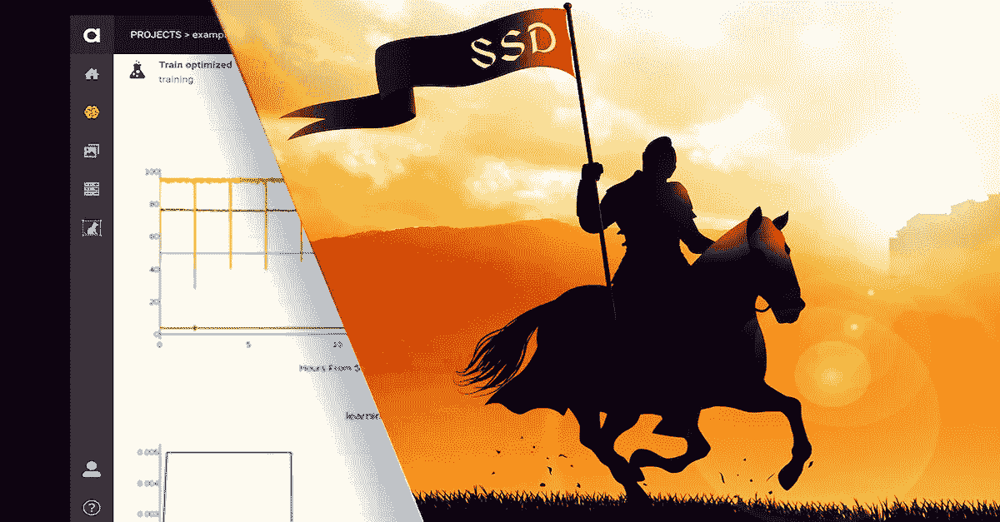
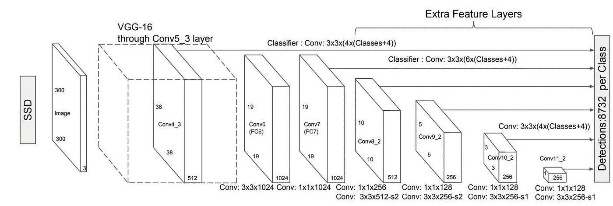
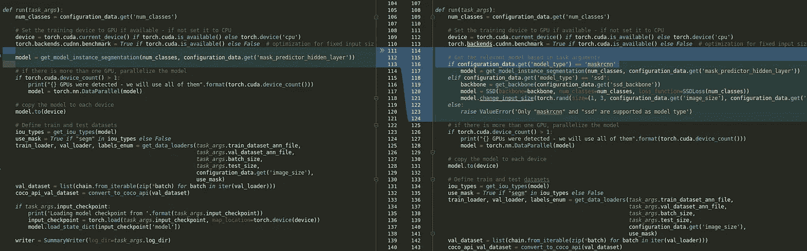
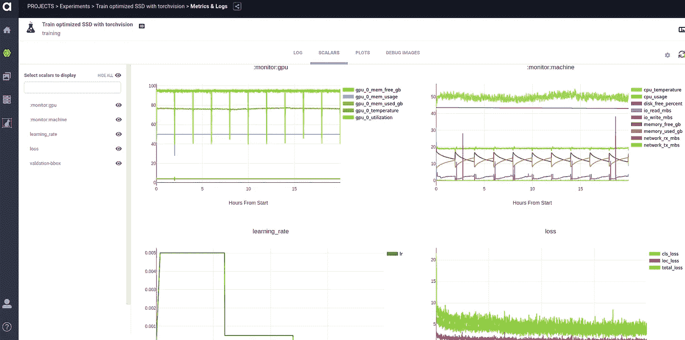

# 英雄崛起:打造自己的 SSD

> 原文：<https://towardsdatascience.com/the-hero-rises-build-your-own-ssd-febfbdd3bd03?source=collection_archive---------52----------------------->

## 现实世界中的数据科学

## 深度学习代码库系列的英雄之旅——IIB 部分

由[丹·马洛万尼](https://www.linkedin.com/in/dan-malowany-78b2b21/)和[加尔·海姆斯](https://www.linkedin.com/in/gal-hyams-2146a662/)
创作的快板艾团队



随着最先进的模型不断变化，人们需要有效地编写模块化的机器学习代码库，以支持和维持 R&D 机器和深度学习多年的努力。在本系列的第一篇博客中，我们展示了如何编写一个可读和可维护的代码来训练 Torchvision MaskRCNN 模型，利用 Ignite 的框架。在我们的[第二篇文章(IIA 部分)](/the-battle-of-speed-vs-23b61eb4225d)中，我们详细介绍了单触发和双触发探测器之间的根本区别，以及为什么单触发方法是速度/精度权衡的最佳选择。因此，在这篇文章中，我们很自然地收集了如何利用 MaskRCNN 代码库的模块化特性，并使其能够训练 MaskRCNN 和 SSD 模型。由于代码库的模块化性质，只需要对代码进行最小的修改。

[Torchvision](https://pytorch.org/docs/stable/torchvision/index.html) 是一个由流行的数据集、模型架构和计算机视觉的通用图像转换组成的包。除其他外，它还包含一个预先训练好的模型动物园，用于图像分类、对象检测、人物关键点检测、语义分割和实例分割模型，随时可供开箱即用。这使得 PyTorch 用户的生活变得更加容易，因为它缩短了想法和产品之间的时间。或者一篇研究论文。或者一篇博文。

Torchvision 不包含单镜头对象检测模型的实现，例如这个流行的 [SSD](https://link.springer.com/chapter/10.1007/978-3-319-46448-0_2) **。因此，我们添加了一个:**基于 Torchvision 模型的 SSD 实现，作为特征提取的主干。自发布以来，在最初的 SSD 上进行了许多改进。然而，为了清晰和简单起见，我们将重点放在了最初的 SSD 元架构上。让我们深入研究一下实现的逻辑和方法。完整的代码可以在 [Github](https://github.com/allegroai/trains-blogs/tree/master/the_hero_rises) 上获得。

# 常量:从默认值开始

首先，我们把手电筒放在代码常量上，它们是 [SSD 类构造函数](https://github.com/allegroai/trains-blogs/blob/fd92c462cbbceb8d4027aec2cf9acd5579117fe1/the_hero_rises/SSD/ssd_model.py#L113)的默认输入参数。这些是为 PASCAL-VOC 数据集定制的 512×512 输入图像的常见值。(在本系列的第三部分中，我们将演示如何根据您自己的数据集调整这些值)



图 1: SSD 元架构和多特征图计算— [SSD 论文](https://link.springer.com/chapter/10.1007/978-3-319-46448-0_2)

这些[列表中的每一个](https://github.com/allegroai/trains-blogs/blob/fd92c462cbbceb8d4027aec2cf9acd5579117fe1/the_hero_rises/SSD/ssd_model.py#L17)包含 7 个条目——每个特征图一个条目，从该特征图中进行对象检测(见上面的*图 1* )。注意，列表之一 BOX_SIZES 有 8 个条目，实际的框尺寸[计算](https://github.com/allegroai/trains-blogs/blob/fd92c462cbbceb8d4027aec2cf9acd5579117fe1/the_hero_rises/SSD/box_coder.py#L13)是基于这些值执行的。

如*图 2* (上图)所示，矩形和方形锚点平铺特征图。 *aspect_ratio* 列表包含每个特征图的矩形纵横比列表。这个列表中的每个数字为每个先前的中心定义了两个矩形:一个具有提到的纵横比，另一个具有相反的纵横比。也就是说，对于每个 2:1 的“躺着的”矩形锚，我们也有一个 1:2 的“站着的”矩形锚。除了矩形锚之外，两种尺寸的方形锚被设置在每个先前的中心上。

```
*# The size ratio between the current layer and the original image.
# I.e, how many pixel steps on the original image are equivalent to a single pixel step on the feature map.*

STEPS = (8, 16, 32, 64, 128, 256, 512)

*# Length of the smaller anchor rectangle, for each feature map.*

BOX_SIZES = (35.84, 76.8, 153.6, 230.4, 307.2, 384.0, 460.8, 537.6)

*# Aspect ratio of the rectangular SSD anchors, besides 1:1*

ASPECT_RATIOS = ((2,), (2, 3), (2, 3), (2, 3), (2, 3), (2,), (2,))

*# feature maps sizes.*

FM_SIZES = (64, 32, 16, 8, 4, 2, 1)

*# Amount of anchors for each feature map*

NUM_ANCHORS = (4, 6, 6, 6, 6, 4, 4)

*# Amount of each feature map channels, i.e third dimension.*

IN_CHANNELS = (512, 1024, 512, 256, 256, 256, 256)
```

# SSD 类构造函数

这个 *SSD* 类产生一个基于 Torchvision 特征提取器的 SSD 对象检测模型，参数如上所述。

```
**class SSD**(nn.Module):
   **def __init__**(**self**, backbone, num_classes, loss_function,
                num_anchors=NUM_ANCHORS,
                in_channels=IN_CHANNELS,
                steps=STEPS,
                box_sizes=BOX_SIZES,
                aspect_ratios=ASPECT_RATIOS,
                fm_sizes=FM_SIZES,
                heads_extractor_class=HeadsExtractor):

**super**(SSD, **self**).__init__()
...
**self**.extractor = heads_extractor_class(backbone)
**self**.criterion = loss_function
**self**.box_coder = SSDBoxCoder(self.steps, self.box_sizes, self.aspect_ratios, **self**.fm_sizes)

**self**._create_heads()
```

# 创建分类和本地化负责人

下面，我们首先将特征映射的分解从 SSD 模型中分离出来，使 SSD 能够轻松适应调整后的特征映射提取器。如果您确实要修改 SSD，那么在调用 SSD 构造函数时，不要忘记修改相关的参数。

```
class HeadsExtractor(nn.Module):
   def __init__(self, backbone):
       super(HeadsExtractor, self).__init__()

       def split_backbone(net):
           features_extraction = [x for x in net.children()][:-2]

           if type(net) == torchvision.models.vgg.VGG:
               features_extraction = [*features_extraction[0]]
               net_till_conv4_3 = features_extraction[:-8]
               rest_of_net = features_extraction[-7:-1]
           elif type(net) == torchvision.models.resnet.ResNet:
               net_till_conv4_3 = features_extraction[:-2]
               rest_of_net = features_extraction[-2]
           else:
               raise ValueError('We only support VGG and ResNet')
           return nn.Sequential(*net_till_conv4_3), nn.Sequential(*rest_of_net)

       self.till_conv4_3, self.till_conv5_3 = split_backbone(backbone)
       self.norm4 = L2Norm(512, 20)

       self.conv5_1 = nn.Conv2d(512, 512, kernel_size=3, padding=1, dilation=1)
       self.conv5_2 = nn.Conv2d(512, 512, kernel_size=3, padding=1, dilation=1)
       self.conv5_3 = nn.Conv2d(512, 512, kernel_size=3, padding=1, dilation=1)

       self.conv6 = nn.Conv2d(512, 1024, kernel_size=3, padding=6, dilation=6)
       self.conv7 = nn.Conv2d(1024, 1024, kernel_size=1)

       self.conv8_1 = nn.Conv2d(1024, 256, kernel_size=1)
       self.conv8_2 = nn.Conv2d(256, 512, kernel_size=3, padding=1, stride=2)

       self.conv9_1 = nn.Conv2d(512, 128, kernel_size=1)
       self.conv9_2 = nn.Conv2d(128, 256, kernel_size=3, padding=1, stride=2)

       self.conv10_1 = nn.Conv2d(256, 128, kernel_size=1)
       self.conv10_2 = nn.Conv2d(128, 256, kernel_size=3, padding=1, stride=2)

       self.conv11_1 = nn.Conv2d(256, 128, kernel_size=1)
       self.conv11_2 = nn.Conv2d(128, 256, kernel_size=3, padding=1, stride=2)

       self.conv12_1 = nn.Conv2d(256, 128, kernel_size=1)
       self.conv12_2 = nn.Conv2d(128, 256, kernel_size=4, padding=1
```

SSD 模型共享所有的分类和定位计算，直到最终的内容分类器和空间回归器。 *create_heads* 方法在每个特征图的顶部创建 SSD 分类和定位头，产生每锚预测。对于每个锚，定位头预测向量移位和拉伸(cx，xy，w，h)，而分类头预测每类概率的向量。

```
**def _create_heads**(**self**):
       **self**.loc_layers = nn.ModuleList()
       **self**.cls_layers = nn.ModuleList()
       **for** i **in** **range**(**len**(**self**.in_channels)):
 **self**.loc_layers += [nn.Conv2d(**self**.in_channels[i], **self**.num_anchors[i] * 4, kernel_size=3, padding=1)]
 **self**.cls_layers += [nn.Conv2d(**self**.in_channels[i], **self**.num_anchors[i] * **self**.num_classes, kernel_size=3**,** padding=1)]
```

SSD 模型从最高分辨率到最低分辨率建立了一个特征图的层次结构，并检测每个特征图上的对象。*头部提取器*类放置特征地图，并使其可用于检测器。其命名基于 VGG-16 特征提取器(其中 *conv4_3* 是用作 SSD 模型特征图的最高分辨率层的名称)。

不同的数据集和影像大小最适合调整后的要素地图等级；小图像不需要像大图像那样多不同的特征地图。类似地，没有小对象的数据集可以避免高分辨率的特征地图(加速模型计算时间)。

# 定义 SSD 正向传递

在下面的方法中，计算 SSD 模型上的图像批次的正向传递，并返回其结果。

如果模型处于评估模式，则正向传递返回输入图像上的模型预测。但是，如果在训练模式下进行正向传递，则只返回损失。这是一种常见的设计，它只返回损失，比返回所有检测的计算效率更高。

使用这种方法， *extracted_batch* 参数保存图像批次的布局特征图，然后分别计算跨每个特征图的预测。

```
**def forward**(**self**, images, targets=None):
       **if** **self**.training **and** targets **is** None:
           **raise** ValueError("In training mode, targets should be passed")
       loc_preds = []
       cls_preds = []
       input_images = torch.stack(images) **if** **isinstance**(images, **list**) **else** images
       extracted_batch = **self**.extractor(input_images)
       **for** i, x **in** **enumerate**(extracted_batch):
           loc_pred = **self**.loc_layers[i](x)
           loc_pred = loc_pred.permute(0, 2, 3, 1).contiguous()
           loc_preds.append(loc_pred.view(loc_pred.size(0), -1, 4))

           cls_pred = **self**.cls_layers[i](x)
           cls_pred = cls_pred.permute(0, 2, 3, 1).contiguous()
           cls_preds.append(cls_pred.view(cls_pred.size(0), -1, **self**.num_classes))

       loc_preds = torch.cat(loc_preds, 1)
       cls_preds = torch.cat(cls_preds, 1)

      **if** **self**.training:
           encoded_targets = [**self**.box_coder.encode(target['boxes'], target['labels']) **for** target **in** targets]
           loc_targets = torch.stack([encoded_target[0] **for** encoded_target **in** encoded_targets])
           cls_targets = torch.stack([encoded_target[1] **for** encoded_target **in** encoded_targets])
           losses = **self**.criterion(loc_preds, loc_targets, cls_preds, cls_targets)
           **return** losses

       detections = []

       **for** batch, (loc, cls) **in** **enumerate**(**zip**(loc_preds.split(split_size=1, dim=0),

                                              cls_preds.split(split_size=1, dim=0))):

           boxes, labels, scores = **self**.box_coder.decode(loc.squeeze(), F.softmax(cls.squeeze(), dim=1))

           detections.append({'boxes': boxes, 'labels': labels, 'scores': scores})

       **return** detections
```

# 将 SSD 模型连接到代码库

为了调整 [MaskRCNN 代码库](https://github.com/allegroai/trains-blogs/blob/master/once_upon_a_repository/train_model.py)的训练和评估脚本，并使其能够训练 MaskRCNN 和 SSD 模型，我们将以下条目添加到配置数据中(手动或通过 [Trains Server](https://github.com/allegroai/trains-server) web app)。

```
'model_type': 'ssd', 'ssd_backbone': 'resnet50'
```

如果您查看一下 train 脚本，您会发现除了上述配置数据更改之外，原始 MaskRCNN 脚本和新脚本(也支持 SSD)之间的唯一区别是模型对象定义部分:

```
*# Get the relevant model based in task arguments*

   **if** configuration_data.get('model_type') == 'maskrcnn':
       model = get_model_instance_segmentation(num_classes, configuration_data.get('mask_predictor_hidden_layer'))
   **elif** configuration_data.get('model_type') == 'ssd':
       backbone = get_backbone(configuration_data.get('backbone'))
       model = SSD(backbone=backbone, num_classes=num_classes, loss_function=SSDLoss(num_classes))
       model.dry_run(torch.rand(size=(1, 3, configuration_data.get('image_size'), configuration_data.get('image_size')))*255)
   **else**:
       **raise** ValueError('Only "maskrcnn" and "ssd" are supported as model type')
```

这意味着这个代码库中所有剩余的资产都保持不变。从 R&D 资源的角度来看，这是一个巨大的优势。



本系列第一部分中的训练脚本和本文中的训练脚本的比较，展示了这个代码库的模块化本质。

# 快板火车——坐下来，放松和监控你的实验



培训期间 Trains web app 的快照，显示标量(损失、学习率等。)前进

与[原代码库](https://github.com/allegroai/trains-blogs/tree/master/once_upon_a_repository)一样，使用 [Allegro Trains](https://github.com/allegroai/trains) ，一个开源实验& autoML manager，让我们实时监控训练过程，包括:学习率、损耗、val 数据集上的 mAP 等。此外，Allegro Trains 会在训练过程中自动监控 CPU、GPU 和计算机信息。这一重要工具有助于识别内存泄漏、硬盘空间不足、GPU 利用率低等问题。

由于包括脚本参数在内的所有这些信息都记录在 [Trains 服务器](https://github.com/allegroai/trains-server)中，因此可以比较不同的训练课程，并识别出产生优异结果的超参数。

# 结论

在[上一篇文章(IIA)](https://allegro.ai/blog/the-battle-of-speed-accuracy-single-shot-vs-two-shot-detection/) 中，我们深入探讨了单触发探测器相对于双触发探测器的优势。在这里，我们将这些知识编写成代码，并在 Torchvision 预训练的 backbone 之上创建一个 SSD 模型，您可以根据自己的目的使用它。此外，我们展示了遵循本系列指南编写可维护的模块化代码库的优势。

完整代码可在 [Github](https://github.com/allegroai/trains-blogs/tree/master/the_hero_rises) 上获得。这里介绍的 SSD 类的部分是基于[这个](https://github.com/kuangliu/torchcv/tree/master/examples/ssd)写得很好的 SSD 实现。谢谢匡柳😉

在下一篇文章中，我们将向您展示如何优化 SSD 模型，并根据您的数据进行调整。敬请期待！

*原载于 2020 年 4 月 19 日*[*https://allegro . ai*](https://allegro.ai/blog/the-hero-rises-build-your-own-ssd/)*。*