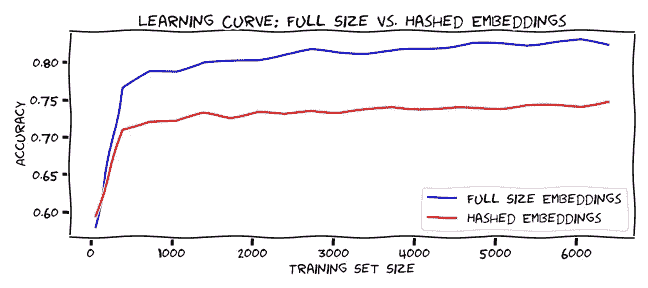
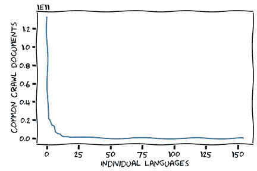

# 低质量单词嵌入的隐性成本

> 原文：<https://towardsdatascience.com/the-hidden-costs-of-low-quality-word-embeddings-b05f38c7e095?source=collection_archive---------59----------------------->

## 通过升级到高质量的单词嵌入，英语 NLP，尤其是非英语 NLP 应用程序，通常可以获得高达 10%的分类器准确性提升。

今天，内存和磁盘空间很便宜，但许多应用程序仍在为使用低质量的字向量表示付出代价。为什么非英语语言模型特别容易受到低质量单词嵌入的影响？

在单词嵌入之前，词典引用和索引提供了上下文提示。(图片由作者提供)

[空间](https://spacy.io/) NLP 图书馆提供英语和许多其他语言的模型，即:德语、法语、西班牙语、葡萄牙语、意大利语、荷兰语、希腊语、挪威语博克马尔语、立陶宛语。然而，这些产品之间有很大的差异。英语模式有小、中、大三种尺寸，每种尺寸的文件大小和内存需求都在增长。每个模型都有一个固定的词汇表，模型文件大小的主要组成部分是[单词嵌入](https://en.wikipedia.org/wiki/Word_embedding)向量维度。减少文件大小的一种方法是使用散列技巧。

**哈希技巧:**

> 在机器学习中，特征哈希，也称为哈希技巧(类似于内核技巧)，是一种快速且节省空间的特征矢量化方法，即将任意特征转化为向量或矩阵中的索引。它的工作原理是对要素应用散列函数，并直接使用它们的散列值作为索引，而不是在关联数组中查找索引。[ [1](https://en.wikipedia.org/wiki/Feature_hashing) ]

在某些情况下，特性散列并没有错，但是当产生的空间太受限制时，冲突会增加，性能会降低。使用哈希技巧可以创建更小的单词向量模型(想想 200，000 个关键字映射到 20，000 个浮点向量)。看起来 SpaCy 中型模型使用具有大量冲突的散列技巧来构建它们的词向量表示，或者可能它们只是随机地重用槽——中型模型词汇是固定的，所以很难分辨，但效果是相同的。目前，只有一个 SpaCy 大型模型使用全尺寸嵌入——English。同时，所有非英语语言和中型模型通过重用嵌入槽来节省磁盘和内存空间。每个中型车型规格中都有提示，这里是[德国](https://spacy.io/models/de#de_core_news_md)的提示:

> 向量 276k 个键，20k 个唯一向量(300 维)

对，就是 86.2%复用！实际上，这是大量的哈希冲突。

与全尺寸嵌入相比，散列字嵌入的性能如何？

可悲的是，单词表达一直表现不佳一点也不好笑。(图片由作者提供)

即使只有 7108 项标记数据，使用哈希字向量也能获得 73%的准确率，而不是使用全尺寸嵌入时的 84%的准确率(三个类别用于分离，多数类别基线为 43%)[ [2](https://www.kaggle.com/toddcook/spacy-embeddings-compared-quality-implications) ]。上面的[学习曲线图](https://scikit-learn.org/stable/modules/learning_curve.html#learning-curve)显示了机器学习模型在对渐进式数据量进行训练时的不同表现。

幸运的是，非英语语言也可以使用其他嵌入，特别是 [FastText](https://fasttext.cc/) ，它使用维基百科和通用抓取数据为 157 种语言提供了[单词向量。当然，不同语言之间的大小和质量差异很大:](https://fasttext.cc/docs/en/crawl-vectors.html)

*   排名前九的维基百科(不包括机器人创作的内容)是印欧语
*   普通爬行中的语言分布遵循帕累托分布[ [4](https://commoncrawl.github.io/cc-crawl-statistics/plots/crawlsize)

语言不平衡是一个真正的问题。可悲的是，这个图表一点也不好笑。(图片由作者提供)

缺少数据没有简单的解决办法，然而，FastText 以一种独特的方式改进了生成单词向量的问题:允许使用字符级信息。

传统的单词向量构建工具，如 [Gensim](https://radimrehurek.com/gensim) 、 [GloVe](https://nlp.stanford.edu/projects/glove/) ，或者神经网络的嵌入层等，需要许多例子来生成单个单词的精确表示。因此，大多数传统的词向量模型的词汇量有限，因此无法预测他们以前没有见过的词的值。相比之下，通过考虑字符序列(有时称为子词信息)，FastText 可以生成模型，这些模型使用许多相似词和子词的集体信息来为它从未见过的词生成嵌入。但是，有一个问题，要执行这个功能，您必须使用 FastText 模型的二进制形式，而不是 Word Vector 文本格式。

**生成自定义词向量模型**

FastText 二进制模型文件格式在磁盘和内存中非常大，例如英语压缩为 4.2 GB。更常见的单词向量文件格式是一个简单的文本文件，其中每一行都以一个单词开始，然后是表示该单词在全局单词向量空间中的尺寸的浮点数。以下是 GloVe 文件的简短摘录，展示了 word vector 文件的常见文本格式:

> 市 0.43945 0.43268-0.36654 0.27781…
> 造 0.14205 0.0046063 -0.40052 …
> 像 0.36808 0.20834 …

实际上，NLP/ML 应用程序使用 WordVector 文本文件作为字典，并将单词转换为数字表示，然后输入到管道和模型中。使用 FastText 可执行文件，您可以加载二进制模型文件(。bin)，请求您指定的每个单词的向量，并以通用单词向量格式在文本文件中写出信息。这个过程真的很简单，下面是他们的例子:

> 获取单词向量
> 打印包含单词的文本文件 queries.txt 的单词向量。
> `$。/fast text print-word-vectors model . bin<queries . txt `中

不幸的是，它需要大量的磁盘空间和内存，所以根据你的型号和词汇量，你可能需要使用内存更大的机器。
使用 FastText 二进制格式生成定制的单词嵌入可能是比从零开始周期性地重新生成单词嵌入更好的解决方案，并且这对于实际研究来说可能是一个好问题。

**更好的单词嵌入不一定需要更多的维度**

[几个快速实验](https://www.kaggle.com/toddcook/spacy-embeddings-compared-quality-implications)表明，主成分分析( [PCA](https://en.wikipedia.org/wiki/Principal_component_analysis) )可以将 SpaCy 全尺寸单词嵌入从 300 维减少到 50 维，并且只损失一两个点的准确度。当常规/完整大小的嵌入与散列嵌入进行比较时，我们发现在准确性上有 10%以上的差异。没错:使用少 83%的空间，一个 50 维的字向量比一个 300 维的散列字向量的性能高 10%以上。这使用了三个分类和 7，108 个标记项目；如果您有更多的数据或更多的类，您的里程可能会有所不同，但性能可能会更差。

**如何提升你的自然语言处理应用的性能**

我们已经展示了散列嵌入是如何执行的，并且展示了如何获得完整大小的单词嵌入。现在，您应该能够升级应用程序使用的 word 嵌入，并获得良好的性能提升。有许多遗留代码仍在使用，通过简单地避免使用散列嵌入并总是使用可用的最高质量的字嵌入，可以获得可靠的性能增益。

*快速补充说明* : ELMO 和伯特也可以产生基于字符的嵌入，但是他们被设计用来产生上下文嵌入，这是一个句子中许多字符和单词的乘积。因此，虽然伯特和 ELMO 可以用来生成传统的单词嵌入，但这些应用超出了本文的范围。它们是强有力的工具；但是有很多代码已经成功地使用了单词嵌入，或者用伯特或 ELMO 语言替换来生成嵌入，成本太高。

**SpaCy 仍然是一个很好的 NLP 库**

尽管我对 SpaCy 在中型模型上使用散列词向量的选择持批评态度，但它仍然是一个很棒的 NLP 库，我向所有有志于 NLP 的实践者(从初学者到中级及以上)推荐它。

你不必扔掉你所有的多余代码；您应该能够将空间模型用于其他功能，如标记化、词性标注、命名实体识别和文本分类。此外，SpaCy 架构的某些部分是模块化和可扩展的，这允许许多新颖的用法。但是，用户也应该考虑替代方案。斯坦福大学的 NLP 图书馆现在正在给一些强有力的竞争，它应该被视为从零开始的努力。与 SpaCy 不同，Stanza 不提供单词嵌入作为离散词汇表的一部分。

最重要的是，要知道你的系统正在使用哪种单词嵌入。坚持高标准实现高绩效。

【参考资料
【1】[https://en.wikipedia.org/wiki/Feature_hashing](https://en.wikipedia.org/wiki/Feature_hashing)
【2】[https://www . ka ggle . com/Todd cook/spacy-embedding-comparated-quality-implications](https://www.kaggle.com/toddcook/spacy-embeddings-compared-quality-implications)
【3】[https://en.wikipedia.org/wiki/List_of_Wikipedias](https://en.wikipedia.org/wiki/List_of_Wikipedias)
【4】[https://common crawl . github . io/cc-crawl-statistics/plots/crawl size](https://commoncrawl.github.io/cc-crawl-statistics/plots/crawlsize)
【5】[https://spacy.io/usage/processing-pipelines](https://spacy.io/usage/processing-pipelines)

*(感谢 Kyle P. Johnson 和 Josh Frazier 对本文草稿的审阅和评论。)*