# 强化学习的隐藏线性代数

> 原文：<https://towardsdatascience.com/the-hidden-linear-algebra-of-reinforcement-learning-406efdf066a?source=collection_archive---------17----------------------->

线性代数的基础如何支持深度强化学习的顶点？答案就在求解马尔可夫决策过程时的迭代更新中。

强化学习(RL)是一组智能方法，用于**迭代**学习一组任务。由于计算机科学是一个**计算**领域，这种学习发生在状态、动作等向量上。以及动力学或跃迁矩阵。状态和向量可以采取不同的形式，但是我们怎么能看到算法的收敛成为技术社区的头条新闻呢？当我们想到将一个变量向量传递给某个线性系统，并得到类似的输出时，应该会想到**特征值**。

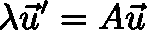

特征值，特征向量方程。

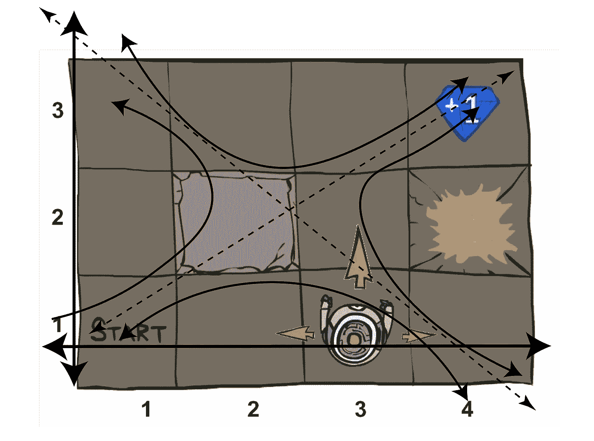

MDP 中赝本征空间的示意图。MDP 是由特征值决定的，但是它们在一个子空间里，可能有点复杂。

本文将引导您理解在 RL 环境中解决任务的迭代方法(收敛到最优策略)。这个基础将反映*环境*的特征向量和特征值。

沉思的小狗——来源:作者的好朋友。

# 回顾马尔可夫决策过程

马尔可夫决策过程是支持强化学习的随机模型。如果你很熟悉，你可以跳过这一部分。

## 定义

*   状态集合 **s ∈ S** 。这些状态代表了世界上所有可能的构型。
*   一组动作 **a ∈ A** 。动作是代理可以采取的所有可能动作的集合。
*   一个转移函数 **T(s，a，s’)**。T(s，a，s’)持有 MDP 的**不确定性**。给定当前位置和提供的动作， ***T*** 决定下一个状态跟随的频率。

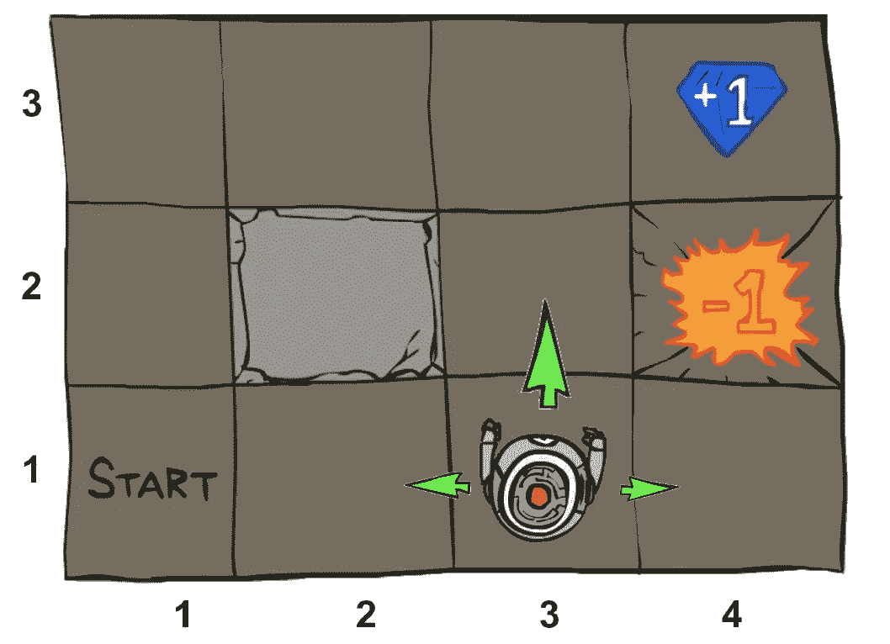

MDP 就是一个例子。来源——我在 CS188 做的讲座。

*   一个奖励函数 **R(s，a，s’)。任何代理人的目标都是回报总和最大化。**这个函数说的是每一步获得多少奖励。一般来说，在每一步都会有一个小的负奖励(成本)来鼓励快速解决问题，在最终状态会有大的正(目标)或负(失败的任务)奖励。
*   [0，1]中的折扣因子 **γ (gamma)** ，将当前(下一步)的价值调整为未来奖励。这抓住了现在奖励相对于以后奖励的重要性。非常重要的是，在我们讨论如何解决 MDP 时，可以期待更多的信息。
*   起始状态 **s0** ，也可能是终止状态。

来源——我在 [CS188](https://inst.eecs.berkeley.edu/~cs188/sp20/) 做的讲座 11。

## 重要的价值观

MDP 有两个重要的特征效用-状态值和机会节点的 q 值。

*   **一个状态的价值**:一个状态的价值是从一个状态出发的回报的最优递归和。*如果机器人在火坑里、宝石附近或沙发上，左边的状态值会有很大不同。*
*   状态动作对的 Q 值:Q 值是与状态动作对相关的折扣奖励的最优和。*一个状态的 q 值由一个动作决定——因此，如果指向火焰内部或外部，壁架上的 q 值会有很大变化！*

这两个值通过[相互递归](https://en.wikipedia.org/wiki/Mutual_recursion)关联，贝尔曼更新。

# 行李员更新

理查德·e·贝尔曼是一位数学家，为现代控制和优化理论奠定了基础。通过一个递归一步方程，**一个贝尔曼更新方程，**大型优化问题可以高效求解。通过递归贝尔曼更新，可以用**动态规划**建立优化或控制问题，这是一个创建更小、更易于计算的问题的过程。这个过程从末端递归地进行*到*——一种滚动时域方法。

理查德·e·贝尔曼(1920-1984)——维基百科。

1.  **贝尔曼方程** : *公式化为动态规划* ***的优化问题最优性的必要条件。***
2.  **动态编程** : *通过将优化问题分解成最佳子结构来简化优化问题的过程。*

在强化学习中，我们使用贝尔曼更新过程来求解状态-动作空间的最优值和 q 值。这最终形成了来自给定位置的**预期未来回报总额**。

在这里，我们可以看到来自审查交错的所有值。符号 **(*)** 表示最优，所以正确或收敛。我们有由最佳行为决定的状态值，一个 q 状态，然后是两个递归定义。递归值平衡了***【T(s，a，s’)****中访问任意状态的*概率和任意跃迁****【R(s，a，s’)****的*报酬，为状态-动作空间*的值创建一个全局映射。****

**

*最佳值与最佳动作条件 q 值相关。然后值和 q 值更新规则非常相似(加权转换、奖励和折扣)。顶部)值与 q 值的耦合；mid) Q 值递归，bot)值迭代。来源[加州大学伯克利分校的 cs 188](https://inst.eecs.berkeley.edu/~cs188/sp20/)。*

*他们在这里的关键点是，我们是乘矩阵( ***R，T*** )，乘向量( ***V，U*** )，来迭代求解收敛。*由于一个状态的值如何由它们的邻居****’***确定，这些值将从任何初始状态收敛。有关 MDP 的更多信息，请参见[我写的这篇简介](/what-is-a-markov-decision-process-anyways-bdab65fd310c)。*

## *强化学习？*

*“有人告诉我会有 RL，”—你，读者，4 分钟后。这都是强化学习，我断言**理解算法所基于的假设和模型会让你比仅仅从 OpenAI 复制 python 教程准备得更好**。之后再做。我已经指导了很多学生在 RL 中工作，那些做得更多的人总是那些了解正在发生什么，然后如何应用它的人。*

*也就是说，这是**离在线 q 学习**的一小步，在在线 q 学习中，我们用 T 和 R 的样本来估计相同的贝尔曼更新，而不是在方程中显式地使用它们。所有相同的断言都适用于，但它是基于概率分布和期望。 [Q-learning 是~2015 年](https://daiwk.github.io/assets/dqn.pdf)解决雅达利游戏等著名算法。*

# *隐藏数学*

## *特征值？哼。*

*回想一下系统*的特征值-特征向量对( *λ，u*)A*是一个向量和标量，使得系统作用的向量返回原向量的标量倍数。*

**

*特征值，特征向量方程。*

*特征值和特征向量的美妙之处在于，当它们跨越状态空间时(对于大多数物理系统来说，广义特征向量保证了这一点)，每个向量都可以写成其他特征向量的组合。然后，在离散系统中，特征向量控制从任何初始状态的演化——任何初始向量将组合成特征向量的**线性组合。***

## *随机矩阵和马尔可夫链*

*MDP 与马尔可夫链非常接近，但在结构上并不相同。马尔可夫链由转移矩阵 ***P*** 决定。概率矩阵的作用类似于对动作求和的转移矩阵 ***T(s，a，s’)****。在马尔可夫链中，下一个状态由下式决定:**

*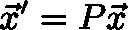*

*一个[随机矩阵的演化。](https://en.wikipedia.org/wiki/Stochastic_matrix)*

*这个矩阵 **P** 有一些特殊的值——你可以看到这是一个*特征值方程，所有特征值等于一个*(图 a *λ* =1 预乘方程左侧)。为了使矩阵**保证**的特征值等于 1，所有列的总和必须等于 1。*

*我们现在在 RL 中寻找的是，我们的解的演化如何与概率分布的收敛相关联？我们通过将用于 ***V**** 和 ***Q**** 的迭代算子公式化为线性算子(a 矩阵) ***B*** 来做到这一点。收敛可能很棘手——我们使用的值和 q 值向量不是本征向量——它们收敛到本征向量，但这对于了解本征向量如何控制系统并不重要。*

*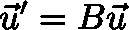*

*贝尔曼算子，B，像一个带特征向量的线性变换，特征值对 *λ=1。**

*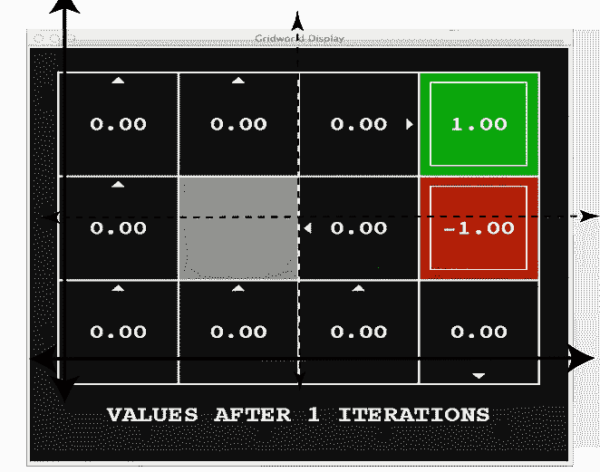**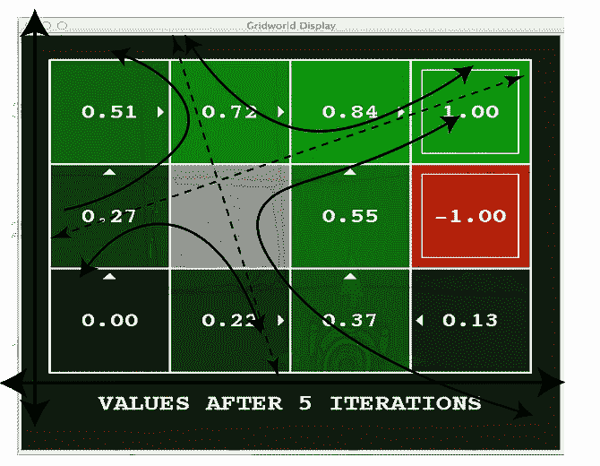**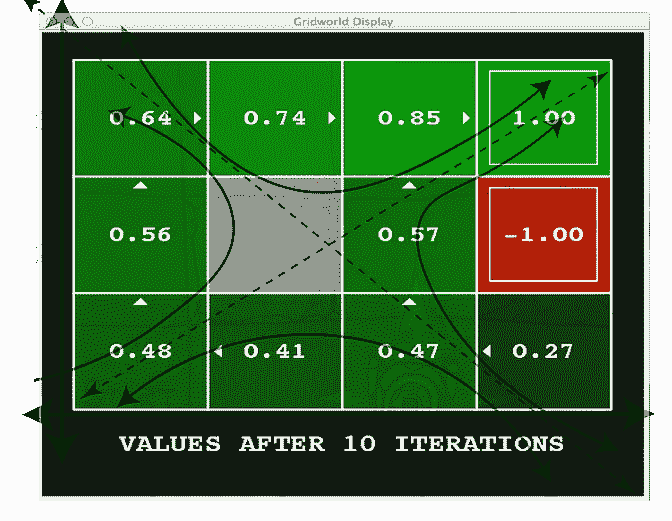*

*任何初始值分布将收敛到特征空间的形状。该图没有显示贝尔曼更新的确切特征值，而是显示了空间的形状如何随着值的递归更新而演变。最初，这些值将是完全未知的，但是随着学习的出现，已知的值将收敛到与环境完全匹配。*

# *贝尔曼矩阵更新*

*到目前为止，我们知道，如果我们能够以一种更简单的形式制定我们的贝尔曼更新(线性更新)，一个方便的本征结构将出现。如何将我们的 ***Q*** 更新公式化为一个简单的更新方程式？我们从一个 Q 迭代方程开始(最佳值代替右边的等价 Q 值方程)。*

*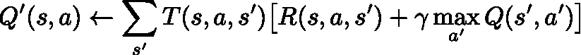*

*MDP 的 q 迭代。*

*实现这种转变需要几个小步骤(当然还有几个大的假设)。*

*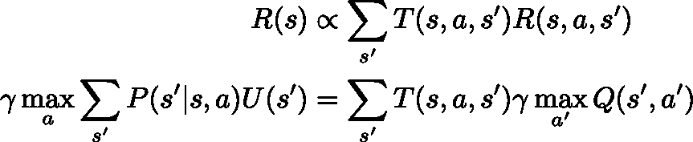*

*将我们的系统移向线性算子(矩阵)*

## *I)让我们将几个术语重新表述为**通用表格***

*前半段更新，求和超过 ***R，T，*** 是显式奖励数；我们称之为 **R(s)** 。接下来，我们将转换的求和改为一个概率矩阵(方便地匹配一个马尔可夫矩阵)。同样，这导致了下一步——从 ***Q*** 到实用程序的变化。(回想一下，你可以从一个总和中取出一个最大值(把它想象成一个更一般的上限)。*

*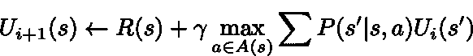*

*接近我们想要的贝尔曼矩阵，其中 P(s'|s，a)将决定我们矩阵的演化。*

## *ii) **我们把这个做成向量方程**。*

*我们最感兴趣的是效用，*【如何演化为 MDP。效用意味着价值或 q 值。我们可以简单地将我们的 ***Q*** 改写成*而没有太大的变化，但这意味着我们假设一个固定的策略。***

***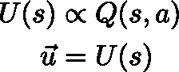***

***将 q 状态转换为特征值的通用效用向量。***

***重要的是要记住，即使对于一个多维的物理系统来说，如果我们将所有测量的状态堆叠成一个长数组，那么状态的效用也是一个向量。一个固定的政策不会改变收敛——它只是意味着我们必须重新审视这一点，以学习如何迭代地获得一个政策。***

## ***三。采取固定政策***

***如果你假设一个固定的政策，最大化超过 ***一*** 就消失了。最大化算子明显是非线性的，但是线性代数中存在特征向量加上一个附加向量的形式(提示— [广义特征向量](https://en.wikipedia.org/wiki/Generalized_eigenvector))。***

**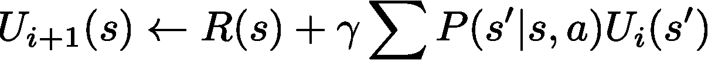**

**上面这个方程是贝尔曼效用更新的一般形式。我们想要一个线性算子， ***B*** ，然后我们可以看到这是一个特征值演化方程。它看起来有点不同，但这最终是我们想要的形式，减去几个线性代数断言，所以我们有我们的贝尔曼更新。**

****

**贝尔曼算子，B，像一个带特征向量的线性变换，特征值对 *λ=1。***

> **从计算上来说，我们可以得到我们想要的特征向量，但是从分析上来说这样做是有挑战性的，因为在这个过程中要做很多假设。**

****

**来源-作者，詹姆斯敦里。**

# **外卖食品**

**线性运算符向您展示了某些离散的线性系统将如何演变，以及我们在强化学习中使用的环境遵循的结构。**

> **我们收集的数据的特征值和特征向量可以表示 RL 问题的潜在值空间。**

**变量变化、线性变换、在线 q-learning(而不是这里的 q-iteration)以及更多的细节将在以后的文章中介绍。**

**该系列的下一篇文章:**

** [## 强化学习的基本迭代方法

### 学习价值和策略迭代能掌握多少强化学习？很多。

towardsdatascience.com](/fundamental-iterative-methods-of-reinforcement-learning-df8ff078652a)  [## 强化学习算法的收敛性

### 有什么简单的收敛界限吗？

towardsdatascience.com](/convergence-of-reinforcement-learning-algorithms-3d917f66b3b7) 

更多？订阅我关于机器人、人工智能和社会的时事通讯！

 [## 自动化大众化

### 一个关于机器人和人工智能的博客，让它们对每个人都有益，以及即将到来的自动化浪潮…

robotic.substack.com](https://robotic.substack.com/)**