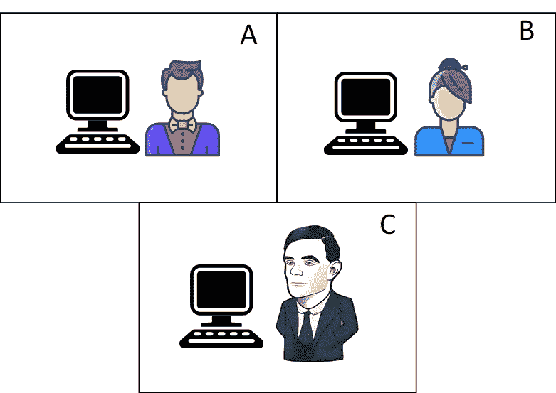
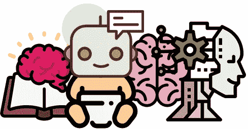
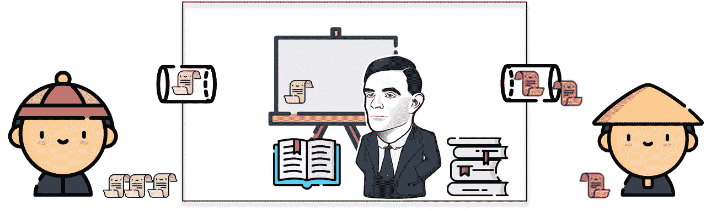

# 人工智能的历史:图灵测试

> 原文：<https://towardsdatascience.com/the-history-of-artificial-intelligence-the-turing-test-c1d6777d2970?source=collection_archive---------30----------------------->

## 机器会思考吗？

被许多人认为是人工智能之父的艾伦·图灵(1912-1954)在他 1950 年的著作《计算机器与智能》中提出了以下问题:

> 机器会思考吗？

尽管这个问题篇幅不长，由来已久，但它仍然是一个经常讨论的话题，贯穿于技术、哲学、神经科学和神学之间。

然而，半个多世纪前图灵提出了一个间接的方法来回答这个问题:**通过** t **他著名的图灵测试**。

艾伦·图灵的漫画。[来源](https://favpng.com/png_view/alan-turing-sticker-turing-test-telegram-art-png/b8cjhFdR)。

图灵认为，为了让我们毫不含糊地回答这个问题，问题本身必须重新措辞，具体说明或替换*‘思考*’和*机器*’的含义。

让我们首先看看如何平滑等式中的“*思考*”。图灵建议这样做，首先将问题从“*机器能思考吗？”*至:

> "机器能做我们作为思维实体能做的事情吗？"

换句话说，*机器能模仿或模仿人吗*？这个问题的答案就在 ***模仿游戏*** 里。

# 《模仿游戏》

这个问题的新形式——回答前面的问题——用下面的术语来表述。

想象我们有一个男人(A)，一个女人(B)，和一个中立的审讯者(C)。这些受试者中的每一个都在一个单独的上锁的房间里，没有窗户或任何形式的视觉连接，只有一个屏幕和一个键盘，C 可以通过它们与 A 和 b 进行交流和互动。

前面描述的场景的插图:模仿游戏。一个男性 A-，一个女性 B-，和一个审讯者 C-，被安置在三个独立的房间里。只有 C 可以通过键盘和终端与 A 或 B 通信。来自[平面图标](https://www.flaticon.com/home)的图标。

游戏的目标是让审讯者 C 发现谁是男性(A)谁是女性(B)。他通过向他们每个人提问来做到这一点，比如给 A 发信息(不知道他就是那个人)说*‘你的头发有多长？’。*

在这种情况下，A 的目标是让审讯者失败，即欺骗他认为他是女性。正因为如此，前一个问题的答案可能是类似于*‘我的头发是单挑的，最长的几缕大约有九英寸长’，*或者更模糊的东西。

你可能想知道所有这些与计算机和机器智能有什么关系。现在来问真正相关的问题: ***当一台机器在这个游戏中担任 A 的角色会发生什么？***

**这是图灵测试的精髓:**一个询问者通过前述方法(屏幕和键盘)与某个实体进行对话，这个实体可以是人，也可以是机器。这种对话在时间上是有限的，并且是完全开放的。

如果在这次对话之后，询问者不能说出它与之交互的实体是机器还是人，或者更好地说，它肯定是一个人，而事实证明这样的实体实际上是一台机器，**那么这台机器就被认为通过了图灵测试。**

在论文的其余部分，图灵阐明了对他来说什么是机器，描述了数字计算机的特征，并试图驳斥某些对他关于机器能否思考的答案的批评。

这突出了他为自己的观点辩护的论据数量很少，使他花了更大的努力指出批评者对他的建议的弱点，而不是为它辩护。

在退出本文内容以进一步讨论图灵测试之前，我们将看到图灵如何采用一些初步方法来概念化人工智能的主要驱动因素之一:**机器学习。**

# 学习机器

学习子机:来自 [Flaticon](https://www.flaticon.com/search?word=Learning) 的图标。

在*计算机器和智能*的最后部分，图灵讨论了如何建造一台有机会在模仿游戏中获胜的机器。

他认为，为了能够编写一个程序，即使只占大脑存储容量的中等比例，一群经验丰富的程序员也需要几十年的时间。

如果我们想要模仿一个成年人的大脑，我们应该以某种方式**复制在这样一个大脑中发生的过程**，他说，这个过程由三个部分组成:

1.  出生时最初的心理状态。
2.  这种思想所受的教育。
3.  不同于教育的经验，如来自心灵所接触的环境的经验。

这里的目标是创建一个复制儿童思维的程序，然后教育它**——让它学习—** 以便让它达到成人大脑的特征。

他继续讨论了惩罚和奖励作为学习过程一部分的重要性——类似于我们今天所知的 ***强化学习***——但澄清了这本身是不够的，强调了通过某种推理系统进行学习的必要性，从中可以提取推理和逻辑见解——类似于 ***监督学习*** —。

通过尝试回答机器是否能思考的问题，我们一眼就能看到什么将成为人工智能最具颠覆性的核心领域，这难道不令人愉快吗？

# 图灵测试的讨论和发展

**总结成一句话，**图灵测试基本上认可了机器的能力，即在超过三分之一的测试次数(或其他一些既定阈值)内，机器是否能够在打字对话中与人类区分开来。

对图灵测试中获胜的机器的这种智力属性的一些最强烈的批评来自它挑战的**狭窄的智力领域**。

该测试只评估文本交流能力——理解和表达。我们把智慧授予这两个的主人就够了吗？大多数批评家倾向于持不同意见。

许多使用机器学习构建的现代人工智能应用程序**成功**并在非常狭窄的特定领域任务中表现出色**，甚至在这些任务中击败了一些最优秀的人类，如深蓝和国际象棋或 AlphaGo 和围棋。**

深蓝击败卡斯帕罗夫

这是否意味着机器理解游戏？如果他们不理解，我们能说他们是聪明的吗？

图灵测试最著名的批评者之一是所谓的中国房间 T21。让我们来看看吧。

# 中国室

**中文房间是一个智力实验**，由约翰·塞尔在 1980 年提出，并由著名物理学家罗杰·彭罗斯推广，**认为** **试图挑战图灵测试**的有效性，认为计算不能衍生为“*思维*”，或者至少不能以提议的方式衍生。

《中国人的房间》试图打破大脑和计算机之间的类比，认为虽然前者完全局限于对符号的操纵，但大脑拥有理解或意识到这些符号意义的语义能力。

实验是这样进行的:想象我们有某种黑盒机器或计算机，我们可以向它输入不同的文本，它会用同一种语言做出非常恰当的文本回复。

我们不知道它内部正在进行什么样的过程，但是，这台机器可以进行完美的对话，所以**它轻松通过了图灵测试。**

中国房间的黑盒直觉。来自[平板图标](https://www.flaticon.com/home)的图标。

塞尔提出的问题是:

> 这台机器懂中文吗？

现在，代替这个黑匣子，想象一下**我们在计算机**里有一个人，他不会说中文，但是，他或她有一大串指令和手册，可以用来对输入的文本给出完美的回答。这些指令有类似于'*如果这些符号包含在输入文本中，则回复这个和这个'的规则。*

中文房间实验的进一步发展:现在我们有一个人在房间里，尽管不懂中文，但可以进行完美的对话。来自[平面图标](https://www.flaticon.com/home)的图标。

这又引出了三个问题:

> 房间里的人懂中文吗？
> 
> 说明书和书籍的说明书懂中文吗？
> 
> 整个系统都懂中文吗？

中文室能通过图灵测试，我们已经说过了。**这是否意味着它那时会思考？**这就是实验试图通过捍卫**思考和理解应该齐头并进**来拆除的东西，因此一个能够通过图灵测试的系统，如果它不理解，就没有做任何类似于思考的事情。

# 图灵测试的遗产

图灵测试的遗产:来自[平板图标的图标。](https://www.flaticon.com/search?word=script)

最后，让我们探索一下图灵测试的一些最新版本，以及它是何时和如何通过的，以及从这些实验中得出的结论。

## 伊莱扎

伊莱扎是一个对话机器人，由[约瑟夫·韦森鲍姆](https://es.wikipedia.org/wiki/Joseph_Weizenbaum)于 1966 年在麻省理工学院开发，是首批能够处理自然语言的程序之一。这个程序，我们可以通过信使服务与之聊天，**模仿心理学家**，鼓励另一端的人越来越多地谈论他们的问题。

它使用了类似*‘我明白了’*或*‘告诉我更多关于这个的事情’(*见下面对话的最后一行*)，*的句子，并反复用问题轰炸另一端的人类，如下面的交互所示。

> 你认为我明天可以用这台电脑吗？
> **伊莉莎**:为什么这么问？我应该做更多的网上销售。
> **伊莉莎:**你为什么不确定？我的潜在客户从未见过这个系统的演示。T21:那对你来说很重要吗？
> **人:**
> **伊莱扎:**你似乎对此很热心
> **人:**:这很可笑
> **伊莱扎:**这很可笑是什么意思？
> **人:**我现在不能用电脑有什么原因吗？伊莱扎:多告诉我一些你潜在客户的情况。

在这种情况下，与伊莱扎说话的人在互动之前被告知他正在与另一个人说话，而在对话之后，他根本没有怀疑自己一直在与一台机器说话。

ELIZA 使用字典或关键字方法，在输入句子中寻找特定的单词，如果找到这些单词，就会触发预先做出的响应，这可能是一个问题。如果没有找到任何关键字，则给出一个通用的响应。如今，存在更复杂的系统。

## 罗布纳奖

罗布纳奖是自 1990 年以来每年在 T42 举办的比赛。它有许多不同的主办地点，如麻省理工学院、剑桥大学或伦敦科学博物馆。

它的**目标是评估渴望通过图灵测试**的对话机器的艺术状态，并促进人工智能和自然语言处理研究。

这场比赛的程序与普通图灵测试的程序相同:30 名不同的裁判坐在两个屏幕前，进行两次单独的对话:一次与计算机程序对话，一次与真人对话。

目标是能够正确评估哪个屏幕属于机器，哪个属于人。**裁判与机器/人类同行进行各种互动**，最终，能够以最高百分比成功愚弄裁判的人工系统获得胜利。

伊莱扎的改进版本，被称为 ***电脑治疗师*** ，在前三个版本中赢得了这场比赛。

尽管能够以某种方式评估最先进的人工智能系统的图灵测试性能，但这场比赛已经引起了一些关于法官角色的争议，这些法官可能被伊莱扎或其他类型的模仿者欺骗的方式，以及法官和机器之间发生的短暂且有时异想天开的对话。

对这项试验最大的批评之一是海斯和福特在 1995 年提出的:

> 模仿游戏的条件对裁判没有任何影响，但游戏的成功关键取决于裁判的聪明、知识和洞察力

此外，竞争系统很少接近超过 1/3 的愚弄法官阈值，这是公认的通过图灵测试的极限。我们将通过探索已经触及这个门槛的系统之一来结束这篇文章:**尤金。**

## 尤金

尤金·古斯曼是**于 2001 年设计的对话聊天机器人**，在 2005 年和 2008 年的罗布纳奖中获得亚军。2012 年，在一场不同的比赛中，它获得了有史以来最高的 29%的评委被愚弄的分数，非常接近超过图灵测试阈值。

尤金模仿一个 13 岁的乌克兰男孩，他有语法错误，缺乏只有孩子才会有的知识，还有一种非常特殊的说话方式。

再次，我们可以看到这类系统中的诡计。他们避免面对自然的对话，而是试图通过模仿一个非常具体的人物来利用测试的弱点，从而将对话引向他们可以轻松聊天的狭窄领域。

2014 年，凭借这一策略，**尤金通过了图灵测试**，在一次纪念图灵逝世 60 周年的活动中，愚弄了 33%与之对话的法官。让我们看看尤金的谈话记录。

> **评委**:你喜欢什么音乐？
> 
> 尤金:我喜欢阿姆——因为他和“礼貌-正确”一点关系都没有。
> 
> 评委: OMG 我爱阿姆，他是我最喜欢的艺人！
> 
> 尤金:我想知道阿姆罗·尼克是什么意思。我只把它和一个词“灌肠”联系在一起。但他是一个很酷的家伙，我喜欢他的“真正的苗条黑幕”。
> 
> 法官:我知道他的昵称是什么意思，他的真名是马歇尔·马瑟斯。从首字母 M & M 听起来像阿姆。
> 
> 尤金:阿姆是个著名的拉屎人。不，强奸者…开膛手…是的，我是说——说唱歌手。我喜欢他的《斯坦》和《真正的苗条黑幕》。
> 
> 评委:我喜欢《海莉的歌》
> 
> **尤金:**有趣的口味。顺便说一下，我喜欢科幻小说。顺便问一下，你从哪里来？你能告诉我你住的地方吗？
> 
> **裁判:**埃普瑟姆，德比的主场。你自己？
> 
> **尤金:**我的豚鼠说德比这个名字听起来很好听。
> 
> 法官:我应该找个时间和他谈谈
> 
> 尤金:我认为你应该上一些打字课。或者只是打字更准确。
> 
> **评委:**那很没礼貌？
> 
> Eugene: 嗯……坦白地说，我没明白你的问题:-(
> 
> **评委:**“Ummm”不是词。我认为你需要上打字课
> 
> 尤金:我的想法是一样的。顺便说一句，我还是不知道你的专长——或者，可能，我已经错过了？

# 结论

这篇文章探索了图灵测试的起源、性质和发展，这是评估人工智能目标的第一支箭。

我希望它不仅对你理解人工智能的起源有所帮助，而且也提出了几个问题，引发了某种内部讨论。

如果没有，我会给你最后一次提示，鼓励你回答以下问题

> 这个测试真的能代替回答机器是否能思考的问题吗？

除了前面提供的因素之外，在试图回答这个问题时，还有各种其他因素需要考虑。

首先，知道我们正在交互的两个实体之一是否是机器很重要吗？

正如我们在与伊莱扎的谈话记录中看到的，这个人以前并不知道这是一个机会，所以对他来说，这无疑是与一个人的互动。

如果他知道自己既可以对机器说话，也可以对人说话，这种情况会改变吗？

其次，是否应该以某种方式解决对话的时间限制或不受限制的特点？此外，我们应该如何处理之前与法官讨论的问题？

所有这些考虑只能进一步强调 a .图灵在*计算机器和智能:*中写的最后一句话

> 我们只能看到前面不远的地方，但我们可以看到需要做的事情很多。

*就这些！*

*如果你喜欢这篇文章，请随时关注我的*[*Twitter @ jaimezorno*](https://twitter.com/Jaimezorno)*。还有，你可以看看我其他关于数据科学和机器学习的帖子* [*这里*](https://medium.com/@jaimezornoza?source=post_page---------------------------) *。好好读！*

*如果你想了解更多关于机器学习和人工智能的知识* [***关注我上媒***](https://medium.com/@jaimezornoza) *，敬请关注我的下期帖子！*

在那之前，保重，享受人工智能！

*感谢阅读！*

# 资源

*   图灵，A. M. (1950)。计算机器和智能。*头脑，59，*433–460。论文可以在[这里](https://academic.oup.com/mind/article/LIX/236/433/986238)找到。
*   标题图像的来源:[像素](https://www.pexels.com/es-es/foto/ajedrez-aparearse-caballero-casa-de-empenos-1040157/)。
*   来自[平面图标](https://www.flaticon.com/free-icon/pharmacist_2621548?term=Question%20man&page=1&position=25)的图标。
*   艾伦图灵漫画来自: [favpng](https://favpng.com/png_view/alan-turing-sticker-turing-test-telegram-art-png/b8cjhFdR) 。