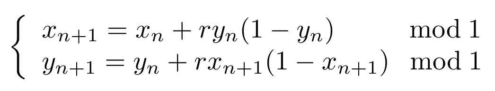
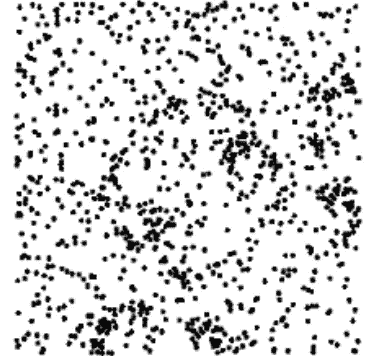
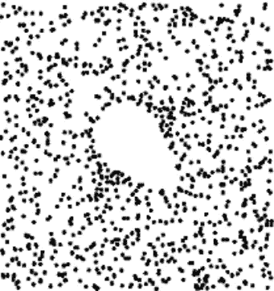
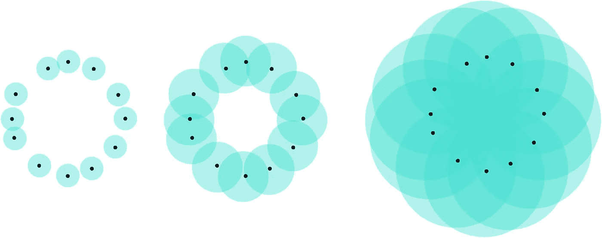
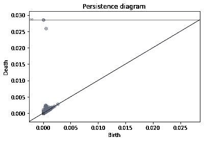
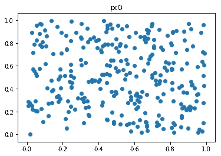
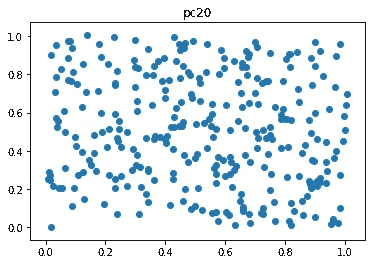
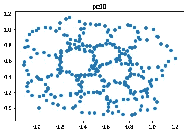

# 拓扑机器学习的神圣三位一体:Gudhi、Scikit-Learn 和 Tensorflow

> 原文：<https://towardsdatascience.com/the-holy-trinity-of-topological-machine-learning-gudhi-scikit-learn-and-tensorflow-pytorch-3cda2aa249b5?source=collection_archive---------21----------------------->


库斯科学校，“加冕的三位一体”(约 1730)，利马艺术博物馆(公共领域)

大家好！今天，我想强调拓扑数据分析在机器学习中的作用，并演示如何结合使用三个 Python 库来实际使用它:Gudhi、Scikit-Learn 和 Tensorflow。

# 拓扑数据分析？

先说第一件事，先说[拓扑数据分析](https://en.wikipedia.org/wiki/Topological_data_analysis) (TDA)。这是一个相对较小的数据科学领域(特别是与机器学习和深度学习相比)，但它正在积极发展，并引起了数据科学家的关注。许多初创企业和公司实际上正在将这些技术集成到他们的工具箱中(我们正在谈论的是 [IBM](https://researcher.watson.ibm.com/researcher/view_group.php?id=6585) 、[富士通](https://www.fujitsu.com/global/about/resources/news/press-releases/2016/0216-01.html)、 [Ayasdi](https://www.ayasdi.com/platform/technology/) …),由于它最近在各种应用中取得的成功，例如[生物学](https://www.ncbi.nlm.nih.gov/pubmed/28459448)、[时间序列](https://www.ams.org/journals/notices/201905/rnoti-p686.pdf)、[金融](https://papers.ssrn.com/sol3/papers.cfm?abstract_id=2931836)、[科学可视化](https://topology-tool-kit.github.io/)、[计算机图形学](http://www.lix.polytechnique.fr/~maks/papers/top_opt_SGP18.pdf)……我可能会写一篇关于这方面的帖子-)

TDA 的目标是计算和编码数据的拓扑，这意味着记录数据集中各种连接的组件、环路、空腔和高维结构。这可能非常有用，主要是因为这种类型的信息不能由其他描述符计算，所以 TDA 真正存储了一组独特的数据特征，这些特征在其他任何地方都找不到。事实证明，这些功能经常被证明对增强机器学习预测是有用的，所以如果你以前没有见过或听说过这些功能，我会让你跟上速度；-)

我已经写了几篇关于这个主题的[文章](/a-concrete-application-of-topological-data-analysis-86b89aa27586)中的[两篇](/mixing-topology-and-deep-learning-with-perslay-2e60af69c321)，你可以在 Medium 上找到[许多](/applied-topological-data-analysis-to-deep-learning-hands-on-arrhythmia-classification-48993d78f9e6) [其他](/persistent-homology-with-examples-1974d4b9c3d0) [关于 TDA 的帖子](/topological-data-analysis-unpacking-the-buzzword-2fab3bb63120)，所以我不会花时间在数学定义上，而是通过分解 TDA 文献的一个经典例子来说明如何在你的数据集上应用 TDA。

# TDA 的参考范例:点云分类

这个数据集是在 TDA 的一篇开创性文章[中介绍的。它由通过生成以下动力系统的轨道而获得的一组点云组成:](http://jmlr.org/papers/v18/16-337.html)



动力系统方程。

这意味着我们将在单位正方形中随机选取一个初始点，并用上面的等式生成一系列点。这将给出一个单点云。现在我们可以随心所欲地重复操作，最终得到一堆点云。这些云的一个有趣的特性是，根据您用来生成点序列的 *r* 参数的值，点云最终会有非常不同和有趣的结构。例如，如果 *r = 3.5* ，产生的点云似乎覆盖了整个单位正方形，而如果 *r = 4.1* ，单位正方形中的一些区域是空的:换句话说，你的点云中有洞。这对我们来说是个好消息:TDA 可以直接计算出这些结构的存在。



用 r = 3.5(左)和 r = 4.1(右)计算的点云。很明显，后者有一个洞，而前者没有。

TDA 追踪这些黑洞的方法其实很简单。想象给定半径的球以你的点云的每个点为中心。如果 *R = 0* ，这些球的并集就是点云本身。如果 *R =无穷大*，球的并集就是全单位正方形。但是如果仔细选择，球的结合可能包含许多拓扑结构，比如洞。



球联合的例子。对于中间的 union，这个 union 显然形成了一个洞。这张图片是无耻地从我以前的一篇文章中重复使用的。

因此，为了避免不得不为 *R* 手动选择这个“好”值，TDA 将为 0 到无穷大之间的 *R* 的所有可能值计算这个球的联合，并记录每个球洞出现和消失的半径，并将这些值用作一些点的 2D 坐标。TDA 的输出是另一个点云，其中每个点代表一个洞:它被称为 *Rips 持久性图*。假设点云存储在一个形状为(n x 2)的 numpy 数组 *X* 中，可以用下面这段代码用 [Gudhi](http://gudhi.gforge.inria.fr/python/latest/) 计算两行图表:

```
import gudhirips = gudhi.RipsComplex(points=X).create_simplex_tree()
dgm = rips.persistence()
```



根据对应于 r = 4.1 的点云计算出的漂亮的持久性图。红色的点代表连接的组件，蓝色的点代表孔。

给定点云，我们要解决的任务是预测 *r* 的值。

# 用 Gudhi + Scikit-Learn 进行拓扑机器学习

持久性图很简洁，对吗？但是它们的问题是，从不同的点云中计算的持久性图可能有不同的点数(因为点云可能有不同数量的洞)。因此，如果您想用 Scikit-Learn 从持久性图中预测 *r* ，不幸的是，没有直接的方法，因为这些库期望将结构化向量作为输入。这就是为什么有大量的工作将持久性图转换成固定长度的欧几里得向量，甚至开发持久性图的内核。那太好了，但是你应该使用哪一个呢？

不用再担心了！[古迪](http://gudhi.gforge.inria.fr/python/latest/)又来找你了。使用其 [*表示*](https://gudhi.inria.fr/python/latest/representations.html) 模块，您不仅可以计算所有这些矢量化和内核，还可以完全使用 Scikit-Learn 来交叉验证和/或选择最佳的。就像这样简单:

```
import gudhi.representations as tda
**from** **sklearn.pipeline** **import** Pipeline
**from** **sklearn.svm** **import** SVC
**from** **sklearn.ensemble** **import** RandomForestClassifier as RF
**from** **sklearn.neighbors** **import** KNeighborsClassifier as kNN
**from** **sklearn.model_selection** **import** GridSearchCVpipe = Pipeline([("TDA",       tda.PersistenceImage()),
                 ("Estimator", SVC())])

param =    [{"TDA": [tda.SlicedWassersteinKernel()], 
             "TDA__bandwidth": [0.1, 1.0],
             "TDA__num_directions": [20],
             "Estimator": [SVC(kernel="precomputed")]},

            {"TDA": [tda.PersistenceWeightedGaussianKernel()], 
             "TDA__bandwidth": [0.1, 0.01],
             "TDA__weight": [**lambda** x: np.arctan(x[1]-x[0])], 
             "Estimator": [SVC(kernel="precomputed")]},

            {"TDA": [tda.PersistenceImage()], 
             "TDA__resolution": [ [5,5], [6,6] ],
             "TDA__bandwidth": [0.01, 0.1, 1.0, 10.0],
             "Estimator": [SVC()]},

            {"TDA": [tda.Landscape()], 
             "TDA__resolution": [100],
             "Estimator": [RF()]},

            {"TDA": [tda.BottleneckDistance()], 
             "TDA__epsilon": [0.1], 
             "Estimator: [kNN(metric="precomputed")]}
           ]model = GridSearchCV(pipe, param, cv=3)
model = model.fit(diagrams, labels)
```

在前面的代码中，我基本上是用[切片 Wasserstein 内核](http://proceedings.mlr.press/v70/carriere17a/carriere17a.pdf)和[持久性加权高斯内核](http://proceedings.mlr.press/v48/kusano16.html)来尝试内核 SVM，用[持久性图像](http://jmlr.org/papers/v18/16-337.html)来尝试 C-SVM，用[持久性景观](http://www.jmlr.org/papers/volume16/bubenik15a/bubenik15a.pdf)来尝试随机森林，以及用所谓的持久性图之间的瓶颈距离来尝试简单的 k-NN。在 [Gudhi](http://gudhi.gforge.inria.fr/python/latest/) 里还有很多其他的可能性，你一定要去看看！如果你想了解更多的细节，你也可以看看[这个古迪教程](https://github.com/GUDHI/TDA-tutorial/blob/master/Tuto-GUDHI-representations.ipynb)。

# Gudhi + Tensorflow 拓扑优化

我很确定你现在已经对 TDA 上瘾了。如果你还是不相信，我有别的东西给你，是从[这篇论文](https://arxiv.org/abs/1905.12200)得到的启发。假设你现在想解决一个更难的问题:我想让你给我一个点云，它的持久性图有尽可能多的点。换句话说，你要生成一个有很多洞的点云。

我能看到你额头上的汗水。但我是慈悲为怀的那种人，让你知道 [Gudhi](http://gudhi.gforge.inria.fr/python/latest/) 眨眼之间就能做到这一点。想一想:当你生成一个持久性图时，这个图中不同点的坐标并不依赖于完整的原始点云，对吗？对于该图中的给定点*p*,*p*的坐标仅以简单的方式取决于原始点云中形成洞的点的位置(对应于 *p* ):这些坐标仅仅是球的联合使这个洞出现或消失的半径——或者等价地，这些点内的最大成对距离。原来 [Gudhi](https://gudhi.inria.fr/python/latest/) 可以用它的 *persistence_pairs()* 函数吐出这些依赖关系。然后，梯度被简单地定义为欧几里德距离函数的导数(正式定义见[本文](https://sites.google.com/view/hiraoka-lab-en/research/mathematical-research/continuation-of-point-cloud-data-via-persistence-diagram))。

因此，让我们编写几个函数，一个从点云中计算 Rips 持久性图，另一个计算持久性图点的导数。为了可读性，我稍微简化了代码，实际的代码可以在[这里](https://github.com/GUDHI/TDA-tutorial/blob/master/Tuto-GUDHI-optimization.ipynb)找到。

```
**def** Rips(DX, mel, dim):
    rc = gd.RipsComplex(distance_matrix=DX, max_edge_length=mel)
    st = rc.create_simplex_tree(max_dimension=dim+1)
    dgm = st.persistence()
    indices = st.persistence_pairs()
    **return** indices**class** RipsModel(tf.keras.Model):
    **def** __init__(self, X, mel=12, dim=1, card=50):
        super(RipsModel, self).__init__()
        self.X = X
        self.mel = mel
        self.dim = dim
        self.card = card

    **def** call(self):
        m, d, c = self.mel, self.dim, self.card

        # Compute distance matrix
        DX = tfa.losses.metric_learning.pairwise_distance(self.X)
        DXX = tf.reshape(DX, [1, DX.shape[0], DX.shape[1]])

        # Turn numpy function into tensorflow function
        RipsTF = lambda DX: tf.numpy_function(Rips, [DX, m, d, c], [tf.int32 for _ in range(4*c)])

        # Compute vertices associated to positive and negative simplices 
        # Don't compute gradient for this operation
        ids = tf.nest.map_structure(tf.stop_gradient, tf.map_fn(RipsTF,DXX,dtype=[tf.int32 for _ in range(4*c)]))

        # Get persistence diagram by simply picking the corresponding entries in the distance matrix
        dgm = tf.reshape(tf.gather_nd(DX, tf.reshape(ids, [2*c,2])), [c,2])
        **return** dgm
```

现在，让我们定义一个损耗，它与余辉图中指向对角线的距离相反。这将迫使图表有许多点，纵坐标比横坐标大得多，相当于一个有许多大孔的点云。

```
model = RipsModel()
optimizer = tf.keras.optimizers.Adam(learning_rate=1e-2)**for** epoch **in** range(100):

    **with** tf.GradientTape() **as** tape:

        dgm = model.call()        
        loss = -tf.math.reduce_sum(tf.square(.5*(dgm[:,1]-dgm[:,0])))
        gradients = tape.gradient(loss, model.trainable_variables)
        optimizer.apply_gradients(zip(gradients, model.trainable_variables))
```

现在我们来优化一下！以下是第 0、20 和 90 个时期的结果:



如此多的洞，如此美丽…我们活在梦里。如果你想继续玩其他损失，检查[这个 Gudhi 教程](https://github.com/GUDHI/TDA-tutorial/blob/master/Tuto-GUDHI-optimization.ipynb)，它也包含了另一个关于图像优化的例子。

# 最后一句话…

这篇文章只是结合 Gudhi、Scikit-Learn 和 Tensorflow 所提供的许多可能性的一瞥。我希望我说服了你，将 TDA 整合到你的管道中已经变得非常简单了。尽管 TDA 的许多应用已经出现在文献中，但肯定还有更多需要发现！