# 家庭云革命:如何在家托管您的个人云？

> 原文：<https://towardsdatascience.com/the-home-cloud-revolution-how-to-host-your-personal-cloud-from-home-584abf16be4?source=collection_archive---------7----------------------->

## 抛弃谷歌和微软，选择 Nextcloud


安娜斯塔西娅·杜尔吉尔在 [Unsplash](https://unsplash.com?utm_source=medium&utm_medium=referral) 上的照片

# 前提

谷歌跟踪你。是的，我知道这不是一个令人震惊的阅读，但这是真的。是的，几乎每个大公司都在追踪你，但是你可能不知道谷歌在网络上有多活跃。引用[这篇](https://spreadprivacy.com/followed-by-ads/)来自《鸭鸭走》的文章:

> 普林斯顿的 WebTAP 隐私项目最近发现谷歌的追踪器安装在 75%的上百万个互联网网站上。

我一直在逐渐脱离谷歌的生态系统，虽然不使用谷歌的许多应用程序几乎是不可能的，但在本文中，我将向你展示如何摆脱谷歌最受欢迎的服务之一:谷歌驱动。

请注意，本文将向您展示如何在家中托管云应用程序，而且这并不便宜。从 OEM 购买时，这种设置的近似成本是€130 或 159 美元，但显然，您可以通过从第三方购买来降低价格。

这里有一个小小的警告:自己托管云不如让别人托管云安全。它的风险更大，因为任何事故，如停电或过载都可能烧毁你的设备，你基本上失去了所有的文件。如果你害怕这一点，使用 UPS 和 raid 备份多个驱动器。

此外，您的网络需要一个公共静态 IP，因此如果您打算跟进并安装 Nextcloud，请联系您的 ISP 来申请。

# 什么是 Nextcloud？

Nextcloud 是一个你可以自己托管的云平台。自托管可以让你重新获得对数据的控制，你上传的文档、图片和其他任何东西都不会上传到谷歌或微软的服务器，而是上传到你的个人服务器。

此外，它是一个开源项目，这意味着它所依赖的每一行代码都可以被社区检查。当源代码可用时，您可以阅读文件中发生的任何事情。不再不知道您的数据会发生什么。

你可以在[官网](https://nextcloud.com/)找到更多信息。

# 要求

我们将在这些指南中找到的最重要的工具是 **Raspberry Pi** ，在我们的情况下，在迭代 4B 2GB 中，你可以从 raspberrypi.org[购买](https://www.raspberrypi.org/products/raspberry-pi-4-model-b/)。该网站不允许您从 OEM 购买主板，而是将您重定向到您所在国家的合作商店。

**你必须为这个项目使用专用的 RaspberryPi 4B，以避免过热。**我的树莓 Pi 3 仅仅通过运行 Nextcloud 和其他几个网络项目就轻松达到了 158 华氏度或 70 摄氏度。

我们需要的第二个硬件是树莓派的盒子。我推荐的案例是 [PiCase 40](https://www.kickstarter.com/projects/coolermaster/pi-case-40) ，一旦它离开 Kickstarter，它将从 2020 年 9 月中旬开始在共同市场上市。你可以使用任何兼容的外壳，甚至根本不使用任何外壳，但 Cooler Master 的这款特殊产品应该可以确保你的设备不会经常过热。

我们必须把系统刷新到 microSD 存储器，所以我们需要买一个。我会推荐一款可靠的 SD，比如你可以在三星网站上找到的三星 EVO 32GB，但实际上任何 16GB 以上的内存都可以，我们只会将其用于操作系统和 Nextcloud 的数据库。

如果你有一台可以读取 SD 卡的笔记本电脑，你是幸运的，但如果你没有，你就需要购买一个 MicroSD 转 USB 适配器。你可以在网上和大多数电子商店找到它。

为了存储数据，我建议使用 USB 驱动器、硬盘或 SSD。我认为最适合的是你可以从沃尔玛或大多数在线电子商店买到的高达 5tb 的希捷 Basic。

最后，你需要一个带 USB Type-C 连接器的 5V 3A 电源。如果你不确定买什么或去哪里买，这是树莓基金会的官方电源。

你还需要一根以太网电缆，但是既然我们在讨论网络，我就不应该提这个了。

# Raspberry Pi 操作系统设置

如果你是一个超级用户，或者你已经使用过 Raspberry Pi，你可以跳过这一部分。

如果你是一个普通用户，并且你从来没有接触过树莓派，那么你将开始一段伟大的旅程！

首先，你需要把树莓皮放进你的盒子里。如果你已经购买了 PiCase 40，你可以观看[这个视频](https://www.youtube.com/watch?v=GMDINc3LUao&t=114s)将电路板安装到机箱中，尽管这应该非常简单。

要将操作系统刷新到 MicroSD，您必须将其直接或通过适配器连接到 PC，然后下载 [Raspberry Pi Imager](https://www.raspberrypi.org/downloads/) 。如果您在 Linux 上，您可以通过以下命令安装它:

```
sudo apt install rpi-imager
```

打开成像仪，选择 SD 并通过 *Raspberry Pi OS(其他)——*安装 *Raspberry Pi OS Lite* 而非 Ubuntu，我们也可以安装 Ubuntu 并使用 [snap](https://snapcraft.io/nextcloud) 安装 Nextcloud 或直接安装 [NextCloudPi](https://docs.nextcloudpi.com/en/how-to-install-nextcloudpi/) 的系统映像，但在本指南中，我们将使用 Raspberry Pi OS。

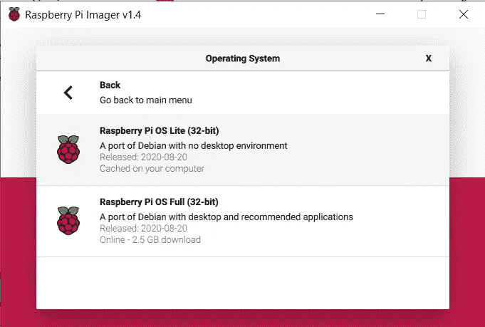

要使用 Raspberry Pi，您可以通过 ssh 连接，也可以直接将其连接到 USB 键盘和 HDMI 显示器。我将使用 SSH，因此，如果您将直接连接它，可以跳过下一步。

闪存完成后，使用您的文件管理器导航至 SD 卡，并在根目录下创建一个名为 ssh 的文件——不是 ssh.txt，只是 ssh，如果您在 Windows 上，您可以使用顶部栏通过菜单*查看>文件扩展名来启用扩展名。*

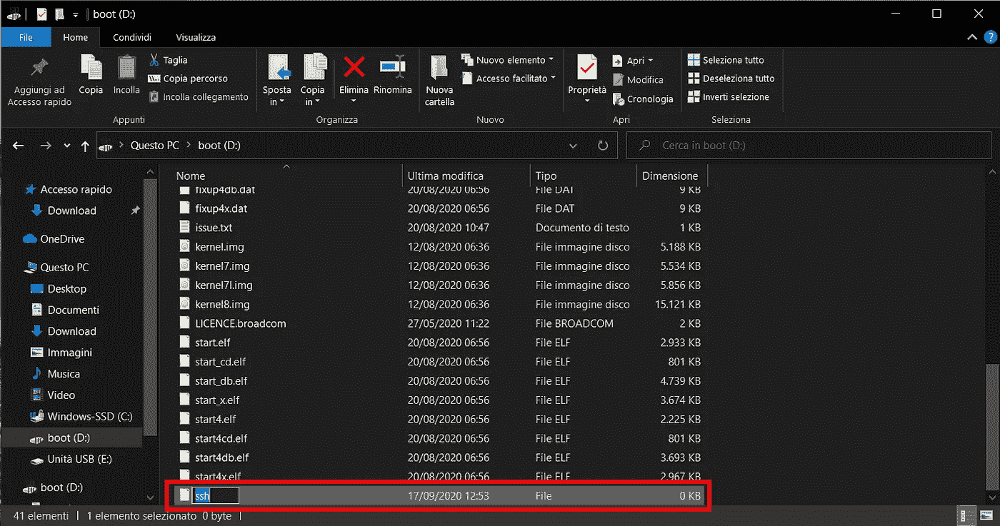

弹出卡，然后将其插入板上的卡槽。很好，我们的树莓派现在可以启动了。将其插入壁挂支架，并连接到您的路由器。

现在，这有点棘手，你需要进入你的路由器页面来检查树莓派的 IP 地址。不幸的是，我不能提供更好的细节，因为每个制造商有不同的登录页面。我能做的就是告诉你，通常，路由器的 IP 是 192.168.x.1，192.168.x.254，其中 x 可以是 0，也可以是 1。通过运行命令，您可以很容易地找到是否必须通过计算机终端设置 0 或 1

```
ipconfig
```

如果你在 Windows 或

```
ifconfig
```

如果你在 Linux 上查看你电脑的 IP 地址。

如果你运行的是 Mac OS，也可以采取类似的步骤，因为 Mac OS 和 Linux 一样都是基于 Unix 的。

# 安装 Nextcloud

现在 Raspberry Pi 已经设置好了，我们需要使用 SSH 通过命令行连接到它。通常，Windows 和 Mac 都带有 SSH 客户端，所以只需启动您的终端并运行:

```
ssh pi@ip_address 
```

其中 pi 是 Raspberry Pi 的默认用户，ip_address 必须替换为您的 Raspberry 的 ip。pi 帐户的默认密码是 *raspberry* ，尽管我建议您在使用命令登录后更改它

```
sudo passwd
```

现在，要安装 Nextcloud，您只需运行以下命令:

```
curl -sSL https://raw.githubusercontent.com/nextcloud/nextcloudpi/master/install.sh | sudo bash
```

如果由于某种原因，你没有自动安装 curl，只需运行

```
sudo apt install curl
```

# 设置 Nextcloud

下一步，导航到 [HTTP://rpi-ip-address，](http://HTTP://rpi_ip_address,)其中 *rpi-ip-address* 是您的 Raspberry Pi 的 ip 地址，并保存将给您的密码。默认用户是 ncp，所以您不需要保存它，因为它不是随机的。点击“激活”，一个新的页面将在你的浏览器中打开，提示你输入用户名和密码。将 **ncp** 设置为用户名，将您保存的密码设置为密码。

现在有趣的事情开始了，你进入 Nextcloud 的门户网站，你将被要求启动设置向导:

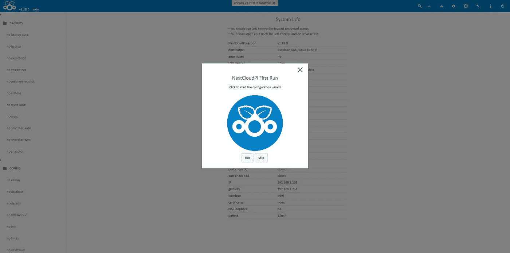

Nextcloud 的设置向导。

按照简化的向导进行操作，当被问及是否希望能够从屋外访问 Nextcloud 时，点击 **yes** 。

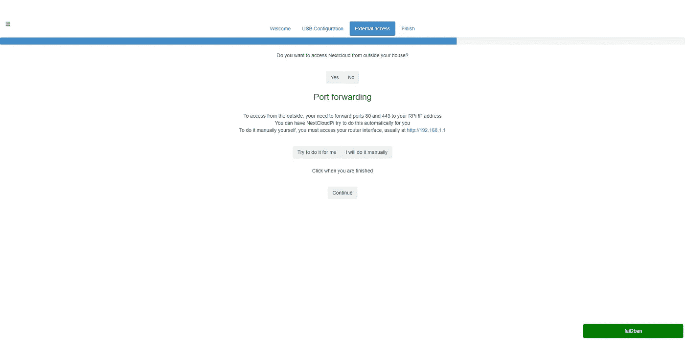

如果你不确定如何移植应用程序，让 Nextcloud 来帮你做吧。它将使用 UPnP 标准来尝试并自动设置端口转发。然而，我们还将在后面介绍如何移植应用程序。

下一步有点棘手。现在，为了让你的服务器在你的房子外面也能使用，你可能需要建立一个域，这意味着不用 2.210.123.43 进入你的服务器，你只需使用 thisismynextcloudserver.com 就可以了。现在你真的不需要一个. com，任何域名都可以。你可以用 name price 买到非常便宜的东西。我的域名(我得到我的大约 2 美元)。

如果你不想购买域名，你可以使用 Nextcloud 向你推荐的服务，基本上是为每个账户创建一个子域，所以你可能会有类似于 yourname.freedns.com 的东西。

我建议你自己购买一个域名，这就是我将在本指南中向你展示的。选择跳过并完成您的设置。

# 域名和 HTTPS。

现在，我们的 web 服务器运行在 HTTP 上，这意味着设备和服务器之间交换的数据没有加密。你不希望你的数据在线不加密，所以让我们安装一个证书。为此，你需要购买一个域名。

去[whatsymip.org](http://whatsmyip.org)保存你的 IP 地址，我们以后会用到。

在[namecheap.com](https://namecheap.com)或任何你信任的域名提供商上创建一个账户，并购买你的域名。

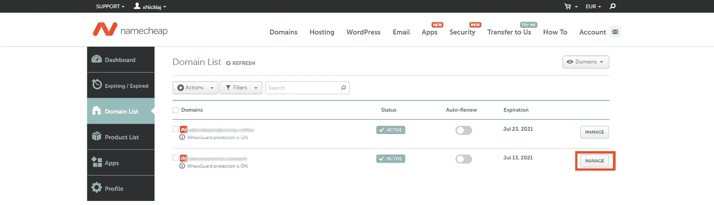

然后，如果你使用过 namecheap，进入[你的域名](https://ap.www.namecheap.com/domains/list/)，点击你的域名右边的*管理*，显示高级信息标签。现在点击*高级 dns —* 或者直接导航到 AP . www . name cheap . com/Domains/domain control panel/your domain/advanced ns—添加一个带有 Host @的 A 记录，并为您的 IP 赋值。然后添加一个主机为 www 的 CNAME 记录，并为您的域赋值。

最后，您的配置应该包括这两条记录:

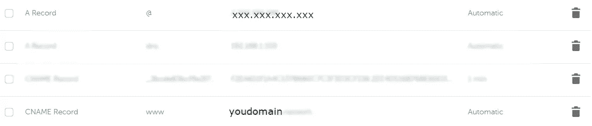

我们所做的是告诉域名，当它被访问时，应该从你的域名和 [www.yourdomain.](http://www.yourdomain.) 指向你的 IP 地址

然后回到您的终端并安装 certbot:

```
sudo apt install certbot python-certbot-apache
```

在这一步中，我们将检索用于加密连接的证书，因此运行:

```
sudo certbot --apache
```

您应该这样配置它:

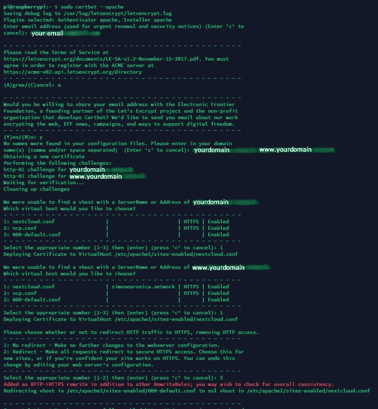

最后，回到[HTTP://rpi-IP-address](http://HTTP://rpi_ip_address,):1443 进入控制面板，将 yourdomain 和 www.yourdomain 添加到 nc-trusted-domains 部分。

# 更改驱动器目录

首先，我们需要将 USB 格式化为 btrfs，但是不要担心，这并不难。将驱动器连接到 raspberry pi，并拔下所有其他驱动器。然后运行:

```
sudo ncp-config
```

然后导航到*工具>NC-格式-USB:*

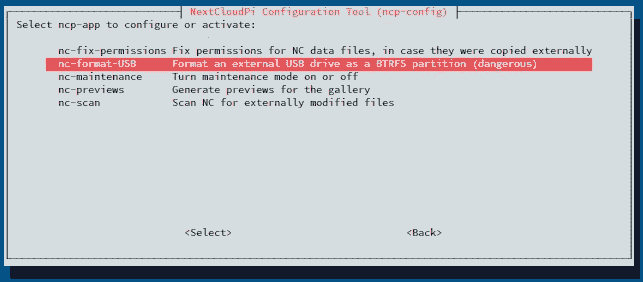

按照屏幕上的步骤格式化 USB 驱动器，然后按 exit 返回主页。在这一步之后，记住驱动器的名称或保留默认名称是很重要的。

现在导航到*系统>NC-自动安装*，遵循设置程序，当在此屏幕上时，用是替换否:

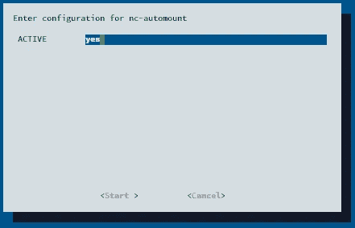

最后，导航到 *config > nc-datadir* 并将数据目录更改为/media/yourdevicename，或者，如果您使用了默认名称/media/MyCloudDrive。

# 设置您的路由器

现在我们差不多完成了。我们只需要设置端口转发。为此，你需要像第一步那样回到调制解调器的页面，找到一个叫做端口转发或端口映射的部分。端口映射基本上是映射您的调制解调器，使某些端口在您的网络之外可用，这样当您访问您的 ip:port 时，该服务将在整个互联网上可用。在新的端口映射中，您必须为您的 raspberry pi 的 IP 添加一个 TCP 异常，以及作为内部和外部端口的端口 443。对端口 80 进行同样的操作。

很好，我们基本上完成了。前往您的领域，测试一切是否正常。您应该会看到一个类似的页面:

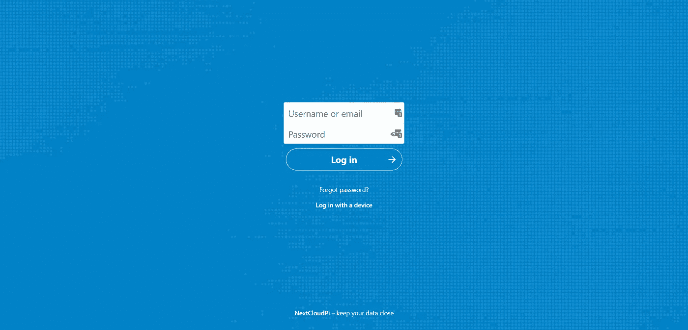

Nextcloud 的登录页面。

这意味着您现在可以使用 nextcloud 了。您可以使用之前保存的密码以用户名 ncp 登录。

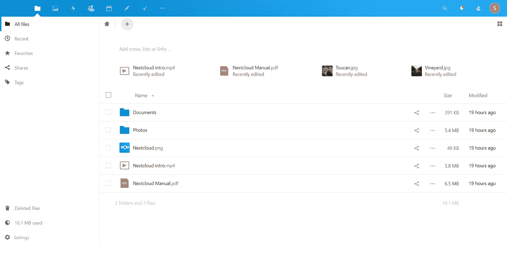

Nextcloud 的文件页面。

如你所见，你现在可以通过互联网安全地访问你所有的文件。你也可以下载适用于安卓系统和 T2 系统的应用程序，并像在谷歌照片中一样设置照片备份。