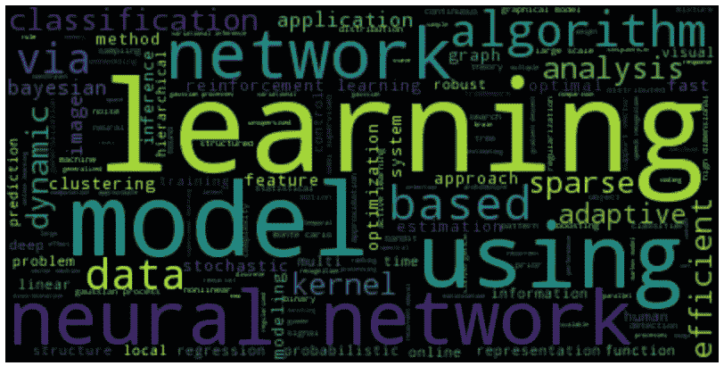
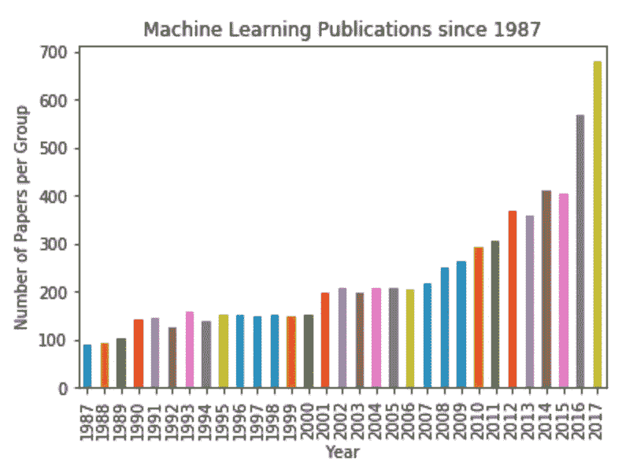
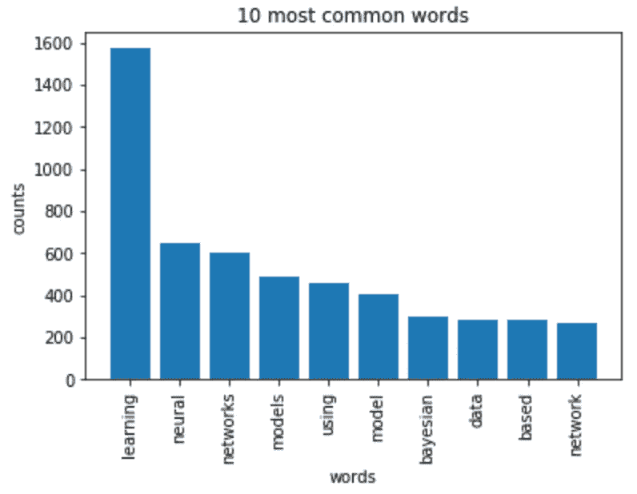

# 文本预处理和主题建模入门

> 原文：<https://towardsdatascience.com/the-hottest-topics-in-machine-learning-866ae21ba22d?source=collection_archive---------39----------------------->

## 了解自然语言处理(NLP)——Python 中的文本预处理、主题建模和潜在狄利克雷分配(LDA)

```
Feel free to follow me on Medium!
```

最近在 DataCamp 上完成了“[机器学习最热门话题](https://learn.datacamp.com/projects/158)”项目。该项目在 NIPS 论文上使用自然语言处理(NLP ),并实现主题建模和潜在狄利克雷分配(LDA ),以开发机器学习研究中最热门的主题。



" [**主题建模**](https://en.wikipedia.org/wiki/Topic_model) 是一种统计模型，用于发现文档集合中出现的抽象主题。"" [**潜在狄利克雷分配** ( **LDA** )](https://en.wikipedia.org/wiki/Latent_Dirichlet_allocation) 是主题建模的一个示例，是一个生成统计模型，它允许观察集由未观察到的组来解释，这解释了为什么数据的某些部分是相似的。"

> "文档被认为是主题的概率分布，而主题被认为是单词的概率分布."

# 数据

NIPS 会议(神经信息处理系统)是机器学习社区最负盛名的年度活动之一。在每次 NIPS 会议上，都会发表大量的研究论文。该数据文件包含从 1987 年到 2017 年(30 年)发表的不同 NIPS 论文的信息。这些论文讨论了机器学习中的各种主题，从神经网络到优化方法等等。

```
import pandas as pd
papers = pd.read_csv("datasets/papers.csv")
papers.head()
```

# EDA 来理解数据

对于论文的分析，我们只考虑与论文相关的文本数据和论文发表的年份，因此有必要删除所有不包含有用文本信息的列。

```
papers.drop(columns=['id', 'event_type', 'pdf_name'], inplace=True)
```

为了理解机器学习领域是如何随着时间的推移而发展的，我们将从可视化 1987 年以来每年的出版物数量开始。

```
groups = papers.groupby('year')counts = groups.size()import matplotlib.pyplot as plt
%matplotlib inline
counts.plot(kind='bar')
plt.xlabel('Year')
plt.ylabel('Number of Papers per Group')
plt.title('Machine Learning Publications since 1987')
```



自 1987 年以来的机器学习出版物

# 数据预处理

在我们开始之前，这里是文本预处理步骤的列表:

*   **正则表达式/规范化** —小写单词，删除标点符号和数字
*   **记号化** —将文本分割成称为记号的小块的过程
*   **停用词**移除——任何语言中的一组常用词
*   **词汇化** —将一个单词的词形变化组合在一起的过程，这样它们就可以作为一个单独的项目进行分析
*   **词干分析** —将一个单词的词尾变化形式组合在一起的过程，这样它们就可以作为一个单独的项目进行分析

首先，我们将对标题进行一些简单的预处理，以便于分析。我们将使用正则表达式删除标题中的任何标点符号。然后我们将小写的单词。

```
import re# Remove punctuation
papers['title_processed'] = papers['title'].map(lambda x: re.sub('[,\.!?]', '', x))# Lowercase the words
papers['title_processed'] = papers['title_processed'].map(lambda x: x.lower())
```

为了检查预处理是否正确，我们可以制作研究论文标题的单词云。Python 有大量的开放库，但现在我们将使用 Andreas Mueller 的“ [wordcloud 库](http://amueller.github.io/word_cloud/)”。这将为我们提供最常见单词的可视化表示。

```
import wordcloudlong_string = " ".join(papers.title_processed)wordcloud = wordcloud.WordCloud()
wordcloud.generate(long_string)
wordcloud.to_image()
```


词云

# LDA 分析

我们将使用的主要文本分析方法是潜在狄利克雷分配(LDA)。LDA 能够对大型文档集执行主题检测，确定大型未标记文本集中的主要主题。

首先，需要将文档转换成简单的向量表示。文档向量的每个条目将对应于一个单词在文档中出现的次数。综上所述，我们将把一个标题列表转换成一个长度等于词汇量的向量列表。我们将根据文档向量列表绘制 10 个最常见的单词。

```
from sklearn.feature_extraction.text import CountVectorizer
import numpy as npdef plot_10_most_common_words(count_data, count_vectorizer):
    import matplotlib.pyplot as plt
    words = count_vectorizer.get_feature_names()
    total_counts = np.zeros(len(words))
    for t in count_data:
        total_counts+=t.toarray()[0]

    count_dict = (zip(words, total_counts))
    count_dict = sorted(count_dict, key=lambda x:x[1], reverse=True)[0:10]
    words = [w[0] for w in count_dict]
    counts = [w[1] for w in count_dict]
    x_pos = np.arange(len(words))plt.bar(x_pos, counts,align='center')
    plt.xticks(x_pos, words, rotation=90) 
    plt.xlabel('words')
    plt.ylabel('counts')
    plt.title('10 most common words')
    plt.show()count_vectorizer = CountVectorizer(stop_words='english')
count_data = count_vectorizer.fit_transform(papers['title_processed'])
plot_10_most_common_words(count_data, count_vectorizer)
```



10 个最常见的单词

最后，将使用 LDA 分析研究标题。我们将改变的唯一参数是 LDA 算法中的主题数量，以便我们决定获得前 10 个主题。根据我们得到的结果，我们可以区分每个主题是关于什么的(“神经网络”、“学习”、“核方法”、“高斯过程”)。

```
import warnings
warnings.simplefilter("ignore", DeprecationWarning)from sklearn.decomposition import LatentDirichletAllocation as LDA

def print_topics(model, count_vectorizer, n_top_words):
    words = count_vectorizer.get_feature_names()
    for topic_idx, topic in enumerate(model.components_):
        print("\nTopic #%d:" % topic_idx)
        print(" ".join([words[i]
             for i in topic.argsort()[:-n_top_words - 1:-1]]))

number_topics = 10
number_words = 6lda = LDA(n_components=number_topics)
lda.fit(count_data)print("Topics found via LDA:")
print_topics(lda, count_vectorizer, number_words)
```


通过 LDA 找到的 10 大主题

# 结论

最后，根据我们之前创建的图表，从 1987 年到 2017 年，NIPS 会议论文的数量呈指数级增长。我们还可以得出结论，机器学习在过去几年变得越来越流行。所以历史数据预测 2018 年会有更多的论文发表！

```
# The historical data indicates that:
more_papers_published_in_2018 = **True**
```

创建这篇文章的源代码可以在我的 [Github](https://github.com/shirley0823/The-Hottest-Topics-in-Machine-Learning) 中找到。

# 关于我

非常感谢您阅读我的文章！大家好，我是雪莉，目前在亚利桑那州立大学攻读商业分析硕士学位。如果您有任何问题，请随时联系我！

```
Email me at ***kchen122@asu.edu***and feel free to connect me on [**LinkedIn**](https://www.linkedin.com/in/kuanyinchen-shirley/)!
```