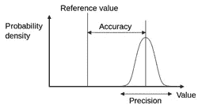
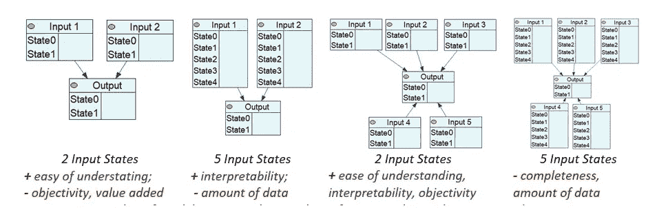
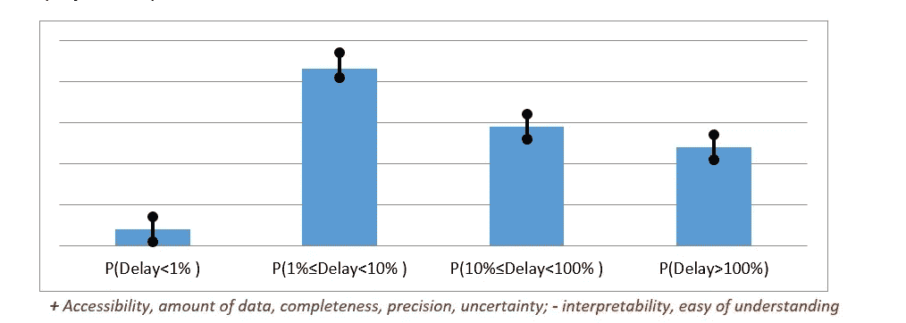
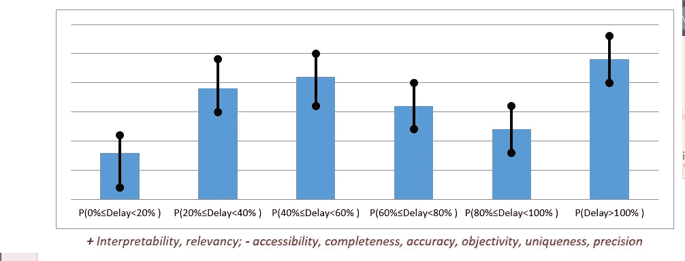
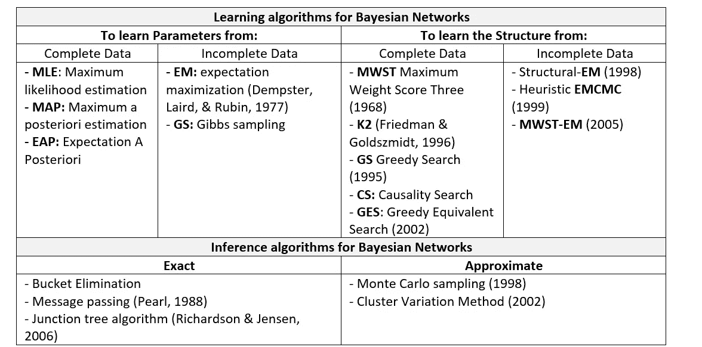
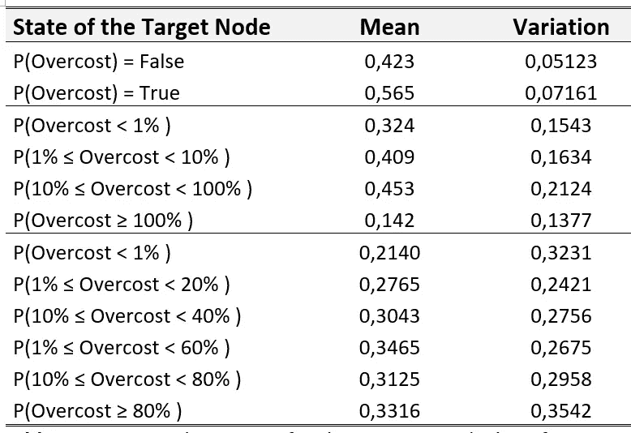
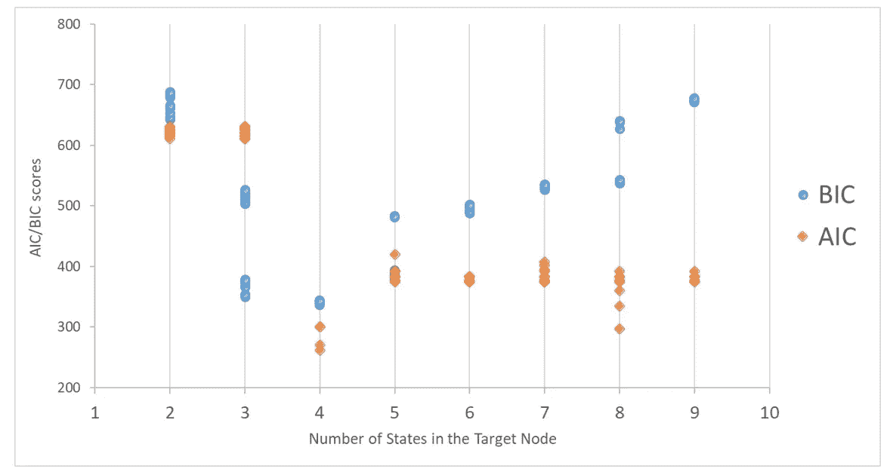
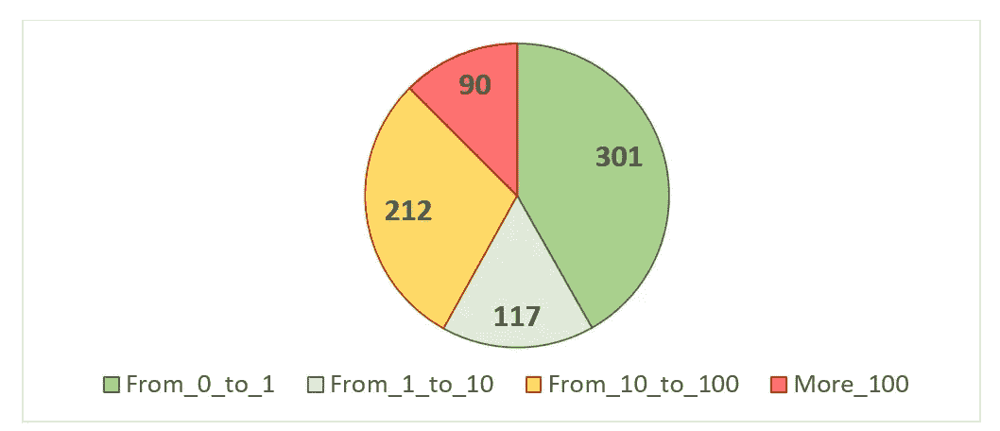

# 如何使用贝叶斯网络调整建模的超参数？

> 原文：<https://towardsdatascience.com/the-hyperparameter-tuning-problem-in-bayesian-networks-1371590f470?source=collection_archive---------27----------------------->

Alexis Baydoun 在 [Unsplash](https://unsplash.com/s/photos/guitar-tuning?utm_source=unsplash&utm_medium=referral&utm_content=creditCopyText) 上拍摄的照片

在这段历史中，我们讨论了基于贝叶斯网络(BN)建立模型时要考虑的结构标准。

如果你是 BN 的新人，我建议你先看看下一个帖子:

 [## 贝叶斯思维导论:从贝叶斯定理到贝叶斯网络

### 假设世界上存在一种非常罕见的疾病。你患这种疾病的几率只有千分之一。你想要…

towardsdatascience.com](/will-you-become-a-zombie-if-a-99-accuracy-test-result-positive-3da371f5134) 

在这篇文章中，我将首先关注模型的结构。为此，我们将使用深度学习模型中使用的术语“*超参数*”，即*“在运行学习算法之前应该设置的参数”* (Mnih 等人，2013)。这些超参数将条件固定在被训练的学习参数上；他们依赖专家。例如，在人工神经网络中，超参数是学习率(a)、梯度下降中的迭代次数、隐层数、隐单元数、激活函数等。然后我们需要为 BN 定义特定的超参数。

*如果你想了解更多关于超参数和机器学习的知识，我建议你访问这个博客:*

 [## Optuna vs Hyperopt:应该选择哪个超参数优化库？- neptune.ai

### 思考应该选择哪个库进行超参数优化？使用远视有一段时间了，感觉像…

海王星. ai](https://neptune.ai/blog/optuna-vs-hyperopt) 

通常，在任何机器学习问题中，目标都是找到最小化给定成本函数的正确参数。相反，在构建 BNs 时，这些参数取决于数据可用性和专家的知识。因此，这个问题比参数优化更广泛；这是一个超参数设置问题。在构建 BNs 时，选择超参数的正确配置是一个挑战，因为这些参数是基于模型的语义的。它们对于将用于训练模型的数据应该是有用的。我们在这段历史中探索的超参数是:

***输入节点数，***

***每个输入节点的状态数，***

***目标节点的状态数，***

*[***合成节点数(i***](/bayesian-networks-and-synthetic-nodes-721de16c47e2) ***中间节点)*** ，我有一篇较长的帖子讨论这个主题，因为它非常重要:*

* [## 贝叶斯网络和合成节点

### 在这篇文章中，我给出了一个更正式的观点，并讨论了建模的一个重要元素:合成节点。

towardsdatascience.com](/bayesian-networks-and-synthetic-nodes-721de16c47e2) 

***学习前的数据结构，***

***学习算法。**** 

# ***资格标准选择***

*选择好的超参数是具有挑战性的，因为没有'*'先验的*'正确答案。这是一种试错妥协。通常，在 BN 构建过程中，建模者尝试一些参数，然后测试获得的 BN，尝试超参数的其他值，然后再次测试网络，等等。例如，创建一个所有输入节点都有两种状态的网络，然后创建另一个所有节点都有五种状态的网络，等等。因此，对于超参数的一个候选配置，我们怎么能说一个网络足够有效呢？在本研究中，我们提出了一些评估 BNs 有效性的标准。这些标准将帮助我们判断 BN 是否有效和有用。*

***1 —保证语义一致性:**专家应该很容易解读 BN 语义。该模型应给出可解释的、对专家群体有用的背景和结果。确保语义一致性将增加*可解释性*，增加*易理解性*，增加*时间一致性*。*

***2 —调整网络的完整性:** BNs 应该使用适当数量的节点(以及节点的状态)来表示概念。第二个标准取决于可用的数据量及其完整性。它取决于数据的*可访问性*，它的*不确定性和不完全性。**

***3 —保证结果的相关性:**目标节点(及其状态)应对决策者有用，但其值应具有足够的*准确度*和*精度*，如下图所示:*

**

*结果的相关性确保了几个内在标准，如*有效性*、唯一性*和客观性*。***

***4 —限制组合爆炸。**父节点与子节点的关系数要令人满意。如果模型在每个节点中使用大量的节点或状态，网络将会太复杂而不能被算法学习。当 CPT(条件概率表)对于给定数量的可用数据来说太大时，网络的预测能力将会很低。当 CPT 的大小得到控制时，网络的*相关性*高，结果的准确性增加。如果 CPT 是由基于数据库的算法构建的，它可以执行*敏感性分析*，因此对决策者来说有更多的*附加值*。*

***5 —保证良好的学习质量。** BNs 要有一个完整的学习，就是 CPTs 必须计算完整。当配置爆炸时(太多的状态或节点)，或没有足够的信息时，CPT 计算将是不完整的，因此学习的质量将是低的(Nam et al .，2008)。有几种衡量标准来估计学习的质量，例如，BIC (Burnham & Anderson，2004)或 AIC (Akaike，1974)。良好的学习质量意味着算法将在新的数据集中表现良好，并且网络将有效地帮助决策过程。*

# ***超参数对合格标准的影响***

*在构建 BNs 时，超参数的选择和资格标准之间有很强的相关性。不同的网络结构会改变标准中的结果:*

***输入节点数**是网络中父节点数。下图显示了具有不同输入节点配置的三个网络。专家应该定义哪些变量与输入相对应，其中有多少是必需的。从语义的角度来看，模型可能用更多的输入变量更好地表示问题，但是从数学的角度来看，更多的输入节点可能影响结果中的*准确度*和*精度*，并且模型将需要更大的*数量*的训练*数据*。*

**

*BN 配置示例-输入节点数量的变化(作者创作)*

***输入节点的状态数:**每个输入节点可以有几种状态。从两种状态出发，通常表示(是/否)。随着状态数量的增加，子节点的 CPT 大小也会增加。文献中的 BNs 在每个节点使用两个输入。从语义的角度来看，更多的状态可能是重要的(增加模型的可解释性)；然而，它们会增加模型训练和*灵敏度分析的难度。**

**

*BN 的例子——输入节点数和输入状态的变化(作者创造)*

***输出或目标节点的状态数:**假设输入节点将要连接到一个目标节点。该模型应该在答案的粒度(即目标节点的状态数)和每个答案的值的精度之间进行权衡。*

**

*目标节点中四种状态的精度(黑线)。(作者创作)*

*在这种情况下，我们有四种可能性。第一个显示了事件延迟小于预期时间 1%的概率。第二个显示预期时间的 1%到 10%之间的延迟概率，其他状态以此类推(以对数标度)。目标节点中的这种状态分布向决策者呈现了分组信息，即状态 P 中的范围(10%<delay may="" be="" too="" large.="" to="" tackle="" this="" problem="" the="" figure="" proposes="" a="" more="" granular="" division="" that="" is="" states="" in="" target="" node.=""></delay>*

**

*Precision (black line) for the six states in a target node (Author’s Creation)*

*The second case (the figure above) displays a target node with six states. Here the state segmentation is divided into every 20% interval of the expected possible delay. The presence of several states may appear better for the decision-maker because s/he would have more detailed output for each of the different input configurations; nevertheless, as the number of states increases, the precision and accuracy of the value for each state decrease, as presented by the black line in that figure.*

***合成节点数:**如前所示，当目标节点具有多个状态和多个父节点时，问题变得更加难以解决。提出引入合成节点来限制配置的爆炸(康斯坦蒂努等人，2016；芬顿&尼尔，2013；孙&谢诺伊，2007)。然而，要使用的合成节点的数量将取决于问题的结构及其语义。*

***数据结构化:**在训练算法之前，数据必须是干净的和结构化的。数据库中不应有任何错误。一旦数据准备就绪，数据库中的列表示父节点，最后一列表示目标节点。每一行代表一个实例(测量)，即每一行都是训练算法的一个新案例。给定一个数据库，构建网络的专家应该确保列数和行数之间的对应关系，以及其中包含的信息的质量，以确保学习的质量。*

***机器学习算法:**最后，**要选择一个学习算法。BN 可以使用几种分类算法，它们可以分为两类:(1)用于确定图结构和条件分布参数的算法(学习算法)。还有(2)那些一旦网络完成就计算信息传播的算法(推理算法)(Acid，De Campos，& Castellano，2005；德鲁日泽尔，1999 年；弗里德曼&戈尔兹米特，1996；戈什，2008；纳姆等人，2008 年；珀尔，1988 年)。下表显示了贝叶斯学习中使用的一些算法。***

**

*贝叶斯网络中使用的算法，改编自(Bouaziz，2014)*

*如果你想知道超参数优化在哪里应用，我推荐这篇文章:*

* [## 石油和天然气工程项目中的数据科学。

### 探索性数据分析

towardsdatascience.com](/datascience-in-oil-and-gas-engineering-projects-daace6e6c7f)* 

***贝叶斯网络的超参数调整示例***

*[在这篇文章中，我创建了一个贝叶斯网络来计算石油和天然气项目成本超支的概率](/datascience-in-oil-and-gas-engineering-projects-daace6e6c7f)，但是，我忽略了大部分超参数优化。下面，我举例说明为什么我选择一个参数(目标节点)有四种状态:*

*因此，我们选择了目标节点的状态数:目标节点可以具有: **(1)** 两种状态，表示过成本出现的概率为真或为假。或者， **(2)** 四种状态，对本文讨论的标准给出了更好的折衷:*

***目标节点的状态数与精度。***

*我们定义了目标节点的状态数。为了解决这个问题，我们使用高斯混合模型(GMM)算法来确定目标节点中每个状态的中值和变化值。结果显示在下表中。该表显示，当目标节点具有 2 个或 4 个状态时，产生最佳精度(最低变化)。*

**

*三个目标节点配置的均值和方差。(作者创作)*

*然后，我们评估了在几个类别下对数据库进行聚类时的准确性。我们使用了两个分析标准:阿凯克的信息标准(AIC)(阿凯克，1974)和贝叶斯信息标准(BIC)(施瓦茨，1978)。这两个标准非常接近，并且有很强的统计基础(Vrieze，2012)。下图显示了多个州(2 到 9 个)的评估标准的结果。这些参数下的最佳选择是最小化 BIC 和 AIC 值。这些标准指出，给定手头的数据，目标节点中的四个状态使计算精度最大化。*

**

*不同类别的目标节点及其相关的 BIC 和 AIC 值。(作者创作)*

*根据 AIC 和 BIC 标准，目标节点应该有四个状态来代表四个成本超支范围，以便在准确性和精确度之间达到良好的折衷。*

***P_1_ 或 P(过度成本)< 1%。**相当于总费用不到 1%的成本超支发生的概率。*

***P_1_10 或 1% ≤ P(超额成本)< 10% :** 是总费用的 1%到 10%之间发生成本超支的概率。*

***P1 _ 100 或 10% ≤ P(超额成本)< 100% :** 是总费用的 10%到 100%之间发生成本超支的概率。*

***P_100_ 或 P(超额成本)≥ 100% :** 发生相当于总费用 100%以上的成本超支的概率。*

*鉴于我们的数据库，我们选择 10 为基数的对数标度有两个原因。首先，这个选择产生了对专家有用的范围。目标节点呈现四种状态，前两种 *P(过度成本)< 1%* 和 *1% ≤ P(过度成本)< 10%* 被专家认为具有可忽略和可接受的风险。第三个层次 *10% ≤ P(过度成本)< 100%* 是“未知区域”(不期望的)，项目的复杂性会产生一系列难以准确预测的漂移。四个级别 *P(过度成本)≥ 100%* 定义了当项目有如此多的弱点，以至于可以预见重大漂移影响(不可接受)时发生的风险级别。第二个原因，它创建了四个类，每个类中有足够的例子来高效地训练算法 [**(本帖规则 5)**](/using-bayesian-networks-for-project-management-evaluation-13a6eda50605)如下图所示。*

**

*目标节点中四个类的分布。(作者创作)*

*该算法显示测试的最佳值是四个状态。它表明较少的状态可能有更精确的值(较少的变化),但准确性较差。最后，四州选择提供了较低的 AIC/BIC 值。*

*链接到这篇文章的完整研究可以在下一个链接中找到*

* [## 一种基于贝叶斯网络的提高项目管理成熟度的方法

### 提出了一种建立项目管理成熟度和项目超额成本之间因果关系的方法

www.sciencedirect.com](https://www.sciencedirect.com/science/article/pii/S0166361519309480?dgcid=author)* 

*如果你有兴趣了解创建贝叶斯网络的启发、规则和最佳实践，我推荐这篇文章:*

* [## 构建贝叶斯网络的主要启发式方法——项目管理评估实例

### 这篇文章解释了用贝叶斯网络建模的困难，以及 5 个基本规则如何可以极大地促进你的学习。

towardsdatascience.com](/using-bayesian-networks-for-project-management-evaluation-13a6eda50605) 

# 感谢阅读！！！

> 如果你想继续阅读这样的故事，你可以在这里订阅！*