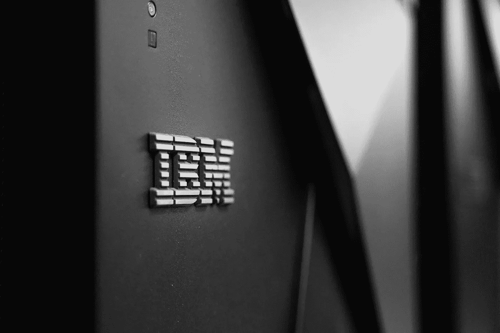

# IBM 数据科学家访谈

> 原文：<https://towardsdatascience.com/the-ibm-data-scientist-interview-a8982361755c?source=collection_archive---------41----------------------->

## IBM 数据科学面试问题

图片来自 [Unsplash](https://unsplash.com/photos/0mXw-dvuLok)

## 介绍

IBM 是一家跨国技术公司，成立于 1911 年，在全球 170 多个国家开展业务。今天，IBM 提供广泛的产品和服务，包括软件解决方案、硬件架构(服务器和存储架构)、业务和技术服务以及全球融资解决方案。

作为一家数据驱动的公司，IBM 了解数据和数据分析在组织的每一层推动更好的业务决策的重要性。此外，作为分析和基于云的解决方案的领先提供商，IBM 提供了一整套基于云的产品和服务，涵盖数据分析、存储、人工智能、物联网和区块链。

*对另一家大型科技公司的数据科学感兴趣？* [***看看这篇关于微软数据科学家采访的文章吧！***](https://www.interviewquery.com/blog-microsoft-data-science-interview-questions/)

# IBM 的数据科学家角色

图片来自 [Pixabay](https://pixabay.com/photos/supercomputer-mainframe-mira-1781372/)

在任何企业分析团队中，数据科学家的角色包括识别提供最大洞察力的机会、分析数据以识别趋势和模式、构建管道和个性化机器学习模型以了解客户需求，以及做出更好的商业决策。

在 IBM，术语数据科学涵盖了数据科学相关工作的广泛范围(数据分析师、数据工程师、数据科学家和研究分析师)，角色可以包括**从数据收集、组织和分析中揭示洞察力，为信息基础设施奠定基础，以及构建和培训具有重大成果的模型**。角色有时是特定于团队和分配的产品的，有时它们可以更加专门化，如面向内部和外部客户的 IBM 分析咨询服务。

IBM 的数据科学家被安排在从事 IBM 产品和服务的团队中，如 IBM Watson Studio、IBM Cloud Pak、IBM Db2、IBM SPSS、IBM Infosphere 等。

## 所需技能

IBM 是一个数据驱动的组织，数据科学是一件大事。IBM 的数据科学家角色需要领域专业化，因此 IBM 只雇佣在**数据分析、定量研究和机器学习应用**方面具有至少 **3 年(高级职位为 5 年以上)**行业经验的高素质人员。

其他基本资格包括:

*   统计学、数学、计算机科学以及其他 STEM 相关领域的理学学士/硕士/博士学位。
*   对统计计算机语言(R，Python，SQL 等)有丰富的经验。)来操作数据，并从大型数据集中获得洞察力。
*   具备创建和使用高级机器学习算法和统计的高级知识，如回归、模拟、情景分析、建模、聚类、决策树、神经网络等。
*   具有机器学习和线性代数的经典方法的经验，包括用于线性分类的支持向量机(SVM)和用于降低数据维度的奇异值分解(SVD)。
*   有 3 年以上使用数据可视化和报告工具的经验，如 Excel、PowerBI、Tableau 等。
*   在使用分布式数据或计算工具(如 Hive、Spark、MySQL 等)方面拥有丰富的行业经验
*   具有自然语言处理、文本分析、数据挖掘、文本处理或其他人工智能子领域和技术的经验
*   充分理解数据分析基础设施和数据工程流程，包括数据存储和检索、ETL 管道、Docker、Kubernetes 等。
*   软件工程实践的背景知识，如版本控制、连续交付、单元测试、文档、发布管理

## IBM 的数据科学家团队

图片来自 [Unsplash](https://unsplash.com/photos/SYTO3xs06fU)

像大多数大型科技公司一样，IBM 有过多的产品和服务，有许多部门和高素质的专业团队在开发新产品和改进现有产品。

IBM 数据科学家在团队中工作，有时可能与内部团队跨职能合作。具体职能可能因团队而异，但一般的数据科学家角色从**轻量级数据分析到机器学习/深度学习都有。**

下面列出了 IBM 的一些数据科学团队以及团队中具体的数据科学家角色:

**用户体验研究&分析:**角色包括分析来自多个存储库的大型数据集，包括主要研究、行为数据和数据库，如 AWS S3、Azure、MongoDB、SQL 或 NoSQL，以创建预测性和规范性模型，并提取可操作的见解。角色还包括开发自动化报告和仪表板，并与利益相关者(如高管、项目经理和设计团队)交流发现。

**IBM 全球技术服务(GTS)分析团队**:该团队通过使用高级分析和机器学习模型来开发和构建创新的 AIOPS 解决方案，分析从各种 IT 运营工具和设备收集的大数据，以实时自动发现和纠正问题。该团队中的数据科学家利用深度学习和 LSTM 模型来实时自动检测任何异常，并防止停机。

**IBM Q Start 团队:**这里的数据科学家与研究和算法专家一起工作，实现数据处理、运行数值和数据可视化的量子方法。

**软件开发&支持:**该团队的数据科学家负责扩展和优化数据模型、预测算法、关联算法以及文本分析模型。作为该团队的数据科学家，您还将负责实体的自然语言处理(NLP ),以及使用自然语言分类和 RNN 算法对人工生成的票据进行文本分析。

**IBM SME** :这个团队的角色包括利用分析和深度学习模型来预测新兴趋势，并提供优化业务结果的建议。

**IBM 全球业务服务部(GBS):** 这个团队通过利用商业敏锐度和预测性机器学习模型，帮助 IBM 的企业客户做出更好、更明智的商业决策。

**IBM 客户创新中心(CIC):** 该团队中的数据科学家利用各种机器学习技术，包括聚类、决策树学习、人工神经网络等，以及高级统计技术和概念(回归、分布特性、统计测试和正确使用等)。)来创建解决方案并为业务提供可行的见解。

> 如果你想在 IBM 这样的公司工作，那里的数据科学家什么都做， [**我们推荐阅读《Twitch 数据科学家访谈》！**](https://www.interviewquery.com/blog-twitch-data-scientist-interview/)

# 面试过程

图片来自 [Unsplash](https://unsplash.com/photos/M9rZ4A5LwEs)

面试过程从接受在线编码挑战“HireVue”开始。之后是与招聘人员或人力资源人员就简历和过去的相关项目进行的初步电话面试。随后是一个技术屏幕，可能由各种编码问题组成，从基本的 python、SQL 到中级 Algo 问题。最后一个阶段是现场面试，包括 3 轮面试。

## 在线挑战

这是在 HireVue 平台上进行的 5 小时在线数据挑战测试。这项挑战中的问题是围绕行为、机器学习和统计的中级难度问题。候选人总共需要回答 13 个问题，有些问题需要视频回答、短文写作、口头解释和编码解决方案。

## 初始屏幕

这是对人力资源或招聘经理的试探性面试。面试中的问题基本上围绕着你的简历和背景经历，因为这与你申请的工作职位相吻合。

## 技术屏幕

与最初的面试不同，技术面试要深入得多。你还会被问到过去的项目，比如“你面临过什么挑战？”，“你是如何克服那些挑战的？”“你用了什么技巧或方法？”，“你的项目中使用了哪些机器学习算法？”，以及“您是如何选择参数的？”。还有很多编码问题和一些关于机器学习理论和概念的讨论。

在面试查询上尝试[一道来自真实面试的机器学习题。](https://www.interviewquery.com/questions/encoding-categorical-features)

## 现场面试

IBM 数据科学家现场面试由 **2 到 3 轮面试**组成，面试小组由高级数据科学家、经理和来自设计、统计和机器学习、管理的 IBM 员工组成。

问题跨越**统计概念、机器学习概念和方法、大数据和框架，以及情境行为问题**。大多数统计问题都是基于案例研究的。你也可能会遇到类似“你将如何尝试解决一个数据科学问题？”，“描述您以前工作过的项目/数据集。”，以及“告诉我一次…”。

整个现场面试过程看起来很像这样:

*   统计面试
*   机器学习/编码面试
*   行为面试

> 注意:行为面试中的问题大多围绕你简历中提到的与角色相关的过去项目和经历。

# 注意事项和提示

像每个标准的数据科学家面试一样，IBM 数据科学家面试包括数据科学概念的长度和宽度。问题涵盖多变量统计和机器学习算法等领域，包括主成分分析、判别分析、线性和逻辑回归、k-最近邻、分类和回归树、神经网络等、预测和规定模型、多变量回归和聚类分析。

它有助于学习基本的统计和机器学习模型，并在白板上练习编码，以熟悉现场面试。 [**访问面试查询和练习 IBM 数据科学面试问题**](https://www.interviewquery.com) **可以帮助你 ace 现场面试的技术部分。**

请记住，IBM 非常依赖情景问题，因此您可能会遇到这样的问题:“告诉我一个时间……”、“您如何……”、“您将如何解决……”以及“描述一个您的项目……”。它有助于将每个概念与您过去从事的项目联系起来，以及如何使用这些概念或技术来帮助您克服挑战。

# IBM 数据科学家面试问题

*   使用蒙特卡罗算法估计圆周率的值。
*   什么是深度学习？
*   什么是标准差？
*   精度/特异性有什么区别？
*   你对成为数据分析师的愿景是什么？
*   定义一个置信区间？
*   解释 p 值的重要性？
*   你熟悉什么语言？(python、java 等)
*   有监督的和无监督的机器学习有什么区别？
*   什么是精准？什么是特异性？什么是敏感/回忆？
*   你有几年的 Python 编程经验？
*   描述精确度和召回率。
*   为什么你想为 IBM 工作，
*   p 值是多少？
*   你对 Tensorflow 了解多少？
*   与分类预测模型相比，您如何评估回归预测模型的性能？
*   监督学习和非监督学习的区别。
*   为什么你认为你的背景非常适合 IBM
*   你如何处理一个丢失的值
*   用于评估预测模型的矩阵是什么？
*   逻辑回归中的系数和优势比之间有什么关系？
*   如何验证一个机器学习模型？
*   如何用 python 实现斐波那契？为什么循环比递归好？

# 感谢阅读

*   如果你有兴趣磨练你的数据科学，请查看 [**面试查询**](https://www.interviewquery.com/) **！**
*   查看我的 [**Youtube 频道**](https://www.youtube.com/channel/UCcQx1UnmorvmSEZef4X7-6g) 获取更多数据科学面试指南、商业视频和解决问题的技巧&。
*   想要更多数据科学面试问题？复习这些文章关于**[**Google 数据科学面试问题及解答**](https://www.interviewquery.com/blog-google-data-science-interview-questions-and-solutions/)****[**数据科学实习面试问题**](https://www.interviewquery.com/blog-data-science-internship-interview/)****[**SAP 数据科学面试问题**](https://www.interviewquery.com/blog-sap-data-science-interview-questions/)**。************

*******原载于 2020 年 8 月 24 日 https://www.interviewquery.com***。********