# 什么是分类标准？

> 原文：<https://towardsdatascience.com/the-illustrated-guide-to-classification-metrics-the-basics-cf3c2e9b89b2?source=collection_archive---------34----------------------->

## [人工智能图解指南](https://towardsdatascience.com/tagged/the-ai-illustrated-guide)

## 衡量和比较机器学习解决方案背后的基础概述

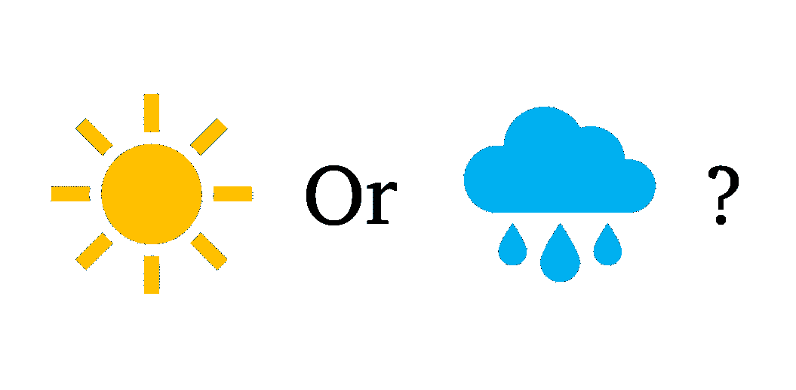

在我从事数据科学工作的这些年里，我总是发现指标是一个有点神秘的话题:你知道你必须使用哪些指标，但你并不总是明白为什么。例如，一些作品使用特殊性，而另一些作品使用精确性。这是为什么呢？在这篇文章中，我回顾了一些基本的度量标准和它们背后的直觉，希望能稍微揭开这个主题的神秘面纱。为此，我尽了最大努力为您提供**插图:**

这是一个多部分系列计划。在这一篇中，我将重点放在该领域的每个人都必须知道的三个主要指标:准确性、敏感性/特异性和准确性/召回率，以及全能的混淆矩阵。

事不宜迟，我们先从一个简单的二元问题开始。

# 明天会下雨吗？

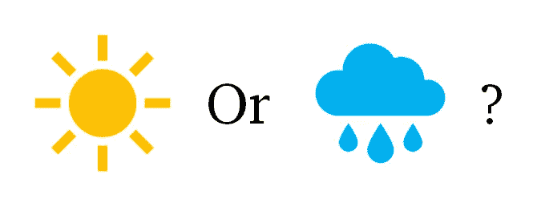

我们的二元问题:预测明天是否会下雨。

有两种可能的答案:*是的，会下雨*和*不，不会*。然后，我们可以等待第二天，看看会发生什么:*雨*或*孙*。这是一个经典的*二元分类问题*:我们必须在两种结果之间进行预测。

自然有两种方式是对的:*你说下雨了，就下雨了，*或者*你说晴了，就晴了*。同样，有两种方式是错的:*你说下雨，结果是晴天，*或*你说晴天，结果雨下了你一脑袋*。

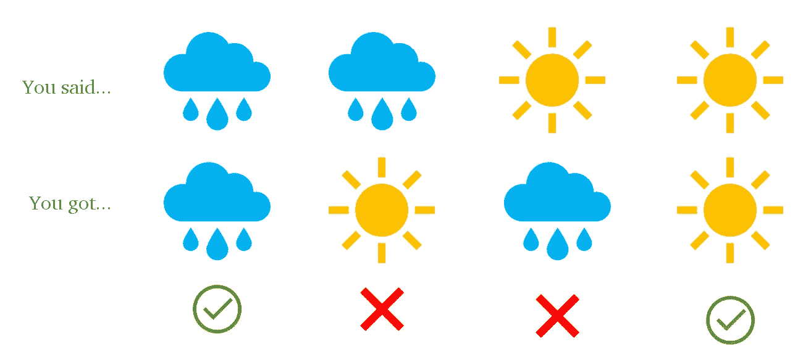

有两种方法是对的，也有两种方法是错的。

如果我们的任务是预测降雨，我们将把降雨称为“积极的”，把太阳称为“消极的”。说雨和得到雨是一个“真正的积极”，而说太阳和得到太阳是一个“真正的消极”。相反，说下雨并晒太阳是“假阳性”——*假警报*，说晒太阳但下雨是“假阴性”，或者说*误预测*。

这四种可能的结果以矩阵的形式排列，如下所示:

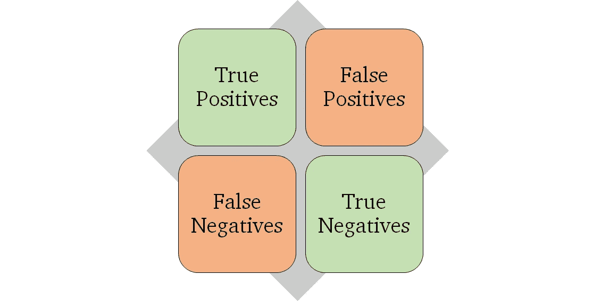

全能的混乱矩阵。

这种表示被称为*混淆矩阵*并总结了四种可能性:关于雨是正确的，发出错误警报，错过雨，以及关于太阳是正确的。它被称为混淆矩阵，因为它显示了*太阳与雨*(假阳性)混淆的程度，以及*太阳与雨*(假阴性)混淆的程度。

你可能会想，“我不喜欢下雨！为什么下雨应该是一件积极的事情？”我同意一开始这不是很直观。我发现更容易记住“消极”是“自然/预期状态”。例如，在检测疾病时，健康是阴性，生病是阳性。

所有这些名字都有许多其他的昵称。例如，您可以分别使用名称“命中”、“错误警报”、“错过”和“拒绝”，这更直观一些。然而，标准的做法是使用积极/消极。

这是同一个矩阵，但使用了更直观的术语:

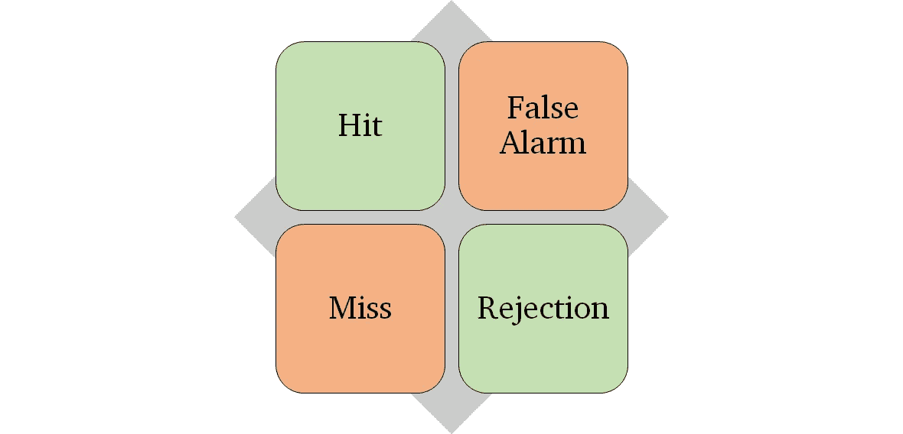

混淆矩阵元素的更直观的术语。

以生病/健康为例,“击中”是指你发现了疾病，而“拒绝”是指你拒绝承认这个人生病了。同样，如果你说这个人生病了，但他/她没有，你就发出了假警报，如果你错误地说他/她很健康，你就错过了疾病。

## 我们来加一些数字。

在荷兰，每年大约有 217 天的降雨。如果你问一个荷兰人明天会不会下雨，他/她会告诉你每天都下雨，他们再也受不了了😢。从字面上理解这个答案，普通荷兰人对雨的困惑矩阵是:

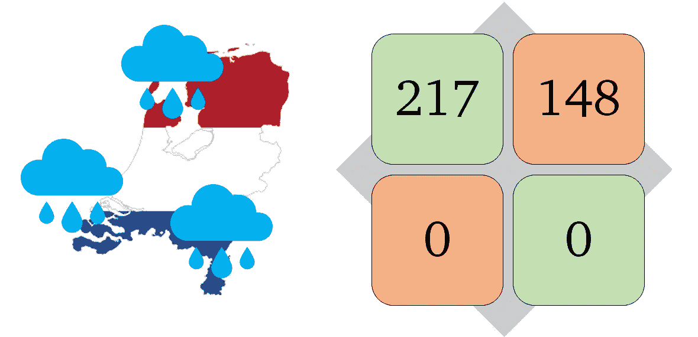

对荷兰人没有仇恨！这只是❤的一个例子

我们这位悲观的荷兰朋友在 217 个雨天里都猜对了，代价是发出了 148 次错误的下雨警报。因为他从来没有说过会是晴天，所以他从来没有错过任何一场雨，也从来没有对过一个晴天。

如果我们问一个完全乐观的人，一个总是希望太阳的人，我们会得到相反的结果:148 天的太阳被正确预测，217 天的阵雨被错误预测。

我们现在面临的问题是:悲观的荷兰人的预测比过度乐观的荷兰人的预测好或差多少？换句话说，我们如何*量化* ***这些预测*** 有多好？

# 优度度量

衡量这些预测有多好的一个简单方法是考虑有多少预测是正确的。这叫做**精度。**

悲观的荷兰人在 365 天内做出了 217 次正确的预测，准确率为 59%，而过度乐观的荷兰人在 365 天中只有 148 天是正确的，准确率仅为 41%。这使得悲观的荷兰人成为比过度乐观的荷兰人更好的榜样。

形式上正确的预测是 TP + TN，而 TP + TN + FP + FN 是预测总数。因此，精度可计算如下:

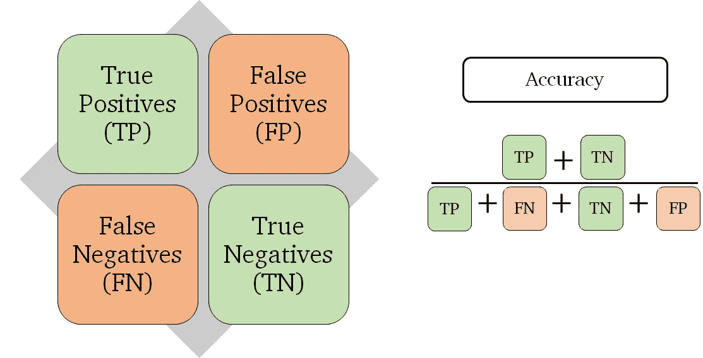

准确度:*绿色超过绿色和红色*。

或者简单来说:*绿过绿，红过红*。

# 准确性的问题

在我们的雨的例子中，荷兰的雨天明显比晴天多。因此，正确预测下雨比预测晴天更能提高准确率。

在极端情况下，您想要检测的可能只发生在 1%或更少的情况下。例如，撒哈拉沙漠每年只下几天雨，所以如果你总是说“太阳”，你 99%的时间都是对的。

不要相信这些云。明天也会是晴天。乔治·帕拉维西尼在 [Unsplash](https://unsplash.com?utm_source=medium&utm_medium=referral) 上的照片

在医疗环境中，疾病通常是罕见的，尽管罕见，你*需要*来检测它们。对每个人说“健康”并说你 94%准确是不切实际的。你需要一个更好的衡量标准。考虑这个例子:

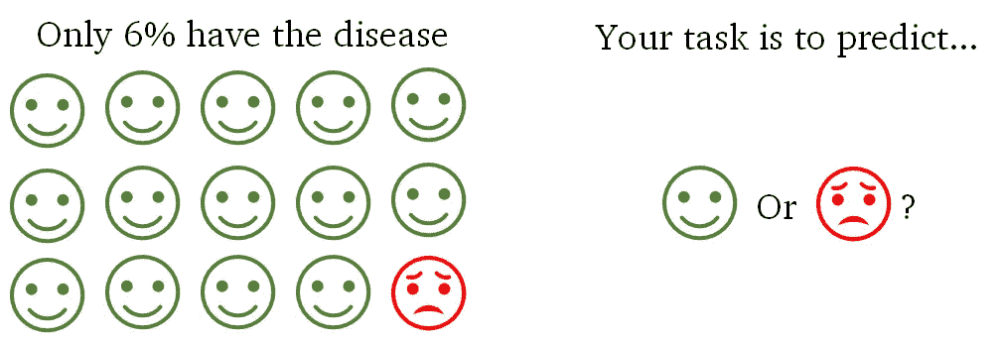

医学领域典型的不平衡问题。

在这些情况下，分别计算积极因素和消极因素的准确性是值得的，因此您可以衡量模型对其中一个因素和另一个因素的执行情况。简单来说，我们需要一个“正精度”和一个“负精度”。这些在商业中被称为**敏感性和特异性**:

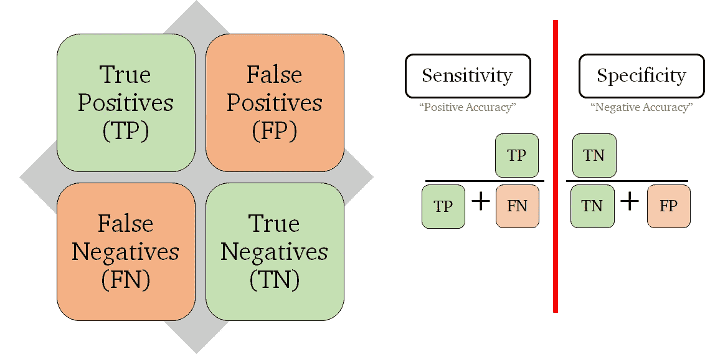

我们将准确性分为“积极”和“消极”两个方面。

请注意我们是如何将准确度公式分成两部分的:一部分检测我们检测阳性(命中超过未命中)的程度，另一部分检测阴性(拒绝超过误报)的程度。所以，如果你天真的说“大家都很健康！”你将是 0%的敏感和 100%的具体，而不是 94%的准确。

**精度是一个*的总结。它*** 试图将所有内容捕获到一个单一的值中。这就是它有用的原因:一个值比两个值更容易处理，但这也是一个缺点:它不能捕捉到问题的每个细微差别。另一方面，特异性和敏感性是指标。它们告诉你你的模型在特定环境下表现如何。

您可能会问，是否有可能将两个指标合并成一个值，以便我们可以进行汇总。一个很酷的公式是几何平均值，它被定义为乘积的平方根:

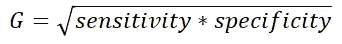

敏感性和特异性得分的几何平均值

这个公式有一个好处，就是在惩罚不平衡对的同时，平均两个分数。例如，90%对 90%的评分比 80%对 100%的评分稍高。

回到荷兰雨，悲观的荷兰人 100%敏感，0%专一，乐观的荷兰人 0%敏感，100%专一。使用我们的 G 分数，两个模型都有 G = 0。因此，在灵敏度/特异性分析下，它们*同样不好*。干净利落。

# 使用敏感性和特异性的限制

在某些情况下，有太多真正的负面因素需要考虑。所以，所有使用真否定的公式都不行。

例如，对象检测任务被定义为寻找对象并用边界框包围它们。真正的肯定是正确发现的对象，错误的肯定是错误的检测，错误的否定是遗漏对象，真正的否定是在没有要检测的东西的地方检测不到任何东西。

物体检测的例子。有多少真阴性？。维基百科:[MTheiler](https://commons.wikimedia.org/wiki/User:MTheiler)[CC BY-SA 4.0](https://creativecommons.org/licenses/by-sa/4.0)

请密切注意最后一点:真正的否定是在不期待什么的时候什么也不说。在上面的图片中，*我们正确地没有给多少东西一个边界框？*

再比如谷歌搜索。当你寻找狗时，返回的所有狗站点都是真阳性，非狗站点是假阳性，错过的狗站点是假阴性，剩下的整个互联网都是真阴性。

在这两个例子中，如果我们真的试图计算有多少真阴性，我们将总是有+99%的特异性，因为真阴性的数量将远远超过其他一切。在这种情况下，我们必须用另一个指标来代替特异性: **precision。**

当真阴性不可用时，我们使用精度和召回指标。

请注意,“敏感度”更名为“回忆”。它们是相同的度量，有相同的公式。这只是一个命名约定:*使用 precision 的时候，你把 sensitivity 叫做“recall”*。

使用对象检测示例，recall 测量您在所有对象中检测到多少个对象，precision 测量您在此过程中检测到多少个错误对象。以 Google 为例，recall 是指你返回了多少狗的网站，precision 是指狗的网站和非狗的网站在你的搜索结果中的比例。

**注意:精确度/召回率不能代替灵敏度/特异性；它们处理不同的问题。只有当你不能有效地计算出真正的负数，或者它们太多的时候，前者才有意义。只要有可能，灵敏度/特异性更合适。**

同样，这些是*指示器*。为了对它们进行总结，我们使用调和平均值，其计算方法是将乘积乘以总和:

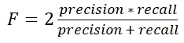

F 分数，从精度和召回指标获得的摘要

调和平均值被称为 F 值。至于 G 分数，它也惩罚不平衡的配对。然而，它做得更有力。因此，为了获得高 F 值，模型必须同时具有高精度和高召回率。

# 多阶层问题

到目前为止，您可能会问:如果我们有几个类要预测呢？我们来挑一个问题:

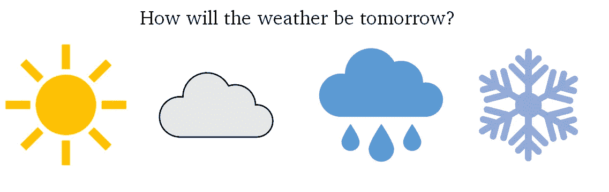

我们二元问题的扩展，包括多云和下雪的预测

首先，如果我们有 n 个类，就有 n 个⋅ N 种可能:说太阳得到太阳，说太阳得到多云，说太阳得到雨等等在这些方法中，有 N 种方法是正确的(每个类一种)和 N(N-1)种方法是错误的(所有其他的可能性)。如果我们把它全部绘制成一个混淆矩阵，我们得到如下结果:

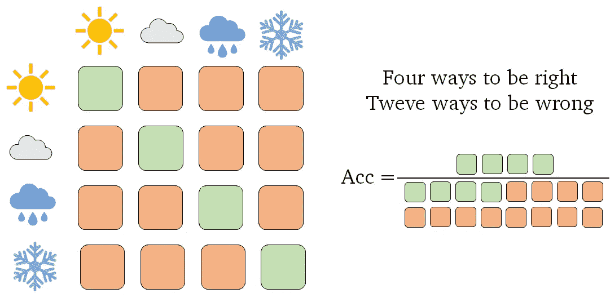

一个四类问题的混淆矩阵和准确性

和以前一样，精确度可以定义为我们得到的正确预测数(绿色)除以所有预测数(绿色加红色)。

为了计算每一类的敏感性和特异性，我们必须将我们的问题重定为*类对非类*。例如，*多云与非多云*。这样，我们可以为每个类提取一个二进制问题，并像以前一样计算我们的二进制度量。这里是一个敏感性和特异性的例子:

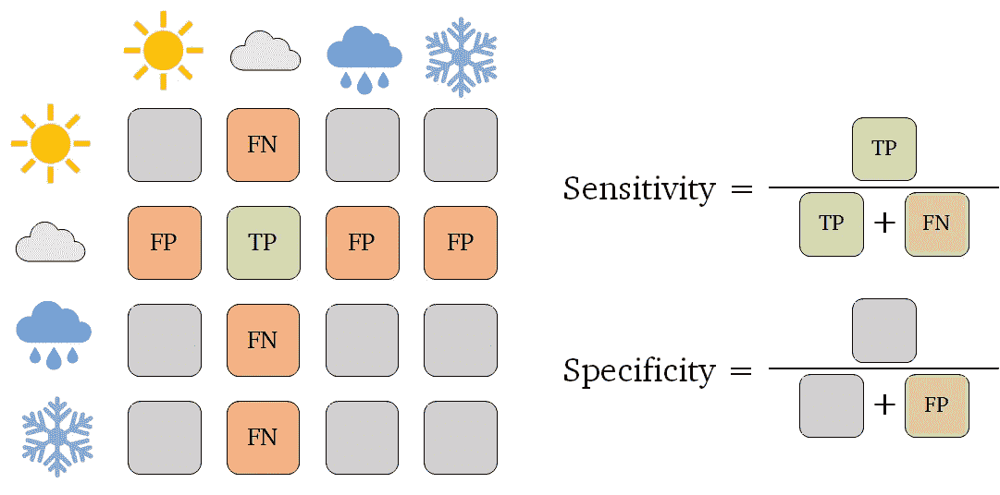

对多类问题的敏感性和特异性。真正的底片是灰色的。

你可能会想到的一件事是，如果我们添加更多的类，我们真正的缺点(用灰色表示)会变得非常大。灰色立方体比绿色和红色多得多。由于这个原因，**敏感性和特异性在处理多类问题时意义不大**。

出于上述相同的原因，精确度和召回分数更适合于这种情况，因为它们不依赖于真正否定(灰色框)的数量。下面是它的公式:

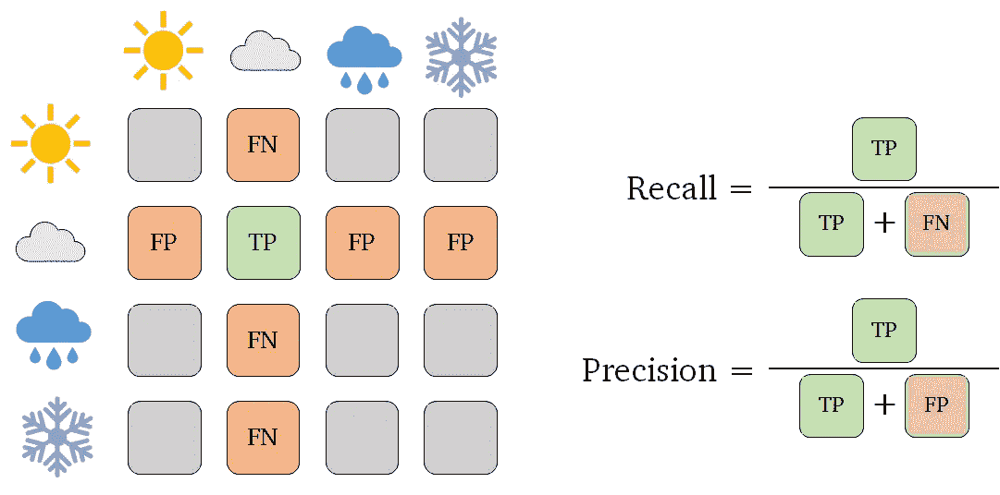

多类问题的查准率和查全率。在这种情况下不需要真正的否定。

有了这个，我们就有了一套完整的工具来评估我们的二元和多类问题模型，无论是平衡类(准确性)还是不平衡类(特异性/敏感性或精确度/回忆)。

到目前为止，我们已经了解了什么是真/假阳性和真/假阴性，以及它们对于二元和多类情况的意义。然后，我们看到了精确度是如何计算的，精确度是一个*总结*:一个量化模型有多好的单一值。

后来，我们看到当类不平衡时，精度不是一个可靠的度量，因为一个类倾向于支配精度值。为了解决这个问题，我们把这个公式分成一个“正准确度”，称为灵敏度，和一个“负准确度”，称为特异性。使用这两个值，我们对这两个类的模型性能有了更清晰的了解。

然而，在某些情况下，真正否定的数量可能太高，甚至是无限的。在这种情况下，使用精度和召回分数来代替，这不依赖于真正的否定。

最后，我们看到，我们可以计算 G 分数和 F 分数，分别作为灵敏度/特异性和精确度/回忆分数的汇总。对于不平衡的问题，这些总结比比较解决方案的准确度分数更能提供信息。

在本系列的下一期中，我们将看看如何处理提供*分数*而不是答案的模型。例如，“我有 60%的把握明天会下雨”。在这种情况下，我们需要为我们的模型设定阈值，以定义哪些是积极的，哪些是消极的。这带来了一些基本概念，如 ROC 曲线和平均精确度分数。

如果你对这篇文章有任何问题，欢迎评论或[联系我](https://www.linkedin.com/in/ygorreboucas/)。如果你是新手，我强烈推荐[订阅](https://ygorserpa.medium.com/membership)。对于数据和 IT 专业人员来说，中型文章是 StackOverflow 的完美组合，对于新手来说更是如此。注册时请考虑使用[我的会员链接。](https://ygorserpa.medium.com/membership)

感谢阅读:)