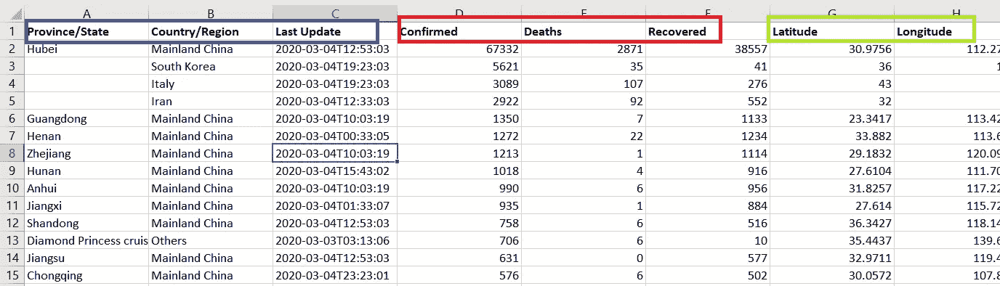

# 新冠肺炎的影响——plottly 数据可视化及与 SARS 的对比分析

> 原文：<https://towardsdatascience.com/the-impact-of-covid-19-data-analysis-and-visualization-560e54262dc?source=collection_archive---------7----------------------->

## 获得关于新冠肺炎的有趣数据见解，并与 SARS 相比，直观显示冠状病毒的爆发

图片由[皮克斯拜](https://pixabay.com/?utm_source=link-attribution&utm_medium=referral&utm_campaign=image&utm_content=4884862)的 Gerd Altmann 提供

**简介:**

随着新型冠状病毒在各国的快速传播，世界卫生组织(世卫组织)和几个国家公布了过去几个月新冠肺炎影响的最新结果。

我查阅了许多资料和文章，以了解死亡趋势，我很高兴看到这个数据源，并决定在其上看到一些可视化。这里的目的是理解 ***可视化如何帮助从数据源*** 中获得信息性的见解。

对于可视化部分，我使用 Plotly。 [Plotly](https://plot.ly/python/) 是 python 和 R 中可用的可视化工具，它支持大量交互式的高质量图形，是数据科学初学者的绝佳工具。

**数据集:**

数据集来源由**“约翰·霍普金斯大学系统科学与工程中心(JHU·CSSE)”**在其[**github 页面**](https://github.com/CSSEGISandData/COVID-19) 进行累积、处理和最新更新

**使用条款:**如[链接](https://github.com/CSSEGISandData/COVID-19)中 [JHU CSSE](https://github.com/CSSEGISandData/COVID-19) 所述。【数据仅用于研究目的】。

数据集的详细信息如下:

1.  **每日报告数据**

该 csv 文件包含关于受影响国家的信息[蓝色],这有助于识别病毒传播、受感染病例信息、死亡人数以及各国的恢复情况。还提供了国家坐标以供分析。

数据来源: [2019-nCoV 数据](https://github.com/CSSEGISandData/COVID-19)由[约翰霍普金斯 CSSE](https://systems.jhu.edu/) 提供

**2。时序数据**

还提供了一个时间序列数据，其中包含各国的感染病例数、死亡数和恢复数。每个案例的时间序列数据都有单独的文件，需要在可视化之前进行处理。国家坐标也可用于地理图上的时间序列可视化，如[地理图。](https://plot.ly/python/choropleth-maps/)

数据来源: [2019-nCoV 数据](https://github.com/CSSEGISandData/COVID-19)由[约翰霍普金斯 CSSE](https://systems.jhu.edu/) 提供

**代码:**生成以下图表的所有代码和所用的数据集可在下面提供的链接中找到。

**重要提示:**

截至 3 月 3 日的数据已用于以下分析。**请避免将分析得出的数据或见解用于医疗指导或商业用途。**仅供学习之用。

相同的代码模板可以用于各种其他数据源。我鼓励读者也在 Plotly 中尝试其他图表，并根据应用程序需求定制代码。

展示你的**关键发现**的另一个**重要方面**是只使用一组从数据中推断关键见解的图表，而不是展示太多带有冗余信息的图表。

**分析:**

1.  新冠肺炎的全球影响

2.感染率、死亡率和恢复率的描述性分析

3.新冠肺炎传播的时间线分析

4.新冠肺炎对 SARS 影响的比较分析

# 新冠肺炎的全球影响

为了了解病毒对地理景观的影响，我使用了 Plotly 的地理散点图。这个互动情节的代码可以在共享链接中找到，这将提供一个更清晰的互动可视化。

新冠肺炎的全球影响

**观察:**

1.  从图表中，我们可以看到在首次发现这种病毒的中国，这种疾病已经感染了大量的人
2.  *尽管感染区域很大【蓝色】,但我们可以观察到死亡人数相当低，我们还可以看到迄今为止有许多康复患者*

# 感染率、死亡率和恢复率的描述性分析

这里我使用了各种图表来展示如何从数据源中挖掘信息。

***注意:由于与其他国家相比，中国的感染率高于 85%,因此最好将中国排除在外，查看其他国家的数字。这将应用于以下所有图表。***

1.  **确诊病例:** [**分析使用**](https://plot.ly/python/pie-charts/) 饼状图

跨国感染病例

感染病例(不包括 Mainland China)

*与其他地区相比，中国大陆的受感染病例数量最多。仅次于中国，韩国、意大利和伊朗显示出较高的感染人数。*

**2。报告死亡人数:** [**利用条形图**](https://plot.ly/python/bar-charts/) 进行分析

各国报告的死亡人数

报告的死亡人数[不包括 Mainland China]

*从图表中我们可以看出，尽管与意大利和伊朗相比，韩国的确诊病例数最高，但它们的死亡率相比之下却低得多。现在，各省/州的回收率分析如下所示，*

**3。回收率:** [**分析使用树形图**](https://plot.ly/python/treemaps/)

各国的恢复率提供了各国如何缓解疫情的更广泛范围。在这里，不同级别的层次结构来自按顺序排列的数据集，“世界”、“国家”，接着是“省/地区”，如可以看到的 Mainland China(“世界”、“Mainland China”、“鄂”、“豫”、“皖”等)。

树形图:回收率

树形图:回收率[不包括中国]

*有趣的一点是，与韩国相比，伊朗和意大利的追回率更高。从这里开始，深入研究其他属性(年龄、种族和地区)对恢复/死亡的影响可以使这些数字更加清晰。*

# 新冠肺炎传播的时间线分析

显示病毒在短时间内在不同国家传播的速度是至关重要的。时间线分析需要对原始数据进行一些预处理，以在笔记本中提供的 Plotly 中可视化。

这里我只显示了感染病例的趋势。在各国的死亡和康复方面也可以观察到类似的趋势。使用下面的折线图给出了一个综合视图。

**跨国家时间轴分析:** [**散点图**](https://plot.ly/python/line-and-scatter/)

各国时间表分析

各国时间表分析[不包括中国]

**观察:**

*虽然在中国可以观察到病毒传播的稳定增长，但在过去几天里，在其他一些国家可以看到病例数量的迅速增加*。

**时间线分析:** [**多重折线图**](https://plot.ly/python/line-charts/)

全球总体受影响病例、死亡和康复情况。

# 新冠肺炎与非典影响的比较分析

最有趣的部分是比较新冠肺炎和性质相似的严重急性呼吸系统综合症(SARS)的影响。SARS 的数据集取自[**kaggle 数据源**](https://www.kaggle.com/zhongtr0n/sars-who-data) **。**该数据仅包含总体感染和死亡病例，因此在此将其可视化。我在一个**窗口框架内分析了这两种病毒的影响，从它被发现到它在接下来的三个月内的影响**。

**感染病例时间表分析:**

世界各地报告的感染病例:新冠肺炎 vs SARS

**报告死亡的时间线分析:**

世界各地报道的死亡人数:新冠肺炎 vs 非典

**观察:**

显然，与 SARS 相比，新冠肺炎的传播速度更快，死亡率也更高。在这种情况下，交通的进步可能是一个关键因素。

**结论:**

本文详细分析了新冠肺炎是如何影响世界的，以及由此得出的见解如何用于下游分析。这些图表还可以应用于其他场景，以推断关键的数据洞察力。

[**代码:**](https://github.com/SanthiyaDaniel/Impact-of-COVID-19) **链接到代码和数据集**

**未来工作:**

1.  了解更多关于其他属性的信息，如患者性别、种族和年龄，以及它是如何导致死亡率的
2.  交互式图表仪表板，提供总体摘要

**参考文献:**

 [## 主页

### 世卫组织的主要作用是在联合国系统内指导国际卫生工作，并领导全球卫生合作伙伴

www.who.int](https://www.who.int/)  [## ncov - CSSE

### 参考资料:董鄂，杜洪，加德纳 l。一个基于网络的交互式仪表盘，可实时跟踪新冠肺炎。柳叶刀感染…

systems.jhu.edu](https://systems.jhu.edu/research/public-health/ncov/)  [## 更多基本图表

### Plotly.js 在线制作交互式、出版物质量的图表。如何制作基本图表的例子？

plot.ly](https://plot.ly/javascript/basic-charts/)  [## SARS 世卫组织数据

### Kaggle 是世界上最大的数据科学社区，拥有强大的工具和资源来帮助您实现您的数据…

www.kaggle.com](https://www.kaggle.com/zhongtr0n/sars-who-data)