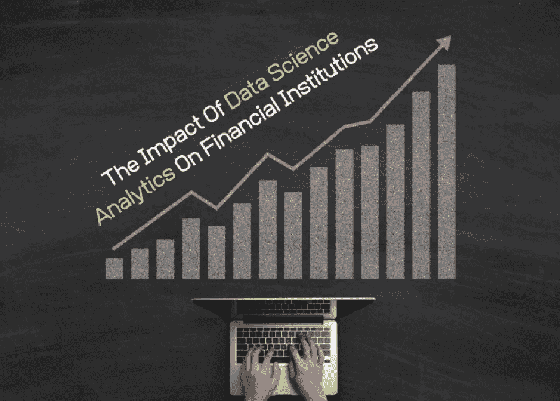

# 数据科学分析对金融机构的影响

> 原文：<https://towardsdatascience.com/the-impact-of-data-science-analytics-on-financial-institutions-ee2d272427d1?source=collection_archive---------27----------------------->

数据科学的力量越来越大，彻底改变了不同的商业领域。其中之一就是金融。如果我们仔细想想，它实际上并不是什么新东西。

多年来，金融机构一直使用收集的数据来决定最佳的商业策略。让我们以银行为例。他们的成功主要取决于他们是否进行了准确的风险分析。这就是为什么公司希望改进他们用来在市场上建立更强地位的技术。

数据科学和机器学习创新使金融行业能够将大量收集的数据转化为有价值的商业见解。在金融领域运营的公司是数据分析领域的先驱，并且已经学会了如何在众多流程中发挥自己的潜力。

# 金融公司中的数据科学

## 管理客户数据

数据是从事金融业务的公司的重要资源。如今，金融公司必须处理大量数据，无论是结构还是数量都各不相同。该数据库包括市场数据、交易、移动和社交媒体活动等等。

数据量是一个问题，另一个是它的形式。我们可以将数据分为结构化、半结构化和非结构化。一个普遍的规律是，数据越不结构化，就越难以处理和提取业务洞察力。

处理非结构化数据最有效的方法是使用人工智能驱动的工具。其中一些使用自然语言处理、[数据挖掘](/data-mining-in-brief-26483437f178)和文本分析等技术。机器学习算法分析数据，将其转化为可靠的信息，并建议最佳的商业解决方案。最终，目标是提高公司的利润，使用基于人工智能的工具是实现这一目标的最佳方式。

## 风险分析

管理者做出战略决策时会考虑许多方面，但最重要的是风险。数据科学和商业智能开发专门针对风险分析的创新。它是如何工作的？

风险管理集中于测量损失的频率，并根据现有数据乘以损失的严重程度。有许多风险来源，如客户行为、竞争对手、投资者或监管者。

领导者需要能够首先识别风险，监控风险，然后确定特定风险的优先级。机器学习-软件可以支持金融机构，并为它们执行这些操作。因此，从事金融业务的公司能够比以往任何时候都更快地验证客户的信誉。交易受到持续监控，以便公司可以立即采取措施降低不良后果的风险。

## 欺诈检测技术

欺诈是金融公司的主要担忧之一。每笔交易中，欺诈的危险都在增加。毫无疑问，每个人都听说过信用卡欺诈——这是金融机构中最常见的欺诈之一。

从事金融业务的公司需要向客户保证无懈可击的安全性。要做到这一点，他们必须应用一个系统来检测欺诈行为，并提醒员工注意危险。机器学习技术提供了各种工具，这些工具具有识别异常活动并自动向金融公司发送消息的功能。

合格的数据科学家能够创造出能够确定交易数据模式的算法，这种模式在大多数情况下会导致操纵。显然，日常犯罪分子会想出新的方法来欺骗系统。这就是基于人工智能的系统如此珍贵的原因——算法具有自学能力。这意味着该系统将每天自我改进，并随着时间的推移而增加有效性。

## 引入定制客户的方法

为了留在市场上，每个公司都需要保持竞争力。这意味着不仅要保持高质量的服务，还要在其他领域不断发展。

维护与客户的个性化关系是任何企业面临的最重要的挑战之一。数据科学使公司能够分析客户的[数字体验](https://medium.com/@NathanKinch/to-design-digital-experiences-that-matter-design-for-the-5-senses-4c25f9c32ed7)，然后在考虑客户个人偏好的同时引入改进。

通过语音识别和自然语言处理等技术，人工智能现在能够比以往任何时候都更好地理解人类的语言和情感。由于收集了信息，金融机构可以向他们的每个客户提供个性化的方法和服务。

# 如何将数据科学解决方案引入金融机构？

为了充分利用数据科学机遇，与经验丰富的数据科学家合作至关重要。最大的公司建立了整个部门，只专注于数据分析。他们建立了一个数据分析师和商业智能专家团队。通过这种方式，他们能够充分利用数据的潜力，超越竞争对手。

对于中小型公司来说，创建一个新的部门甚至雇佣全职数据科学家可能成本太高。有一个解决办法。虽然数据科学行业相对较新，但市场上有专门从事[数据科学咨询](https://addepto.com/data-science-consulting-ai-consulting/)的公司。通过这种方式，中小型企业可以从收集的数据中获得有价值的商业见解，而无需进行巨额投资。

# 结论

金融机构获得了一个难以置信的机会。数据科学分析有足够的力量来加速任何金融公司的发展并增加其利润。

大数据时代已经开启，没有回头路。只有通过实施人工智能驱动的解决方案和机器学习工具，金融机构才能面对海量数据，并将其转化为见解。