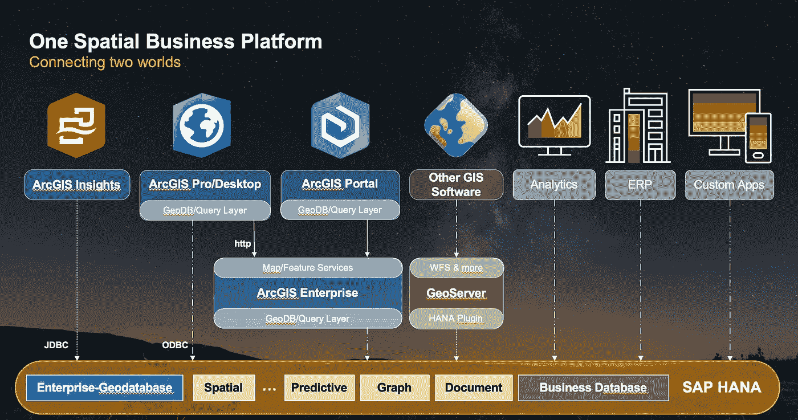
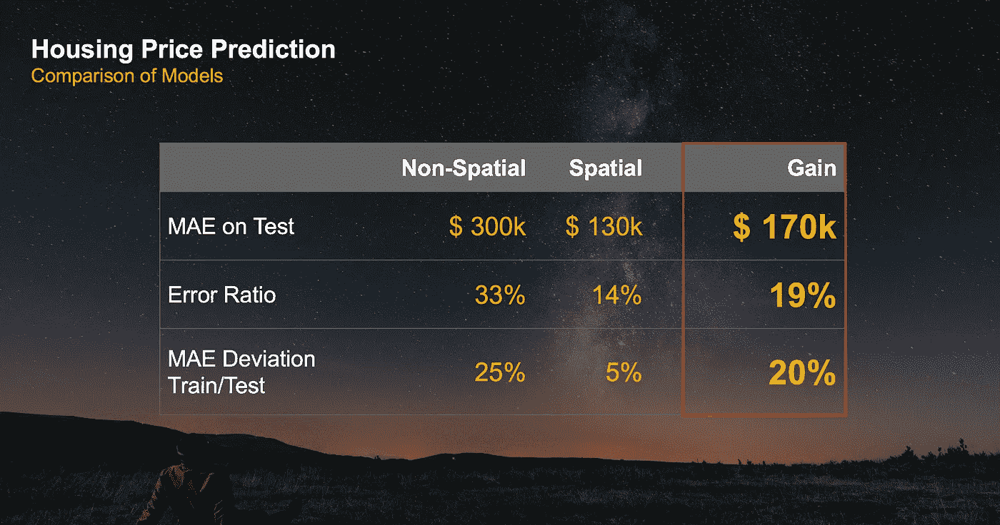
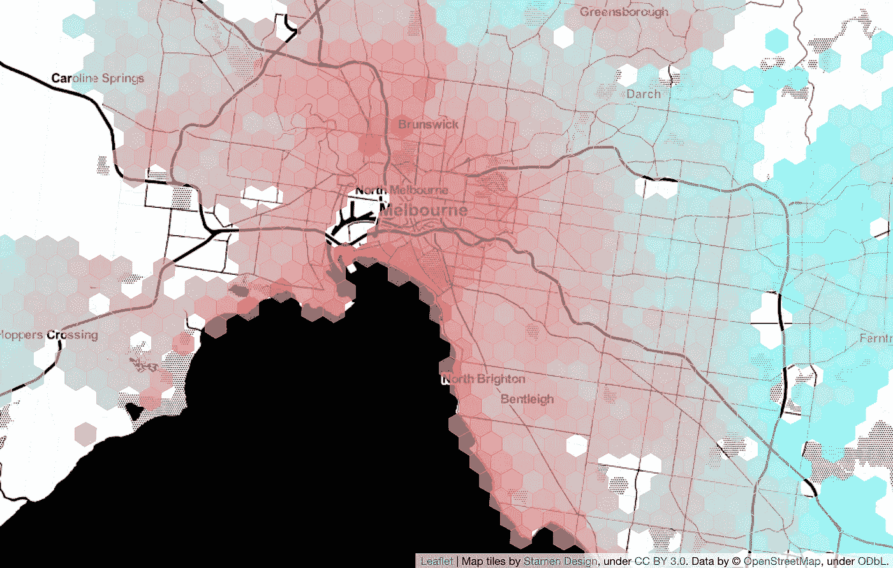

# 地理空间特征对机器学习的影响

> 原文：<https://towardsdatascience.com/the-impact-of-geospatial-features-on-machine-learning-3a71c99f080a?source=collection_archive---------42----------------------->

## 关于位置数据对机器学习模型的增值

预测冰淇淋销售没有季节模式？不会吧！(照片由[蓝菊·福托格拉菲](https://unsplash.com/@lanju_fotografie?utm_source=unsplash&utm_medium=referral&utm_content=creditCopyText)在 [Unsplash](https://unsplash.com/?utm_source=unsplash&utm_medium=referral&utm_content=creditCopyText) 上拍摄)

I magine 预测冰淇淋的销售，却忽略了对时间维度的适当处理:虽然在总体水平上(例如每年)进行预测可能仍然会产生良好的结果，但当你进入季节细节时，你会很快进入状态。

位置数据也是如此。在处理地理参考数据时，忽略位置维度将导致预测模型无法解释已经进行的观察，最终将导致不精确和不太稳健的模型。与时间维度一样，您的模型在聚合级别上看起来可能还不错。然而，这对你的客户没有帮助，他住在山里，不断收到潜水设备的报价。

使用地理空间数据创建稳健而精确的模型(照片由 [Morning Brew](https://unsplash.com/@morningbrew?utm_source=unsplash&utm_medium=referral&utm_content=creditCopyText) 在 [Unsplash](https://unsplash.com/?utm_source=unsplash&utm_medium=referral&utm_content=creditCopyText) 上拍摄)

*嗯，听起来很明显，对吧？*是的，你会这么想。然而，我观察到，当涉及到高级分析或机器学习时，地理空间维度经常被忽略。在我看来，这主要是因为两个原因。

> 我的数据没有地理参考。它不包含纬度和经度

首先，您必须确定您实际处理的是地理空间参考数据。它不包含任何坐标的论点是不适用的！无论何时，只要您能够回答在“何处”进行了特定观察的问题，您就有了现成的空间数据。想想销售点数据、客户数据或来自物联网设备的数据。我们的绝大多数数据都以某种方式与地球上的某个位置相关联。通过对您的数据进行地理编码，并在您可能已经拥有的地址或城市名称之外添加纬度和经度信息，您可以提升这些信息的全部潜力。

> SRS、几何形状、尺寸…呃，处理地理空间数据很复杂。

其次，初看起来，处理地理空间数据可能比处理依赖于时间的数据稍微复杂一些。当你试图自己解决空间复杂性时，你很快会遇到像[空间参考系统](https://en.wikipedia.org/wiki/Spatial_reference_system)和球面几何中的复杂计算这样的术语。

好消息是:你不必自己解决这些复杂的问题！有很好的工具，可以帮你卸下计算几何的重担。如果您在企业环境中工作，您应该考虑利用多模型数据管理平台透明地连接您的业务和位置数据的可能性。我选择的平台是 [SAP HANA Cloud](https://saphanacloudservices.com/hana-cloud/) 及其[空间功能](https://www.sap.com/spatial) *(* [*嗯，我可能会有偏见*](https://www.linkedin.com/in/mathiaskemeter/) *！)*。然而，这里描述的大多数方面是独立于底层技术而适用的。

GIS 和非 GIS 应用程序正在消耗底层模型

在多模型数据管理平台上运行地理空间工作负载的主要优势是[生产力、敏捷性、加速和集成](https://blogs.sap.com/2020/02/12/the-four-advantages-of-arcgis-on-hana/)。通过在数据管理层实施高级分析和机器学习模型(无论有无空间数据),您可以确保构建在该平台上的所有上游应用程序都能使用结果，并以一致的方式提供给不同的用户组。

现在有了平台，它们结合了地理空间数据处理和嵌入式机器学习的能力。但是，我们真的能量化将地理空间特征纳入我们的机器学习模型的好处吗？

我试图挑选一个具体的例子，比较同一个回归模型包含和不包含数据的位置维度。[底层数据集](https://www.kaggle.com/anthonypino/melbourne-housing-market/)包含墨尔本市房屋的属性和销售价格。我根据房子的大小、房间数量、停车位数量等，训练了一个房子价格的回归模型。然后，第二个模型已经使用相同的特征进行了训练，但是这一次还生成了诸如该地方周围的餐馆数量和到海湾的距离之类的特征。

比较具有和不具有地理空间特征的相同回归模型

在本例中，我们可以测量到，中值绝对误差从 300，000 澳元降至 130，000 澳元，而当增加位置维度时，模型的稳健性显著提高。

为了隔离地理空间特征的影响，我使用了第二个模型来预测参考房屋的价格(600 平方米的土地面积，160 平方米的建筑面积等)。)横跨城市的不同位置。根据型号，价格从 33 万澳元到 250 万澳元不等，仅取决于位置！

对同一栋房子的预测在 33 万澳元和 250 万澳元之间变化，取决于位置(红色=昂贵；用[叶](https://python-visualization.github.io/folium/)制作而成

有趣的是，在没有地理空间特征的情况下，对回归模型*贡献最大的特征是房屋的建造年份。房子越旧，往往越贵。撇开历史建筑不谈，我解释对价格影响的方法是:*地点*。旧房子往往位于靠近市中心的居民区，而新房子往往位于郊区的开发区。*

这反过来意味着，在我们的例子中，位置维度是如此重要，以至于它甚至通过使用相关的特征潜入到我们的非空间模型中。

在我的 SAP 博客上查找技术细节

**你可以在 SAP 社区页面** **上的我的** [**博客中阅读上述例子的所有技术细节。**博客还包括完整的 Jupyter 笔记本，可以让你重现分析。最快的入门方式是使用免费的](https://blogs.sap.com/2020/06/24/on-machine-learning-without-location-data/) [SAP HANA 云试用版](https://www.sap.com/cmp/td/sap-hana-cloud-trial.html)，其中也包括空间处理引擎。

房价预测的例子清楚地量化了将地理空间特征纳入机器学习模型的价值。如果你看一下上面链接的更具技术性的博客，你也会注意到包括位置和其他数据源(如 OpenStreetMap)的努力是可以监督的，并且在任何情况下都是值得的。

空间数据科学和数据库内机器学习的力量

如果你对更多高级地理空间分析的例子感兴趣，请查看我基于波尔图市出租车轨迹数据的其他博客。用于复制该示例的完整 Jupyter 笔记本包含在各自的博客中。

*请查看* [*SAP 社区页面*](https://people.sap.com/mathias.kemeter#content:blogposts#) *查看*[*# saphanaspacial*](https://twitter.com/search?q=%23SAPHanaSpatial)*上的内容。*

地理空间超级力量