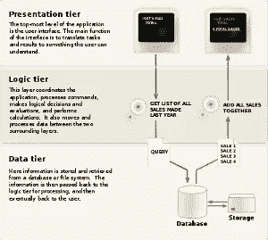
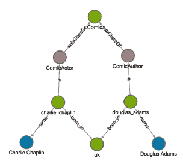
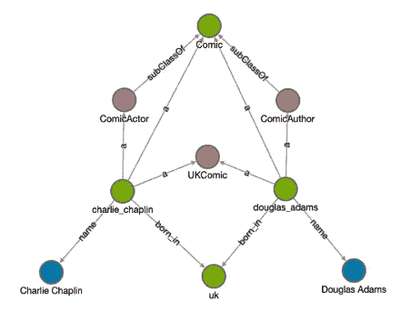
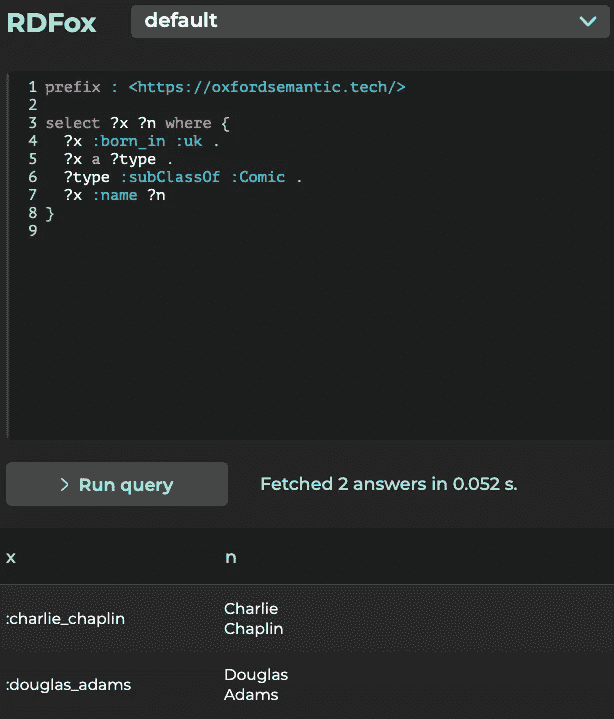
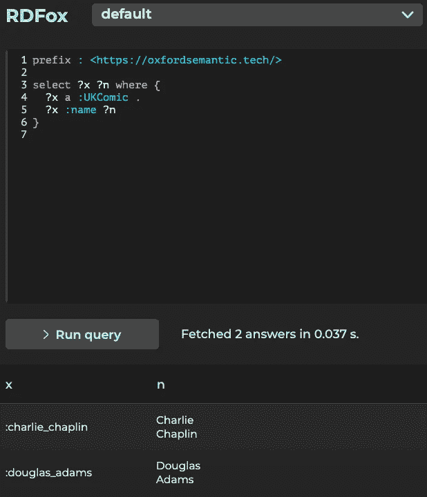

# 规则对查询的影响

> 原文：<https://towardsdatascience.com/the-impact-of-rules-on-queries-e69468dadf98?source=collection_archive---------74----------------------->

## 实现数据中的知识

应用程序处理和操作数据的逻辑通常由位于数据库和表示层之间的应用程序或逻辑层控制。这就形成了必须符合数据库结构的请求。下图代表了经典的三层体系结构，世界上大多数 IT 系统都是在此基础上构建的。

[https://en . Wikipedia . org/wiki/Multitier _ architecture #三层架构](https://en.wikipedia.org/wiki/Multitier_architecture#Three-tier_architecture)

然而，知识图提出了这种设计的范式转变，模糊了逻辑和数据之间的界限。通过将领域的一些知识通过规则带入图中，知识图捕获的不仅仅是系统中的数据。因此，规则可以使查询和请求更容易编写和管理，这反过来又使应用程序更灵活、更不容易出错、更快。

本文将介绍一个简单的例子来展示规则对查询设计的影响。这个例子将在由 Oxford Semantic Technologies 开发的高性能知识图和语义推理引擎 RDFox 上演示。

# 介绍规则

规则是一个逻辑语句，它扫描图形以寻找与规则匹配的数据模式。

考虑 RDFox 控制台中呈现的下图:

为此示例导入的原始数据片段。

从图中很容易判断出道格拉斯·亚当斯和查理·卓别林出生在英国，因此他们是英国漫画家。在经典的分层方法中，可以在中间层编写逻辑，以原始形式直接查询基图。根据定义，这个查询将比我们直接查询所有英国漫画的知识图更复杂。

第一个规则作用于关系的子类，对于我们的数据，这使得道格拉斯·亚当斯和查理·卓别林之间的直接类型关系成为喜剧。

`[?x, a, ?z] :- [?x, a, ?y], [?y, :subClassOf, ?z] .`

接下来，我们将英国漫画的概念引入图表。为了添加这个概念，我们可以在 Datalog 中使用一个简单的规则来实现英国漫画关系:

`[?x, a, :UKComic] :- [?x, a, :Comic] , [?x, :born_in, :uk] .`

也就是说:

如果`?x`是一个`:Comic`，而`?x`是`born_in` `:uk`，那么`?x`就是一个`:UKComic`。

# 具体化规则

RDFox 将扫描数据存储中满足规则主体的三元组。每当“`:-`”符号后的模式得到满足时，RDFox 就会向图中添加一个`:UKComic`三元组，并在找到所有英国漫画后停止。

结果如下图所示:

与前面显示的相同的片段显示了规则添加的内容。特别是与新的英国漫画概念的直接联系。

使用 RDFox，一旦规则被导入到数据存储中，或者每当新的数据点被添加到数据存储中时，这些三元组就被规则具体化。例如，一部在英国诞生的新漫画在被添加到图表中时会被自动标记为`:UKComic`。

# 规则如何帮助查询？

在第一个图中，要获取英国漫画，查询必须首先识别在英国出生的实体，然后识别漫画实体，然后返回两个答案中存在的实体。在 SPARQL 中，查询可以用以下方式表示:

原始查询针对源数据运行。

使用英国漫画规则，回答相同问题的查询要简单得多，因为它只搜索`:UKComic`实体:

使用 new :UKComic 概念的简化查询。

我们还可以注意到，简化的查询执行起来更快。这在更大的数据集和更复杂的查询中变得更加明显。

规则通过以一致和可管理的方式扩展原始数据来提供帮助:随着新数据的添加，相同的规则也会触发。重要的是，如果数据被删除，反之亦然，并且先前触发的规则的后果被撤销。

因此，用规则对经常搜索的概念进行建模有助于更快地回答问题，但由于查询更简单，它们也使中间层更容易维护。更简单的查询使应用程序更加灵活。

大多数查询可以通过规则的 IF 部分来建模，这意味着许多现有的应用程序可以通过知识图变得更快、更灵活。如果您当前的架构无法提供用户所需的查询性能，为什么不使用规则将数据的逻辑推送到知识图中呢？尝试使用 RDFox 结合规则编写查询，您可以在这里注册试用。

要了解更多关于知识图表的信息，请点击阅读我们在 TDS [上的介绍。](/the-intuitions-behind-knowledge-graphs-and-reasoning-59df2f1ad054)

## 关于牛津语义技术

牛津语义技术公司(Oxford Semantic Technologies)背后的团队于 2011 年在牛津大学计算机科学系开始研究 RDFox，他们坚信灵活和高性能的推理是数据广泛应用的一种可能性，而不会危及结果的正确性。RDFox 是第一个面向市场的知识图，它是基于推理从头开始设计的。牛津语义技术公司是牛津大学的一个分支，由主要投资者支持，包括三星风险投资公司(**)、牛津科学创新公司( [**OSI**](https://www.oxfordsciencesinnovation.com/) )和牛津大学的投资部门( [**OUI**](https://innovation.ox.ac.uk/) )。作者很自豪能成为这个团队的一员，也是已故伟大的道格拉斯·亚当斯的粉丝。**

**由[paweczerwi324ski](https://unsplash.com/@pawel_czerwinski?utm_source=unsplash&utm_medium=referral&utm_content=creditCopyText)在 [Unsplash](https://unsplash.com/@pawel_czerwinski?utm_source=unsplash&utm_medium=referral&utm_content=creditCopyText) 上拍摄的照片**