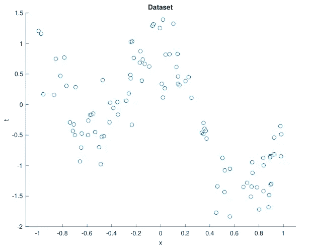
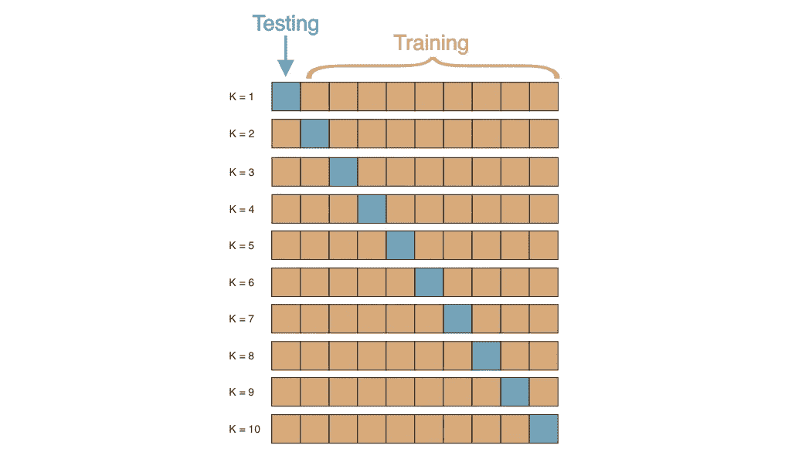
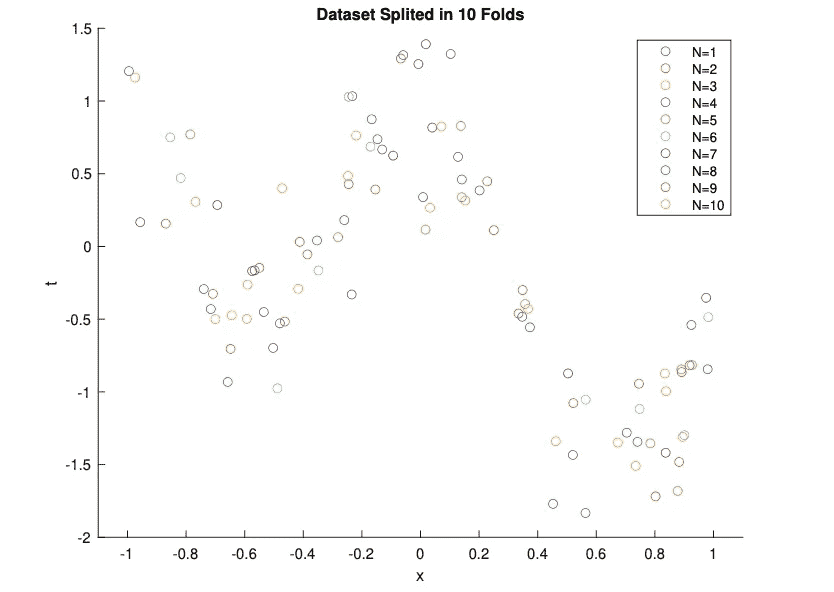
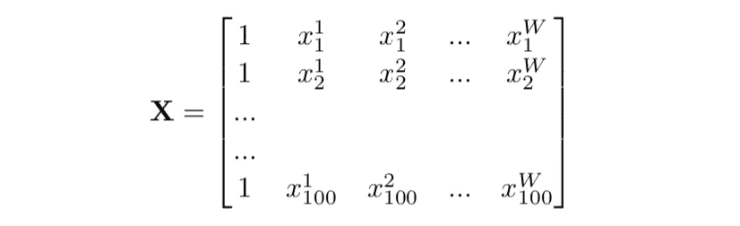
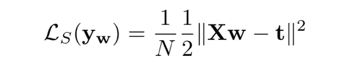
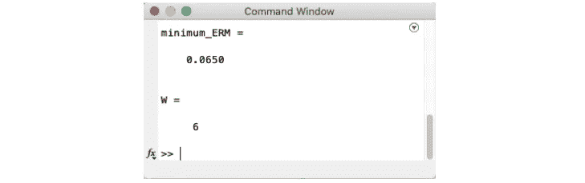
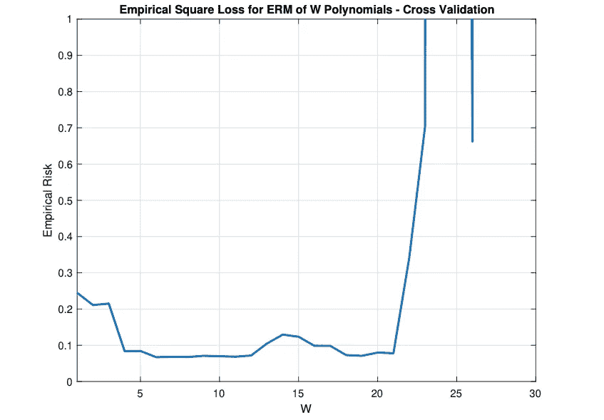
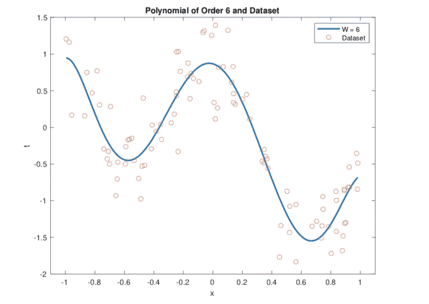
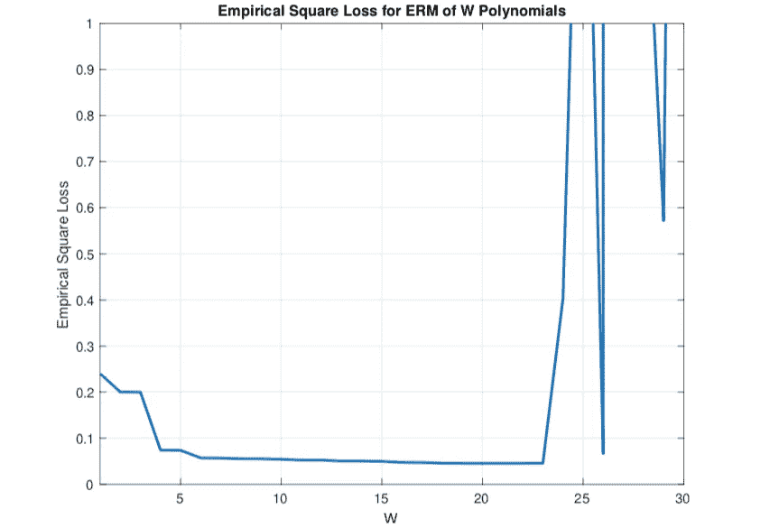
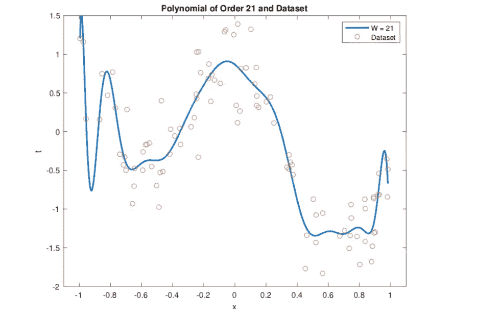

# k-fold 交叉验证对机器学习中模型预测的重要性

> 原文：<https://towardsdatascience.com/the-importance-of-k-fold-cross-validation-for-model-prediction-in-machine-learning-4709d3fed2ef?source=collection_archive---------11----------------------->

作者图片—加拿大桑德湾

本文将讨论和分析使用经验风险最小化(ERM)的最小二乘算法的机器学习中模型预测的 k-fold 交叉验证的重要性。

我们将使用多项式曲线拟合问题来预测样本数据集的最佳多项式。此外，我们将在 MATLAB 上一步一步地检查 10 重交叉验证的实现。

在这篇文章结束时，你将知道如何实现 k-fold 交叉验证方法，并理解它的优点和缺点。

# 概观

为了更好地可视化在机器学习上应用 k-fold 交叉验证的好处，我们将分析我们在根本不进行任何类型的交叉验证的情况下估计模型时可能面临的一些问题。

我们首先将数据集导入 MATLAB，并绘制数据点，以便更好地可视化它们。然后，我们将实施 10 重交叉验证算法，并计算经验风险最小化(ERM)的[平方损失误差](https://en.wikipedia.org/wiki/Least_squares)，以找到我们数据的最佳模型。最后，我们将重复这个过程，但这次没有任何类型的交叉验证，并比较结果。

# 资料组

我们将使用只有 100 个数据点的数据集。稍后将解释使用如此小的数据集的原因。这个数据集最初是由 [Ruth Urner](https://www.eecs.yorku.ca/~ruth/) 博士在她的一次机器学习课程作业中提出的。在下面的存储库中，你会发现两个 TXT 文件: [dataset1_inputs.txt](https://github.com/jaimedantas/least-squares-regresion/blob/main/dataset/dataset1_inputs.txt) 和 [dataset1_outputs.txt](https://github.com/jaimedantas/least-squares-regresion/blob/main/dataset/dataset1_outputs.txt) 。

 [## jaimedantas/最小二乘回归

### 正则化最小二乘算法用于回归以寻找机器学习模型。这个实现…

github.com](https://github.com/jaimedantas/least-squares-regresion) 

这些文件包含输入和输出向量。在 MATLAB 上的 Home > Import Data 中导入它们之后，我们可以绘制如下所示的数据点。

资料组

# k 倍交叉验证

当我们没有足够的数据来应用其他更有效的方法，如三分法(训练、验证和测试)或使用维持数据集时，交叉验证通常用于机器学习中，以改善模型预测。这就是我们的数据集只有 100 个数据点的原因。如果你想更多地了解这种方法背后的数学原理，我推荐你阅读这篇文章。

在 k-fold 交叉验证中，我们首先打乱数据集，使输入和输出的顺序完全随机。我们这样做是为了确保我们的输入没有任何偏差。然后，我们将数据集分成大小相等的 *k* 个部分。在这个分析中，我们将使用 10 重交叉验证。所以，第一步是把我们的数据集分成 10 份。

将数据分成 10 份

然后，我们将使用一个折叠来测试和计算经验平方损失，其余 9 个折叠用于在每个 *k* 交互中训练我们的模型。通过这样做，每次我们开始一个新的交互时，我们都使用不同的文件夹进行测试。这样，我们保证每一个 *k* 零件都被用于一次测试。

10 重交叉验证的算法

最后，我们将有 10 个经验平方损失值，每个相互作用一个。最终的经验平方损失将是这些值的平均值。说够了，还是去实现本身吧。

## 履行

首先，我们需要将数据集随机分成 10 等份。为了做到这一点，我创建了两个循环来迭代向量 **t** 和 **x** ，将它们分成 10 个相等的部分。这些部分存储在单元阵列 *split_t* 和 *split_x* 中。我还创建了一个辅助单元格数组来存储为每个部分选择的索引。最后，我创建了一个向量来存储所有已经拆分的索引。

在内部循环中，我生成一个从 1 到 100 的均匀分布的随机整数[1]。然后，我检查这个索引是否在被访问的索引列表中。如果它不在那里，我将这个值添加到分割单元数组中，并递增内部循环；否则，我会生成一个新的随机索引。外环重复 10 次这个过程。

这个过程可能不是混洗和分割数据集的最有效的方法，但是它确实有效，并且保证了随机分割。为了形象化我们创建的 10 个折叠，我将它们绘制在下图中。

数据集随机分成 10 份

现在，我们需要对 ERM 的经验平方损失实施 10 重交叉验证。在继续之前，我建议阅读一下关于 ERM 的解释，这样你就能理解它背后的一些主要概念。ERM 的解决方案在下面的等式中定义。

向量 **w** 是我们的多项式系数， **X** 是设计矩阵， **t** 是输出向量。

为了简化我们的计算，我们将在 MATLAB **中手动求解 **w** 的线性方程(**通过矩阵**的相乘和求逆)。**请注意，这不是求解线性方程的最有效方法。此外，我们将分析 W = 1，2，…，30 阶多项式。

因此，对于 10 重交叉验证，我们在一个循环中执行 ERM 过程 10 次，并将每次执行的所有测试分数存储在单元数组 **E** 中。经验平方损耗通过以下公式计算。

在此过程中，我们使用一个折叠进行测试，其余 9 个折叠用于训练。在这个循环中，我还计算了训练和测试设计矩阵。

我们算法的输出如下图所示。

[Cross_Validation.m](https://github.com/jaimedantas/least-squares-regresion/blob/main/code/Cross_Validation.m) 脚本的输出

因此，**W = 6 阶多项式最适合该数据**。现在，让我们分析下图中所有多项式的 ERM 图。

缩减规模下交叉验证的经验平方损失

请注意，为了更好地理解趋势，我缩小了上图中图表的比例。我们可以得出结论，随着多项式阶数的增加，经验平方损耗降低。然而，当我们将阶数增加到非常大的值时，我们开始看到过度拟合的行为(本例中 W > 21)。此外，请注意，从 W = 12 到 W = 15，平方损耗略有增加。这是因为我们在 k 倍交叉验证过程中置换了我们的数据集。避免这种情况的一种方法是进行多次 k 倍交叉验证，最后对平方损失进行平均。

下图显示了 W = 6 阶多项式相对于数据集的曲线。

6 阶多项式与数据集

请注意，我们没有用我们选择的模型过度拟合我们的数据。

> 如果我们没有使用 10 重交叉验证会怎么样？

作者图片

为了回答这个问题，让我们看看如果在我们的问题中没有使用 10 重交叉验证，我们会得到什么结果。为此，我们简单地将平方损失法应用于 ERM，如下所示。

上述算法的输出如下所示。

脚本的输出

如我们所见，这一次 21 阶多项式是经验平方损失最小的一个。即使我们分析经验平方损失曲线(如下所示),我们最终也会选择一个非常大的模型。

缩小比例下的经验平方损失

选择更高阶多项式的结果并不便宜。这不仅会使数据过拟合，还会增加复杂性。下面我们来看看 21 阶多项式。

21 阶多项式与数据集

我们可以看到，尽管 W = 21 阶多项式的经验损失最小，但它以极大的方式过度拟合了数据。

# 结论

我们看到**交叉验证**允许我们为我们的数据集选择一个**更好的模型**和一个**更小的阶数**(W = 6 与 W = 21 相比)。最重要的是，k-fold 交叉验证避免了我们在不执行任何类型的交叉验证时遇到的**过拟合**问题，尤其是对于小数据集。

然而，这种改进伴随着高成本。当使用 k-fold 交叉验证时，需要更多的计算能力来找到最佳模型。

当我们分析有交叉验证和没有交叉验证的模型的曲线时，我们可以清楚地看到 10 重交叉验证在为该数据选择最佳模型时是最重要的。

我们还研究了 10 重交叉验证的算法，详细说明了在 MATLAB 上实现该算法所需的每个步骤。

# 关于我

我是约克大学的一名硕士研究生，骨子里是一名软件工程师。在过去的十年里，我一直在软件开发、云计算和系统工程等领域的几个行业工作。目前，我正在研究云计算和分布式系统。

如果你愿意，你可以在我的[网站](http://jaimedantas.com/)上查看我的作品。

感谢阅读！

# 参考

[1] Randi 函数 MATLAB。网址:[https://www . mathworks . com/help/MATLAB/ref/randi . html # d 122e 1072277](https://www.mathworks.com/help/matlab/ref/randi.html#d122e1072277)

[2] Shai Shalev-Shwartz 和 Ben-David。理解机器学习:从理论到算法。剑桥大学出版社，2014 年。DOI:10.1017/CBO9781107298019。网址:[https://www . cs . huji . AC . il/~ shais/understanding machine learning/understanding-machine-learning-theory-algorithms . pdf](https://www.cs.huji.ac.il/~shais/UnderstandingMachineLearning/understanding-machine-learning-theory-algorithms.pdf)