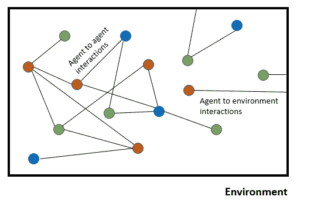
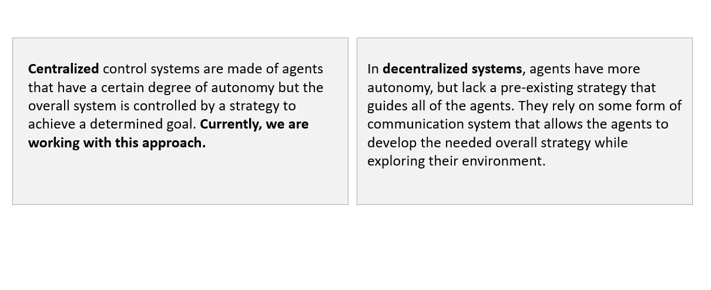
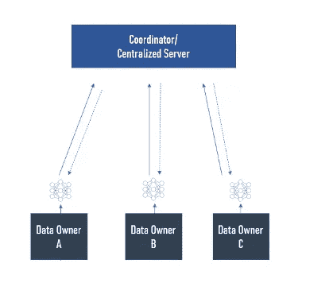
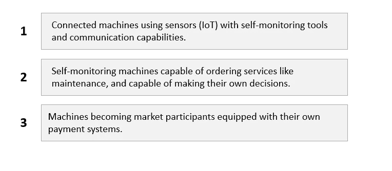

# 机器对机器经济的重要性(M2M) &多智能体系统

> 原文：<https://towardsdatascience.com/the-importance-of-machine-to-machine-economy-m2m-multi-agent-systems-cbb85c2fd3c2?source=collection_archive---------37----------------------->

## 从商业角度理解去中心化人工智能

克里斯·巴巴利斯在 [Unsplash](https://unsplash.com/s/photos/car-traffic?utm_source=unsplash&utm_medium=referral&utm_content=creditCopyText) 上的照片

在我最近的一次任务中，我负责在我们所谓的“机器对机器经济”(M2M)的背景下制定一项与去中心化人工智能相关的战略。在本文中，我将解释为什么多代理系统是在即将到来的 M2M 经济中创建新商业模式的关键，以及为什么这个新时代会对您的组织构成重大威胁。

具体来说，我们希望机器变得“更聪明”，并且很快能够在没有任何人类干预的情况下做出决策并在它们之间进行交易。因此，由于**去中心化的人工智能**，我们将很快看到新的商业模式和客户关系。

# 多智能体系统

让我们从定义一些关键术语开始:

> **代理:**复杂的计算机程序，在开放和分布式环境中，代表它们的用户自主行动，以解决越来越多的复杂问题。然而，应用程序越来越需要多个可以协同工作的代理。( [1](https://www.cs.cmu.edu/~softagents/multi.html)
> 
> **多智能体系统(MAS):** 一个松散耦合的软件智能体网络，通过交互来解决超出每个问题解决者个人能力或知识的问题。( [2](https://www.intechopen.com/books/multi-agent-systems/introductory-chapter-multi-agent-systems#B4) )

更简单地说，用一个来自 Yoav Shoham 和 Kevin Leyton-Brown 的例子，你应该想象一个个人软件代理在几个电子商务网站上代表你。例如，让我们假设这个代理的任务是识别随着时间的推移在各种在线网站上销售的特定产品，并代表您购买其中的一些产品。为了取得成功，您的代理需要记住您对产品的偏好、您的预算以及您对其运营环境的总体了解。

此外，代理将需要利用你对与之互动的其他类似代理的了解(在拍卖中，或代表其他企业的代理)。

这些智能体的集合形成了一个多智能体系统。详细地说，多智能体系统是“一个由各种相互沟通的人工智能组成的松散生态系统”( [**3**](https://www.appypie.com/multi-agent-systems) **)。它本质上是基于代理的系统的下一次迭代。一些算法在 MAS** (强化学习、深度学习、深度卷积网络、…)的发展中被证明是相当有趣的。

目前，MAS(在分散的人工智能背景下)仍在研究中。因此，多智能体系统的工业应用/可扩展性仍然需要几年的时间。

多代理系统分为两类:

正如我们已经看到的，代理可以相互作用。这些代理之间的通信或协调可以采取多种形式。然而，也有必要理解它们也是自主代理。因此，在一些情况下，代理具有相反的目标，因此，不能执行任何包含它们的合作过程。

**知道代理配备了社交能力**是很关键的。这种能力可以定义为“交换高级信息(而不仅仅是没有关联意义的数据字节)和与其他代理(和/或人类)进行社会互动过程的能力，类似于人类在日常生活中使用的那些，建立集体行为。”( [4](https://www.intechopen.com/books/multi-agent-systems/introductory-chapter-multi-agent-systems)

我们当前的挑战是建立能够与其他代理协商和合作的代理。例如，为了说服代理合作，可能需要付款或提供特定的商品或服务。

此外，我们也在关注联合学习。

> **联合学习:**一种机器*学习*技术，在多个分散的边缘设备或保存本地数据样本的服务器上训练算法，而不交换它们。( [5](https://en.wikipedia.org/wiki/Federated_learning) )

事实上，我们认为 AI 和实时数据处理必须发生在边缘网络和边缘设备(物联网设备等)上。对于一些产品来说，从传感器中收集数据以在不依赖云或互联网的情况下实时做出决策是否至关重要。他们还应该能够使用机载算法学习或训练自己，并与其他产品分享他们的学习成果。

# 机器对机器经济

随着人工智能、智能传感器、去中心化 P2P 交易协议和区块链的兴起，我们正在进入机器经济。机器最终会在经济上独立。一个对象(比如:车)就能花钱，就能挣钱。机器将为我们做出决定，这解释了人工智能方面的问题，但我们需要信任它们——这就是区块链的用武之地。

> 我们未来的顾客将是带钱包的机器。

我们设想在未来，机器可以发现、自动与其他机器连接(使用公共或私有网络，例如网状网络)，通过 AI(强化学习)做出自己的选择，并独立购买他们需要的东西。我们认为机器迟早也会集成钱包。

一个物联网设备将不再被认为是一个孤立的产品，需要自己从头学习一切；这些设备还将利用全球其他类似物联网设备的大规模学习。**这意味着由机器学习训练的物联网智能系统不仅仅是变得更聪明；随着时间的推移，他们以指数趋势变得更聪明。**

此外，在 M2M 经济中，大多数**消费者将根据他们使用或消费产品的数量付费。这是我们购买产品方式的重大转变。**

> 在汽车行业，我们可以想象车辆可以无缝连接和[通信](https://arxiv.org/pdf/1903.01365.pdf)(使用多代理深度强化学习)与其他[车辆](https://www.intechopen.com/books/multi-agent-systems/multiagent-systems-in-automotive-applications)、道路、交通灯、停车计时器、汽油泵，甚至像优步这样的私营公司。更广泛地说，我们可以设想一个社会，在这个社会中，汽车、无人机或建筑物可以直接相互协商，以实现它们的目标，而不需要人类的参与。

为了在机器对机器经济中创造新的以机器为中心的商业模式，我们必须首先通过更好地利用数据网络效应来改进我们的 AIoT 战略。

> 机器是未来的客户…

从技术角度来看，建造一台真正自主且可扩展的机器，并使其能够在非常具体的目的背景之外做出决策，仍然是一件极其困难的事情。

我们产品的转型或多或少遵循了澳大利亚联邦银行制定的路线图。在机器对机器经济的发展中，我们有三个必要的步骤

# 新的机遇和威胁

向大多数顾客都是机器的经济转型将产生重大影响。

*   你如何说服一个人工智能代理从你的公司购买？
*   **在 M2M 经济中，你是如何管理“顾客”忠诚度的？**
*   你如何确保在这个**机器驱动的经济**中保持相关性？

这种情况会给你的行业带来新的动力。今天依赖人工智能代理的客户可能会转向更“人工智能友好”的业务，或者一些公司可能会创建特定的专属环境。与此同时，你必须考虑到你的产品可能会独立产生额外的收入。

例如，在 M2M 经济中，自动驾驶汽车的车主可以通过向其他人提供乘车服务，或者通过向人工智能公司出售或出租数据集来受益。我们的项目之一是为这个案例考虑一个激励机制。事实上，作为一种激励，汽车可以接收比特币或一些代币。

我们已经关注了代理之间信任的概念。事实上，信任可以被视为代理之间交互的质量和数量:两个部分之间发生的交互越多，一方就越信任另一方。在一个由去中心化人工智能驱动的竞争市场中，改变这一点容易吗？

代理之间的信任问题可以通过[基于动态交互的信誉模型(DIB-RM)](https://arxiv.org/pdf/1801.03904.pdf) 来解决，该模型被引入来捕获信任的动态属性。该模型结合不同的动态因素计算系统中每个代理的信誉值。信誉值在每次交互时被更新。

除了显而易见的技术问题之外，公司还必须从孤立的解决方案过渡到共享的、值得信赖的通信方法。事实上，只有为 MAS 开发特殊的协议，MAS 才能适用于所有行业。MAS 将很难在当前的数据驱动协议下工作。

## 要了解更多信息，我推荐以下链接:

*   [机器对机器时代的到来及其对保险业的影响](https://www.quantumrun.com/article/dawn-machine-machine-age-and-its-implications-insurancee)
*   [为什么多智能体系统会让人工智能变得更好](https://www.appypie.com/multi-agent-systems)
*   [分布式人工智能(第一部分):MAS、ABM 和群体智能入门](https://www.forbes.com/sites/cognitiveworld/2019/03/21/distributed-artificial-intelligence-part-i-a-primer-on-mas-abm-and-swarm-intelligence/#814672918a3e)
*   介绍性章节:多智能体系统
*   [合作多智能体深度强化学习微观交通仿真](https://arxiv.org/pdf/1903.01365.pdf)
*   [汽车应用中的多智能体系统](https://www.intechopen.com/books/multi-agent-systems/multiagent-systems-in-automotive-applications)
*   [欢迎来到机器对机器经济](https://www.commbank.com.au/content/dam/caas/newsroom/docs/Commbank-Whitepaper-Machine-to-Machine-economy.pdf)
*   [多智能体系统](https://www.cs.cmu.edu/~softagents/multi.html)
*   [在 M2M 经济中的声誉](https://deepai.org/publication/reputation-in-m2m-economy#bib.bibx2)
*   [走向基于动态交互的信誉模型](https://arxiv.org/pdf/1801.03904.pdf)
*   [使用多代理系统和人工智能来监控和提高云性能和安全性](https://www.sciencedirect.com/science/article/abs/pii/S0167739X17310531)
*   [多智能体系统:算法、博弈论和逻辑基础](https://books.google.fr/books/about/Multiagent_Systems.html?id=bMR_qScakukC&redir_esc=y)
*   [多智能体系统和分散式人工超级智能](https://arxiv.org/ftp/arxiv/papers/1702/1702.08529.pdf)