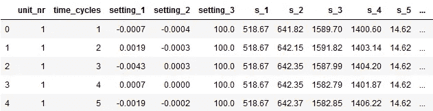
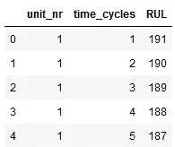
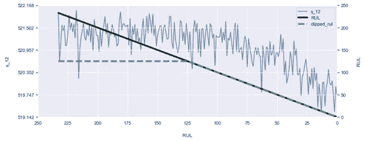
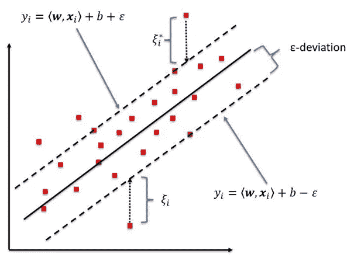

# 监督预测性维护解决方案中问题框架的重要性

> 原文：<https://towardsdatascience.com/the-importance-of-problem-framing-for-supervised-predictive-maintenance-solutions-cc8646826093?source=collection_archive---------10----------------------->


杰西卡·鲁斯切洛在 [Unsplash](https://unsplash.com?utm_source=medium&utm_medium=referral) 上的照片

## [探索美国宇航局的涡轮风扇数据集](https://towardsdatascience.com/tagged/exploring-nasa-turbofan)

## 重温我们的剩余使用寿命假设&支持向量回归

<*免责声明:我的目的是展示模型开发过程中不同方法和选择的效果。这些影响经常使用测试集来显示，这被认为是(非常)不好的做法，但有助于教育目的。* >

在我的上一篇文章中，我们探索了 NASA 的 FD001 涡轮风扇退化数据集。简单概括一下，传感器 1、5、6、10、16、18 和 19 没有与剩余使用寿命相关的信息(RUL)。从数据中去除这些因素后，我们拟合了一个 RMSE 为 31.95 的基线线性回归模型。今天，我们将重新检查我们的 RUL 假设，以提高我们的准确性，并拟合支持向量回归机(SVR)，以进一步改善我们的结果。我们开始吧！

# 加载数据

首先，我们将加载数据并检查前几行，以确认数据加载正确。



train.head()的结果

加载的数据看起来不错，让我们像以前一样计算线性下降 RUL。

RUL 在击穿时可以认为是 0，我们天真地假设 RUL 是一个线性函数。意味着在击穿前的 10 个周期时 RUL 是 10，在击穿前的 50 个周期时是 50，等等。



在重新检查我们计算 RUL 的方法之前，我们将通过删除不包含有用信息的列来准备数据。这将允许我们直接测试我们所做的任何更改，因为我们的数据已经准备好了。

我们还定义了评估模型性能的函数。

改装我们的基线模型。

```
# returns
# train set RMSE:44.66819159545453, R2:0.5794486527796716
# test set RMSE:31.952633027741815, R2:0.40877368076574083
```

# 重新审视 RUL

之前我假设 RUL 随着时间线性下降。然而，在上一篇文章中，我们看到这可能会影响我们的整体模型性能。有一种方法可以改进我们的假设，我将在下面解释[1]。

观察传感器信号(参见下面的*一个*示例)，许多传感器在开始时似乎相当稳定。这是因为随着时间的推移，发动机只会出现故障*。信号曲线的弯曲是提供给我们的第一个信息，即发动机正在退化，并且第一次有理由假设 RUL 线性下降。在那之前，我们真的不能说任何关于 RUL 的事情，因为我们没有关于最初磨损的信息。*



描述 S12、线性和削波 RUL 的图形。

我们可以更新我们的假设来反映这个逻辑。我们没有让 RUL 线性下降，而是将 RUL 定义为一个常数，一段时间后才线性下降(见上面的例子)。通过这样做，我们实现了两件事:

1.  初始恒定的 RUL 与初始恒定的平均传感器信号更好地相关
2.  RUL 的较低峰值导致我们的目标变量的较低分布，从而更容易拟合直线

因此，这种变化允许我们的回归模型更准确地预测低 RUL 值，这通常是更有趣/更关键的正确预测。

使用 pandas，您可以简单地将之前计算的线性下降 RUL 限制在所需的上限值。测试多个上限值表明在 125 处剪切 RUL 对模型产生了最大的改进。当我们更新我们对列车组的 RUL 的假设时，我们应该在评估中包括这一变化。测试集的真实 RUL 保持不变。让我们来看看这一变化的影响。

```
# returns
# train set RMSE:21.491018701515415, R2:0.7340432868050447
# test set RMSE:21.900213406890515, R2:0.7222608196546241
```

火车 RMSE 已经减半多了。当然，我们已经自己设定了这些目标，但是它显示了之前的 RUL 假设对整体模型性能的影响有多大。更重要的是测试集的改进。测试 RMSE 从 31.95 降低到 21.90，提高了 31%！这告诉我们更新的假设有利于模拟真实的 RUL。让我们看看使用另一种技术是否能做得更好。

# 支持向量回归

线性 SVR 与线性回归的主要区别在于，它将边界设置在距离参考数据ε(ɛ)的位置(见下图)。当在模型拟合期间最小化损失函数时，落在边界内的点被忽略。在这些边界之外的点上拟合你的模型减少了计算量，并允许你捕捉更复杂的行为，**但是**这种技术对异常值也更敏感！



来源:[2]。黑色实线代表目标，虚线是距离ε(ɛ).)处的边界只有边界外的点有助于模型拟合和最小化损失函数。损失函数类似于岭回归和套索回归的损失函数。

实例化一个 SVR 就像建立一个线性回归一样简单，一定要确保将内核设置为“线性”。拟合模型后，我们再次对训练集和测试集进行评估。

```
# returns
# train set RMSE:29.57783070266026, R2:0.49623314435506494
# test set RMSE:29.675150117440094, R2:0.49005151605390174
```

请注意，均方根误差比我们的 RUL 线性回归差得多。让我们通过缩放我们的特征来尝试改进我们的模型。

# 缩放比例

支持向量回归机通过比较特征向量之间的距离来工作。但是当特征在范围上变化时，计算的距离由具有更大范围的一个来支配。假设一个特性的范围在 10-11 之间，另一个在 1000-1100 之间。两者相差 10%，但后者的绝对差异要大得多。SVR 将更重视其范围的变化。
为了解决这个问题，您可以缩放您的要素，使它们都在同一范围内。这使得您的 SVR 可以比较相对距离，并对差异进行大致相同的加权。[3, 4].
Sklearns 的 MinMaxScaler 可用于创建适合我们训练数据的缩放器。默认设置创建一个缩放器，在 0-1 之间缩放我们的训练特征。然后，缩放器被应用于我们的 X_train 和 X_test 集。我们用缩放后的数据拟合和评估一个新的 SVR 模型。

```
# returns
# train set RMSE:21.578263975067888, R2:0.7318795396979632
# test set RMSE:21.580480163289597, R2:0.730311354095216
```

请注意，21.58 的测试 RMSE 已经是对我们的线性回归的改进，该线性回归的 RMSE 为 21.90。接下来，我们将应用一些特征工程来尝试进一步改进我们的预测。

# 特征工程

一种非常有用的要素工程技术是创建要素的多项式组合，这可能会揭示数据中与原始要素不明显的模式。假设我们想要创建二次多项式特征`s_2`和`s_3`，结果将是`[1, s_2, s_3, s_2², s_3², s_2*s_3]`。
将该技术应用于我们当前数据集中的所有传感器，可将特征空间从 14 个增加到 120 个。

```
# returns
# (20631, 14)
# (20631, 120)
```

在设计了新的特征之后，我们安装了新的模型。

```
# returns
# train set RMSE:19.716789731130874, R2:0.7761436785704136
# test set RMSE:20.585402508370592, R2:0.75460868821153
```

请注意，测试集 RMSE 和方差再次得到改善，表明通过添加多项式特征可以获得更多信息。我也考虑过对数变换，但是传感器值范围不够大，不足以证明这些变换的合理性。然而，多项式特征确实扩大了我们的特征空间，使我们的模型有点“臃肿”,并增加了训练时间。让我们看看我们是否可以在保持分数的同时，通过保留最具信息性的特征来降低音量。

# 特征选择

使用包含工程特征的模型，我们可以计算哪些特征对模型性能的贡献最大。为此，我们使用 SelectFromModel，在其中传递我们训练好的模型并将 prefit 设置为 True。我们将选择“重要”特征的阈值设置为“平均”，表示所选特征的特征重要性将大于整个集合的平均特征重要性。获取支持将返回一个布尔数组，指示哪些要素的重要性高于平均值。我们将用它来划分特征子集，只保留“特征重要性>平均特征重要性”等于真的特征。

```
# returns
# Original features:
 Index(['s_2', 's_3', 's_4', 's_7', 's_8', 's_9', 's_11', 's_12', 's_13',
       's_14', 's_15', 's_17', 's_20', 's_21'],
      dtype='object')
# Best features:
 ['x0' 'x1' 'x2' 'x3' 'x5' 'x6' 'x7' 'x9' 'x10' 'x11' 'x12' 'x13' 'x2 x5'
 'x2 x8' 'x2 x9' 'x3 x5' 'x3 x8' 'x3 x9' 'x4^2' 'x4 x6' 'x4 x7' 'x4 x8'
 'x5^2' 'x5 x6' 'x5 x7' 'x5 x9' 'x5 x12' 'x5 x13' 'x6^2' 'x6 x8' 'x6 x9'
 'x7 x8' 'x7 x9' 'x8^2' 'x9^2' 'x9 x12' 'x9 x13']
# shape: (37,)
```

用所选择的特征来拟合和评估新的 SVR 模型。

```
# returns
# train set RMSE:19.746789101481127, R2:0.775461959316527
# test set RMSE:20.55613819605483, R2:0.7553058913450649
```

注意，测试 RMSE 和方差略有改善，而模型使用的特征数量从 120 个减少到 37 个！这种改善可能是由于模型在列车组上过度拟合得稍微少一些。我们现在有了所有的构建模块来训练和选择我们的最终模型。

# 选择我们的最终型号

对于最终模型，我们将在训练集上使用简单的超参数调整来调整ε的值。正如本文前面所解释的，ε表示最小化损失函数时要考虑的数据点的边界。

```
# returns
# epsilon: 0.4 RMSE: 19.74772556660336 R2: 0.7754406619776462
# epsilon: 0.3 RMSE: 19.747580761069848 R2: 0.7754439552496148
# epsilon: 0.2 RMSE: 19.74660007817171 R2: 0.7754662580123992
# epsilon: 0.1 RMSE: 19.746789101481127 R2: 0.775461959316527
# epsilon: 0.05 RMSE: 19.746532456984006 R2: 0.7754677958176168
```

ε为 0.2 似乎在训练集上产生最佳性能。让我们重新训练我们的模型，并检查最终结果。

```
# returns
# train set RMSE:19.74660007817171, R2:0.7754662580123992
# test set RMSE:20.54412482077374, R2:0.7555918150093489
```

具有剪切 RUL 的线性模型的 RMSE 为 21.90，比我们的基线回归提高了 31%，基线回归的 RMSE 为 31.95。我们的最终模型利用边界调谐的 SVR、用于训练的限幅 RUL、特征缩放和贡献最大的二阶多项式特征来达到 20.54 的测试 RMSE。这比我们的 RUL 限幅线性模型提高了 6%，比基线模型总体提高了 35.7%。

最后，这篇文章展示了正确构建数据科学问题的重要性。虽然 SVR 肯定是对线性回归的改进，但与我们更新的 RUL 假设相比，它的改进就相形见绌了。完整的笔记本你可以点击这里查看我的 github repo。

我要感谢 Maikel Grobbe 和 Wisse Smit 对我的文章的评论。[下一次](/time-series-analysis-for-predictive-maintenance-of-turbofan-engines-1b3864991da4?source=friends_link&sk=a62dbeb8230f6b29123b692ac08dad59)我们将深入研究时间序列分析，20.54 的 RMSE 将是要打破的分数。如果你有任何建议、问题或评论，请在下面的评论中留下！

参考文献:
【1】f . o . Heimes，“用于剩余有用寿命估计的递归神经网络”， *2008 年国际预测和健康管理会议*，科罗拉多州丹佛，2008 年，第 1–6 页，doi:10.1109/PHM . 2008.4711422 .
【2】Kleynhans，Tania & Montanaro，Matthew & Gerace，Aaron & Kanan，Christopher。(2017).使用深度学习的 MERRA-2 大气数据预测大气顶部热辐射。遥感。9.1133.doi: 10.3390/rs9111133。
【3】[https://en.wikipedia.org/wiki/Feature_scaling](https://en.wikipedia.org/wiki/Feature_scaling)
【4】[https://stats . stack exchange . com/questions/154224/when-using-SVMs-why-do-I-need-scale-the-features](https://stats.stackexchange.com/questions/154224/when-using-svms-why-do-i-need-to-scale-the-features)