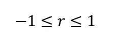
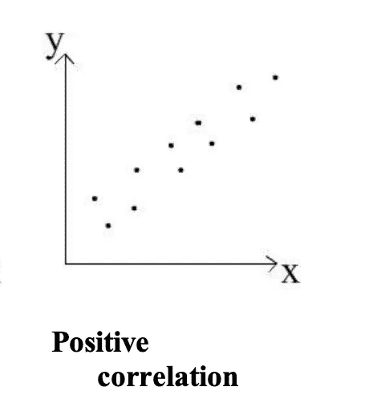
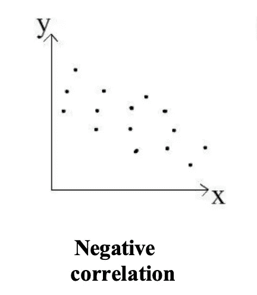
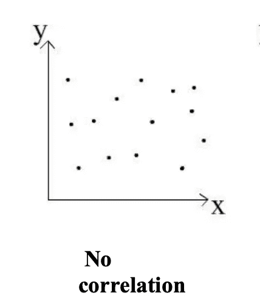
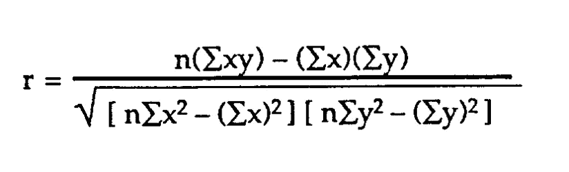
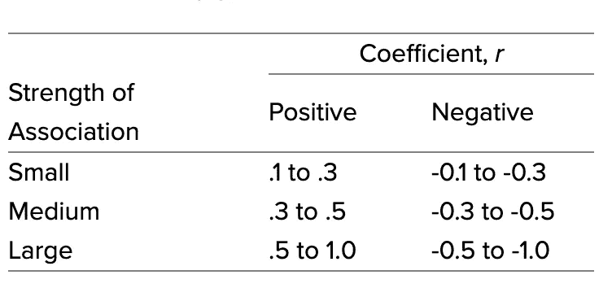
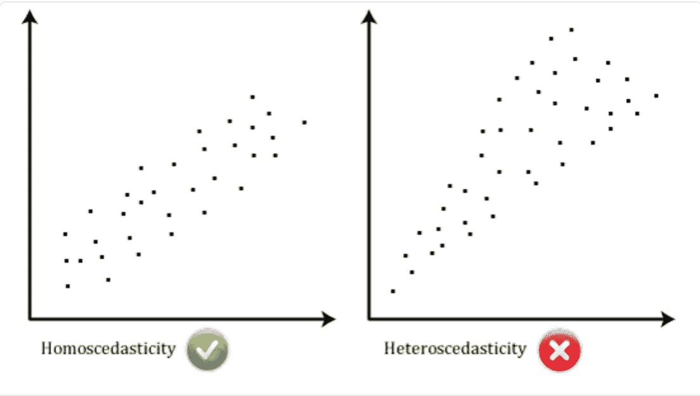

# r 及其在数据科学中的应用

> 原文：<https://towardsdatascience.com/the-importance-of-r-in-data-science-6b394d48fa50?source=collection_archive---------23----------------------->

弗朗西斯·德拉佩纳在 [Unsplash](https://unsplash.com/s/photos/animal-friendship?utm_source=unsplash&utm_medium=referral&utm_content=creditCopyText) 上拍摄的照片

## 关于皮尔逊相关系数及其应用的一点提醒

r 是什么？简单来说就是皮尔逊相关系数(r)。或者换句话说:R 是一个相关系数，它衡量两个变量之间的关系强度，以及[散点图](https://en.wikipedia.org/wiki/Scatter_plot)上的方向。r 的值总是在一个负值和一个正值之间(-1 和 a +1)。

图片作者:[https://www . stats tutor . AC . uk/resources/uploaded/pearsons . pdf](https://www.statstutor.ac.uk/resources/uploaded/pearsons.pdf)

对于那些需要复习散点图是什么的人，不要担心。散点图是一个数学图表，显示了两个变量的数据点的[笛卡尔坐标](https://g.co/kgs/imRff8)。同样，笛卡尔坐标来自[笛卡尔系统](https://g.co/kgs/ydEoHk)。笛卡尔系统只是帮助指定和放置每个坐标(一组数字)在一个平面上，这将是散点图。(下面会有散点图的视觉效果)

回到 r .如上所述，连续数据的皮尔逊相关系数(r)范围为-1 到+1。这意味着，如果 r = -1，数据位于一条斜率为负的完美直线上。此外，如果 r = +1，则数据位于具有正斜率的完美直线上。如果 r = 0，这意味着没有线性相关性。注意:如果 r = 0，这并不意味着没有任何关系，只是意味着它不是线性的。可能是二次关系。这可以留给另一篇博客文章。

另一个需要注意的重要事情是，r 并不代表最佳拟合直线的斜率。

很容易直观地知道 r 是什么。r 可分为以下两类:

**正相关**:因变量随着自变量的增加而增加。这产生了一个正斜率，从视觉上看，散点图向上倾斜。这意味着有一个积极的关系。

图片作者:[https://www . stats tutor . AC . uk/resources/uploaded/pearsons . pdf](https://www.statstutor.ac.uk/resources/uploaded/pearsons.pdf)

**负相关:**自变量增加，因变量减少。这会产生一个负斜率。这通过向下倾斜的点来描述。这意味着有一种负面的关系。

图片作者:[https://www . stats tutor . AC . uk/resources/uploaded/pearsons . pdf](https://www.statstutor.ac.uk/resources/uploaded/pearsons.pdf)

**无相关性:**因变量既不倾向于增加也不倾向于减少，这意味着自变量和因变量之间没有关系。

图片作者:[https://www . stats tutor . AC . uk/resources/uploaded/pearsons . pdf](https://www.statstutor.ac.uk/resources/uploaded/pearsons.pdf)

皮尔逊相关系数通常用于线性回归。相关系数不应用于非线性关系。

另一种判断 r 是负还是正的方法是通过皮尔逊公式:

图片作者:[https://www . statistics show to . com/probability-and-statistics/correlation-coefficient-formula/](https://www.statisticshowto.com/probability-and-statistics/correlation-coefficient-formula/)

**其在数据科学和分析数据方面的用途:**

皮尔逊相关系数在数据科学中用于调查两个变量之间的关系强度。

上面我已经列出了完美的消极和积极的关系。大多数时候，情况并非如此，尤其是在应用于数据时。随着 r 越来越接近 0，它变得明显更弱。当 r 接近 0 时，更难确定是否存在正相关、负相关或是否存在相关。

通常，r 将在应用线性回归或最佳拟合线时计算。r 表示每个数据点有多远。

在数据科学中，了解何时使用特定的度量非常重要。在使用皮尔逊相关系数时，大多数测量单位都有一个通用的指导原则，同时也要记住七个假设。皮尔逊相关系数的准则是:

图片来源:[来源](https://statistics.laerd.com/statistical-guides/pearson-correlation-coefficient-statistical-guide.php)

如果要用 r 来度量两个数据点之间的关系，那么它必须在一个区间上进行度量，或者它必须在一个比率尺度上。不用担心，两个变量都不需要用同一个比例尺度来衡量。此外，一个变量可以是比率，另一个变量可以是区间。

为了使用皮尔逊相关系数，需要满足七个假设。现实世界的数据经常满足所有七个假设。这个问题的解决方案是找到一个不同的统计测试，更好地适合所提供的数据，或者对现有数据进行调整，使其满足下面列出的要求:

1.  使用的数据必须在连续的范围内测量(比率或间隔)
2.  正在使用的连续数据必须成对出现。每个变量必须有两个值。之前我提到了笛卡尔坐标。
3.  每个案例都应该是独立的。每个变量或情况都有两个观察值。比如智商，年收入。如果一个案例具有高智商和高收入(散点图上的数据点)，这不应该与数据集中的另一个案例或点相关。
4.  两个连续变量之间应该是线性关系。
5.  被测试的两个变量都应遵循一个双变量正态分布(一个三维钟形曲线，代表两个独立变量 X 和 Y，它们相加在一起形成一个概率密度函数 PDF，变量是线性函数，并且是独立的正态随机变量)。使用单变量正态性是可以接受的，但建议使用双变量。
6.  应该有同方差。这意味着，当直线沿某个方向移动时，数据点应该遵循一致的方差，因为它与最佳拟合直线的移动方向相同。如果方差不相似，则意味着存在异方差。(这个真的很难用皮尔森的相关系数来检验)

图片作者:[https://statistics . laerd . com/statistical-guides/Pearson-correlation-coefficient-statistical-guide . PHP](https://statistics.laerd.com/statistical-guides/pearson-correlation-coefficient-statistical-guide.php)

7.不应该有任何单变量或多变量异常值。不应该有任何异常值！[单变量异常值](https://www.statisticssolutions.com/univariate-and-multivariate-outliers/#:~:text=A%20univariate%20outlier%20is%20a,the%20outcome%20of%20statistical%20analyses.)是出现在一个变量而不是两个变量中的极值。[多元变量](https://www.statisticssolutions.com/univariate-and-multivariate-outliers/#:~:text=A%20univariate%20outlier%20is%20a,the%20outcome%20of%20statistical%20analyses.)由至少两个变量中的异常值组成。异常值会影响结果，这取决于所进行的统计测试。在这种情况下，r 会受到影响，这是不理想的情况。

在数据科学领域，当使用线性回归算法时，可以计算 r。线性回归来自统计学，并被借用和应用于机器学习，以创建预测模型。[线性回归算法](https://machinelearningmastery.com/linear-regression-for-machine-learning/)有助于最小化误差量，从而提高精确度。

总的来说，r 有利有弊。

优势:

*   显示两个变量的强度以及是否确实存在关系
*   研究随机独立变量的行为
*   与其他更复杂的统计测试相比，它有助于获得更容易分析的定量数据。

缺点:

*   它不能显示因果关系
*   它假设总有某种形式的线性关系
*   相关性并不意味着因果关系。两个自变量相关性高，不代表就是因果关系。(一个变量导致另一个变量发生)

我发现一个人选择使用的测试很大程度上取决于手头的数据和项目的最终目标。

皮尔逊相关系数是我在学习成为数据科学家时学到的第一件事。

*参考文献:*

[“用于机器学习的线性回归”https://Machine Learning mastery . com/Linear-Regression-for-Machine-Learning/](https://machinelearningmastery.com/linear-regression-for-machine-learning/)

['如何解读一个相关系数' https://www . dummies . com/education/math/statistics/How-To-Interpret-A-Correlation-Coefficient-r/#:~:text = Rumsey，正好%20%E2%80%931](https://www.dummies.com/education/math/statistics/how-to-interpret-a-correlation-coefficient-r/#:~:text=Rumsey,Exactly%20%E2%80%931) 。

[《皮尔逊相关系数》http://learntech.uwe.ac.uk/da/Default.aspx?pageid = 1442 #:~:text = Pearson s % 20 correlation % 20 coefficient % 20(r)% 20 is，variables % 20 to % 20 check % 20 for % 20 linearity。](http://learntech.uwe.ac.uk/da/Default.aspx?pageid=1442#:~:text=Pearson's%20correlation%20coefficient%20(r)%20is,variables%20to%20check%20for%20linearity.)

[‘皮尔逊的 PDF’；https://www . stats tutor . AC . uk/resources/uploaded/pearsons . pdf](https://www.statstutor.ac.uk/resources/uploaded/pearsons.pdf)

[“皮尔逊乘积矩相关性”https://statistics . laerd . com/statistical-guides/Pearson-Correlation-coefficient-statistical-guide . PHP](https://statistics.laerd.com/statistical-guides/pearson-correlation-coefficient-statistical-guide.php)

[‘相关系数公式的类型’；https://www . statistics show to . com/probability-and-statistics/correlation-coefficient-formula/](https://www.statisticshowto.com/probability-and-statistics/correlation-coefficient-formula/)

[https://www . ICP Sr . umich . edu/ICP srweb/content/shared/ICP Sr/FAQs/what-is-r . html](https://www.icpsr.umich.edu/icpsrweb/content/shared/ICPSR/faqs/what-is-r.html)