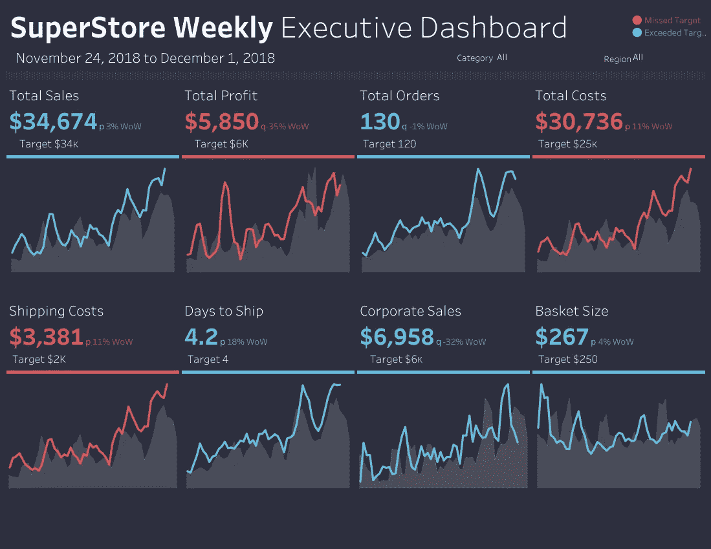
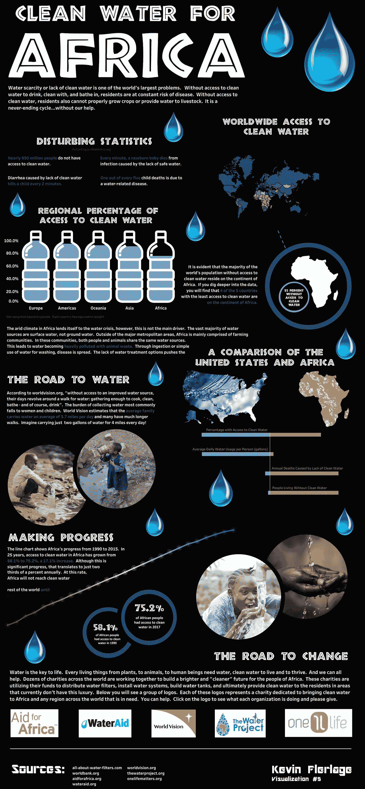
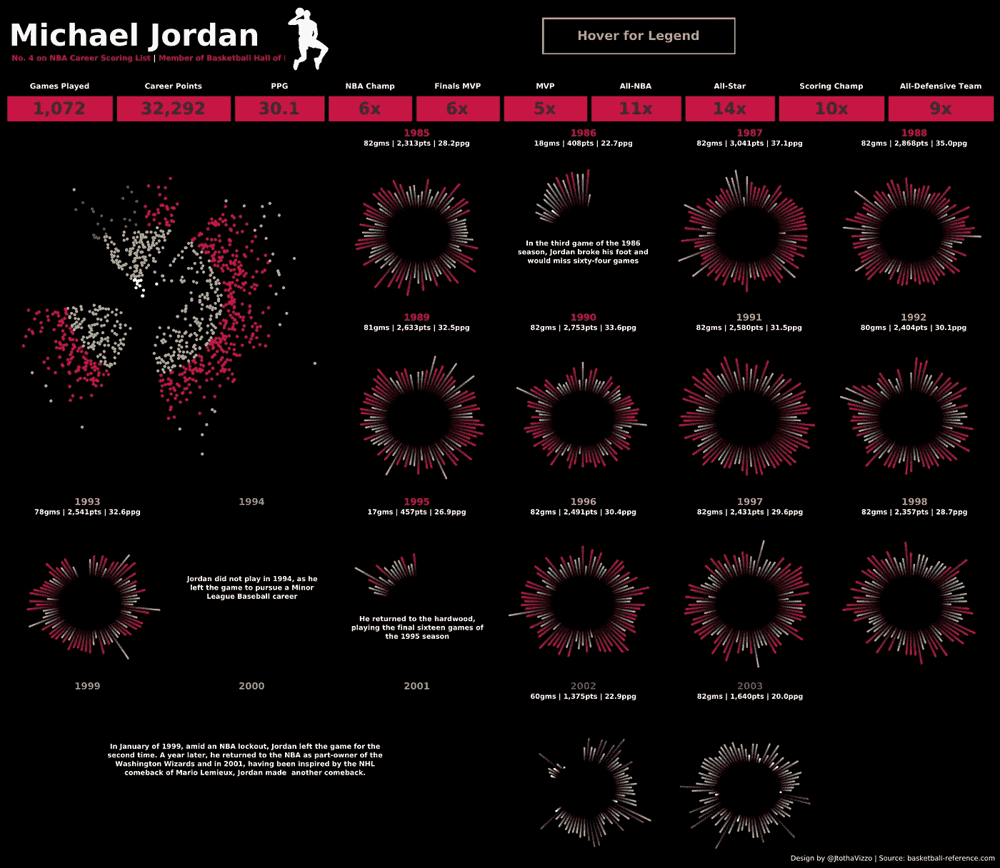

# 为数据可视化设定基调的重要性

> 原文：<https://towardsdatascience.com/the-importance-of-setting-a-tone-for-your-data-visualization-6aae83667062?source=collection_archive---------58----------------------->

## 创造一种气氛不仅仅是小说家的事

语气和情绪显而易见:照片由 [Kat J](https://unsplash.com/@kj2018?utm_source=unsplash&utm_medium=referral&utm_content=creditCopyText) 在 [Unsplash](https://unsplash.com/s/photos/black-and-white-crying?utm_source=unsplash&utm_medium=referral&utm_content=creditCopyText) 上拍摄

每一个伟大的故事背后都有一种潜在的基调，讲故事的人试图传达这种基调，以吸引观众产生一种特殊的感受。精心制作的语气可以让听众感受到喜悦、悲伤、愤怒或希望，也可能同时感受到所有这些情绪。我们大多数人能够如此生动地记得某些书籍、电影、电视节目、照片和艺术品，是因为我们第一次观看时的感受。相信创作者以一种非常有影响力的方式精心打造了他们故事的基调。

作为一名数据分析师或数据科学家，我们有大量的数据可以利用，并通过创建可视化来获得洞察力。我们可能精通我们行业的技术，但我们工作的很大一部分是利用这些数据帮助人们根据我们提供的信息采取行动。根据不同的情况，我们必须以一种特殊的方式来构思我们的故事，以影响观众对我们想要讲述的故事的理解和感受。为你的想象创造一个基调有助于构思一个故事。

为寻找一家公司销量最高的产品而创建可视化效果的基调，可能与你试图说服整个国家，在疫情期间呆在家里有助于拯救生命的基调不同。这两种情况处于光谱的相反两端，但是作为可视化者，设定你的可视化的基调将是一个人记住你的分析并采取行动或者把它推到一边并继续前进的区别。

# 视觉化的基调是什么？

在安迪·基尔克的书《[数据可视化:数据驱动设计手册](https://www.amazon.com/Data-Visualisation-Handbook-Driven-Design/dp/1526468921)》中，他用一句话很好地总结了可视化的基调:

> "声调:“阅读”和“感觉”数据的区别."

就像任何创造性的努力一样，比如写故事、摄影或绘画，创作者想要讲述一个故事，他们可能希望观众以一种特定的方式来感知它。在写作中，作者通过他们的措辞、不同的观点和不同的正式程度来建立一种基调。摄影师可以通过他们对颜色的使用或他们如何框住他们的主题来建立一种基调。在建立你的视觉化图像的基调时有许多相似之处，主要目标是你希望你的观众如何解释和感知你的视觉化图像。你对图表、颜色、字体、大小和形状的选择都在为你的视觉化建立你的基调中扮演了一个角色。

我打赌你会忍不住笑:米的照片

# **为什么语气很重要？**

和其他媒介一样，为你的视觉化建立一个基调尤其重要。在可视化数据的时候有一个你想讲的故事，但是作为创作者，你无法控制你的受众对你的题材的态度。然而，你确实可以控制你的观众如何解释和理解你的主题。建立你的风格有助于影响你的观众以你创造的方式感知和理解你的视觉效果。

如果你已经定义了可视化的目的，你就可以决定你需要为观众设定什么样的基调。正如安迪·基尔克在他的书中所说的，根据你视觉化的目的，你会想要使用两种类型的音调。第一种是用读的语气，第二种是感觉的语气。

# 如何建立“阅读”的基调

由 Tableau Public 上的 [syedjawadhassan](https://public.tableau.com/profile/syedjawadhassan#!/) 创建:[https://Public . Tableau . com/views/supply chain dashboard/1kpid ashboard？:display _ count = y&mobile =&:origin = viz _ share _ link](shorturl.at/txzI4)

当试图优化听众理解你的数据并从中获取详细信息的效率时，使用阅读语气。你想用快速的事实和数据打动你的观众，而不必担心提供太多的视觉刺激。目标不是创造视觉效果和故事点来让你的观众感受到某种情绪，而是提供关键的、详细的信息来推动行动。

因为您希望您的受众能够从您的数据中快速获得洞察力，所以线形图、条形图或带有热图的文本表格等图表非常适合设定阅读基调。这些图表很好地展示了价值的大小，观众可以快速识别谁是高绩效者，哪里可以改进。

这种语气的使用在执行仪表板中很明显，如上图所示，它显示了公司内的关键指标。陈述每个指标的数字向观众展示每个指标的大小。使用折线图显示一段时间内每个指标的下降和峰值。如果某个指标超出或未达到目标，颜色会使其易于识别，从而有助于此视觉效果的基调。

# **如何建立“感觉”语气**

由 Kevin Flerlage 在 Tableau Public:[https://Public . Tableau . com/views/the African water crisis/water dashboard？:display _ count = y&mobile =&:origin = viz _ share _ link](https://public.tableau.com/views/TheAfricanWaterCrisis/WaterDashboard?:display_count=y&mobile=&:origin=viz_share_link)

如果你正在与对你的分析主题一无所知的人交谈，但需要激发行动号召或影响对某一特定主题看法的改变，你会怎么做？抛出指标和硬数字对你的受众没有任何好处，因为他们没有正确解读数据的知识。为你的视觉化选择一种“感觉”的语气将有助于听众如何理解你的主题。

如果听众对某个主题的了解有限，那么要想影响他们，数字是不够的。正如在其他媒体形式中看到的，没有什么比激发情感更有助于改变一个人对某个话题的看法了。无论是试图说服人们呆在家里洗手会在疫情期间拯救生命，还是展示向慈善组织捐款为非洲提供清洁水的重要性，都需要结合精彩的故事和视觉刺激来表达你的观点。

你通常会注意到图形、图片、注释和排版的使用更加明显，以帮助构思故事。与上面的“非洲清洁水”视频一样，请注意使用文字和标签来帮助解释眼前的危机，以及使用颜色和粗体字来吸引观众对令人震惊的统计数据的注意。此外，我提到的条形图和折线图最适合在使用“阅读”语气时使用，但在这种情况下，它可以很好地向观众提供视觉刺激，同时给他们足够的信息，让他们注意到情况的严重性。蓝色和水滴的使用也是一个很好的接触，将可视化的主题结合在一起。

带有感情色彩的视觉效果并不总是试图说服观众采取行动。有时候，分析师的目标是让听众了解某个特定的话题，并让他们得出自己的结论。带着这个目标使用情感基调可能需要使用更少的词语和更多视觉刺激的图形，让观众参与到你的作品中。由于关注更吸引人的视觉效果，数据中的细节可能会有所损失。目标是让观众在高层次上理解主题，使其易于理解。

由[杰夫·普拉特纳](https://public.tableau.com/profile/jeff.plattner4532#!/)创作于 Tableau Public:【https://public.tableau.com/profile/jeff.plattner4532#! /viz home/JordanCareerScoring/player viz

迈克尔·乔丹是我最喜欢的运动员，所以上面显示的视觉效果非常吸引我。我不需要太多的视觉效果来吸引我，但是对于一些不太了解迈克尔·乔丹的人来说，美丽的烟火图表可能足以吸引他们。由于 Tableau 的交互特性，如果你将鼠标悬停在每个烟火图的每个条形上，就会显示迈克尔·乔丹职业生涯中每场比赛的得分。然而，如果你要查看 viz 的静态图片，它仍然可以很好地概述迈克尔乔丹的得分能力。通过颜色和条纹的使用，很容易看出他在 30-49 分的比赛中获得了公平的份额。仅仅从视觉上来看，这个评估是相当准确的，因为迈克尔·乔丹是 NBA 历史上每场得分最高的球员。使用情感基调时，确定你的目的和你的听众是知道如何激发听众情绪和参与的最重要因素。

# 概括起来

像所有形式的消费媒体一样，设定你的视觉化的基调可能是保持你的观众参与和对你的分析采取行动或把你的分析扔到一边的区别。在定义了你的视觉化的目的后，我鼓励你定义一种有助于表达你的观点的语气，并以一种他们可能不会关注你的主题的方式吸引观众。有许多伟大的故事要用数据来讲述，所以从一开始就设定基调是至关重要的！

# 参考

## [1]安迪·基尔克，[《数据可视化:数据驱动设计手册》](https://www.amazon.com/Data-Visualisation-Handbook-Driven-Design/dp/1526468921) (2019)