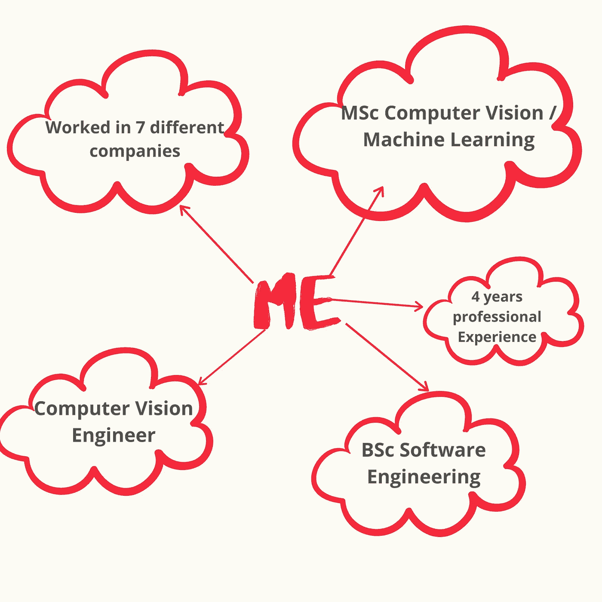

# 辅助项目在机器学习中的重要性

> 原文：<https://towardsdatascience.com/the-importance-of-side-projects-in-machine-learning-edf9836bc93a?source=collection_archive---------39----------------------->

米卡·鲍梅斯特在 [Unsplash](https://unsplash.com/s/photos/startup?utm_source=unsplash&utm_medium=referral&utm_content=creditCopyText) 上的照片

## 提示和建议

## 你和马克·扎克伯格有什么共同点？在这篇文章中，你会发现为什么副业是通向许多机会的大门。

有几个问题是机器学习从业者经常问的，他们希望提高他们的技能、职业生涯或知识。

一些常见问题大致如下:

*“我要怎么做才能学会深度学习？”*

*“我该怎么做才能得到一份数据科学或机器学习的工作？”*

*“怎么做才能让机器学习快速进步？”*

所有这些问题都有不同的答案，取决于你问谁。也就是说，有一个适用于所有问题的答案。

那就是:

## 辅助项目。

或者更准确地说，承担和完成附带项目。

这就是你所有问题的解决方案。那么，为什么还剩下文章的实质性内容呢？

嗯，写这篇文章是为了强调机器学习中辅助项目的重要性。

作为读者，我希望你能理解，从事适当的兼职项目会对你的个人生活和职业生涯产生多大的影响。

你会发现我列举的一些个人趣闻来说明本文中提到的建议和技巧的好处。如果我的叙述不能说服你，别担心，我还有更多锦囊妙计。

在我们更进一步之前，你为什么要听我说或者读这篇文章呢？

请允许我简单介绍一下我自己。

# 介绍

作者简介，作者图片

关于我的职业生涯，与本文相关的一点是，我所担任的大多数角色都比我的经验水平高出至少五年。

毕业不到一年，我已经成为一家初创公司的首席网站开发人员；我接受了为至少有 10 年工作经验的人提供的合同工作。现在，我在一家初创公司领导计算机视觉项目，这是我在理学硕士学习之外的第一个基于机器学习的角色。

我怎么能做到这一切？

很简单。

辅助项目。

## 现在我已经引起了你的注意，让我们进入这篇文章的主要内容。副业的重要性。

# 确保工作/技能发展

> 兼职项目可以帮助你获得下一份工作。

这不是新的建议，你可能已经听过这个建议了。

我实际上想说的是: ***副业可以帮助你获得一份比你现在的工作*** 需要更高技能和经验水平的工作。

但是，这部分的标题会太长。

我获得理学士学位后的第一个角色是一名毕业的前端开发人员。我用[PHP](https://www.php.net/)([laravel](https://laravel.com/))[BackboneJS](https://backbonejs.org/)和 [JavaScript](https://developer.mozilla.org/en-US/docs/Web/JavaScript) 做网页。在与 PHP 战斗了一整天之后，我回到家打开笔记本电脑，开始做一个附带的项目，这个项目使用了 NodeJS、Angular 和 MongoDB。

我的兼职项目没有直接增加我的工作知识，但我知道我想承担的下一个角色需要什么。

有了我下一个角色所需要的技能的信息，我从担任当前角色的第一天起就开始学习这些技能。

在我本科毕业后的第二份工作的面试中，我几乎没有提到我在实际工作中做了什么。主要的对话和提问都与我的副业项目有关。

当时对我的雇主更有吸引力的是，我能够找到学习一套新技能的动力，同时保持理智与 PHP 斗争。

我利用我的兼职项目为我的下一个角色做准备，直到我最近的角色是计算机视觉工程师。在我收到的所有三份工作邀请中，甚至是我被拒绝的[职位，我只谈了技能和从我的副业项目中学到的东西。](/rejected-from-my-first-data-science-interview-c9784dd65296)

## 行动

现在你怎么能把我的个人经验应用到你自己身上呢？

上网到任何一个工作网站，搜索你认为自己在未来 2-5 年内需要的职位。不要被这个角色的资历所影响。记下所需的技能和工具。

接下来，利用你理想角色所需的技能开始一个副业。大小不重要。开始吧。

以下是我目前如何使用这种方法。

我渴望在未来 2-5 年内成为一名首席机器学习工程师。通常，被考虑担任这一职位的人拥有广泛的专业知识，并有 10-15 年的工作经验。

但这一点也不会让我分心。

让我在下面与你分享我确保自己拥有正确技能和专业知识的方法。我用来生成下面页面的工具是[idea . so](https://www.notion.so/)。

为我的下一个角色跟踪我的个人技能和专业知识

上面的图片非常个人化，但这不正是我们都爱 Medium 的地方吗？该图描绘了我的技能跟踪器，其中包含的任务侧重于获取我期望的下一个角色所需的专业知识和技能。

我每周都回顾这个列表，并且每天都处理每个任务的内容。

请随意使用类似的结构。我想展示每个任务包含的内容，但也许在另一篇文章中，我可以详细介绍。

请考虑到我不是专家，我只是像你一样的初学者。

如果你同意或不同意下面的说法，请在这篇文章的评论区留下评论，我想知道你对此事的想法。

> 我看到很多人在科技行业犯的一个错误是，他们将经验与在一个职位上的年数联系起来。然而在现实中，有些人在几年内只有很少的经验，他们在发展一项技能上花费的时间比一般人在三年内花费的时间还要多。

你需要成为这些个体中的一员。副业是一条经过验证和测试的道路。

照片由[你好，我是尼克🎞](https://unsplash.com/@helloimnik?utm_source=unsplash&utm_medium=referral&utm_content=creditCopyText)开启[防溅](https://unsplash.com/s/photos/motivation?utm_source=unsplash&utm_medium=referral&utm_content=creditCopyText)

# 强化学习

> ***身边的项目可以辅助知识的保留***

说机器学习需要吸收前所未有的大量信息是一种保守的说法。

我们的工作包括不断学习，直到退休的那一天。

蒂莫·沃尔茨在 [Unsplash](https://unsplash.com/s/photos/knowledge?utm_source=unsplash&utm_medium=referral&utm_content=creditCopyText) 上拍摄的照片

就像我之前说的，我仍处于职业生涯的早期，尽管如此，我仍在努力记住几天前学到的知识。

稍有经验的人会告诉你，机器学习角色的成功并不明确取决于你能记住多少，而是取决于你找到并实施解决方案以满足特定要求的能力。

尽管如此，你需要一种知识保留的方法来保持你的思维敏捷，并拥有能够处理任何任务的心态，不管你是否熟悉。

再说一次，副业可以在这方面有所帮助。

在我的职责范围内，我广泛使用了 [TensorFlow 框架](https://www.tensorflow.org/)。我使用 TensorFlow 建立机器学习管道，每天训练和评估模型。然而，我仍然发现自己在参考 [StackOverflow](https://stackoverflow.com/) 或者文档来完成我已经做了很多次的任务。

这个问题的解决方案是显而易见的。你可能会告诉我保持理解和练习，直到它成为第二天性。你是对的。

这就是为什么我决定在我的兼职项目中扩展重复和练习我在角色中所学技能的过程。

我的想法很简单。如果我在工作时间和下班后使用 TensorFlow，我会花更多的时间一遍又一遍地重复这些过程，直到它们成为第二天性。

无论你想学哪种方法，对它有一个基本的理解也是至关重要的。

## 行动

找到流程中你未能理解的方面，并在下班后在你的副业项目中实践它们。

这种简单的技巧通过持续练习的原则来帮助记忆知识。

# 你自己的公司

> ***身边的项目可以是盛大的开始***

[马里奥·高](https://unsplash.com/@mariogogh?utm_source=unsplash&utm_medium=referral&utm_content=creditCopyText)在 [Unsplash](https://unsplash.com/s/photos/startup?utm_source=unsplash&utm_medium=referral&utm_content=creditCopyText) 上的照片

我们听说过有多少副业项目变成了价值数十亿美元的公司？

我们今天使用的大多数应用程序和工具都是副业的产品。

[脸书](https://www.facebook.com/)作为副业开始。

在这个包括马克·扎克伯格和陈慧娴在内的简短采访中，普里西拉称脸书只是马克的一个项目。她的原话是:

> “没有人会想到会发生这样的事…这是他的下一个项目”

嘿，我不是说你的下一个副业项目会变成一个十亿美元的公司。

我想说的是，人们愿意为解决重大问题的好产品赋予货币价值。你的副业可能是一项有价值的投资。

在我十八九岁和二十出头的时候，我经常参加聚会。我参加了太多的活动，我需要一个系统来推荐值得我花费时间的活动。因此，我开发了一个 web 应用程序，使用多个活动网站 API，并制定了一个比较算法，对活动地点、价格和参与者进行加权，以提供单个活动推荐。

这个副业项目并没有变成一个数十亿美元的公司。尽管如此，它确实变成了一家公司，我和我的兄弟为之工作了几年，并赢得了创业竞赛。

我想做的就是更有效率地开派对。

目前，我的下一个副业项目是围绕限制冠状病毒感染的机会。迫不及待地想分享这个。

## 行动

用副业解决生活中的痛点。

你有一项技能，使你能够创造工具，以创造性和想象力的方式解决人们生活中的问题。

看看你一天中的方方面面，找出三件可以通过机器学习解决方案变得更简单的事情。

然后实施这些解决方案，享受旅程。

没有人能预测明天，你的下一个副业可能会和《脸书》一样成功。

如果不是，你仍然可以获得大量的技能和经验。

# 在你走之前

丹尼尔·麦金尼斯在 [Unsplash](https://unsplash.com/s/photos/startup?utm_source=unsplash&utm_medium=referral&utm_content=creditCopyText) 上的照片

老实说，我只是在生活中尝试了很多事情，如果一些事情产生了积极的结果，我会付出更多的努力。

我鼓励你按照我在这篇文章中提到的一些行动去做。如果它们对你不起作用，那就继续前进，尝试一些有用的东西。

有几个话题我故意没有包括在本文中，这些话题也展示了机器学习中辅助项目的好处，例如:

*   ***额外收入***
*   ***打造个人品牌***
*   ***建设社区***

上面提到的省略的谈话要点，我没有丰富的经验。但是一旦我获得了宝贵的经验，我一定会分享。

别忘了开始一个兼职项目。

# 更多来自我

## 当我的文章发表时，你可以得到通知的一个方法是通过媒体跟踪我。

## 另一种方法是通过[注册我的每周时事通讯](https://richmond-alake.ck.page/c8e63294ee)，其中将包含文章和机器学习相关的内容。

 [## AI 里有黑人吗？

### 我们仍然是人工智能中代表最少的种族之一，然而我们可能会因为它的利用和滥用而遭受最大的痛苦。

towardsdatascience.com](/are-there-black-people-in-ai-fb6928166d73)  [## 6 个月的机器学习/计算机视觉工程师

### 在一个我几年前都没有涉足的领域呆上半年是什么感觉

towardsdatascience.com](/6-months-as-a-machine-learning-computer-vision-engineer-c05978592368)