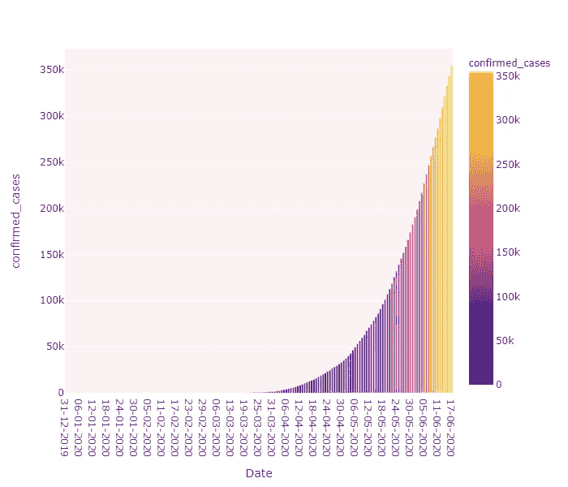
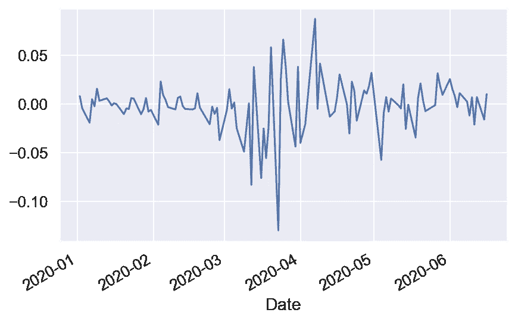
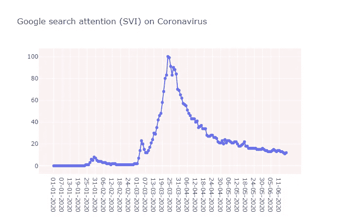
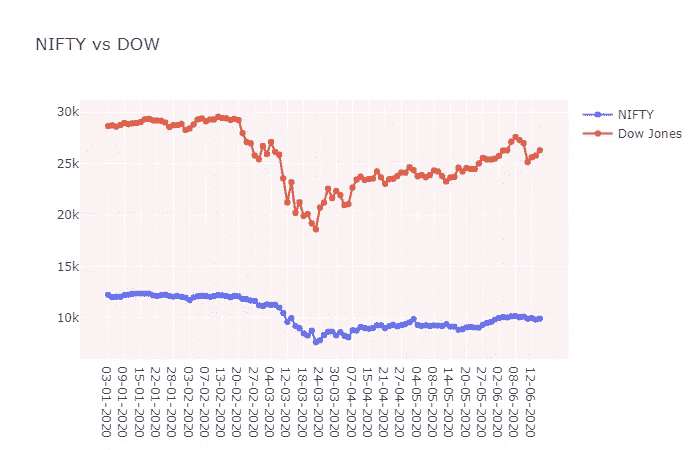
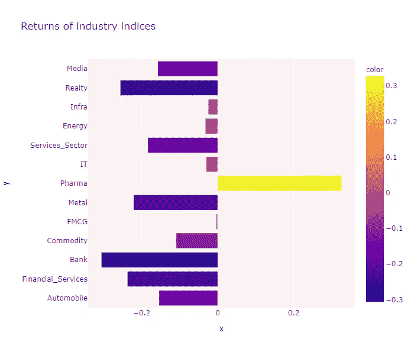

# 基于数据的印度股票市场对新冠肺炎的反应

> 原文：<https://towardsdatascience.com/the-indian-stock-market-reactions-to-covid-19-a-data-based-approach-843fe105a847?source=collection_archive---------46----------------------->

## NIFTY-50 价格变动和影响它的各种因素的分析。



作者图片

在本文中，我们将使用 python 对印度股市及其对 2019 年新型冠状病毒疾病(新冠肺炎)的反应进行一些数据分析。我们将试图了解一些因素的影响，如该国确诊病例的增加，搜索新冠肺炎的人的谷歌趋势分析，与 DJIA(道琼斯工业平均指数)的相关性等。理解新冠肺炎出现等事件后果的一个有效方法是考虑资产价格的变化。这些价格变化反映了当前的预期。实际上，资产市场提供了关于未来预期结果的持续的、高风险的调查。

首先，我们将从导入分析所需的库和数据集开始。所有使用的数据可在 [NSE 网站](https://www1.nseindia.com/products/content/equities/indices/historical_index_data.htm)上获得

```
import pandas as pd
import plotly.graph_objects as go
import matplotlib.pyplot as plt
%matplotlib inline
nifty_price = pd.read_csv('nifty.csv',header=0,index_col=0,parse_dates=True)
nifty_price.head()
```

我们有兴趣分析 NIFTY 指数在过去 6 个月(从 2020 年 1 月 1 日起)的累计回报。我们将使用数据框架的“调整收盘”栏来计算回报。函数 ***pct_change()*** 将给出 NIFTY-50 指数收盘价的每日百分比变化。

```
 nift_price=nifty_price[['Adj Close']]
nift_price['returns'] = nift_price['Adj Close'].pct_change()
nift_price = nift_price.dropna()
nift_price['returns'].plot()
```



漂亮的每日回报

我们可以清楚地观察到，市场在三月份波动最大，损失也最大。三月份的累计回报率为-0.263，一个月内损失了 26.3%。

```
returns_sec = nift_price['2020-03-01':'2020-04-01']['returns']
(returns_sec+1).prod()-1
```

现在，我们将计算一个非常流行的衡量风险的方法，称为最大提取，它给出了如果你不幸在资产的最高点买入，在最低点卖出，你可能经历的最大损失。这基本上是你能经历的最差的回报。提款是衡量最大下行风险的指标。为了计算提款，我们首先计算财富指数和所有时间点的先前峰值(即自开始以来经历的最高值)。

```
wealth_index = 1000*(1+nift_price['returns']).cumprod()
previous_peaks = wealth_index.cummax()
drawdown = (wealth_index-previous_peaks)/previous_peaks
drawdown.plot()
```

`drawdown.min()`将给出考虑期间发生的最大提款，而`drawdown.idxmin()`给出最大损失发生时的时间戳。我们发现，2020 年 3 月 23 日观察到的最大下降幅度为-38.44%。这是 3 月 22 日 Janata 宵禁后的第二个交易日。

有一点很清楚，在确诊的冠状病毒病例数和漂亮的价格/回报之间没有太多可观察到的相关性。然而，分析谷歌在印度(新冠肺炎)的搜索趋势结果可以得出一个重要的结论:公众情绪对市场价格和波动性的影响最大。应对疫情的市场情绪可以通过社交媒体迅速放大，然后刺激贸易活动并导致极端的价格波动。股票市场基本上为我们提供了投资者对未来的预期。谷歌搜索趋势数据可以从[这里](https://trends.google.com/trends/?geo=US)下载，也可以从我的 [Github 库](https://github.com/gowrijp/Indian-market-impact-of-COVID-19)的 datasets 文件夹下载。

```
google_trends = pd.read_csv('google_trends.csv',header=0,index_col=0)
google_trends.rename(columns = {'india coronavirus: (India)':'Search_Intensity'}, inplace=True)
google_trends['Search_Intensity']= google_trends['Search_Intensity'].replace('<1', '0') 
google_trends['Search_Intensity'] = google_trends['Search_Intensity'].astype(int)#March 1st to April 1st correlation
column_1 = nift_price['2020-03':'2020-04']['Adj Close']
column_2 = google_trends["01-03-2020":"01-04-2020"]['Search_Intensity']
correlation = column_1.corr(column_2)
```

在印度，关于冠状病毒的谷歌搜索强度在 3 月份大幅增加，在 3 月份的最后一周(2020 年 3 月 23 日至 24 日)达到峰值。在 4 月初的中期高峰之后，价格有所回落。在此期间(3 月至 4 月)，可以看到谷歌搜索强度因子与 NIFTY 指数高度负相关，相关系数为-0.685。此外，从 2020 年 3 月 1 日到 2020 年 6 月 15 日的总体相关性为-0.52。由此，我们可以看出，搜索查询数据与分析关于疫情的公众情绪及其对金融市场的影响相关。



另一个重要的，虽然预期的相关性，我们可以找到的是道琼斯工业平均指数(DJIA)和 NIFTY 价格之间的关系。道琼斯工业平均指数(DJIA)是一个股票市场指数，跟踪在纽约证券交易所( [NYSE](https://www.investopedia.com/terms/n/nyse.asp) )和纳斯达克交易的 30 家大型上市蓝筹股公司。该数据集可以从雅虎财经网站获得。

```
dow=pd.read_csv('dow.csv')
dow = dow.drop(['Open', 'High','Low','Close','Volume'], axis=1)
dow['Date'] = pd.to_datetime(dow['Date']).dt.strftime('%d-%m-%Y')
dow.rename(columns = {'Adj Close':'Dow_Jones'}, inplace=True)
dow.head()
```

在 2020 年 1 月 1 日至 6 月 17 日期间，两个市场指数之间的相关性似乎非常高，为 0.93。



# 按行业划分的股票回报率

我们可以清楚地看到，这一时期唯一累积收益为正的行业是医药行业。Nifty Pharma 指数在 2020 年 4 月的回报率为 22.6%，而 Nifty50 指数仅上涨了 6%。由于该部门相对抗新冠肺炎的破坏，可以观察到一个积极的立场对印度医药股。

从下图(2020 年 1 月 1 日至 2020 年 6 月 17 日各行业指数的累计收益)中，我们可以清楚地看到，银行业、金融服务、房地产、零售和汽车处于受影响最严重的行业的前列。在连锁企业延伸到多个受疫情袭击的国家的公司中，股价跌幅更大，因为这影响到更多的国际供应网络，而不仅仅是当地供应。



结果表明，市场很快开始对新冠肺炎可能的经济后果做出反应。我们在 3 月份观察到一些大的价格波动，当时投资者开始担心新冠肺炎冲击可能通过金融渠道放大。股票价格反映了市场参与者对未来经济后果的预期。此外，我们可以看到，谷歌新冠肺炎趋势指标和市场波动之间存在直接的因果关系。越来越多的人开始寻找与疫情有关的后果，由此引发的焦虑对市场回报产生了负面影响。

就是这样！我们已经到了文章的结尾。完整的代码可以在我的 Github 库[这里](https://github.com/gowrijp/Indian-market-impact-of-COVID-19/blob/master/corona_stock_project.ipynb)找到。欢迎留下任何建议、问题或评论！