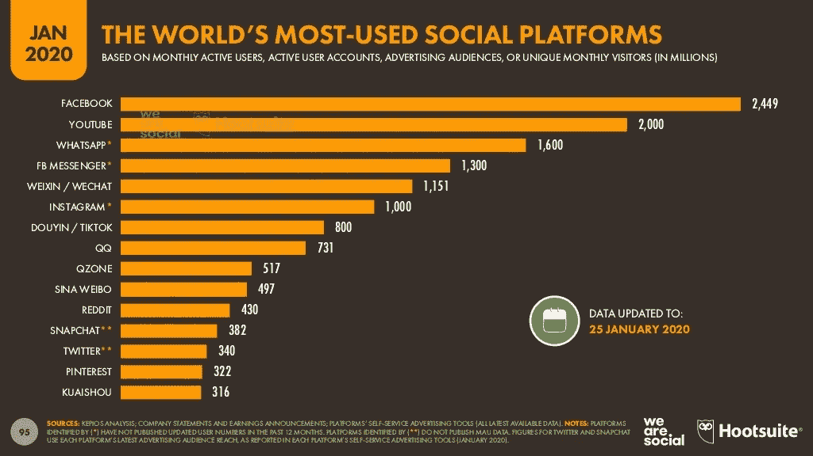
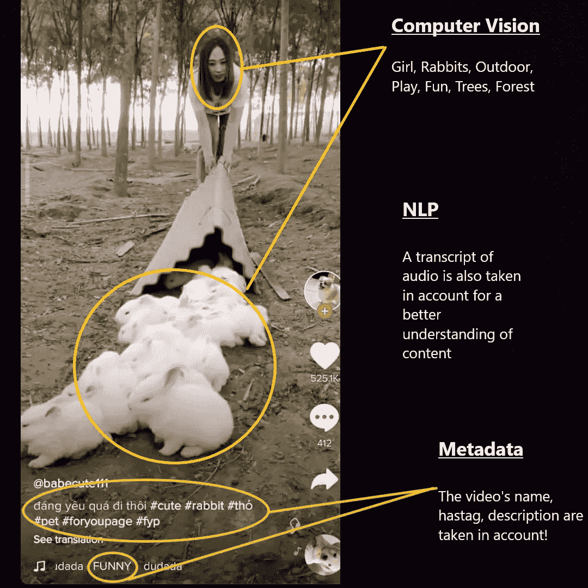
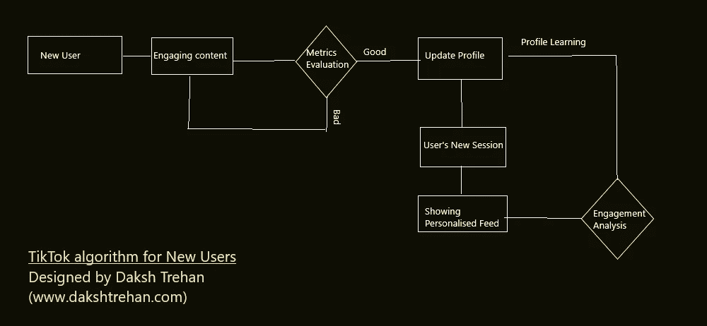
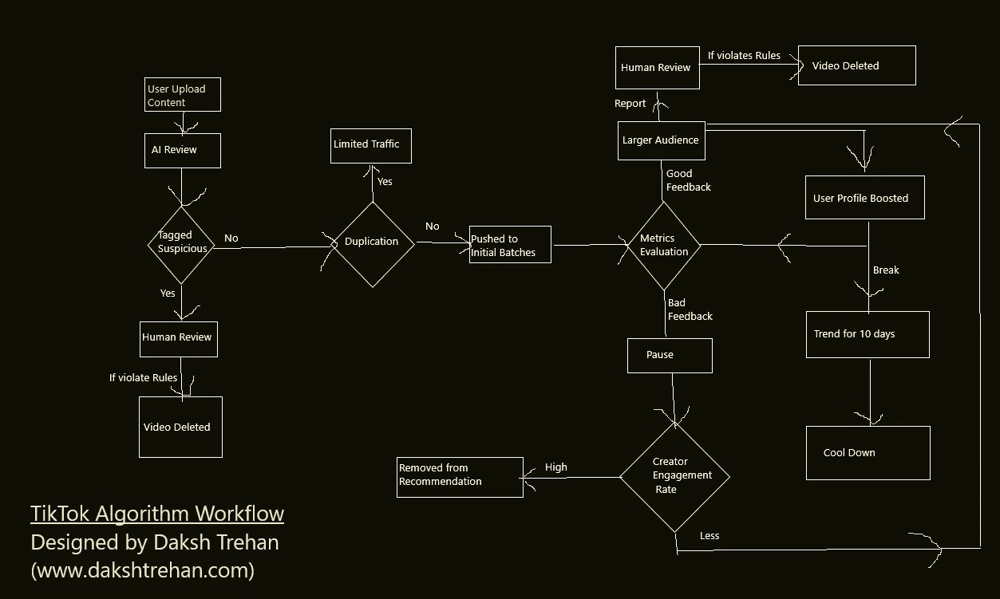

# 无法逃脱的人工智能算法:抖音

> 原文：<https://towardsdatascience.com/the-inescapable-ai-algorithm-tiktok-ad4c6fd981b8?source=collection_archive---------6----------------------->

## 机器学习、创业、数据科学

## 描述一个抖音用来吸引用户的渐进式推荐系统！

从 Tka4enko 通过[运球](https://dribbble.com/shots/10519604-TikTok-logo)

> 如果你没有关注抖音，那你就根本没有关注。

*内容表:-*

1.  *什么是抖音？*
2.  *是什么让抖音有别于其他社交媒体平台？*
3.  *几种理论*
4.  *可能的抖音推荐系统*

# 什么是抖音？

**抖音**是最受欢迎和最有趣的社交媒体应用之一。除了对口型，它还迎合短舞蹈，喜剧和才艺视频。一个更接近的类比是 **Vine** ，Twitter 仍然非常怀念的短格式视频应用，其内容作为 YouTube 的汇编而存在。

**抖音**归**字节跳动**所有，这是一家成立于 2012 年的科技公司。**字节跳动**首先为中国市场推出**豆饮**，然后逐渐向中国以外的市场推出。字节跳动拥有两个社交媒体平台:-中国的抖音(多音)(受到他们协议的审查)，以及世界其他地方的抖音。后来，抖音与 Musical.ly 合并，该公司发展迅速，成为 2018 年第三季度美国下载量最高的应用之一。

字节跳动是世界上最成功的创业公司，在私人市场的估值为 1000 亿美元。关键可以被视为人工智能，该公司使用强大的人工智能工具，这些工具比西方的任何竞争对手都更极端。它还开发了一个人工智能工具，可以阅读 5000 个来源的新闻，并可以在 2 秒内生成一篇 400 字的定制文章。该公司牢牢控制着人工智能，并具有取代其他社交媒体平台的巨大潜力。

# 是什么让抖音有别于其他社交媒体平台？

从苏珊·沃西基到马克·扎克伯格，所有人都表达了对抖音近年来抢夺市场的担忧，并为它在用户中取得的成功而疯狂，从老人到青少年。

但这只是抖音空前成功的一部分原因。在不到两年的时间里，它从一个小粉丝群中的“唇同步”功能变成了 2020 年的一个病毒式功能，每月活跃用户近 8 亿。在如此短的时间内，它可以与市场上超过 10 年的老牌社交媒体平台相媲美！

抖音每月活跃用户。来源:[我们的社会](https://wearesocial.com/blog/2020/01/digital-2020-3-8-billion-people-use-social-media)

说到数字，抖音在全球拥有超过 8 亿活跃用户，使抖音在社交网站方面排名第七，领先于 Twitter、Pinterest 和 Snapchat 等知名平台。

与对手相比，Instagram 用了 6 年时间，脸书用了近 4 年时间才达到抖音在不到 3 年的时间里达到的月活跃用户数量。

抖音是 2020 年 5 月美国下载量最多的应用。(来源:[感应塔](https://sensortower.com/blog/top-apps-worldwide-may-2020-downloads))

[《抖音》](https://sensortower.com/ios/us/tiktok-inc/app/tiktok-make-your-day/835599320/overview)是 2020 年 5 月全球下载量最大的应用(非游戏)，下载量超过 1.119 亿次，其中包括中国的斗印，同比增长 2 倍。

## 回到这个问题，是什么让它独一无二？

它使用一个先进的循环推荐系统，不像网飞和 YouTube 这样的老派娱乐平台，它不会向你推荐视频，而是指示你看什么？

正如中国著名投资家**康妮·陈**所说:

**“抖音是第一款以人工智能为产品的主流消费应用。这代表了更广泛的转变。”**

与 Instagram 和 YouTube 相反，你不需要一个单一的观点或追随者就可以病毒式传播。它使用人工智能驱动的饲料，其工作原理是“*你用得越多，它就越了解你”。*

它严重依赖用户的个人信息(位置、特征、特质、互联网搜索)来使提要更加个性化，因此经常成为信息泄露和滥用争议的一部分。

任何社交媒体平台的基本目标都是让用户参与进来，令人惊讶的是，抖音可以让新用户平均参与 10 分钟，这是 Instagram 的三倍。

它降低了进入门槛，甚至不需要你注册，一旦你安装了应用程序，它就开始跟踪你，并根据这些因素向你推荐视频。

举例来说，如果你是一个应用新手，抖音给你看了一个视频，而你没有看完整个视频，你得到的这类视频的推荐会更少，反之亦然。

此外，它允许你展示你的才华，不像其他社交媒体巨头那样提升地位而非才华；任何人都可以成为抖音的创造者，这就是 USP！

# 几种理论

关于算法没有太多的透明度，但是仍然有一些基于用户经验和专家分析的理论。

## 批处理理论:

据此，当视频被上传时，它被显示给具有不同意识形态的一批人，或者用简单的话来说，基于诸如他们的观看历史、位置、个人偏好等几个区别因素。你的内容的命运是基于那些不同的批次；重新观看，喜欢，分享和评论，这些都是算法用来提升你的内容分数的小输入。

如果你的内容被批量用户所喜欢，那么它就会被推向更多具有相同思维过程的观众，从而使它成为病毒！

根据这个理论，你可能需要几天时间才能成为名人。

额外的一点是:-你越多地参与趋势挑战，它就越能提升你。

## 权威排名:

根据这一原则，你能否走红取决于你最初的几个视频。如果这些获得了一些观点和喜欢，那么它为你作为创作者搭建了一个舞台，你唯一的工作将是尽可能多地与观众互动。

一旦你获得了权威排名，你将会成为众人瞩目的焦点，并且会比新手用户高出一些水平，尽管你仍然是个新手。

## 延迟动量:

遵循这个原则，一些用户建议不要删除任何内容，不管它有多垃圾！

一些用户已经体验到，如果他们的内容没有什么好处，他们在平台上开始变得不那么活跃，平台会在一段时间后试图自己增加他们的内容，从而鼓励他们为观众创造更多内容。

# 可能的抖音推荐系统

抖音算法没有确定的工作流程，但基于该公司发布的数据和书呆子发现的踪迹。我下定了随之而来的决心。

## 抖音算法是如何为内容创作者工作的？

一旦视频被上传到抖音，高性能的人工智能算法就会使用自然语言处理和计算机视觉来分析视频。

[来源](https://www.kapwing.com/resources/we-tested-the-five-best-tiktok-algorithm-theories/)

它将分析你的视频的每一部分，包括音频、字幕和元数据(标签)，以建立对视频内容和背景的理解。

> “人工智能为字节跳动的所有内容平台提供动力，”这位发言人说。“我们制造智能机器，能够使用自然语言处理和计算机视觉技术理解和分析文本、图像和视频。这使我们能够为用户提供他们最感兴趣的内容，并使创作者能够向全球观众分享日常生活中的重要时刻。”

抖音如何使用人工智能分析内容，由 Daksh Trehan 创建，版权所有

在对其规则和法规进行检查后，内容将被推送给一小批观众，并根据样本用户对该内容的反应进行评估。每个被跟踪的指标都有一个可能的关联分数。

> ***【复看率】*** *= 10 分* ***完成率*** *= 8 分* ***股份*** *= 6 分* ***评论*** *= 4 分* ***点赞*** *= 2 分*

但一遍又一遍地循环播放你的视频不会让你病毒式传播，因为这种算法可以区分冗余条目。

一旦你的内容的综合得分不错，它会把你的内容推向更多有着相同想法和教条的观众。

内容创作者的抖音工作流程，由 Daksh Trehan 设计，版权所有

如果你的内容没有像病毒一样传播，不要沮丧，因为循环并没有结束，只是暂停了一下，根据延迟动量理论，一旦你开始在应用程序上留下更短的足迹，它可能会回滚。

这是一个连锁反应，将继续下去，吸引更多的内容创作者，从而吸引更多的观众。这是这个平台的精髓，可以长期吸引用户。

## 作为用户，抖音是如何了解你的？

如前所述，抖音通过不强迫用户注册来降低准入门槛。相反，应用程序开始尽可能多地了解你。你观看的第一系列视频有助于它决定你的口味。

首要任务是让你尽可能长时间地呆在应用程序中。它只会向你展示更广泛的观众喜欢的视频，从而尽量降低你的退出率。

一旦你进入他们的生态系统，他们会跟踪你的每一项指标，并为你的个人资料创建每一个流派的分数。

每次你重新观看一个视频或看完整个视频，算法都会为你的个人资料推荐更多类似类型的视频。以下是详细的可能度量系统:

> **= 10 分* ***完成率*** *= 8 分* ***份额*** *= 6 分* ***评论*** *= 4 分* ***点赞****

****

**新用户的抖音工作流程，由 Daksh Trehan 设计，版权所有**

**除了您的度量数据，它还会收集您的个人信息，如您的位置、您的互联网历史、您的年龄，以创建更准确的个性化订阅源，从而尽可能长时间地将您留在他们的生态系统中。**

> **这种算法的奇妙之处在于，它可以通过其卓越的内容推荐系统吸引来自世界各地不同年龄组的用户！**

## **简而言之，推荐工作流程**

****

**抖音算法可能的工作流程，由 Daksh Trehan 设计，版权所有**

**在抖音，每天有数百万的用户上传内容。手动监控每个内容实际上是不可能的，因此审查由机器完成，如果内容被标记为对公司的协议不敏感，它将被传递给人工审查。**

**通过人工审查后，检查内容是否重复，通过该阶段后，将内容传递给一小批用户进行初步反馈；基于度量系统对内容进行评分，评分决定内容的命运；如果分数高于某个阈值，那么内容将被推向更广泛的受众，但在一周左右的时间内会冷却下来，以保持其用户体验新的内容。**

**但是，如果反馈很低，循环不会就此停止，而是暂停，应用程序观察用户的行为及其活跃时间，如果它经历了高退出率，那么循环将再次变得活跃，并增加内容，从而鼓励创作者在平台上创作更多和参与更多。**

**这种循环是主要原因，它让它的用户着迷，因为它不会让用户感到无聊，如果你是用户，它会不断命令你并向你推荐高度个性化的内容，如果你是创作者，它会试图分散你的一些注意力，从而保持你的士气高昂，并鼓励你创造更多！**

****如果你喜欢这篇文章，请考虑订阅我的简讯:** [**达克什·特雷汉每周简讯**](https://mailchi.mp/b535943b5fff/daksh-trehan-weekly-newsletter) **。****

# **结论**

**希望这篇文章已经告诉你抖音是如何使用人工智能的，以及它的推荐工作流程如何以低退出率吸引用户更长时间。**

**一如既往，非常感谢您的阅读，如果您觉得这篇文章有用，请分享！:)**

# **参考资料:**

**[1] [逆向工程抖音算法如何工作](https://www.veed.io/grow/reverse-engineering-how-tiktok-algorithm-works/)**

**为什么抖音让它的用户如此痴迷？让你上瘾的人工智能算法。**

**[3] [我们测试了五种最好的抖音算法理论，看看哪一种有效](https://www.kapwing.com/resources/we-tested-the-five-best-tiktok-algorithm-theories/)**

**【4】[是时候认真关注抖音了](https://techcrunch.com/2019/01/29/its-time-to-pay-serious-attention-to-tiktok/)**

**[5][2020 年你需要知道的 10 个抖音统计](https://www.oberlo.com/blog/tiktok-statistics)**

**[6][2020 年 5 月全球热门应用下载量](https://sensortower.com/blog/top-apps-worldwide-may-2020-downloads)**

****随意连接:****

> ***加入我在*[*www.dakshtrehan.com*](http://www.dakshtrehan.com/)**
> 
> ***LinkedIN ~*[*https://www.linkedin.com/in/dakshtrehan/*](http://linkedin.com/in/dakshtrehan)**
> 
> ***insta gram ~*[【https://www.instagram.com/_daksh_trehan_/】T21](http://www.instagram.com/_daksh_trehan_/)**
> 
> ***Github ~*[https://github.com/dakshtrehan](http://github.com/dakshtrehan)**

**查看我的其他文章:-**

** [## 为什么你要为乔治·弗洛伊德的谋杀和德里社区骚乱负责！！

### 一个 ML 爱好者改变世界的方法。

medium.com](https://medium.com/@dakshtrehan/why-are-you-responsible-for-george-floyds-murder-delhi-communal-riots-4c1edb7acbc5)  [## 使用深度学习检测新冠肺炎

### 一个实用的方法来帮助医生帮助我们对抗新冠肺炎

towardsdatascience.com](/detecting-covid-19-using-deep-learning-262956b6f981)  [## 解释激活功能

### 阶跃，Sigmoid，双曲正切，Softmax，ReLU，Leaky ReLU 解释

medium.com](https://medium.com/analytics-vidhya/activation-functions-explained-8690ea7bdec9)  [## 解释参数优化

### 梯度下降的简要描述指南，ADAM，ADAGRAD，RMSProp

towardsdatascience.com](/parameters-optimization-explained-876561853de0)  [## 梯度下降解释

### 梯度下降综合指南

towardsdatascience.com](/gradient-descent-explained-9b953fc0d2c)  [## 逻辑回归解释

### 尽可能简单地解释逻辑回归。

towardsdatascience.com](/logistic-regression-explained-ef1d816ea85a)  [## 线性回归解释

### 尽可能简单地解释线性回归。

medium.com](https://medium.com/towards-artificial-intelligence/linear-regression-explained-f5cc85ae2c5c)  [## 确定最适合您的 ML 模型。

### 以最简单的方式教授过度拟合与欠拟合以及完美拟合。

medium.com](https://medium.com/datadriveninvestor/determining-perfect-fit-for-your-ml-model-339459eef670)  [## 将机器学习技术与现实生活联系起来。

### 尽可能简单地解释 ML 模型的类型。

levelup.gitconnected.com](https://levelup.gitconnected.com/relating-machine-learning-techniques-to-real-life-4dafd626fdff)  [## 为新手提供数据科学服务

### 所以，上周我的团队负责人让我面试一些可能加入团队的实习生，了解数据的作用…

medium.com](https://medium.com/towards-artificial-intelligence/serving-data-science-to-a-rookie-b03af9ea99a2) 

> 干杯！**