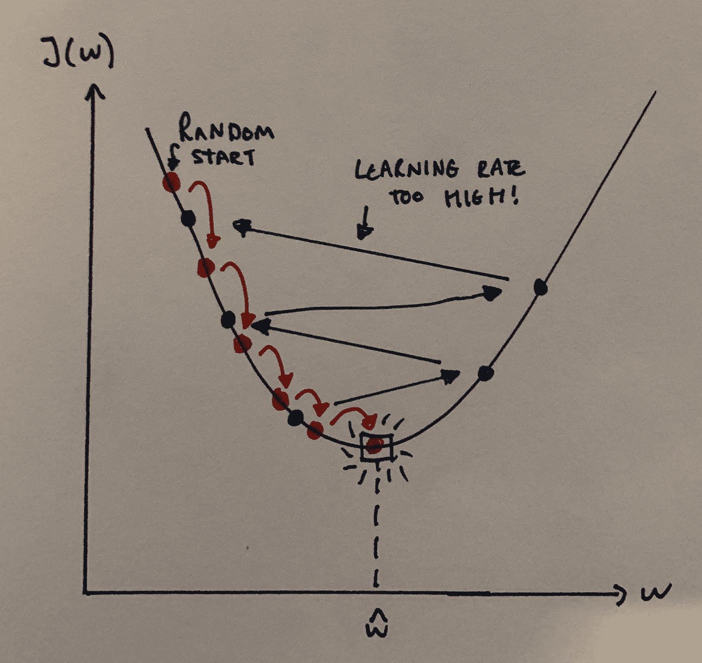
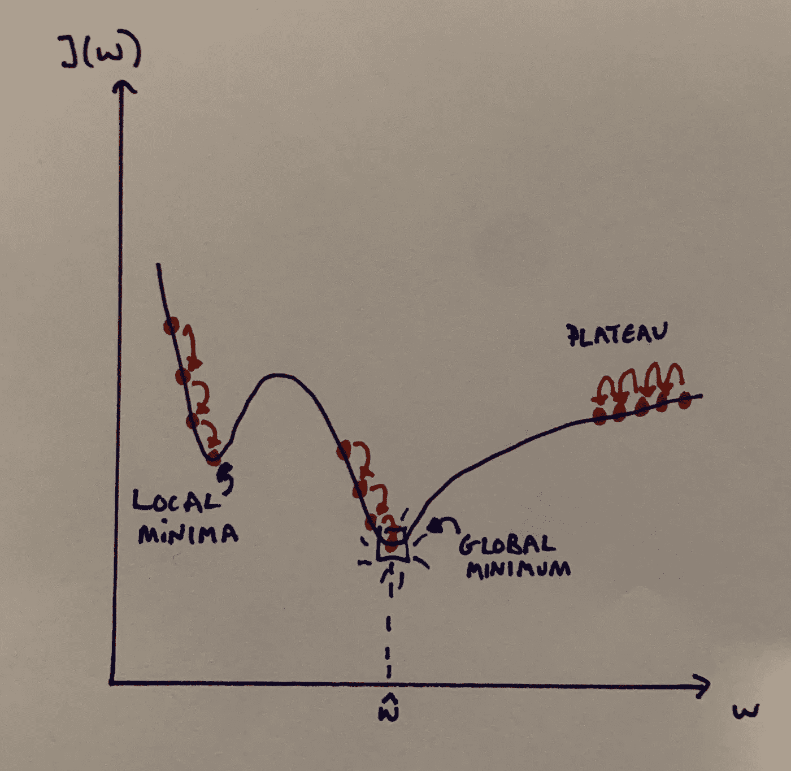
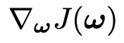
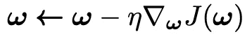
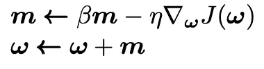
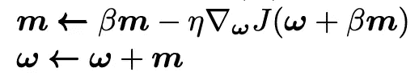
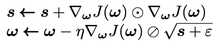
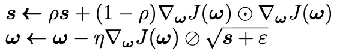
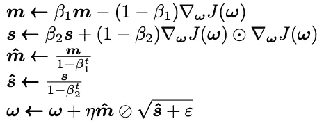

# 梯度下降的来龙去脉

> 原文：<https://towardsdatascience.com/the-ins-and-outs-of-gradient-descent-1cf23dc90f83?source=collection_archive---------45----------------------->

## 优化您对优化器的选择


查德·特兹拉夫在 [Unsplash](https://unsplash.com?utm_source=medium&utm_medium=referral) 上的照片

**梯度下降**是一种优化算法，用于通过在**最陡下降**的方向上迭代移动来最小化一些成本函数。也就是说，在具有最大负梯度的方向上移动。在机器学习中，我们使用梯度下降来不断调整模型中的参数，以最小化成本函数。我们从模型参数的一些值(神经网络中的权重和偏差)开始，并慢慢地改进它们。在这篇博文中，我们将从探索经典机器学习中常用的一些基本优化器开始，然后转向神经网络和深度学习中使用的一些更流行的算法。

想象一下，你正在山里跑步(或散步，随便什么能让你开心的事)，突然一股浓雾遮住了你的视线。下山的一个好策略是从各个方向感受地面，并向地面下降最快的方向迈一步。重复这个过程，你应该会到达山的底部(尽管你也可能会到达一些看起来不像底部的地方——稍后会详细介绍)。这正是梯度下降所做的:它测量代价函数*J(****ω****)(*由模型参数 ***ω*** 参数化)的局部梯度，并向梯度下降的方向移动。一旦我们达到零梯度，我们就达到了最小值。

假设现在山的陡度对你来说不是很明显(也许你太冷了，感觉不到你的脚，发挥你的想象力！)，所以你得用手机的加速度计来测量梯度。外面真的很冷，所以要检查你的手机，你必须停止跑步，脱下手套。因此，如果你想尽快把手机关机，你需要尽量少用手机！因此，你需要选择正确的频率来测量山坡的倾斜度，这样才不会偏离轨道，同时在日落前到家。两次检查之间的时间就是所谓的**学习率**，也就是我们走下坡路的步数。如果我们的学习率太小，那么算法就需要很长时间才能收敛。但是，如果我们的学习率太高，算法可能会发散，并刚刚超过最小值。



作者图片:不同学习率下梯度下降的描述

需要注意的重要一点是，并非所有的成本函数都是凸的(然而，线性回归的 MSE 成本函数是凸的)。如果函数图上任意两点之间的线段位于两点之间的图的上方，则该函数是凸的。凸性是好的，因为它意味着有一个单一的全局最小值。当成本函数不是凸的时，问题就开始出现了:可能有脊、平台、洞等等。这使得收敛到最小值变得困难。幸运的是，有一些技术可以帮助我们解决这些问题。



作者图片:描述梯度下降可能出现的问题

## 批量梯度下降

梯度下降世界的香草。在批量梯度下降中，我们在每个梯度步骤使用完整的训练集 ***X*** 。因此，当使用大型训练集时，速度会非常慢。

我们从寻找成本函数的梯度向量开始，我们将其表示为



这里，*j(****ω****)*是由模型参数 ***ω*** 参数化的代价函数，∇表示向量微分算子。现在我们有了梯度向量，我们只需要它往相反的方向(下坡)。然后，乘以学习速率η，我们得到一步梯度下降更新方程:



用 python 实现批量梯度下降再简单不过了！

```
import numpy as np 
eta = 0.01 # our chosen learning rate 
iterations = 10^3
n = 100theta = np.random.randn(d,1) # random initialization, with d being 
# the dimension of thetafor i in range(iterations):
    gradients = 2/n * X.T.dot(X.dot(theta) - y)
    theta = theta - eta * gradients
```

如果我们愿意，我们可以使用网格搜索来找到一个好的学习率。为了找到正确的迭代次数，通常将迭代次数设置为非常大的数就足够了，但是当梯度向量(`gradients`)变得小于某个预设容差(通常表示为ϵ).)时，中断算法这是因为当梯度向量变小时，我们非常接近最小值。

另一个重要注意事项是，当使用梯度下降时，您应该确保所有要素都具有相似的比例，否则，算法将需要更长的时间才能收敛-Sckikit-Learn 的标准缩放器通常可以做到这一点。但是，我们可以做些什么来加速我们的优化程序呢？进入随机梯度下降。

## 随机梯度下降

随机 GD 采用与批处理 GD 相反的极端，而不是在每一步使用整个训练集，它在每一步采用训练集的随机实例，并使用它来计算梯度。这显然要比批量 GD 快得多，尤其是在使用巨大的训练集时。然而，缺点是，由于其随机行为，该算法不太规则:它只是平均减少，而不是在每一步逐渐减少。因此，我们的最终参数值将是好的，但不是最佳的(不同于批量梯度下降)，因为一旦我们接近最小值，算法将继续反弹。

虽然这听起来不太理想，但它确实有帮助！例如，如果成本函数非常不规则(并且不是凸的),则随机性可以帮助跳出局部最小值。所以实际上，随机 GD 比普通的批量 GD 更有机会找到全局最小值。

当我们接近最小值时，我们实际上也可以做一些事情来帮助处理缺乏收敛性:逐渐降低学习率。我们可以从(相对)大的步长开始，这有助于更快地收敛到最小值，也有助于跳出局部最小值。然后，我们可以逐渐降低学习率，这使得算法可以稳定在全局最小值。这个过程被称为**学习计划**。学习进度计划是一个非常可爱的技术，也许将来我会给它一个自己的博客。

下面的代码实现了随机梯度下降以及一个(简单的)学习计划:

```
epochs = 50
t0, t1 = 1, 10 # Learning schedule hyperparams
n = 100def learning_schedule(t):
    return t0/(t + t1)theta = np.random.randn(d,1) # random initialization, with d being 
# the dimension of thetafor epoch in range(epochs):
    for i in range(n):
        rand_idx = np.random.randint(n)
        xi = X[rand_idx:rand_idx+d]
        yi = y[rand_idx:rand_idx+d]
        gradients = 2 * xi.T.dot(xi.dot(theta) - yi)
        eta = learning_schedule(epoch * n + i)
        theta = theta - eta * gradients 
```

这里我们迭代了几轮 *n* 次迭代，每一轮被称为一个*时期*。

另外值得一提的是另一种方法，**小批量梯度下降**。简单地说，它只是批处理和随机 GD 方法的结合:在每一步，小批处理 GD 计算训练实例的一个小的随机子集上的梯度(一个*小批处理*)。这具有比随机 GD 更少不稳定的优点；然而，它更有可能陷入局部最小值。

到目前为止，我们已经讨论了更经典的 GD 算法，这些算法在训练更经典的 ML 模型(例如，支持向量机、随机森林等)时表现出令人满意的水平。但是，使用这些方法来训练大型深度自然网络可能会慢得令人麻木。更快的优化程序可以在训练中为我们提供额外的速度提升。下面将讨论一些最流行的算法。

## 动量优化

动量优化不是仅使用当前步骤的损失函数的梯度来引导搜索，而是使用动量的概念并累积先前的梯度来帮助确定前进的方向。回想一下我们之前的类比:想象你现在骑着一辆自行车，你正在下山，你开始会很慢，但你会逐渐开始获得越来越多的动量，直到你达到最终速度。这正是动量算法所做的。另一种思考方式是，梯度向量现在用于加速度，而不是速度。因此，我们的模型参数的更新方程由下式给出:



在每次迭代中，我们从动量向量*中减去局部梯度(乘以η)，然后通过添加动量向量来更新权重*。除了总体上收敛得更快之外，动量还有助于算法更快地脱离平稳状态，并滚过局部最小值。超参数β是系统中的摩擦量，β越高，终端速度越慢。**

## **内斯特罗夫加速梯度**

**只要对动量算法稍加调整，我们几乎总能获得更快的收敛。NAG 方法在局部位置 ***ω*** 稍前测量成本函数的梯度。单步更新由下式给出**

****

**这样做的原因很简单:一般来说，动量向量指向最小值，所以在那个方向上测量稍微远一点的梯度会有帮助。这些微小的速度提升累积起来，最终 NAG 算法的速度明显加快。在 Keras 中实现这一点非常简单，我们只需输入:**

```
**optimizer = keras.optimizers.SGD(lr=0.001, momentum=0.9, nesterov=True)**
```

## **RMSProp**

**RMSProp 算法是由 Geoffrey Hinton 和 Tijmen Tieleman 在 2012 年提出的 **AdaGrad** 算法的修改版本(从数学角度来说，这是最近的事了！).想象一个场景，其中成本函数看起来像一个细长的碗，GD 算法将开始沿着最陡的斜率下降，但是这个斜率并不直接指向全局最小值。AdaGrad 算法为我们提供了一个修正，因此该算法确实向全局最小值移动。这是通过沿着最陡的维度按比例缩小梯度向量来实现的。另一种思考方式是，我们在更陡峭的维度上衰减学习速率更快，在斜率更平缓的维度上衰减学习速率更慢。理解其工作原理的最简单方法是亲自动手操作单步更新方程:**

****

**这里，𝇇表示元素间的乘法。因此，s 的每个元素由下式给出**

****

**所以如果代价函数*J(****ω****)*在第*I*-维中是陡峭的，那么 ***s*** 将会随着我们的迭代而累积并变得越来越大。这里的第二步实际上与通常的梯度下降更新相同，除了我们相对于 **s** 缩小梯度向量。⊘代表元素式划分，因此梯度向量的每个元素越大，我们在该方向上采取的步骤就越小。 *ε* 项是一个非常小的平滑项(例如 *ε = 1e-10* )，它只是为了避免被零除(我曾经被零除，流了鼻血，这是魔鬼的工作)。**

**然而，AdaGrad 的问题是，在训练神经网络时，它通常会过早停止。这是因为学习率下降太多。RMSProp 做了一个简单的调整。相反，我们指数衰减最近迭代中累积的梯度。**

****

**尽管我们已经引入了一个新的超参数来进行调整( *ρ* )，但是值 *ρ = 0.9* 通常可以达到这个目的。现在您可能已经猜到，在 Keras 中实现 RMSProp 非常容易:**

```
**optimizer = keras.optimizers.RMSprop(lr=0.001, rho=0.9)**
```

**我想现在是时候谈谈优化大师了。**

## **亚当和那达慕优化**

**自适应矩估计(Adam)结合了我们已经研究过的两种方法:动量和 RMSProp 优化。它从动量优化中窃取了跟踪先前梯度的指数衰减平均值的思想，并且从 RMSProp 中窃取了跟踪过去平方梯度的指数衰减平均值的思想。**

****

**这里， *t* 是迭代次数(从 1 开始)。第一个、第二个和第五个方程几乎与动量和 RMSProp 优化算法相同，不同之处在于超参数。第三个和第四个等式只是为了在算法开始时提升 ***m*** 和 ***s*** 而存在，因为最初，它们偏向 0。与 Keras 中的所有东西一样，Adam 非常容易实现(下面也给出了超参数的默认值)。**

```
**optimizer = keras.optimizers.Adam(lr=0.001, beta_1=0.9, beta_2=0.999)**
```

****Nadam** 算法与 adam 算法相同，但它也包括内斯特罗夫技巧，这意味着它的收敛速度通常比标准 Adam 稍快。**

**Adam(以及 Nadam 和 RMSProp)的另一个不太明显的优点是，它需要对η进行更少的调整——因此，在某些方面，它甚至比标准的普通 GD 方法更容易实现！**

## **结论**

**我们从经典的梯度下降开始，逐渐变得越来越复杂。当使用计算能力不太密集的模型时，我发现通常简单的 SGD/小批量模型工作得非常好。当训练大型神经网络时，像 Adam/Nadam 和 RMSProp 往往工作得很好。就像 ML 世界中的所有事情一样，尝试不同的方法通常会带来最好的结果。**

**最后一句话:已经发现[有时自适应优化方法(Adam、Nadam、RMSProp)有时会导致解决方案泛化能力差，所以如果你发现这个问题，不妨试试 NAG 方法！](https://arxiv.org/abs/1705.08292)**

**如果你觉得这篇文章很有趣，我强烈推荐你拿一本 Aurélien Géron 的《用 Scikit-Learn 和 TensorFlow 进行机器实践学习》。这绝对是一本不可思议的书，也是我第一次读到这篇文章中的很多内容的地方！**

**感谢阅读！**