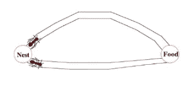
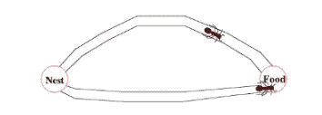
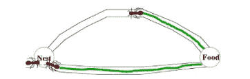
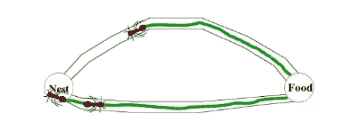
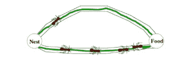
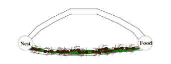
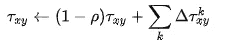
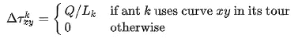

# 蚁群优化算法简介

> 原文：<https://towardsdatascience.com/the-inspiration-of-an-ant-colony-optimization-f377568ea03f?source=collection_archive---------7----------------------->

## 寻找最佳路径的概率技术


照片由[马克西姆·舒托夫](https://unsplash.com/@maksimshutov?utm_source=unsplash&utm_medium=referral&utm_content=creditCopyText)在 [Unsplash](https://unsplash.com/s/photos/ant?utm_source=unsplash&utm_medium=referral&utm_content=creditCopyText) 上拍摄

优化问题在科学和工业领域都非常重要。这些优化问题的一些实际例子是时间表调度、护理时间分配调度、火车调度、容量规划、旅行推销员问题、车辆路线安排问题、组车间调度问题、投资组合优化等。为此开发了许多优化算法。蚁群优化就是其中之一。蚁群优化是一种寻找最优路径的概率技术。在计算机科学和研究中，蚁群优化算法被用于解决不同的计算问题。

蚁群算法是由 Marco Dorigo 在 90 年代的博士论文中首次提出的。该算法是基于蚂蚁的觅食行为引入的，用于寻找蚁群和源食物之间的路径。最初，它被用来解决众所周知的旅行推销员问题。后来，它被用于解决不同的困难的优化问题。

蚂蚁是群居昆虫。他们生活在殖民地。蚂蚁的行为受寻找食物的目标控制。在寻找的时候，蚂蚁在它们的蚁群中游荡。一只蚂蚁反复从一个地方跳到另一个地方寻找食物。在移动时，它会在地面上沉积一种叫做信息素的有机化合物。蚂蚁通过信息素路径相互交流。当一只蚂蚁找到一定量的食物时，它会尽可能多的携带。当返回时，它根据食物的数量和质量在路径上存放信息素。蚂蚁能闻到信息素。因此，其他蚂蚁可以闻到气味并沿着这条路走。信息素水平越高，选择该路径的概率就越高，沿着该路径行进的蚂蚁越多，该路径上的信息素量也会增加。

让我们来看一个例子。让我们考虑从蚁群有两条路径到达食物。起初，地面上没有信息素。所以，选择这两条路的概率是相等的，也就是 50%。让我们考虑两只蚂蚁选择两条不同的路径到达食物，因为选择这些路径的概率是一半对一半。



这两条路径的距离不同。沿着较短路径行进的蚂蚁会比其他蚂蚁更早到达食物。



找到食物后，它会自己携带一些食物，返回蚁群。当它追踪返回的路径时，它在地面上沉积信息素。走捷径的蚂蚁会更早到达蚁群。



当第三只蚂蚁要出去寻找食物时，它会根据地面上的信息素水平选择距离较短的路径。由于较短的路径比较长的路径具有更多的信息素，第三只蚂蚁将沿着具有更多信息素的路径前进。



当沿着更长路径的蚂蚁返回蚁群时，更多的蚂蚁已经沿着信息素水平更高的路径前进。然后，当另一只蚂蚁试图从蚁群到达目的地(食物)时，它会发现每条路径都具有相同的信息素水平。所以，它随机选择一个。让我们考虑选择上面的一个(在下面的图片中)



反复重复这一过程，一段时间后，较短的路径比其他路径具有更多的信息素水平，并有更高的概率遵循该路径，所有蚂蚁下一次将遵循较短的路径。



为了用蚁群算法解决不同的问题，提出了三种不同版本的蚂蚁系统:

**蚂蚁密度** & **蚂蚁数量:**信息素在蚂蚁从一个位置到另一个位置的每次移动中更新。

**蚂蚁周期:**信息素在所有蚂蚁完成旅行后更新。

让我们看看应用蚁群优化算法的伪代码。制造了一种人工蚂蚁来寻找最优解。在解决问题的第一步，每只蚂蚁产生一个解决方案。第二步，比较不同蚂蚁找到的路径。第三步，更新路径值或信息素。

```
**procedure** ACO_MetaHeuristic **is**
    **while** not_termination **do**
        generateSolutions()
        daemonActions()
        pheromoneUpdate()
    **repeat**
end procedure
```

有许多优化问题，你可以使用蚁群算法寻找最优解。其中一些是:

1.  有容量限制的车辆路径问题
2.  随机车辆路径问题(SVRP)
3.  带装卸货的车辆路径问题(VRPPD)
4.  群组车间调度问题(GSP)
5.  护理时间分配调度问题
6.  置换流水车间问题(PFSP)
7.  频率分配问题
8.  冗余分配问题
9.  旅行推销员问题

让我们来看看蚁群算法的数学术语(典型的 TSP 问题)。

## 信息素更新



来源:[维基百科](https://en.wikipedia.org/wiki/Ant_colony_optimization_algorithms)

等式的左边表示给定边 x，y 上的信息素的量

ρ——信息素蒸发的速率

右边最后一项表示储存的信息素数量。



来源:[维基百科](https://en.wikipedia.org/wiki/Ant_colony_optimization_algorithms)

其中 L 是蚂蚁旅行长度的成本，Q 是常数。

# 参考

1.  [蚁群优化:介绍和最新趋势](https://www.ics.uci.edu/~welling/teaching/271fall09/antcolonyopt.pdf)作者克里斯蒂安·布鲁姆
2.  [蚁群优化](https://www.slideshare.net/vk1dadhich/ant-colony-optimization-23928078)由 Subvesh Raichand 完成
3.  [蚁群优化](https://en.wikipedia.org/wiki/Ant_colony_optimization_algorithms)

## 感谢您的阅读