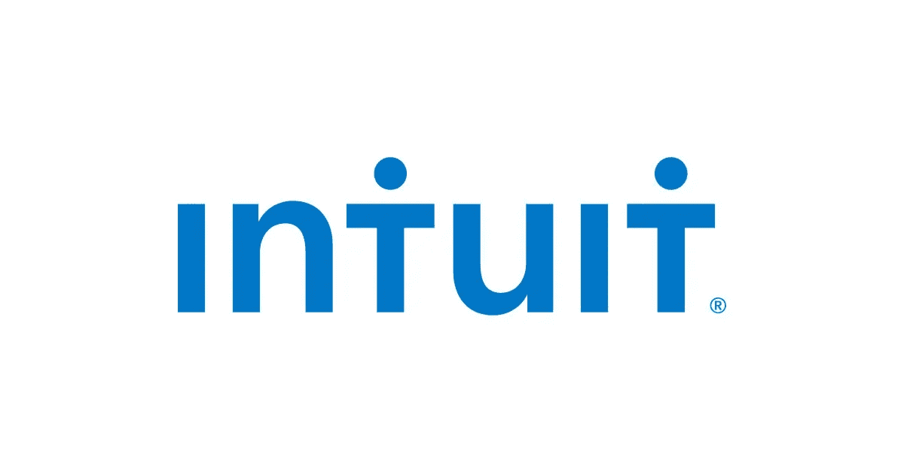

# Intuit 数据科学家访谈

> 原文：<https://towardsdatascience.com/the-intuit-data-scientist-interview-68b40694380?source=collection_archive---------20----------------------->

## Intuit 数据科学问题

businesswire.com

Intuit Inc .是全球最大的小型企业和金融科技公司之一。该公司开发和销售商业和财务管理软件解决方案(QuickBooks)、个人税务解决方案(TurboTax)和个人财务解决方案(Mint 和 Credit Karma now)。Intuit 成立于 1983 年，现已成为领先的金融科技公司，在全球超过 9 个国家拥有超过 5000 万客户。

Intuit 每年都会生成大量的客户数据，将他们所有的产品联系在一起。作为一家数据驱动的公司，数据科学是一切的核心，Intuit 多年来一直在高级分析和机器学习工具中利用数据科学来改善客户的财务生活。

# **Intuit 的数据科学职位**

Intuit 的数据科学家角色因不同团队而异，每个团队中数据科学家的具体角色在很大程度上取决于该团队的需求。从*小企业*到*机器学习未来*等团队，Intuit 的数据科学家团队分析数据，并部署 ML 和 AI 模型来解决业务相关问题。一般来说，Intuits 的数据科学范围从商业分析和数据工程，使用的工具可能从基本分析到机器学习和深度学习。

**所需技能**

Intuit 的首选数据科学招聘要求可能会因特定团队和小组而异，但一般来说，只会聘用在数据科学岗位上至少工作了 3 年(高级职位为 5 年以上)的有才华的合格申请人。

招聘的其他基本要求包括:

*   统计学、应用数学、运筹学、计算机科学、物理学、工程学或相关领域的学士、硕士或博士学位，或同等经验。
*   熟悉数据科学工具和框架(即 Python、Scikit、NLTK、Numpy、Pandas、TensorFlow、Keras、R、Spark)。
*   1 至 3 年以上(高级 5 年以上)通用编程语言(如 Python、C、Java 等)经验。).
*   实验设计和多元 ab 测试等领域的专业知识。
*   良好的人际关系和沟通技巧，以便有效地为技术团队做出贡献，并向各种技术和业务人员进行演示。

## **什么样的数据科学角色？**

Intuits 的数据科学职位分布在广泛的团队中。从表面上看，Intuit 的数据科学家是使用高级分析工具、机器学习、NLP 和 AI 算法来提供业务影响建议的人。然而，具体角色可能从嵌入团队的产品特定分析团队到机器学习工程实施。根据分配到的组，Intuit 的数据科学家或机器学习工程师的职能可能包括:

*   **风险研究&智能**:在 6000 万消费者和小型企业的集体财务数据基础上，构建算法和应用程序并制作原型，以提高安全性和反欺诈能力
*   **智能货币服务**:利用数据挖掘和机器学习技术来管理支付和工资中的信用和欺诈风险。
*   **小型企业数据科学团队**:使用行业领先的分析工具和技术来推动小型企业的用户增长和保留。
*   核心数据科学团队:开发、设计并集成 ML 模型到产品中。为所有内部团队，如工程、人力资源、财务&法律等，合作并建立人工智能解决方案。
*   **客户成功数据团队**:从客户成功数据中提取洞察，并将其应用于所有 intuits 产品(TurboTax、QuickBooks、Mint 等)。).

# **面试流程**

Intuit 的面试流程从招聘人员的第一个电话开始，然后是过去相关项目的视频技术面试和带回家的挑战。完成初始阶段后，将安排一次现场访谈，其中包括与各种团队成员、技术经理和产品经理的四次 45 分钟长的访谈。

## **初始屏幕**

最初的面试是与人力资源或招聘人员的电话面试，以简历为基础。这次面试的目的是评估你的技能和过去的项目，看看你是否非常适合你申请的团队。此筛选中的问题是基于简历的标准问题。

## **技术屏幕**

Intuit 的技术屏幕在招聘人员屏幕之后。这要么通过外部面试服务机构 Karat 完成，要么通过 Intuit 招聘经理完成。面试将包括分别测试 SQL 和 Python 的分析和编码技能。期待[面试查询](http://interviewquery.com/)本次面试中等水平问题。

试试下面的中等水平面试询问问题[这里](https://www.interviewquery.com/questions/bank-fraud-model):

> 假设您在一家银行工作，该银行希望建立一个模型来检测平台上的欺诈行为。
> 
> 该银行还希望实施一项短信服务，当模型检测到欺诈性交易时，该服务将向客户发送短信，以便客户通过短信回复来批准或拒绝交易。
> 
> [*我们将如何构建这个模型？*](https://www.interviewquery.com/questions/bank-fraud-model)

面试长达一个小时，这是恰当的表现出明确的技能倾向。面试官也会检查你过去的项目，以了解你过去的经历。真正确定你的简历，以及如何深入谈论你的项目，以及它们与应用机器学习的关系。

## **带回家的挑战**

Intuit 在现场面试前会给出一个数据挑战，申请人需要在收到带回家的数据后的四个小时内完成。带回家的挑战包括一个关于 TurboTax 的标准 Intuit 案例研究数据集。你必须在 SQL 中运行分析，并在数据集上处理机器学习问题。

*数据科学实践，查看* [***面试查询的*** *带回家挑战*](https://www.interviewquery.com/) *。*

# **现场面试**

Intuit 的现场面试由 4 轮面试组成(两轮技术面试、一轮数据挑战演示和一轮行为面试)。本次面试中的技术问题主要是开放式的，跨越基本统计概念(A/B 测试)、建模、实验设计、SQL 和机器学习算法。

一般来说，Intuit 的现场面试是这样的:

*   **数据挑战演示:**在这一轮中，候选人需要创建所给数据的仪表板，并向面试官条理清晰地解释所做的分析类型以及数据的挖掘程度。这将需要在真实环境中编码，并在讨论你正在做的事情时分析数据。
*   **技术面试**与一位技术经理谈论过去的经验和机器学习概念。
*   **与一位数据科学家进行技术访谈**，内容涉及 SQL 编码、算法以及概率和统计问题。
*   产品经理和高管的行为面试。与其他大型科技公司的面试不同，Intuit 的行为面试将关注他们的文化和价值观，以及候选人与非技术人员(包括高层)的关系。

## 最后的提示

*   Intuit 的数据科学家面试涵盖了广泛的分析概念、统计建模、实验设计和机器学习算法。事先准备好如何将这些数据科学概念应用于与 Intuit 相关的业务问题。
*   在白板上练习编码，并在现有环境中分析数据。
*   Intuit 有很好的工作文化，了解他们的文化和核心价值观会在行为面试中帮助你。

# **Intuit 数据科学面试问题**

*   *增压是如何工作的？*
*   *比方说，你可以玩一次抛硬币猜谜游戏，也可以玩三选二游戏。获胜的最佳策略是什么？*
*   *给定一个无法存储的长数组，如何求中位数？*
*   *线性回归有什么局限性？*
*   *描述随机森林是如何在引擎盖下工作的。*
*   *实现一个迭代器函数，它将三个迭代器作为输入，并对它们进行排序。*
*   *你会给一款车型添加哪些尚不存在的功能？*
*   *如果有一个 100%的用户都使用的功能，它会是一个好功能吗？*
*   *什么是不平衡数据集的充分重新平衡？*

> 更多数据科学面试练习题请上 [**面试查询**](https://www.interviewquery.com/) **。**