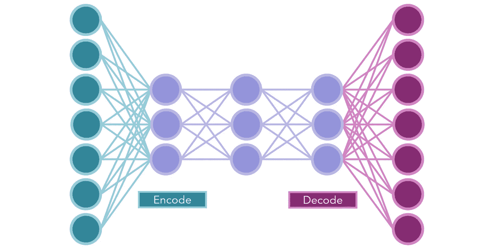
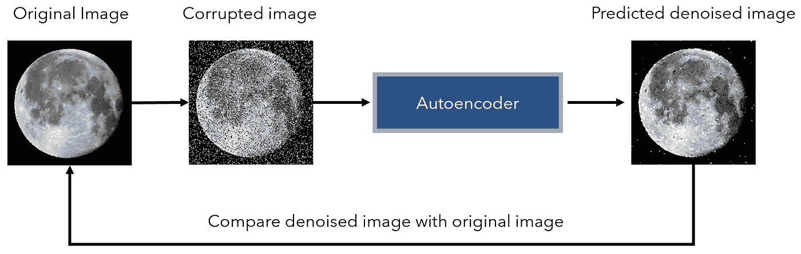
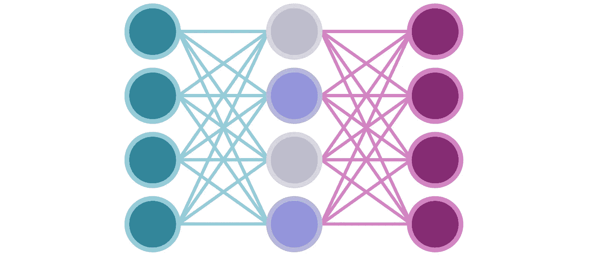
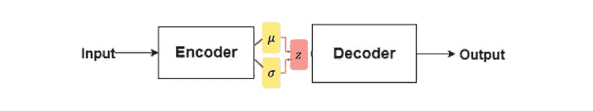

# 自动编码器和变体背后的直觉和应用

> 原文：<https://towardsdatascience.com/the-intuition-and-applications-behind-autoencoders-variants-4afcd45559d4?source=collection_archive---------52----------------------->

来源: [Unsplash](https://unsplash.com/photos/dOhJtfXJZfw)

## 无监督深度学习的美妙之处

神经网络*从根本上受到监督——它们接受一组输入，执行一系列复杂的矩阵运算，并返回一组输出。随着世界越来越多地被无监督数据填充[，简单和标准的无监督算法不再能够满足需求。我们需要以某种方式将神经网络的强大功能应用于无人监管的数据。](/the-future-of-deep-learning-can-be-broken-down-into-these-3-learning-paradigms-e7970dec5502)*

幸运的是，[自我监督学习](/the-fascinating-blueprint-for-efficient-ai-self-supervised-learning-954f919f0d5d)的创造性应用——从自然无监督的数据中人工创建标签，如倾斜图像和训练网络来确定旋转的程度——已经成为无监督深度学习应用的一个巨大组成部分。

自动编码器被训练来重新创建输入；换句话说， *y* 标签就是 *x* 输入。因为自动编码器被构建为具有瓶颈(网络的中间部分)，其神经元比输入/输出少，所以网络必须找到一种方法来压缩信息(编码)，这需要重建(解码)。

由作者创建

这些类型的模型可以有多个隐藏层，用于携带和转换压缩信息。因为这些节点中的空间有限，所以它们通常被称为“潜在表示”。

“潜伏”一词来自拉丁语，意思是“隐藏起来”。潜在变量和表示就是这样——它们携带间接的编码信息，可以解码并在以后使用。人们可以将迁移学习视为利用潜在变量:尽管像 ImageNet 上的 Inception 这样的预训练模型可能不会直接在数据集上表现良好，但它已经建立了关于图像识别动态的某些规则和知识，这使得进一步的训练更加容易。

创建自动编码器时，有几个组件需要注意:

*   损失函数非常重要，它量化了“重建损失”。由于这是一个回归问题，损失函数通常是二进制交叉熵(对于二进制输入值)或均方误差。
*   确定代码大小—这是第一个隐藏层(紧随输入层的层)中神经元的数量。这可以说是最重要的一层，因为它直接决定了有多少信息将通过该层的其余部分传递。
*   自动编码器的性能高度依赖于架构。平衡表示大小，可以通过隐藏层传递的信息量；和要素重要性，确保隐藏层足够紧凑，以便网络需要确定重要的要素。
*   对不同类型的数据使用不同的图层。例如，可以使用一维卷积层来处理序列。自动编码器与神经网络相同，只是在架构上有瓶颈。

普通自动编码器的一个应用是异常检测。例如，我可以构建一个使用 1-d conv 的一维卷积自动编码器。层(有架构瓶颈)并训练它重建输入序列。

在经过相当长时间的训练后，自动编码器学习序列的潜在表示——它能够拾取重要的区别性方面(序列中的哪些部分对精确重建更有价值),并能够假设整个序列中通用的某些特征。

当它对一个测试序列进行预测时，重建损失决定了它与先前序列的相似程度。如果自动编码器可以正确地重建序列，那么它的基本结构与以前看到的数据非常相似。另一方面，如果网络不能很好地重建输入，它就不遵守已知的模式。

自动编码器的另一个应用是图像去噪。通过添加噪声，图像被人为破坏，并被送入自动编码器，该编码器试图复制原始的未被破坏的图像。自动编码器最擅长去噪，因为网络只学习让图像的结构元素——而不是无用的噪声——通过瓶颈。

由作者创建

稀疏自动编码器类似于自动编码器，但是隐藏层的节点数至少与输入层和输出层的节点数相同(如果不是更多的话)。但是，L1 正则化用于隐藏层，这导致不必要的节点被停用。为了获得为什么会发生这种情况的直觉，[阅读这个](/exploring-the-simple-satisfying-math-behind-regularization-2c947755d19f)。

由作者创建。

因此，在某种意义上，架构是由“模型”选择的。然而，让模型自己选择并不总是好的；一般来说，L1 正则化倾向于消除比可能需要的更多的神经元。

请记住，正则化的目标不是*找到性能最佳的架构*，而是主要为了减少参数的数量，甚至以牺牲一些性能为代价。然而，在需要稀疏架构的情况下，稀疏自动编码器是一个不错的选择。

可变自动编码器，通常缩写为 VAEs，是自动编码器生成内容的扩展。正如之前在异常检测中所看到的，自动编码器擅长的一件事是拾取模式，本质上是通过将输入映射到一个缩减的潜在空间。这并没有带来多少创意。

任何生成模型的一个组成部分就是随机性。变分自动编码器将输入映射到多维高斯分布，而不是潜在空间中的点。然后，解码器从该分布中随机采样一个矢量以产生输出。

来源: [Unite AI](https://ml8ygptwlcsq.i.optimole.com/fMKjlhs.f8AX~1c8f3/w:1200/h:226/q:auto/https://www.unite.ai/wp-content/uploads/2020/09/variational.png) 。图片免费分享。

变分自动编码器和自动编码器之间的主要区别在于 vae 基本上是概率性的。他们建立由概率分布形成的一般规则来解释输入并产生输出。

当 VAEs 编码器一个输入时，它被映射到一个分布；因此，这里有随机性和“创造性”的空间。另一方面，必须识别复杂模式的自动编码器必须确定性地接近潜在空间，以获得良好的结果。

最后，自动编码器实际上更多的是一个概念，而不是任何一种算法。这是一个以瓶颈和重建为特征的架构决策，其驱动力是迫使模型将信息压缩到潜在空间并对其进行解释。编码器-解码器的思维模式可以进一步以创造性的方式应用于几个监督问题，这已经取得了相当大的成功。

## 摘要

*   自动编码器是深度学习对无监督问题的创造性应用；对快速增长的未标记数据量的一个重要回答。
*   自动编码器的特点是输入与输出大小相同，并且存在体系结构瓶颈。它们将压缩信息存储在潜在空间中，并被训练以最小化重建损失。
*   标准自动编码器可用于异常检测或图像去噪(当用卷积层替代时)。
*   稀疏自动编码器具有与输入和输出神经元数量相同的隐藏层，但是使用 L1 正则化来消除不必要的神经元。在某种意义上，网络“选择”在最终架构中保留哪些和多少神经元。
*   变分自动编码器用于生成。因此，它们将输入表示为概率分布，而不是潜在空间中确定性的点。解码器从这些分布中采样，以产生随机(因此，创造性)输出。

感谢阅读！

 [## 无需任何训练即可获得顶级神经网络性能

### 我们对神经网络的了解比我们想象的要少

towardsdatascience.com](/obtaining-top-neural-network-performance-without-any-training-5af0af464c59)