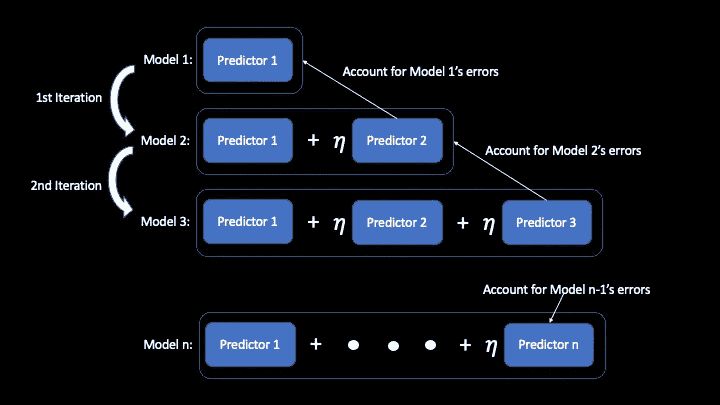
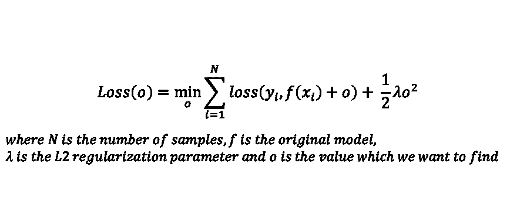
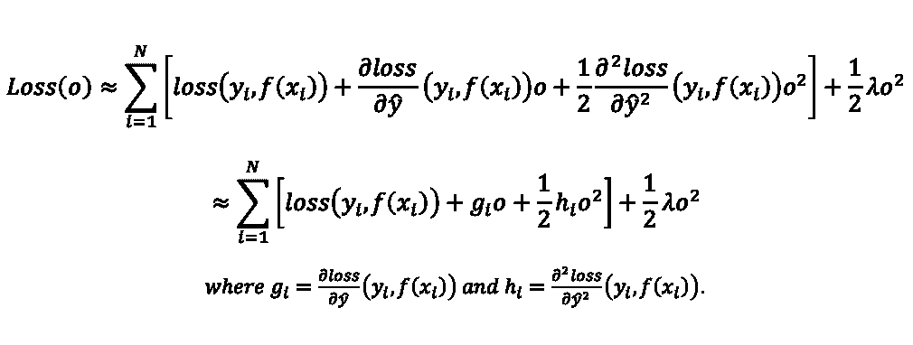
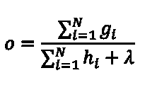
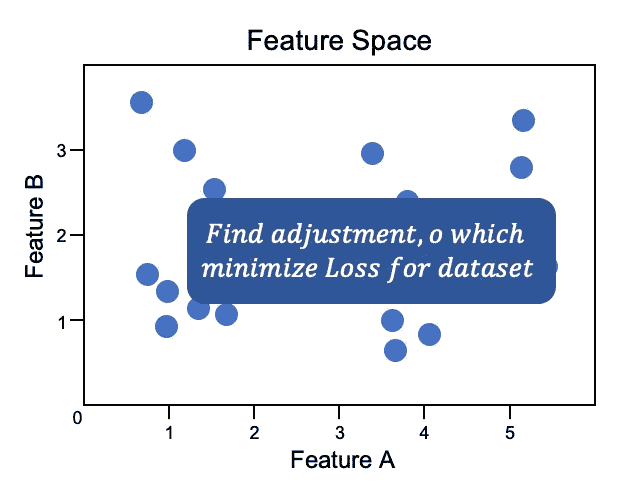
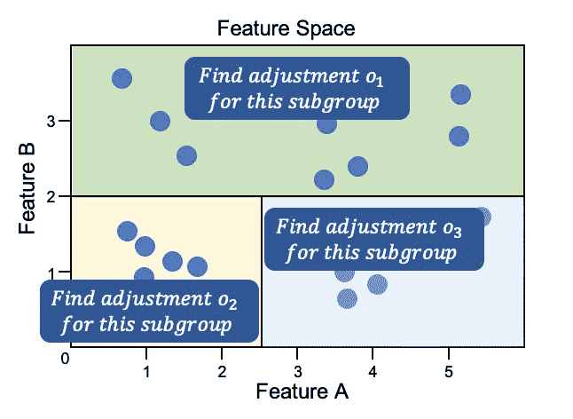

# 梯度增强背后的直觉& XGBoost

> 原文：<https://towardsdatascience.com/the-intuition-behind-gradient-boosting-xgboost-6d5eac844920?source=collection_archive---------24----------------------->

## 定性理解梯度增强和 XGBoost

在这篇文章中，我们提出了一个非常有影响力和强大的算法，叫做*极限梯度提升*或[XGBoost](https://arxiv.org/abs/1603.02754)[【1】](#9f40)。它是梯度推进机器的实现，利用各种优化来非常快速地训练强大的预测模型。

因此，我们将首先解释 [*渐变增强*](#b18a)[【2】](#9f40)，以将读者置于上下文中。然后，我们定性地浏览 XGBoost 的[工作方式，必要时绘制与梯度增强概念的连接。最后，我们谈谈各种实施的](#9fc2)[优化](#4ca7)及其背后的想法。

在写这篇文章时，我把尽可能定性作为自己的一个目标，只有在有助于解释的情况下才引入方程。目标是让读者直观地了解渐变增强和 XGBoost 是如何工作的。

# 梯度推进

梯度推进包括建立弱学习者的集合。它基于两个关键的见解。这是洞察力一。

> 如果我们能解释模型的错误，我们就能改善模型的性能。

让我们用一个简单的例子来支持这个观点。假设我们有一个回归模型，它预测实际结果为 1 的测试用例为 3。如果我们知道误差(在给定示例中为 2)，我们可以通过从原始预测 3 中减去误差 2 来微调预测，并获得更准确的预测 1。这就引出了一个问题，*“对于任何给定的输入，我们如何知道模型产生的误差？”*，这就引出了我们的第二个洞见。

> 我们可以训练一个新的预测器来预测原始模型产生的误差。

现在，给定任何预测模型，我们可以首先通过训练新的预测器来预测其当前误差，从而提高其准确性。然后，形成新的改进模型，其输出是原始预测的微调版本。改进的模型需要*原始预测器*和*误差预测器*的输出，现在被认为是两个预测器的集合。在梯度推进中，这被重复任意多次，以不断提高模型的准确性。这个重复的过程形成了梯度推进的症结。

## 一群学习能力差的学生

当训练一个新的误差预测模型来预测模型的当前误差时，我们正则化其复杂性以防止 [*过拟合*](https://en.wikipedia.org/wiki/Overfitting) 。当预测原始模型的*‘误差’*时，该正则化模型将具有*‘误差’*。参考上面的[例子](#d3a5)，它可能不一定预测 2。由于新的改进模型的预测依赖于新的误差预测模型的预测，它也将有误差，尽管比以前低。

为了减轻这种情况，我们采取了两种措施。首先，我们通过对其输出应用小权重 *η* (通常在 0 到 0.1 之间)来减少对任何单个误差预测器的依赖或信任。然后，不是在 1 次改进迭代后停止，而是多次重复该过程，为新形成的改进模型学习新的误差预测器，直到精度或误差令人满意。这可以用下面的等式来总结，其中 *x* 是一个输入。

```
i*mproved_model(x) = current_model(x) + η × error_prediction_model(x)* *current_model(x) = improved_model(x)* *Repeat above 2 steps till satisfactory*
```

通常，误差预测模型预测负梯度，因此，我们使用加法而不是减法。在每次迭代之后，将学习一个新的预测器来解释先前模型的误差，并将其添加到集合中。要执行的迭代次数和 *η* 是超参数。



如果你的**渐变增强**的想法和这个图相似，你就在正确的轨道上。作者图片

## “梯度”推进

在结束之前，我们先探讨一下为什么称之为*“渐变”*增强。原来，我们上面提到的误差是损失函数相对于模型预测的梯度，这可推广到任何可微分的损失函数。例如，当我们对平方误差损失函数*0.5(y _ true y _ pred)*求微分时，我们得到*y _ pred y _ true*，它恰好是我们训练新误差预测器的“误差”。类似地，其他类型的预测问题(例如分类问题)的误差可以通过梯度来表示。因为我们预测的是梯度，我们称之为梯度推进。

从数学上讲，损失函数的导数∂loss/∂pred 给出了调整预测以使损失最大化的方向。在梯度推进中，我们以相反的方向(负梯度)预测和调整我们的预测。这达到了相反的效果(使损失最小化)。因为模型的损失与其性能和准确性成反比，所以这样做可以提高其性能。

凭直觉，我们正在朝着提高模型整体性能的方向逐步改变我们的模型预测。

# XGBoost

XGBoost 是一种梯度增强机器，它使用梯度增强树(gbtree)作为误差预测器。它从一个简单的预测器开始，该预测器预测一个任意的数(通常为 0.5)，而不考虑输入。不用说，预测器具有非常高误差率。然后，应用上述想法的[，直到误差最小。在 XGBoost 中，误差预测模型的训练不是通过在*(特征，误差)*对上平凡地优化预测器来完成的。接下来，我们来看看它们是如何构建的。](https://bobby-tan.github.io/bobby-tan.github.io/articles/20/The-Intuition-Behind-Gradient-Boosting-and-XGBoost#steps)

## 梯度推进树

在 XGBoost 中，学习一个 gbtree，使得新模型的整体损失最小化，同时记住不要*过度拟合*该模型。请注意，在本节中，我们将讨论上述想法的 1 次迭代。为了更好地理解它，让我们从最简单的可能的树开始，它不进行分割，并且预测相同的值，而不管输入是什么。这个树非常简单，独立于输入，并且绝对是欠满足的。尽管如此，它仍然可以帮助减少损失。提到的问题可以用下面的等式来表示。



由最后一项表示的所应用的 [*L2 正则化*](/intuitions-on-l1-and-l2-regularisation-235f2db4c261) 已经通过实验证明在防止过拟合方面是有效的。虽然在这个已经不足的模型中没有用，但随着我们增加树的复杂性，它将变得有意义。像这样的问题，可以通过对表达式相对于 *o* 求导，设置导数为 0，然后找到对应的 *o* 来解决。不幸的是，我们上面看到的表达式很难区分。为了解决这个问题，我们使用 [*二次近似*](https://www.khanacademy.org/math/multivariable-calculus/applications-of-multivariable-derivatives#quadratic-approximations) 用更简单的术语来近似这个表达式。



这个简化的表达式很容易求导，在导数设置为 0 后，我们可以求解并得到 *o* 。原来，就是下面的 *o。*



推导起来并不难。你可以把推导当作练习。



作者图片

给定场景的一个示例:我们找到一个单一的最佳调整 *o* ,我们可以将其应用于数据集中的任何样本，以最小化总体损失。

请记住，现在，给定一个模型 *f* 和一组样本，我们可以找到最佳改进我们模型的单个调整 *o* 。*请注意，o 也可以代入等式计算损失值。*本节的剩余部分将讨论我们如何通过增加简单模型的复杂性(增长树)来进一步改进(减少损失)。总体思路是这样的。

> 通过巧妙地将样本分成子组，然后为每个子组找到 oo(使用上面的方法)，可以进一步提高模型的性能(损失可以更低)。

可以使用分割条件来分割样本。例如，如果分割条件是*“特征 x 小于 10”*，特征 x 的值小于 10 的样本将进入一个子组，其余的样本进入另一个组。如果需要，每个子组可以进一步迭代划分。这些分裂将原始特征空间分成更小的子空间，并且每个子空间中的样本形成一个子组。对于每个子组，其最优的*o、*和损耗可以使用上述技术求解。总损失， *Los* s，是每个子组(决策树中的叶子)损失的总和。



作者图片

对所讨论的概念的说明:在这个例子中，特征空间被分成 3 段，具有分裂 *B < 2* 和 *A < 2.5* 。然后，使用所讨论的技术计算每个子组的最佳 *o* 。

在每个组或子组中，是否拆分以及如果拆分，使用哪个拆分的决定取决于拆分是否可以减少该组的损失以及每次拆分可以减少多少损失。我们总是选择使*损失*最小的分割，如果*损失*不能减少，我们就不分割。

让我们直观地描述一下正在发生的事情。当前模型在特征空间的不同部分具有不同程度的误差。它对一些样本预测过高，对另一些样本预测过低，预测的幅度各不相同。*通过分割特征空间，使得每个子组中的误差相似、更具体，从而可以为每个子组计算更好的调整，增强整体模型性能。*

## 过度拟合

为了防止*过度配合*，实施了几项措施。我们在这里讨论两个重要的问题。首先，用户可以设定树木生长的最大高度。这有助于限制可以形成的子群(叶子)的数量。第二，分割造成的损失减少必须超过用户为 XGBoost 设置的某个阈值，XGBoost 才会允许。这通过附加的正则化项γT 被建模到*损失函数*中，其中 T 是叶子的数量。为了防止混淆，前面省略了这一点。

# 最佳化

下面是 XGBoost 用来提高训练速度和准确性的有趣优化。

**用于寻找近似最佳分割的加权分位数草图**—在找到最佳分割之前，我们为每个特征形成一个直方图。直方图仓的边界然后被用作寻找最佳分割的候选点。在加权分位数草图中，根据数据点当前预测的“置信度”为其分配权重，构建直方图，使得每个条柱具有大致相同的总权重(与传统分位数草图中相同数量的点相反)。因此，在模型表现不佳的区域将存在更多的候选点，从而进行更详细的搜索。

**并行化**加快树构建过程——当找到最佳分割时，候选点的尝试可以在特征/列级别并行化。例如，内核 1 可以为*特征 A* 找到最佳分割点及其相应的损耗，而内核 2 可以为*特征 B* 做同样的事情。最后，我们比较损失，并使用最好的一个作为分割点。

**稀疏感知的分割查找**用于处理稀疏数据——XGBoost 通过在树中的每个节点为其指定一个默认方向来处理这种稀疏性，这种稀疏性可能是由单热编码的缺失值或频繁的零条目造成的。默认方向的选择基于哪个更能减少*损失*。除此之外，XGBoost 确保在查找拆分过程中不会迭代稀疏数据，从而防止不必要的计算。

**硬件优化** — XGBoost 将常用的 gs 和 hs 存储在缓存中，最大限度降低数据访问成本。当需要使用磁盘时(由于数据不适合内存)，数据会在存储前进行压缩，以一些压缩计算为代价降低 IO 成本。如果存在多个磁盘，可以对数据进行[分片](https://en.wikipedia.org/wiki/Shard_(database_architecture))以增加磁盘读取吞吐量。

**列和行子采样** —为了减少训练时间，XGBoost 提供了仅使用原始数据行的随机采样子集来训练每棵树的选项，其中该子集的大小由用户确定。这同样适用于数据集的列/特征。除了节省训练时间之外，在训练期间对列进行子采样还具有对树进行去相关的效果，这可以减少过拟合并提高模型性能。这个想法也用在了[随机森林](https://en.wikipedia.org/wiki/Random_forest)算法中。

# 尾注和参考文献

干杯，我们已经到达终点。希望这对你有所帮助。随时给我发电子邮件(liangweitan300895@gmail.com)寻求反馈(我会喜欢他们)，问题，甚至聊天。

[1] T. Chen 和 C. Guestrin，[“XGBoost:一种可扩展的树提升系统”](https://arxiv.org/abs/1603.02754) (2016)，编号 arXiv:1603.02754 [cs .LG]
[2] J. H .弗里德曼，[“随机梯度推进”](https://statweb.stanford.edu/~jhf/ftp/stobst.pdf) (1999)