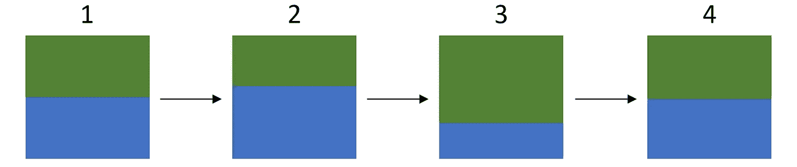
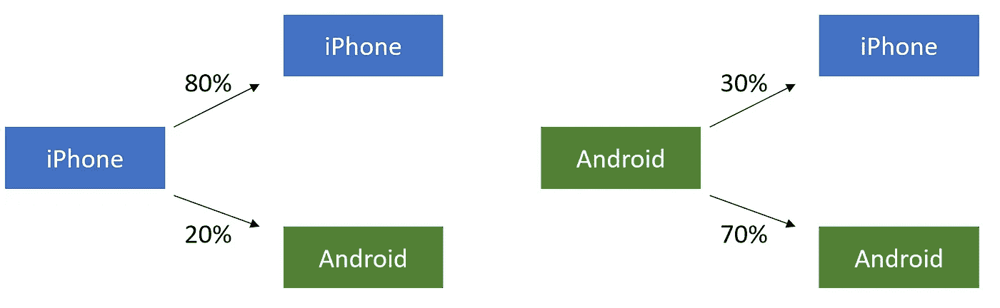
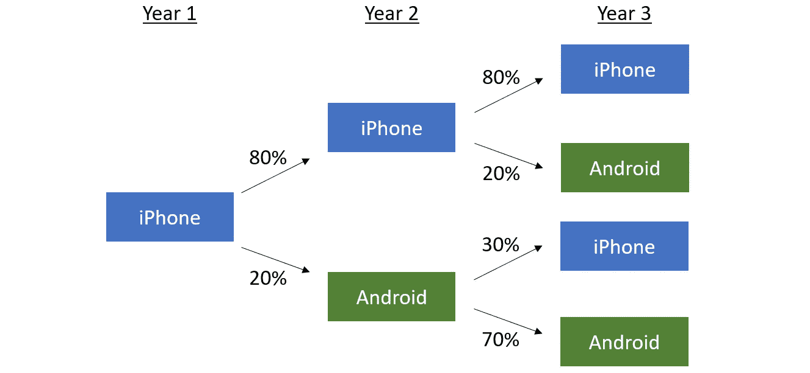
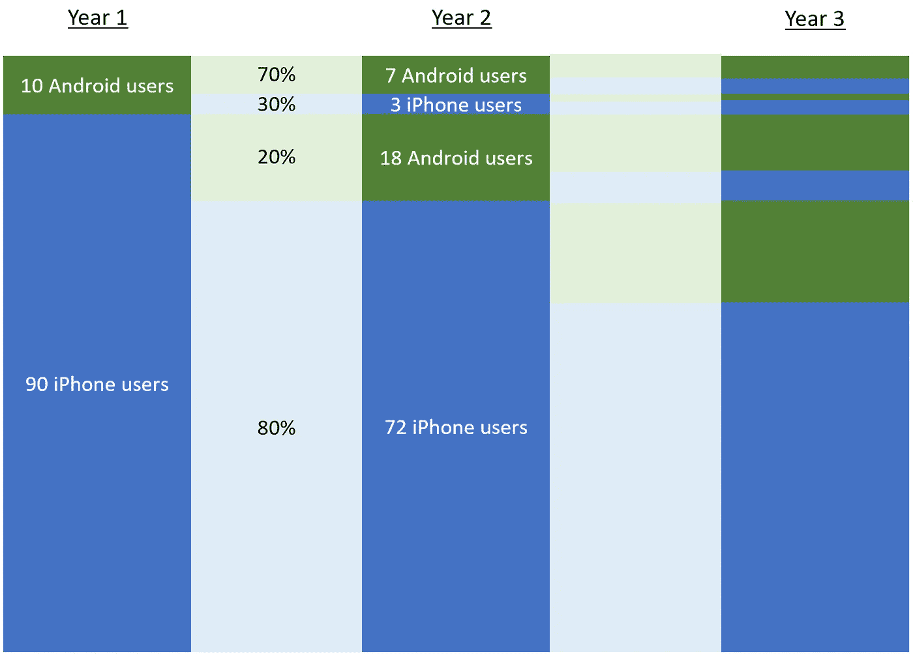
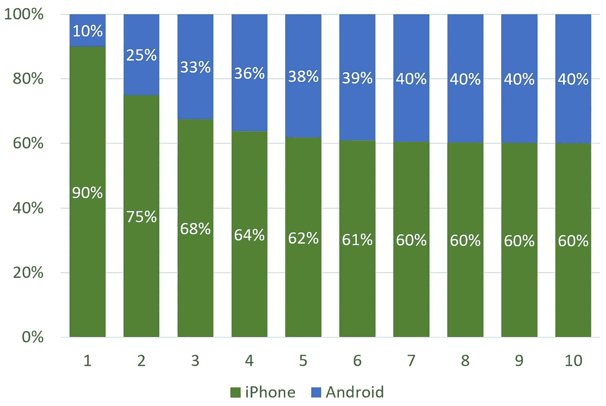
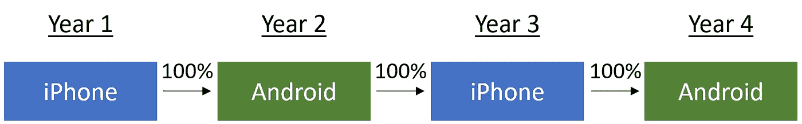

# 马尔可夫链背后的直觉

> 原文：<https://towardsdatascience.com/the-intuition-behind-markov-chains-713e6ec6ce92?source=collection_archive---------37----------------------->

## 用尽可能少的数学或统计数据简单介绍马尔可夫链是如何工作的。

大多数对马尔可夫链的解释都是直接进入数学和统计学领域，而没有提供任何直观的概念。教科书和讲座经常强调精确性和效率，而不是实际的可理解性。在本文中，我将尝试使用一个简单的例子和尽可能少的数学或统计来提供马尔可夫链背后的基本直觉。这篇文章并不意味着全面，而是旨在补充你在教科书和其他地方看到的更正式的解释。

# 什么是马尔可夫链？

马尔可夫链是一系列事件，其中某件事情发生的概率只取决于它之前发生的事情。对于音乐人来说，这就像你下一张专辑的成功仅仅取决于你最新专辑的成功。在遥远的过去发生了什么都不重要。

让我们考虑 4 个时间段。在马尔可夫链中，时间 4 发生的任何事情都只取决于时间 3 的情况。时间 1 或时间 2 中发生的任何事情对时间 4 来说都无关紧要。

在马尔可夫链中，时间 4 的情况只取决于时间 3 的情况。时间 1 和时间 2 中发生的任何事情对时间 4 中发生的事情没有直接影响。

# 为什么马尔可夫链很重要？

我们应该关心马氏链的原因有两个。

首先，现实世界中的许多事物的行为有点像马尔可夫链。我们可以想出一些例子，说明近期的未来主要取决于最近的过去，而不是全部的历史。

天气是一个常见的例子。如果今天下雨，那么明天很有可能会下雨。明天的天气可能会像今天一样。一个月前下不下雨，其实并不影响明天的天气预报。这不是马尔可夫链的完美例子，因为我们有季节之类的东西，但它非常适合。

其次，马尔可夫链允许我们将复杂的问题简化为一组简单的步骤，这些步骤可以很容易地在计算机上编程和运行。当我们让一台计算机数千次执行这些相同的步骤时，我们就能得出非常接近问题的答案，否则我们就无法解决这些问题。稍后，我将谈到马尔可夫链如何允许我们使用一套称为马尔可夫链蒙特卡罗方法的机器学习技术。

那么马尔可夫链是如何工作的呢？浏览一个例子很有帮助。

# 一个例子:iPhone 与 Android

再来想想智能手机用户，我们可以把智能手机用户分为两种:iPhone 用户和 Android 用户。这些是我们可能的状态。成为 iPhone 用户是一种状态。作为安卓用户是另一种状态。所有的可能性就是 T2 状态空间 T3。在这种情况下，状态空间只由两种可能的状态组成:作为 iPhone 用户或作为 Android 用户。

假设每年，每个人都买一部新的智能手机。你可以坚持使用你目前的智能手机或交换机。比方说，用户倾向于坚持使用当前类型的智能手机，但可能会偶尔更换。

因此，如果你目前使用 iPhone，你购买的下一部手机很可能是另一部 iPhone。假设这个概率是 80%。但也有可能你会转向安卓系统。假设这个切换的概率是 20%。

如果你目前使用安卓手机，你可能会再次购买安卓手机——比方说有 70%的可能性——但也有可能换成 iPhone——比方说有 30%的可能性。

明年获得 iPhone 或 Android 手机的可能性取决于你今年是 iPhone 用户还是 Android 用户

每一种继续使用当前类型的智能手机或转换的概率都被称为**转换概率**。转移概率是“条件概率”，即一年内成为 iPhone 或 Android 用户的概率取决于(“取决于”)你前一年是 iPhone 还是 Android 用户。

所有这些转移概率放在一起形成了一个**转移矩阵**。一个转移矩阵可以让我们绘制出每一个可能的未来状态的概率——无论你明年是 iPhone 用户还是 Android 用户——对于每一个可能的当前状态——无论你今年是 iPhone 用户还是 Android 用户。

我们不仅可以思考今年和明年会发生什么，还可以思考后年会发生什么。

如果你在第一年开始使用 iPhone，这些是你在第二年和第三年成为 iPhone 用户或 Android 用户的概率

如果我们在第一年开始使用 iPhone，那么在第二年，我们有 80%的机会再次拥有 iPhone，20%的机会拥有 Android 手机。我们可以在第三年做同样的事情，但是这次我们将转移概率应用到第二年的情况中。如果我们在第二年有了 iPhone，那么在第三年，我们有 80%的机会拥有 iPhone，20%的机会拥有 Android 手机。但是，如果我们在第二年有一部安卓手机，那么在第三年，我们有 30%的机会拥有 iPhone，有 70%的机会拥有安卓手机。

我们可以在许多智能手机用户的群体层面上思考这个问题。假设我们的用户一开始是 90%的 iPhone 用户和 10%的 Android 用户的混合体。这被称为**初始分配**。

如果我们将初始分布应用于 100 名智能手机用户，这意味着在第一年，我们将从 90 名 iPhone 用户和 10 名 Android 用户开始。在第二年，一些人会转换，一些人会继续使用现有的智能手机平台。有多少人会跳槽，有多少人会留下来，这取决于我们之前设定的转移概率。

在 90 名 iPhone 用户中:

*   其中 80%的人会继续使用 iPhone，这意味着 72 名 iPhone 用户
*   20%的人会转用安卓系统，也就是说有 18 个安卓用户

10 个原始 Android 用户中:

*   70%的人会继续使用安卓系统，也就是说有 7 个安卓用户
*   30%的人会转用 iPhone，这意味着 3 个 iPhone 用户

因此，在第 2 年，如果我们将所有这些相加，我们最终会得到:

*   75 名 iPhone 用户
*   25 名安卓用户

对于第 3 年，我们将再次应用相同的转移概率，但改为应用于第 2 年。在第二年，我们的 iPhone 用户中有一部分人会在第三年继续使用 iPhone(80%)，而其余的人会转而使用 Android (20%)。在第二年，我们的 Android 用户中有一部分人会在第三年继续使用 Android(70%)，而其余的人会转而使用 iPhone (30%)。对于第 3 年，你是否是第 1 年的 iPhone 用户并不重要。重要的是你在第二年是否是 iPhone 用户。

对于第 4 年和第 5 年以及之后的每一年，我们都会将转移概率应用于前一年智能手机用户的分布。我们可以想做多少年就做多少年。

# 平稳分布

如果坚持多年，iPhone 用户和 Android 用户的比例最终会收敛到一个稳态均衡。你可以在下面看到，大约 6 年后，我们的用户群最终稳定在大约 60%的 iPhone 用户和 40%的 Android 用户。100 年或 1000 年或 100 万年后，我们的 iPhone 和 Android 用户比例基本保持不变。

当我们观察一个分布在很长一段时间内会发生什么时，我们会发现**极限分布**。而当我们的极限分布收敛到某个稳定的东西时，我们称之为**平稳分布**(它也被称为**不变分布**或**平衡分布**)。以我们的例子为例，长期来看，iPhone 用户和 Android 用户的比例是 60/40，这是我们的固定分布。

事实证明，从长远来看，iPhone 和 Android 用户的确切比例只取决于我们的转移概率。如果我们改变任何一个转移概率，就会改变我们的稳态分布。例如，如果我们将今年的 iPhone 用户明年继续使用 iPhone 的概率从 80%提高到 90%，那么从长远来看，iPhone 用户和 Android 用户的比例将达到 75/25。这些长期平稳分布可以用线性代数数学地找到。

事实证明，从长远来看，我们的初次分配并不重要。不管我们一开始是 90%的 iPhone 用户和 10%的 Android 用户，还是 50%的 iPhone 用户和 50%的 Android 用户。所需的时间可能会有所不同，但最终我们会达到相同的稳态 60/40 分裂，只要我们的转移概率保持不变。

# 遍历马尔可夫链

像我们的例子一样，所有的马尔可夫链在长期内都会收敛到一个单一的平稳分布吗？不。事实证明只有一种特殊类型的马尔可夫链叫做**遍历马尔可夫链**会像这样收敛到一个单一的分布。遍历马氏链是满足两个特殊条件的马氏链:既不可约又非周期。我会解释这些是什么意思。

**条件 1:不可约**

首先，我们必须能够最终从一个州到达另一个州。我们永远不会永远停留在一种状态或一组状态中。当这为真时，那么马尔可夫链就被称为是**不可约的**。

对于我们的智能手机例子来说，这是正确的。如果你是 iPhone 用户，你可以在明年或未来某个时候成为 Android 用户。如果你是安卓用户，你可以在明年或未来某个时候成为 iPhone 用户。如果我们以不同的方式设置我们的例子，这样一旦你成为一个 iPhone 用户，你就永远不能切换到拥有一个 Android 手机，那么我们的马尔可夫链将不再是不可约的。

请记住，对于不可约的马尔可夫链，您不需要能够立即到达每个状态。可能需要几个步骤才能达到某个状态。但重要的是，最终你可以通过足够多的步骤达到任何状态。

**条件二:非周期性**

第二，我们不能陷入定期在同一组状态之间来回循环。换句话说，我们的马尔可夫链一定是**非周期的**。

首先解释什么是周期马尔可夫链是有帮助的。当我们每隔 2、3 或更长的时间间隔保持在同一状态时，马尔可夫链就是周期性的。对于我们的智能手机的例子，让我们回到只考虑单个用户。而这一次，让我们假设每年你肯定会切换你使用的智能手机类型(所以你切换的概率是 1)。因此，如果你在第一年开始使用 iPhone，那么你将在第二年使用 Android 手机，然后在第三年再次使用 iPhone。

周期马尔可夫链的一个例子。如果我们每年都有 100%的概率换手机，那么我们最终会在奇数年换一部 iPhone，在偶数年换一部 Android 手机。

你可以很快看到，在奇数年，你肯定会有一部 iPhone，在偶数年，你肯定会有一部 Android 手机。在这种情况下，您的马尔可夫链是周期性的，因为您以固定的时间间隔(在这种情况下，每两年一次)在 iPhone 和 Android 手机之间来回循环。

但在我们最初的智能手机例子中，我们有各种各样的转移概率，我们永远不会以这样的规律性在 iPhone 和 Android 之间循环。虽然我们确实在两种可能的状态——iPhone 和 Android——之间来回切换，但我们不会定期这么做。换句话说，并不是每两年或每三年你就会拥有一部 iPhone。你无法预测每隔奇数年或偶数年，或者每隔 3 年或 5 年，你就会拥有一部 iPhone。因为没有基于时间的模式，所以这个马尔可夫链被称为是非周期性的。

当这两个条件都满足时——也就是说，当我们的马尔可夫链既不可约又非周期时——那么我们可以说我们的马尔可夫链是遍历的。如果我们把所有这些放在一起，我们就有了**遍历定理**，它说任何遍历的马尔可夫链最终都会收敛到一个单一的平稳分布，不管我们的初始分布是什么。换句话说，如果你在许多时间段内运行这些特殊类型的马尔可夫链，不管你是如何开始的，你都会越来越接近某个分布。

我们可以看到，智能手机用户的群体级示例就是如此。由于我们设置转移概率的方式(例如，今年的 iPhone 用户明年有 80%是 iPhone 用户)，我们创建了一个马尔可夫链，它碰巧是遍历的。因为我们的马尔可夫链是遍历的，我们可以应用遍历定理，并提前知道我们最终会收敛到 iPhone 和 Android 用户的某种混合。遍历定理让我们知道这一点，而不必花费多年时间来完成我们的马尔可夫链。

# 马尔可夫链蒙特卡罗

为什么要关心遍历定理？因为它是一种叫做马尔可夫链蒙特卡罗方法的强大的机器学习技术的基础。**马尔可夫链蒙特卡罗**方法(通常缩写为 **MCMC** )涉及在计算机上运行马尔可夫链的模拟，以获得复杂统计问题的答案，这些问题太难甚至不可能正常解决。

遍历定理是使用马尔可夫链蒙特卡罗方法的基础，因为它确保收敛。只要我们在建立我们的马尔可夫链蒙特卡罗模拟时使用遍历马尔可夫链，那么我们就可以确定我们模拟产生的数据点确实会收敛到一个单一的分布。但在另一篇文章中有更多关于马尔可夫链蒙特卡罗方法的内容。