# 变形金刚背后的直觉——注意力是你所需要的

> 原文：<https://towardsdatascience.com/the-intuition-behind-transformers-attention-is-all-you-need-393b5cfb4ada?source=collection_archive---------14----------------------->

[Mor 妮莎](https://unsplash.com/@morsha?utm_source=medium&utm_medium=referral)在 [Unsplash](https://unsplash.com?utm_source=medium&utm_medium=referral) 上拍照

传统的递归神经网络及其变体已经广泛用于自然语言处理问题。近年来，《变形金刚》的表现超过了大多数 RNN 车型。在看变形金刚之前，让我们重温一下递归神经网络，它们是如何工作的，以及它们落后于何处。

递归神经网络(RNN)处理语言翻译和时序数据等序列数据。有不同类型的递归神经网络。

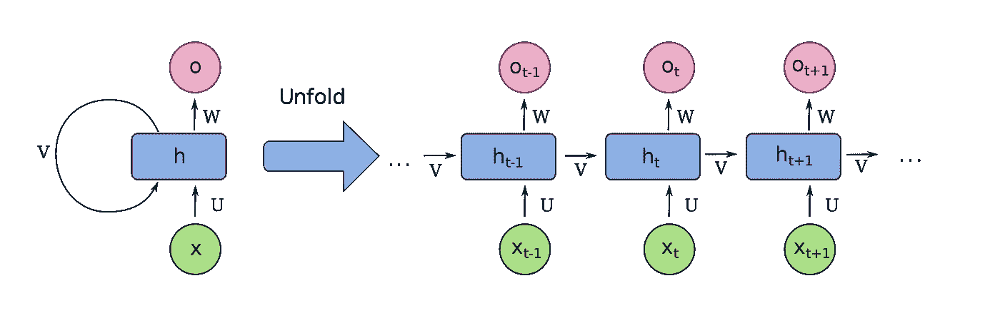

来源[维基百科](https://en.wikipedia.org/wiki/Recurrent_neural_network)

*   向量到序列模型——接受向量并返回任意长度的序列。
*   序列到向量模型—这些模型将序列作为输入，并将向量作为输出返回。例如，这些模型通常用于情感分析问题。
*   序列到序列模型，正如你现在已经猜到的，它们将一个序列作为输入，输出另一个序列。它们在语言翻译应用程序中很常见。

## 自然语言处理和 RNNs

说到自然语言处理 rnn，它们在一个 ***编码器-解码器*** 架构中工作。

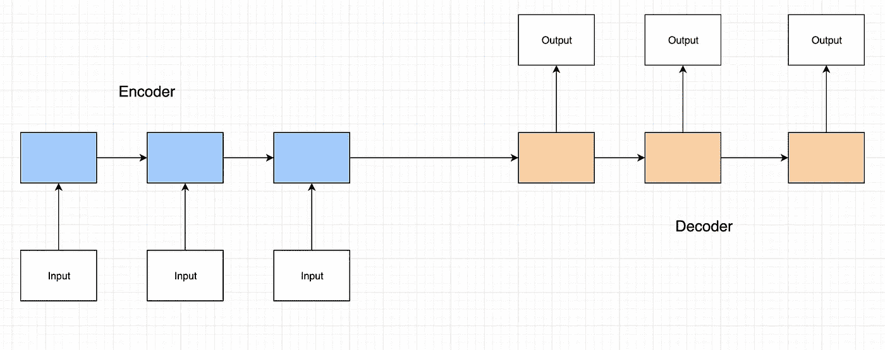

作者图片

编码器将总结输入句子的所有信息，解码器将使用编码器的输出来创建正确的输出。编码器的最终状态传达开始解码的信息。解码器使用先前的状态和输出来计算新的隐藏状态和字。多个 rnn 用于编码器和解码器层。

然而，递归神经网络有其局限性。

*   首先，它们很慢，事实上，训练非常慢，我们经常不得不使用类似于 ***的技术来截断训练，及时截断反向传播*** 。
*   其次，也是更常见的，rnn 会遇到 ***消失和*** 爆炸梯度的问题。当应用于 NLP 问题时，从句子开始的信息会丢失。

## 长短期记忆(LSTM)

引入长短期记忆(LSTM)网络来解决递归神经网络的这些问题。

它们的工作原理是有一个被称为记忆单元的隐藏状态，允许信息从前一个单元流向当前单元，同时跳过当前单元的大部分处理。这使得以前哑的神经元现在有了记忆，可以用来在需要时保留信息。这反过来允许模型在更长的序列中保留信息。

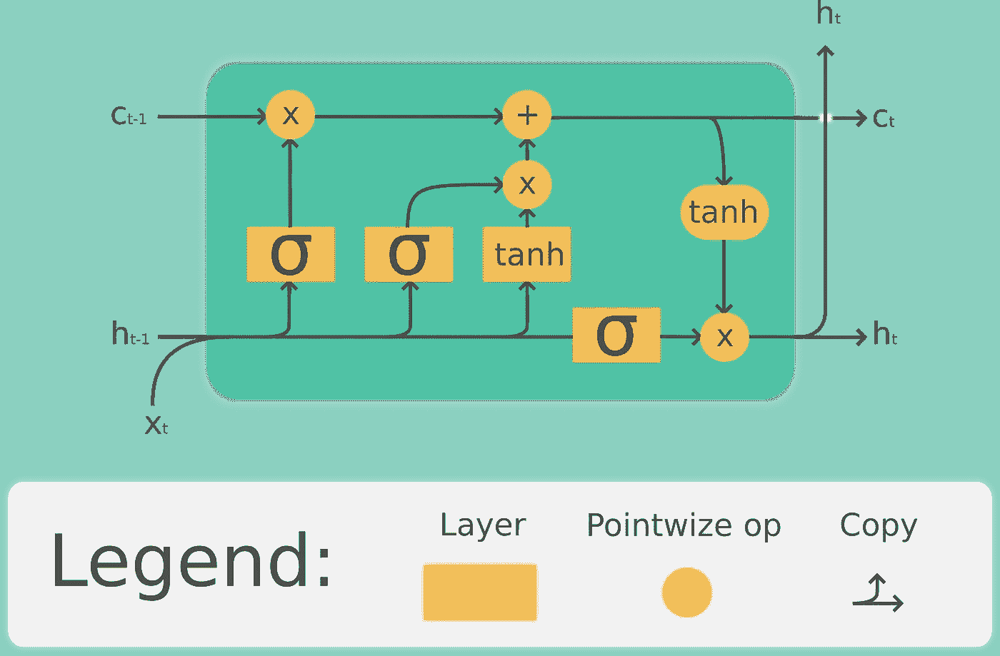

来源[维基百科](https://en.wikipedia.org/wiki/Long_short-term_memory)

然而，虽然常规的递归神经网络的训练速度很慢，但是 LSTMs 的训练速度甚至更慢。其次，由于序列的每个字都被单独传递到网络，并且处理仍然在网络内顺序发生，所以这种架构没有利用当今 GPU 的并行处理。

## 注意机制与 RNNs

一个 ***注意机制*** 被添加到它们中，以解决传统 rnn 和 LSTMs 的一些限制。注意机制通过使用全局向量来工作，上下文向量包含编码器所有隐藏状态的加权和。

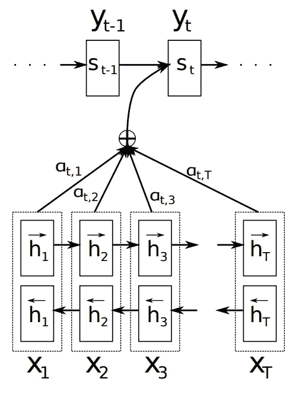

来源[巴赫达瑙等人](https://arxiv.org/pdf/1409.0473.pdf)。

上下文向量表示解码器的当前状态如何与全局输入序列相关。虽然注意机制解决了 rnn 的一些固有缺陷，但我们仍然是单独输入单词并顺序处理它们，这意味着这些架构仍然不能让我们利用当今硬件提供的并行处理。

## 注意力是你所需要的——变形金刚

我们可以完全取消注册护士吗？输入变压器。2017 年，transformer 架构在标题为[的文章中进行了介绍](https://arxiv.org/abs/1706.03762)。事实证明，注意力是你解决最复杂的自然语言处理任务所需要的全部。让我们来看看。

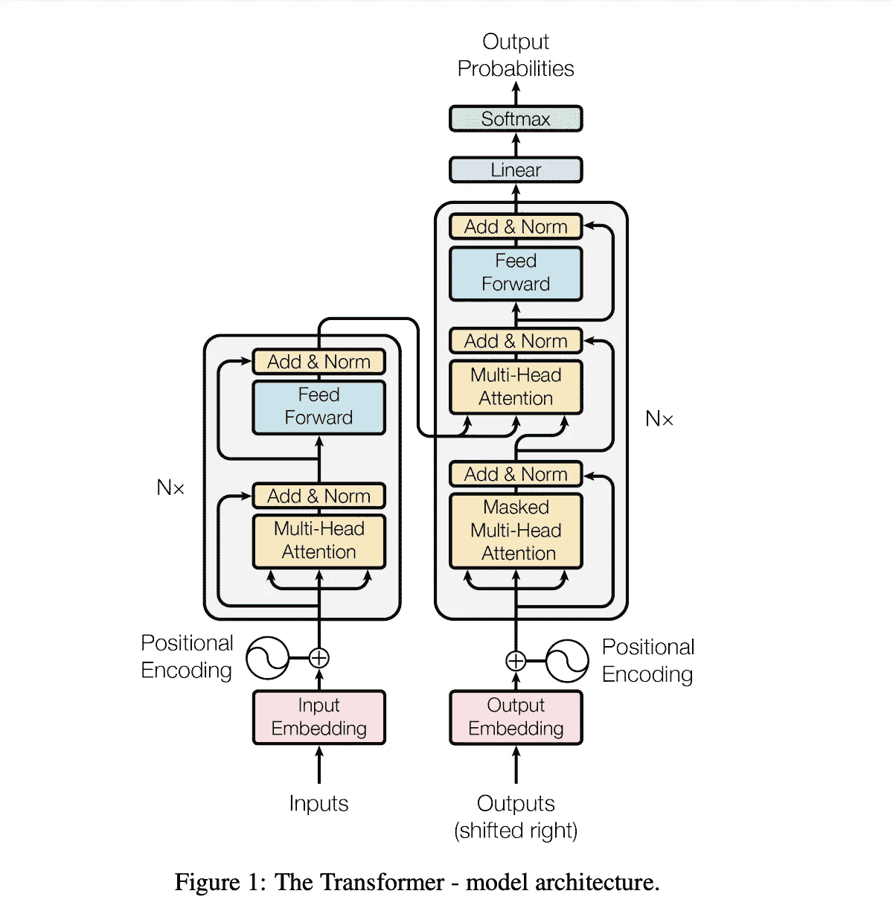

来源[瓦斯瓦尼等人](https://arxiv.org/abs/1706.03762)。

变压器架构使用一个编码器和一个解码器，但只使用注意力，没有 RNNs。

与之前架构的主要区别在于，编码器的 ***输入是整个句子*** ，而不是像 RNNs 那样一次输入一个单词。类似地，解码器的 ***输入也是整个句子(右移)*** 。我们同时传递句子中的所有单词，并同时确定单词嵌入。

让我们打破这种架构，深入研究各个组件，从 ***编码器模块*** 开始。

我们从序列中所有**单词嵌入**的网络输入开始。单词嵌入是单词的向量表示，使得具有相似意思的单词更接近；具体来说，相关单词在嵌入空间内彼此更接近。

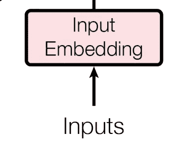

来源[瓦斯瓦尼等人](https://arxiv.org/abs/1706.03762)。

然而，在语言中，一个词在句子中的位置可以改变它的意思。例如，在句子“*之间，猫是一种动物。你像动物一样吃东西。*”字*动物的位置*改变了它的意思。我们在做 CNN 和 RNNs 的时候，保留了这个词的位置。然而，在 transformer 模型中，我们需要一个显式的 ***位置编码*** 层来在嵌入完成后保留单词在序列中的位置。

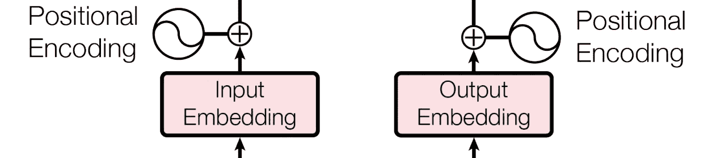

来源[瓦斯瓦尼等人](https://arxiv.org/abs/1706.03762)。

该论文提到了不同频率的正弦和余弦函数的使用。

一旦我们有了单词嵌入和位置编码，我们就可以将它传递给 ***多头注意力模块。***

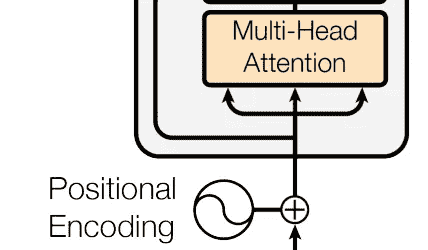

来源:瓦斯瓦尼等人。

多头关注块重点关注 ***自我关注***；即序列中的每个单词如何与同一序列中的其他单词相关联。自我关注由关注块中产生的关注向量来表示。这个想法是为了捕捉句子中单词之间的上下文关系。

这是如何工作的？我们通过计算缩放后的点积来找到两个向量之间的关系。

数学上，点积给出了两个向量之间的相似性。总之，如果点积为 1(或负相关时为-1)，则两个向量密切相关，如果点积为 0，则两个向量不相关。

我们的 transformer 模型使用一个 ***比例点积*** 函数来计算关注度。

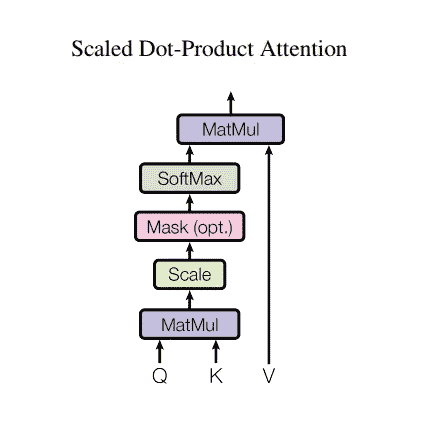

来源[瓦斯瓦尼等人](https://arxiv.org/abs/1706.03762)。

转换器使用的注意函数接受三个输入:Q(查询)、K(键)、V(值)，下面的等式用于计算权重。

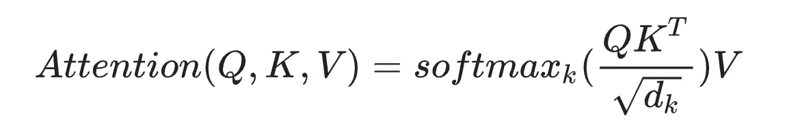

注意力块被称为多头注意力块，因为我们对每个单词使用多个注意力向量，然后进行加权平均。

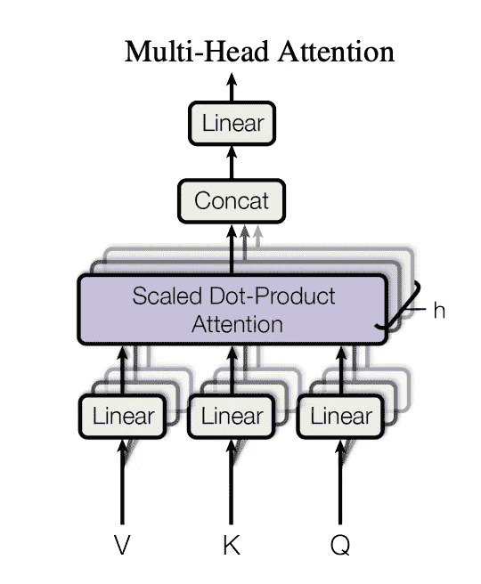

来源[瓦斯瓦尼等人](https://arxiv.org/abs/1706.03762)。

每个注意力向量都是相互独立的，这允许我们使用并行化。还记得 GPU 吗？

接下来，我们有一个 ***前馈网络*** (FFN)。这是一个应用于每个注意力向量的常规前馈网络。应用 FFN，使得输出可以被下一个编码器块或解码器块使用。

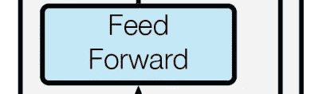

来源[瓦斯瓦尼等人](https://arxiv.org/abs/1706.03762)。

每个 FFN 由两个密集的线性层组成，其间有 ReLU 激活。

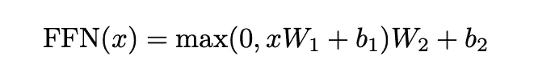

关于 FFN 层的几个关键点

*   FFN 分别应用于每个位置，并且完全相同。
*   每个子层的 FFN 不同。

最后，我们有一个 ***添加&归一化层*** 应用在每个关注块和每个 FFN 块之后。FFN 层对输出进行归一化，并在通过剩余连接进行反向传播的过程中帮助学习。

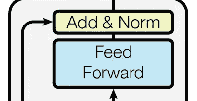

来源[瓦斯瓦尼等人](https://arxiv.org/abs/1706.03762)。

***解码器模块*** 的工作方式类似。我们传入在嵌入中编码的单词的目标序列以及位置编码。

解码器的自关注模块为目标序列生成关注向量，以找出目标序列中的每个单词与序列中的其他单词的相关程度。解码器的第一个关注块被称为 ***掩蔽关注块*** ，这是因为我们对该块应用了掩蔽层。这确保了在为目标序列生成注意力向量时，我们可以使用输入序列中的所有单词，但只能使用目标序列的前一个单词。

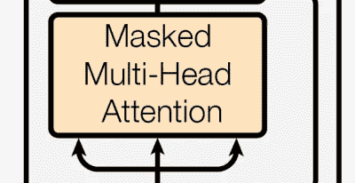

来源:瓦斯瓦尼等人。

解码器具有 ***额外的关注块*** ，其从输入序列和目标序列中获取嵌入，以确定输入序列中的每个单词如何与目标序列中的每个单词相关。

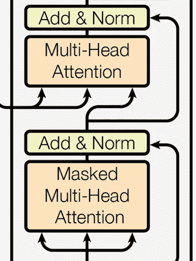

来源[瓦斯瓦尼等人](https://arxiv.org/abs/1706.03762)。

第二关注层的输出被发送到 FFN 层，该层类似于具有类似功能的编码器块的 FFN 层。

最后，在最后，我们有一个线性层，这只是另一个 FFN 和一个 softmax 函数来获得所有接下来的单词的概率分布，因此，下一个预测的单词具有最高的概率得分。

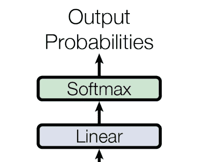

来源[瓦斯瓦尼等人](https://arxiv.org/abs/1706.03762)。

这个过程被执行多次，直到为序列生成句子结束标记。

这篇文章给了你 NLP 转换架构背后的基本直觉。也可以在这里阅读原论文[。](https://arxiv.org/abs/1706.03762)

如果你想亲手实现变形金刚，TensorFlow 有一个很棒的分步[教程](https://www.tensorflow.org/tutorials/text/transformer)。