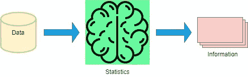
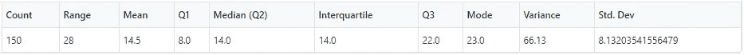
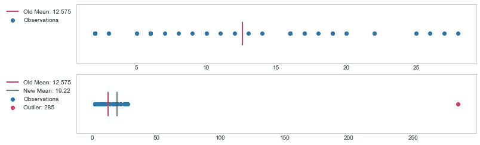
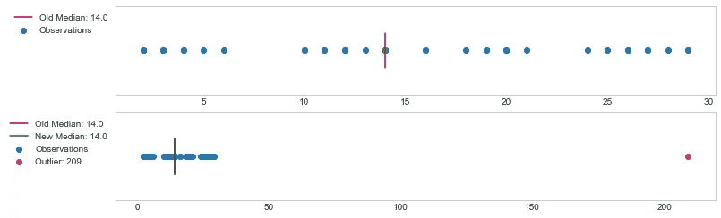

# 统计学的直觉——集中趋势

> 原文：<https://towardsdatascience.com/the-intuition-of-statistics-central-tendency-70f01949d61e?source=collection_archive---------35----------------------->

## 这篇故事/文章将直观地介绍使用 Python 的统计和一些概念的可视化。

但在此之前，我想先介绍一下我们的大脑是如何利用统计学和数学来理解我们生活的现实的。

我们几乎在生活的每个方面都使用统计学。我们发现统计数据可以帮助我们做纯粹的决策，分析事件——为什么会这样，以及我们如何预测同样的事情在不久的将来会发生。我们的大脑更注重统计和数学。

奥斯曼·拉纳在 [Unsplash](https://unsplash.com?utm_source=medium&utm_medium=referral) 上拍摄的照片

根据 [**Kenneth Craik**](https://en.wikipedia.org/wiki/Kenneth_Craik#Works) 的说法，我们的大脑模拟现实来理解现实本身。这款车型是出了名的被称为 [**小型车型**](https://www.neuroscience.cam.ac.uk/research/cameos/StatisticalBrain.php) 。

*简而言之，我们用统计学来辨别好的推理(决策)和坏的推理(决策)*。我希望你们都能理解这其中的迫切需要。我们来消化一下上面这句话。你可能想知道如何应用统计学来决定什么是好的，什么是坏的？

我们的大脑如此善于*收集数据*、*分析数据*，并智能地帮助我们推理出*结论性的结果*。它是如何收集数据的？大脑通过感觉器官(眼睛、鼻子、耳朵、舌头和皮肤)收集数据，这个房间里有太多的生物。整个过程在不知不觉中发生了。隐藏的过程是将数据转化为可感知的信息。

w3.org 上的照片

这个简单的反省给我们留下了一个重要的结论。我们需要数据来进行统计和绘制结果图。你掌握的数据越多，我们得出的结论就越合理。

作者图片

因此，我正在阐明统计概念的直觉同化，这些概念是我们日常活动中与事件相关的基础。

每当我们有数据时，不管是数字的还是分类的，我们都努力通过寻找共同的模式来理解它。在这个过程中，我们发明或发现了一些统计关系或统计函数，它们被称为集中趋势。集中趋势是定量数据(分布值)围绕中心值聚集的特征。什么样的分布值被认为是中心值？这是一个很好的问题，为了回答这个问题，我们通常会计算分布的平均值、中值或众数。但是为什么只有**平均**、**中值**、**模式**？如果你脑子里有这个问题，那么排队我们会慢慢解开。

让我们创建一些数据并使用它。我们会写一些简单的`Python`函数，现场看答案。

导入有用的库

计算集中趋势的代码，并用一个汇总表漂亮地绘制出来

我知道代码看起来很大，但是很简单。我们还需要创建一个简单的函数来生成我们的观察结果。

生成随机观察值的代码

现在我们都明白为什么平均值、中值和众数被认为是中心值了。让我们实例化我们刚刚编码的类。

实例化 CentralTendency 类的代码

统计表

平均值、中值、众数和范围-按作者分类的图像

你注意到第一和第二个次要情节了吗？紫色表示平均值，绿色表示中值(Q2 ),两者都大致位于观察值的中心。描述模式的第二个子图不是观察的中心(记住，它有时可能在中心)。 ***可视化总是有助于解开统计学中的这些基本概念*** 。如果你不明白一个函数是如何工作的，那么只要把输入标在 X 轴上，输出标在 Y 轴上，现在你就有了一个函数的图示。这将使生活变得更容易。

让我们稍微详细地检查一下平均值和中值。

**异常值影响平均值，但不影响中值。**

什么是离群值？在夏季，当附近的每个人都穿着轻薄的夏季服装时，如果你穿毛衣，那么你就是一个局外人。从技术上讲，离群值是分布中与同一分布中的其余值有很大不同的值。是的，异常值会影响平均值，但不会影响中值。让我们用可视化和少量代码来看看这个。

让我们分别实例化 mean 和 median 的类，看看结果。

为平均值实例化类的代码

存在异常值时平均值的影响-作者图片

如果有任何异常值，平均值会受到很大影响。在上图中，第一个子图表示数据中没有异常值的平均值。第二个子曲线表示当异常值被添加到相同的数据中时，均值在某种程度上被拉向异常值。异常值是`285`，它远大于分布中的任何其他值。

为中间值实例化类的代码

存在异常值时中值的影响(无影响)-按作者分类的图片

中位数不受异常值的影响，但当异常值大得多时，它们会有轻微的影响。在上图中，尽管数据中存在异常值，但我们没有看到中值的任何变化。在这种情况下，异常值为`209`，但对中值没有影响。

这清楚地解释了平均值和中间值的异常行为。

平均值和中值是分布的中心值。上面所有的图表清楚地说明了它们的性质，并回答了我们的根本问题:为什么它们是中心？因为在制定平均值和中值时，我们会考虑所有的观察值并进行一些汇总。由于这种聚合，结果总是落在分布的最高值和最低值之间，但大多位于中心。中间值通常不受影响，但平均值受极值的影响很大。

我希望这篇文章能帮助我们理解均值和中位数的本质。