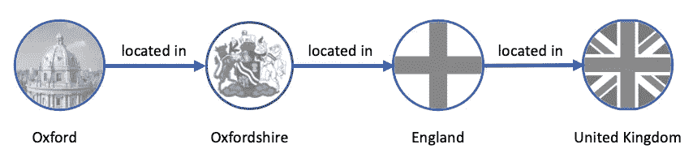
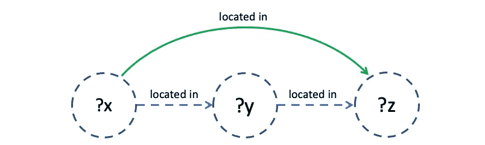

# 知识图和推理背后的直觉

> 原文：<https://towardsdatascience.com/the-intuitions-behind-knowledge-graphs-and-reasoning-59df2f1ad054?source=collection_archive---------24----------------------->

## 概念和示例


尽管名为关系数据库，但它并不擅长表达数据中的关系，因为它们强加了一种不利于连接的存储结构。

图形数据库尽管其名称看起来一点也不像图形，但在表达数据点之间的关系时提供了更大的灵活性。这些关系可以是任何类型，并表示为数据点之间的边。

在图中存储关系很有趣，但对于提取知识和见解来说不是很有用。因此，知识图由存储数据的图形数据库和搜索并具体化数据中的模式的推理层组成。

本文通过在高性能知识图和语义推理引擎[RDF fox](https://www.oxfordsemantic.tech/product)上演示的例子，介绍了知识图和在 [RDF](https://en.wikipedia.org/wiki/Resource_Description_Framework) 图上推理背后的基本概念和直觉。

# 知识图表

RDF 数据模型要求数据点以三个一组的形式表达:主语-谓语-宾语。RDF 图的主要查询语言是 [SPARQL](https://en.wikipedia.org/wiki/SPARQL) 。

RDF 中的推理是根据 RDF 图和一组规则计算逻辑三元组的能力。这样的逻辑结果在 RDFox 中具体化为图中的新三元组。

规则的使用可以大大简化 RDF 数据的管理，并为用户查询提供更完整的答案。例如，考虑包含以下三元组的图:

```
:oxford       :located_in :oxfordshire .
:oxfordshire  :located_in :england .
:england      :located_in :uk .
```

关系`:located_in` 是直观传递的:从牛津位于牛津郡，牛津郡位于英格兰这一事实，我们可以推断出牛津位于英格兰。然而，图中缺少了三个字母`:oxford :located_in :england` ,查询所有英国城市的 SPARQL 查询不会返回 Oxford 作为答案。



图表的可视化表示。

当然，我们可以手动将缺失的三元组添加到图表中，从而确保牛津包含在英国城市列表中。然而，这样做有许多重要的缺点。

*   可能有数百万个涉及`:located_in` 关系的缺失三元组，它们中的每一个都需要手动添加，这既麻烦又容易出错。
*   更重要的是，通过手动添加缺失的三元组，我们没有捕捉到关系的传递性，这普遍适用于图中由它连接的所有对象。

特别地，如果我们将三元组`:england :located_in :uk` 添加到图中，我们应该导出以下三元组作为`:located_in` 关系的传递性的逻辑结果:

```
:oxford :located_in :uk .
:oxfordshire :located_in :uk .
```

我们可以使用一个规则来忠实地表示关系的传递性。

这种规则将规定，

**如果**
【任意】对象**？图中的 x** 通过`:located_in`连接到一个物体**？y** 、
、T20、
？y 又通过`:located_in`连接到一个物体**？z** ，
**然后
？x** 也必须通过`:located_in`连接到**？z** 。

这里，**？x** ，**？y** ，和**？z** 是可以绑定到图中任何对象的变量。

具体来说，这样的规则可以用 RDFox 的规则语言编写如下:

```
[?x, :located_in, ?z] :- 
   [?x, :located_in, ?y], [?y, :located_in, ?z] .
```



在此图中，绿线显示了从规则中派生的链接。

该规则建立了不同数据三元组之间的因果关系；

的确，

三元组`:oxford, :located_in, :england` 成立，因为三元组`:oxford, :located_in, :oxfordshire` 和`:oxfordshire, :located_in, :england` 也成立。


绿线表示由规则导出的关系。

假设我们后来发现`:oxford` 不在`:oxfordshire` 中，而是在美国的密西西比州，结果我们从图中删除了下面的三元组:

```
:oxford :located_in :oxfordshire .
```

然后，三联件`:oxford, located_in, :england` 和`:oxford, :located_in, :uk` 也必须收回，因为它们不再对齐。

这种情况很难通过简单地添加和/或删除三元组来处理；相比之下，可以通过使用 RDFox 中的规则，以高效而优雅的方式自动处理它们。

# 规则语言

规则语言决定了哪些语法表达式是有效的规则，并为每个规则提供了定义明确的含义。特别是，给定一组任意的语法上有效的规则和一个任意的 RDF 图，将规则应用到图中产生的新三元组必须明确定义。

# 数据日志

自 20 世纪 80 年代以来，规则语言一直被用于数据管理和人工智能领域。基本的规则语言叫做 *Datalog* 。它是一种非常容易理解的语言，构成了大量后续规则形式的核心，并配备了广泛的扩展。

Datalog 规则可以被看作是一个`IF ... THEN` 语句。特别是我们的示例规则

```
[?x, :located_in, ?z] :- 
    [?x, :located_in, ?y], [?y, :located_in, ?z] .
```

是 Datalog 规则。

*   规则的`IF`部分也称为*主体*或*前件。*
*   嵌线的`THEN`部分称为*头*或*后件*。
*   头先写，用符号`:-`与体分开。

主体和头部都由条件合取组成，其中合取用逗号分隔，每个合取都是一个三元组，其中可能会出现变量。

在我们的例子中，身体是`[?x, :located_in, ?y], [?y, :located_in, ?z]` ，头部是`[?x, :located_in, ?z]` 。

每个 Datalog 规则都传达了这样的思想，即从输入 RDF 图中三元组的某些组合中，我们可以从逻辑上推断出一些其他的三元组也一定是图的一部分。

特别地，规则中的变量覆盖 RDF 图中所有可能的节点；每当这些变量被赋予使规则体成为图的子集的值时，我们看到那些变量的值是什么，将这些值传播到规则的头部，并推断出结果三元组也必须是图的一部分。

在我们的示例中，一个特定的规则应用程序将变量`?x`绑定到`:oxford` ，将变量`?y`绑定到`:oxfordshire`，将变量`?z`绑定到`:england`，这意味着在规则的头部用`:oxford`替换`?x`和用`:england`替换`?z`所获得的三元组`:oxford :located_in :england` 作为一个逻辑结果成立。

一个不同的规则应用程序将把`?x`绑定到`:oxfordshire`，把`?y`绑定到`:england`，把`?z`绑定到`:uk`；由此，三联`:oxfordshire :located_in :uk`也可以作为一个逻辑推论推导出来。

理解单个 Datalog 规则应用程序对 RDF 图的意义的另一种方法是将其视为 SPARQL 中一个`INSERT`语句的执行，该语句向图中添加了一组三元组。特别是，声明

```
insert {?x :located_in ?z } where {
   ?x :located_in ?y. 
   ?y :located_in ?z }
```

对应于我们的示例规则导致三元组的插入

```
:oxford :located_in :england . 
:oxfordshire :located_in :uk .
```

然而，有一个基本的区别使规则比 SPARQL 中简单的`INSERT` 语句更强大，即规则是递归应用的。

事实上，在我们推导出牛津位于英国之后，我们可以通过将`?x` 与`:oxford` 、`?y` 与`:england` 、以及`?z` 与`:uk` 匹配来再次应用该规则，以推导出`:oxford :located_in :uk` ——一个不是由上面的`INSERT` 语句得到的三元组。

这样，图表上的一组 Datalog 规则的逻辑结果被规则的迭代应用捕获，直到没有新的信息可以添加到图表中。

重要的是要注意，所获得的逻辑结果集完全独立于规则应用的执行顺序以及规则体的不同元素的给出顺序。特别是，以下两条规则完全等效:

```
[?x, :located_in, ?z] :- 
   [?x, :located_in, ?y], [?y, :located_in, ?z] .[?x, :located_in, ?z] :- 
   [?y, :located_in, ?z], [?x, :located_in, ?y] .
```

# 实践中的知识图表

知识图表提供了各种各样的应用，但这些应用并不总是为人所知。

使用 RDFox 构建的知识图在动态发现数据中复杂的基于规则的模式或验证它们没有发生时特别有效。

基于规则的模式提供了一种对领域专业知识进行编码的直观方式。例如，模式可以模拟组件应该如何组装成一个功能产品，或者用户需要满足哪些需求才能完成一个过程。

大多数有响应能力的应用程序需要动态评估这些规则，这对于使用传统的推理引擎在期望的响应时间内大规模执行通常是不切实际的。你可以在这里阅读rd fox 如何帮助 Festo 将复杂产品的配置时间从数小时减少到数秒。

通过提供一种更加灵活和一致的方法来存储知识，知识图还可以用来将聊天机器人变成真正智能的推理代理。规则也有助于改善对表述不当的问题的解释。

知识图的另一个关键用例是检测网络中的循环关系，这些关系代表了欺诈或内幕交易等不良行为。RDFox 可以通过有效地导航传递关系来无缝地建立网络中的连接。RDFox 可以自动标记或阻止不应该存在的连接，不管网络有多复杂。

# 用 RDFox 操作化知识图

RDFox 是一个高性能的知识图和语义推理引擎，可以大规模和动态地评估复杂的查询和规则。

RDFox 克服了传统数据库和推理引擎的灵活性和性能限制，它是一个针对速度和并行推理而优化的内存 RDF 三重存储。

支撑 RDFox 的新颖设计和概念是牛津大学在过去十年中开发和完善的，并在同行评审研究中得到数学验证。

RDFox 保证其规则具体化和查询结果的正确性，可以在生产级服务器和内存受限的设备上大规模、动态地交付。

更多关于 RDFox 的信息可以在[这里](https://www.oxfordsemantic.tech/product)找到。

# 团队和资源

牛津语义技术公司(Oxford Semantic Technologies)背后的团队于 2011 年在牛津大学计算机科学系开始研究 RDFox，他们坚信灵活和高性能的推理是数据密集型应用的一种可能性，而不会危及结果的正确性。RDFox 是第一个面向市场的知识图，它是从底层开始设计的，并考虑到了推理。牛津语义技术公司是牛津大学的一个分支，由主要投资者支持，包括三星风险投资公司([**【SVIC】**](https://www.samsungventure.co.kr/english_main.do))、牛津科学创新公司( [**OSI**](https://www.oxfordsciencesinnovation.com/) )和牛津大学的投资部门( [**OUI**](https://innovation.ox.ac.uk/) )。笔者很自豪能成为这个团队的一员。

[paweczerwiński](https://unsplash.com/@pawel_czerwinski?utm_source=unsplash&utm_medium=referral&utm_content=creditCopyText)在 [Unsplash](https://unsplash.com/?utm_source=unsplash&utm_medium=referral&utm_content=creditCopyText) 上拍摄的封面照片。