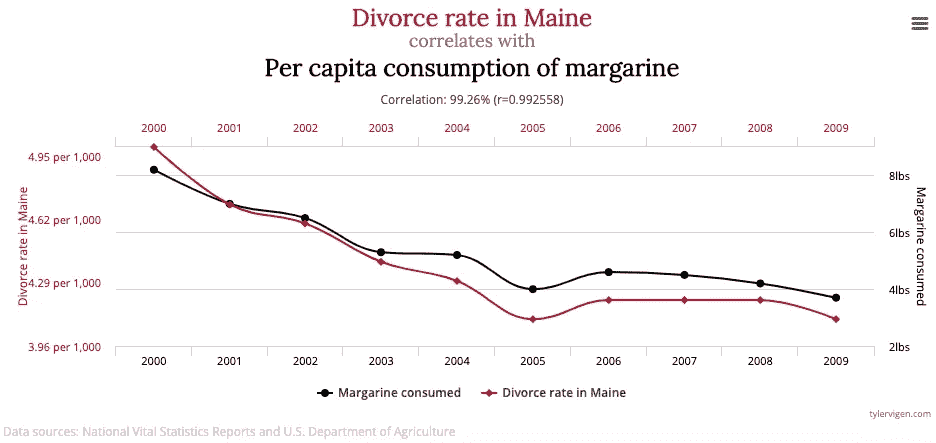

# 数据的隐形陷阱

> 原文：<https://towardsdatascience.com/the-invisible-traps-of-data-278aa1f491ac?source=collection_archive---------49----------------------->

## 这都是关于字里行间的解读

埃里克·马塞利诺在 [Unsplash](https://unsplash.com?utm_source=medium&utm_medium=referral) 上的照片

众所周知，数据科学家花在数据准备任务(数据收集、 [EDA](https://en.wikipedia.org/wiki/Exploratory_data_analysis#:~:text=In%20statistics,%20exploratory%20data%20analysis,modeling%20or%20hypothesis%20testing%20task.) 和功能工程)上的时间比花在机器学习建模上的时间多得多。虽然我们中的许多人可能会抱怨这个事实，但我认为低估数据准备的重要性——尤其是数据探索——是一个错误，会极大地损害您的 ML 项目，并且在开始模型实现之前，应该花相当多的时间来理解和探索数据。

# 机器学习中的数据挑战

在 ML 项目中遇到的挑战要么与算法有关，要么与数据有关。与算法相关的挑战在大多数时候要么过拟合，要么欠拟合训练数据。另一方面，与数据相关的挑战非常多样；此外，它们在当今商业领域的 ML 项目中非常常见——由此可见数据准备的重要性。

现实就是这么简单:你的程序的性能很大程度上取决于你的数据准备的质量——永远不要忘记这个领域最著名的一句话*“垃圾进，垃圾出”。*

但是数据准备并不总是容易的。除了确保你拥有高质量的数据和足够数量的数据，你还必须应对其他一些挑战，如果没有对数据的深刻理解，这些挑战更难揭开——它们是****数据的隐形陷阱****。他们要为数据科学家犯下的几个错误和错误假设负责，这些数据科学家没有后退一步提出正确的问题。这里是我在商业中见过的两个最常见的隐形陷阱。**

## **相关性/因果关系陷阱**

**[相关性并不意味着因果关系](https://en.wikipedia.org/wiki/Correlation_does_not_imply_causation)。这应该是我们在[探索性数据分析](https://en.wikipedia.org/wiki/Exploratory_data_analysis#:~:text=In%20statistics,%20exploratory%20data%20analysis,modeling%20or%20hypothesis%20testing%20task.) 101 中教授的第一条规则。将相关性视为因果关系是 EDA 过程中最容易犯的错误，这种倾向实际上是可以理解的。当我们探索数据时，我们正在寻找增加观察到的事件的可预测性的方法，这样做的最佳方法之一是计算数据集的不同特征之间的相关系数。但我们真正寻找的是因果关系，因为它是超越训练数据的特征之间的关系。因此，当我们观察相关性时，我们很容易走捷径找到因果关系。**

**如果你想证明相关性并不意味着因果关系，你可能想看看[虚假相关性](http://www.tylervigen.com/spurious-correlations)。在这个网站上，你可以找到一些意想不到的有趣的关联。这里有一个例子。**

****

**[https://www.tylervigen.com/spurious-correlations](https://www.tylervigen.com/spurious-correlations)**

## **偏见，无处不在的偏见**

**当 ML & AI 系统在我们的社会中大规模部署时，解决与偏见相关的挑战至关重要。尤其是考虑到算法对我们生活的影响的性质——现在它们可以决定你是否获得抵押贷款或工作。这就是为什么在过去几年里，机器学习中的公平问题已经成为一个非常活跃的研究领域。**

**因此，数据科学家应该注意这个问题，因为偏见很容易进入 ML 系统，并且很难发现。偏见有很多种，但它们可以分为两类。**

*   ****数据中的偏差:**这些是训练数据中的偏差，ML 算法将从中学习，并因此复制为输出。社会偏见、种族偏见、样本偏见……都是数据偏见的例子。它们可能是由非代表性数据引起的，也可能是由训练样本中描述的有偏模式引起的，它们肯定会影响您的 ML 系统，使其泛化能力很差，或者学习将在输出中复制的有偏模式。要了解更多关于社会偏见的信息，我建议你看看 Bertrand K. Hassani 的论文[通过机器学习强化社会偏见:信用评分视角](https://arxiv.org/abs/2006.08350)。**
*   ****人类的偏见:**这些是存在于我们头脑中的认知偏见。事实上，我们大大高估了自己做出正确决定/判断以及摆脱无意识偏见的能力。我们需要记住，作为个体人类，我们有很多认知偏见，这取决于我们个人的背景、文化等。因此，在某些情况下，人们可以从相同的数据中得出非常不同的——有时甚至相反的——结论。**

# **您的 ML 工作流程需要一个探索审查步骤**

**有大量的 EDA 技术和工具旨在自动化和加速我们的数据探索方法。但是这种方法的缺点是，它增加了忽略数据复杂性的风险——以及落入其*隐形陷阱*的风险。**

**为了解决这个问题，我发现最好的方法是在 ML 工作流程中系统地整合一个*探索审查*阶段，在此期间，您可以后退一步，提出更多的问题，并重新考虑您对培训数据所做的假设。**

**在这个新阶段，“探索数据集之外”也至关重要。我说的不仅仅是通过一些谷歌搜索或寻找更多的数据，还包括走出去和人们交谈:**

*   **咨询领域专家以获得更多的领域知识，**
*   **与客户接触，更好地了解他们的动机，**
*   **与你的同事/朋友分享你的发现，以获得其他观点，…**

**因为，通常情况下，数据只会告诉你*发生了什么*，而不是*为什么*会发生。我们都知道，预测未来最好的方法莫过于理解过去和现在的原因。**