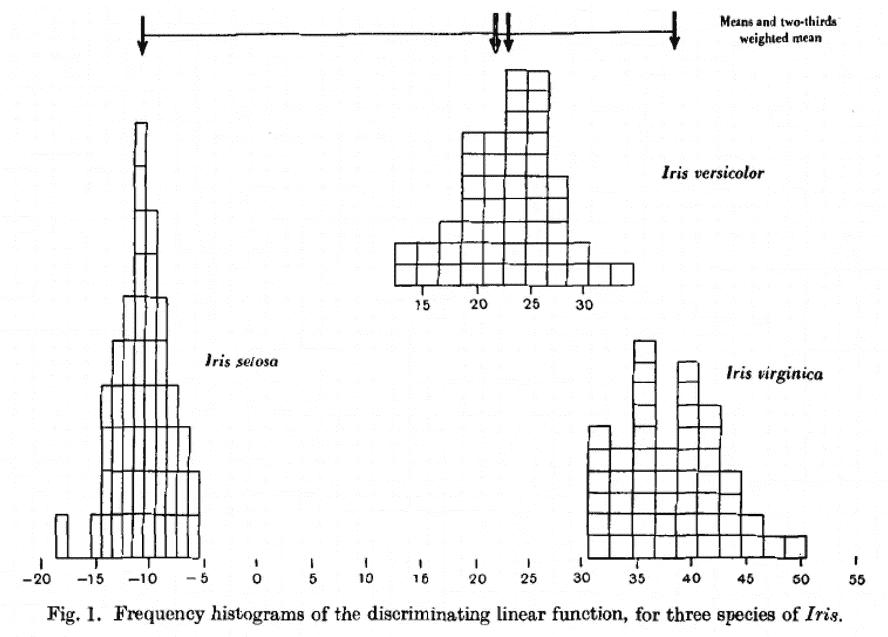
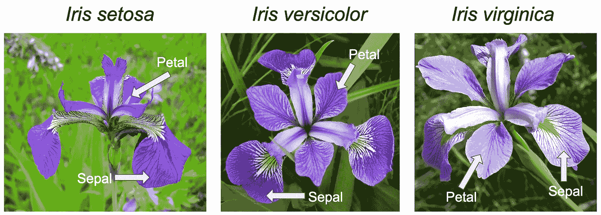

# 虹膜数据集——一点历史和生物学知识

> 原文：<https://towardsdatascience.com/the-iris-dataset-a-little-bit-of-history-and-biology-fb4812f5a7b5?source=collection_archive---------24----------------------->

## 如果我们知道数据背后的故事，数据会更有意义。

卡伦·艾姆斯利在 [Unsplash](https://unsplash.com?utm_source=medium&utm_medium=referral) 上的照片

如果你曾经接受过任何正式或非正式的统计或机器学习培训，你不会对*虹膜*数据集感到陌生，鉴于其受欢迎程度，它甚至有自己的[维基百科页面](https://en.wikipedia.org/wiki/Iris_flower_data_set)。大多数人对虹膜数据集的了解是，它记录了萼片和花瓣的长度和宽度。该数据集由三种鸢尾中的每一种的 50 条记录组成:*鸢尾*、*海滨鸢尾*和*杂色鸢尾*。

除此之外，你知道数据集来自哪里吗？你知道这些不同的物种长什么样吗？如果你不知道答案，没关系。这正是本文所要讨论的。让我们暂时放下处理数据的工作，了解一些常见数据集背后的有趣故事。

## 数据集的历史

Iris flower 数据集也称为 Fisher's Iris 数据集。你的猜测是对的——这就是同一个费雪，[罗纳德·艾尔默·费希尔爵士](https://en.wikipedia.org/wiki/Ronald_Fisher)，他也发明了[费雪精确测试](https://en.wikipedia.org/wiki/Fisher%27s_exact_test)。作为皇家学会的会员，费希尔爵士于 1890 年出生在英国伦敦，是一位著名的统计学家和遗传学家。

罗纳尔·艾尔默·费希尔爵士(来源:[维基百科](https://en.wikipedia.org/wiki/Ronald_Fisher#/media/File:Youngronaldfisher2.JPG)，许可:公共领域)

他对统计学的贡献远远超出了费希尔的精确检验。例如，他开发了[最大似然估计](https://en.wikipedia.org/wiki/Maximum_likelihood_estimation)和[方差分析](https://en.wikipedia.org/wiki/Analysis_of_variance)(通常被称为 ANOVA)测试。由于这些重要的贡献，他在现代统计学史上受到了高度评价，正如他的维基百科页面上所指出的那样。

> 由于他在统计学方面的工作，他被描述为“一个几乎单枪匹马为现代统计学奠定基础的天才”和“20 世纪统计学中最重要的人物”。—维基百科

1936 年，费希尔在《T2 优生学年鉴》杂志上发表了一篇题为“*多重测量在分类学问题中的应用*”的报告。如果你有兴趣，可以在这里阅读全文[。在这篇文章中，Fisher 开发并评估了一个线性函数来根据花的形态区分鸢尾属物种。这是上述三种鸢尾属植物的萼片和花瓣结构首次公开出现。下面提供了原始数据表的快照。请注意，这些测量是以厘米为单位记录的。](https://onlinelibrary.wiley.com/doi/epdf/10.1111/j.1469-1809.1936.tb02137.x)

鸢尾花的形态学测量(鸢尾数据集的一部分，[来源&许可](https://onlinelibrary.wiley.com/doi/epdf/10.1111/j.1469-1809.1936.tb02137.x)

如下图所示，总体而言，该判别函数在区分这些物种方面表现良好，除了*杂色鸢尾*和*海滨鸢尾*之间有一些重叠。刚毛鸢尾与其他两个物种明显不同。

图来自 Fisher 关于 Iris 数据集的文章([来源&许可](https://onlinelibrary.wiley.com/doi/epdf/10.1111/j.1469-1809.1936.tb02137.x)

但是，需要注意的是，费希尔本人并没有收集这些数据。在他的文章中，他明确将数据来源归功于埃德加·安德森博士，他在加拿大一个美丽的旅游胜地[加斯佩半岛](https://en.wikipedia.org/wiki/Gasp%C3%A9_Peninsula)收集了大部分数据。我找不到安德森博士的无版权图片，但如果你感兴趣，你可以在这里找到他的图片。

安德森博士 1897 年出生于纽约州，21 世纪初在美国密歇根州长大。作为一名植物学家，安德森博士是圣路易斯华盛顿大学的教员。1929 年，他接受了一项奖学金，与包括费希尔爵士在内的几位科学家一起在英国工作。通过这次合作机会，Fisher 获得了 Anderson 博士的许可，可以使用上面讨论的文章中的数据。

除了收集这个著名数据集的数据，安德森博士还对植物遗传学做出了重要贡献，并出版了一本关于该领域的原创书籍，书名为“*渐渗杂交”他在科学上的贡献使他在 1934 年当选为美国艺术与科学院院士，并在 1954 年当选为美国国家科学院院士。*

## 鸢尾花的生物学

你们中有多少人真的在花园或图片中看到过鸢尾花，尤其是数据集中的那三种？我怀疑这个数字可能很高，因为根据我周围的朋友和同事的回答，只有一小部分人告诉我他们以前见过 Iris 追随者。当然，我必须给他们看一些鸢尾花的照片，否则他们中的许多人可能甚至不知道鸢尾花是什么。

除此之外，我们知道数据集中的三种鸢尾:*鸢尾*、*海滨鸢尾*和*杂色鸢尾*，我们还知道数据集记录了这些花的萼片和花瓣的长度和宽度。让我们一箭双雕吧——见下图。

*鸢尾*、杂色鸢尾和海滨鸢尾的花瓣和萼片(来源: [1](https://commons.wikimedia.org/wiki/Category:Iris_setosa#/media/File:Irissetosa1.jpg) 、 [2](https://en.wikipedia.org/wiki/Iris_flower_data_set#/media/File:Iris_versicolor_3.jpg) 、 [3](https://en.wikipedia.org/wiki/Iris_flower_data_set#/media/File:Iris_virginica.jpg) ，许可证:公共领域，CC BY-SA 3.0 & CC BY-SA 2.0)

如上图所示，这几个物种在形态上确实有相似之处。因此，有趣的是，费希尔爵士在 30 年代开发的判别函数可以从统计学的角度巧妙地解决这个问题。然而，植物学家有更好的方法来区分这些物种。其实安德森博士自己也发表了一篇名为《*鸢尾属植物中的物种问题*》的手稿，讨论鸢尾属植物物种的判别问题，你可以在这里阅读正文[。在文章中，安德森博士指出，这些花的种子的形态更能提供信息。除了花瓣和萼片的大小不同之外，这三个种的种子大小也有明显的不同。](https://www.jstor.org/stable/2394164?seq=1)

## 最终想法

大数据、人工智能、机器学习、深度学习和许多其他数据科学术语几乎是每个学术和工业领域的热门话题。鉴于市场上对数据科学家的大量工作需求，许多人进入了这些领域。一些数据科学家错误地认为他们唯一的工作就是处理呈现给他们的数据。

他们没有真正意识到的是，我们所有的数据都有其来源和内容背景。数据的处理、分析和解释都需要相关领域的内容知识。因此，如果我们想做更好的数据科学，我们永远不能忽视我们正在处理的数据背后的内容知识。

关于当前文章的最后一个简短说明。我第一次了解 Iris 数据集是在我使用 SAS 学习判别分析的时候。坦白地说，我没有过多地考虑数据集本身。然而，随着我对数据科学研究的了解越来越多，我发现深入理解数据非常重要。因此，事后看来，我想找出虹膜数据集背后的故事，并与你分享。我希望你喜欢当前作品的某些部分，并学到一些东西——至少，你应该知道鸢尾花的萼片和花瓣是什么，对吗？