# 矩阵的瑰宝:深入探究特征值和特征向量

> 原文：<https://towardsdatascience.com/the-jewel-of-the-matrix-a-deep-dive-into-eigenvalues-eigenvectors-22f1c8da11fd?source=collection_archive---------14----------------------->

[信号源](https://pixabay.com/illustrations/precious-diamond-jewelry-expensive-1199183/)

## 对抽象概念的直观观察

特征值和特征向量可能看起来是抽象和遥远的概念，但它们在你周围的世界中起着不可或缺的作用。当一切都由数据定义时，它们被存储在矩阵中。通过复杂性和复杂性，矩阵的中心是特征向量和特征值，提供了清晰性并揭示了矩阵的本质。理解它们是什么，如何得到它们，以及它们的应用是欣赏矩阵之美，以及更广泛地说，数据和数学在世界上所扮演的角色所不可或缺的。

让我们首先考虑二维向量，它有两个元素，每个元素对应于二维平面上的一个坐标。它们代表从一个坐标到另一个坐标的运动。

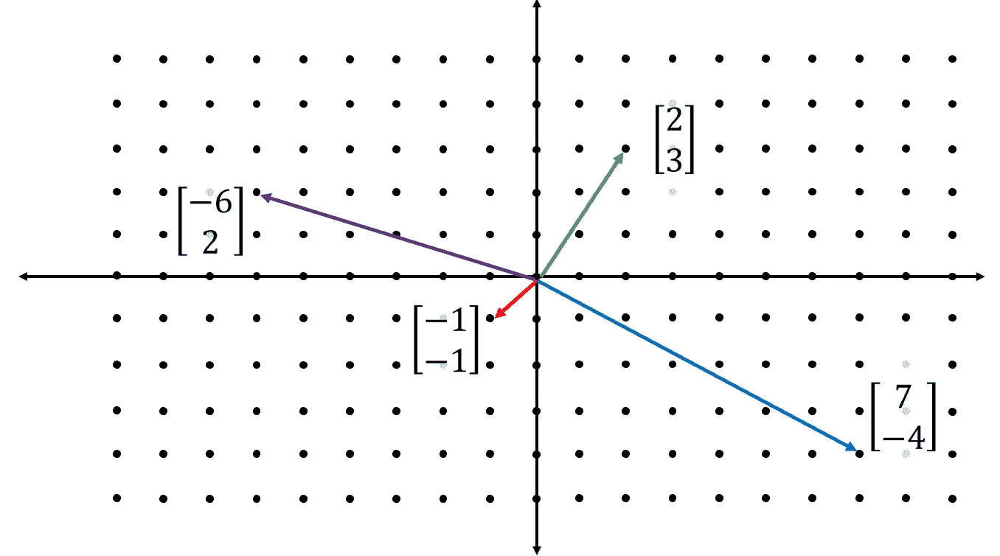

当一个向量乘以一个矩阵时，他们应用了一个线性变换。这具有沿着两个向量拉伸(或挤压)坐标系的效果。例如，矩阵`[[3, 1], [1, 2]]`沿着矢量`[3, 1]`(第一列)对齐 *x* 轴，沿着矢量`[1, 2]`对齐 *y* 轴。从视觉上，可以看出点(0，1)实际上映射到(1，2)，这可以通过将其乘以矩阵来确认。

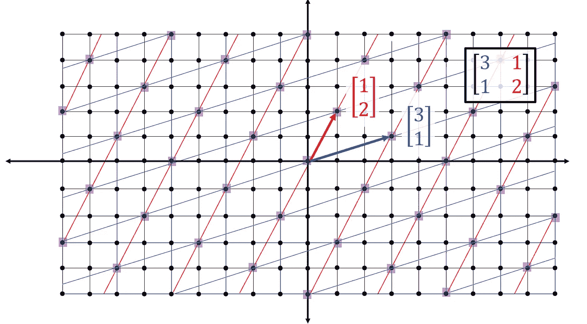

假设我们有一个矢量`[-1, -1]`。它乘以线性变换矩阵后，落在点`[-4, -3]`上。

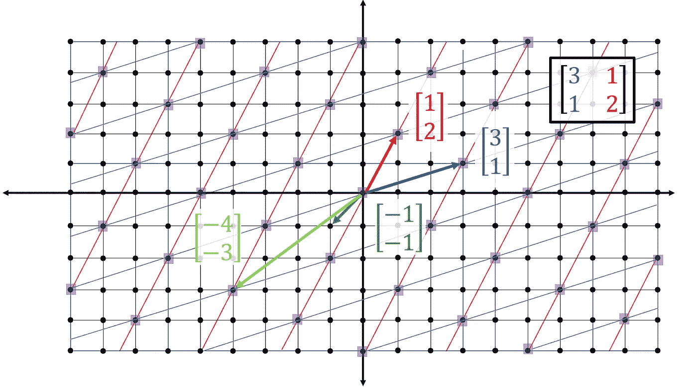

向量的跨度是永远穿过向量的线。当一个向量经历线性变换(乘以矩阵)时，通常它会被从它的跨度中去掉。

然而，一些类型的向量不会被删除。这些是矩阵的*特征向量*。相反，当特征向量乘以矩阵时，特征向量简单地按*特征值*的因子缩放，落在沿其跨度的其他地方。

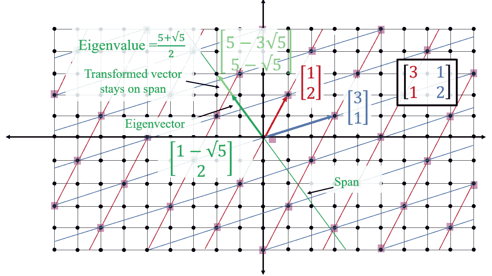

特征向量和特征值是混乱的——它们很少是整数，很容易处理。

由于特征向量的性质，简单地在相同或直接相反的方向上缩放基本特征向量将产生另一个特征向量。

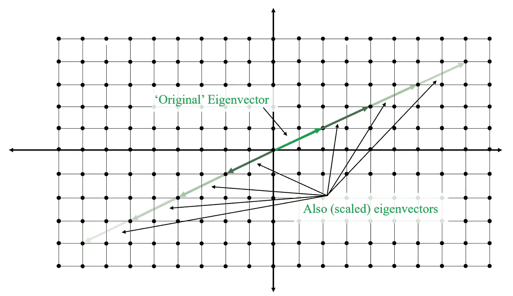

在三维空间中，矩阵描述了三个轴的变换——*x*、 *y* 和*z*——对应于代表每个坐标经历的变换的三个坐标。这就是为什么只对方阵定义特征向量和特征值；一个通用的 *n* 乘 *n* 矩阵描述了 *n* 轴的变换，每个轴对应一个具有 *n* 元素的坐标。

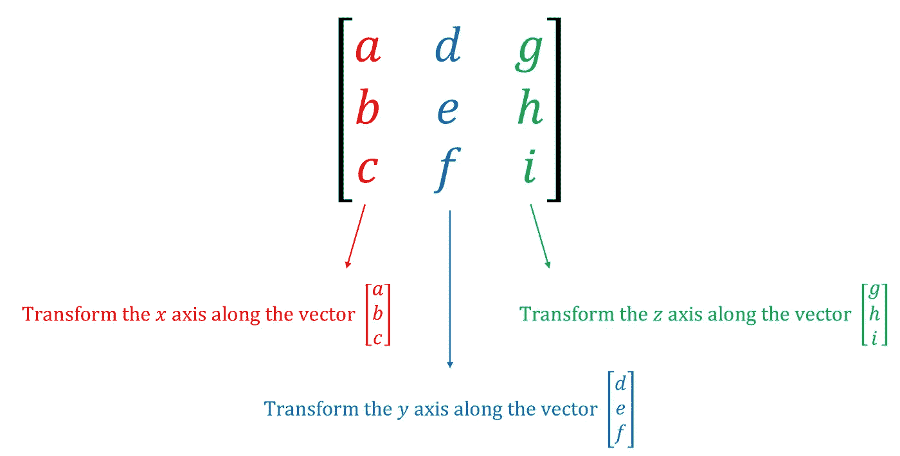

为了找到一个矩阵的特征向量，我们首先需要找到它的特征值。从特征值的定义可以构造一个等式 *Ax =* λ *x* ，其中 *A* 表示矩阵，λ表示特征值。这有道理；将特征向量乘以变换矩阵 *x* 应该具有与将其缩放特征值λ相同的效果。

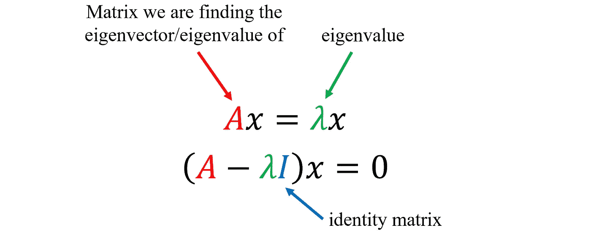

根据这个关系，我们可以将这两个项移到左边。为了使表达式 *A -* λ有效( *A* 是一个矩阵，λ是一个数)，我们将λ乘以一个单位矩阵，它根本不应用任何变换。

如上所述，有无限多的*平凡解*，或者可以简单地通过将一个特征向量缩放任意数量来实现的解。为了摆脱琐碎的解决方案，我们使用行列式。

行列式只是面积被变换矩阵拉伸的因子的度量。例如，考虑坐标平面上的一个标准正方形，面积为一个正方形单位。

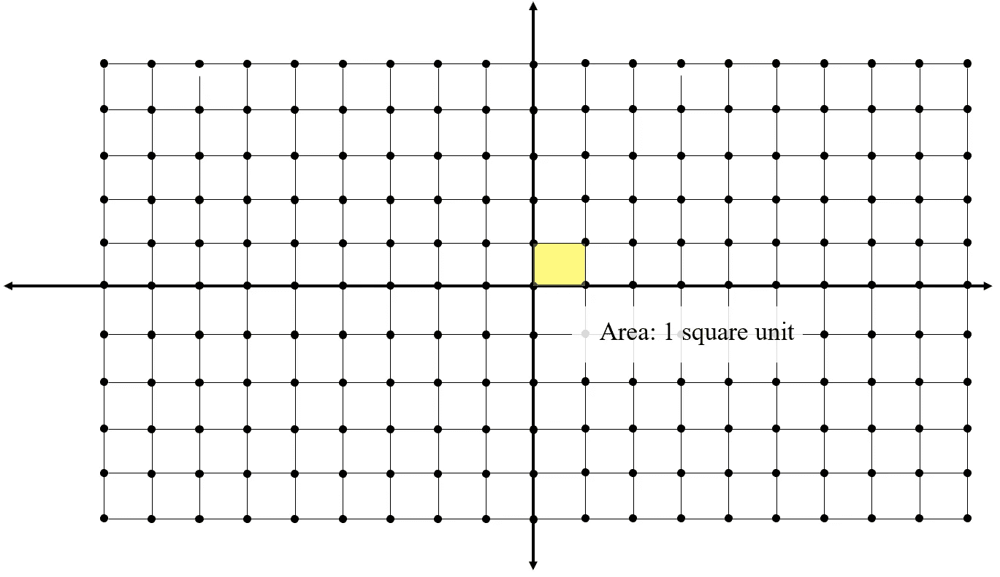

当空间被变换矩阵拉伸时，新的区域是四个平方单位。因为面积增加了四倍，所以矩阵的行列式是四。

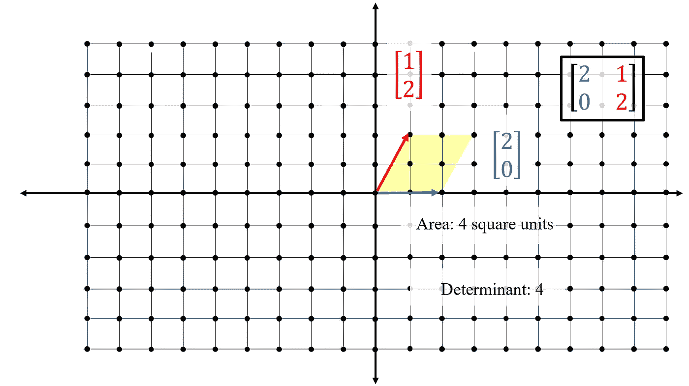

当行列式等于 0 时，正方形的面积折叠为零，这意味着描述轴的位置的两个向量在同一条线上。在这种情况下，所有的空间都被扭曲成一条线(一维)。通过设定行列式必须等于零的要求，多余的或平凡的解的空间可以被丢弃，使得方程更容易解。

因此，为了使先前设计的等式(容易)可解，首先矩阵的行列式必须等于零。

寻找特征值是一个求解二次方程的任务。对于 3+维矩阵，必须使用不同形式的行列式公式。

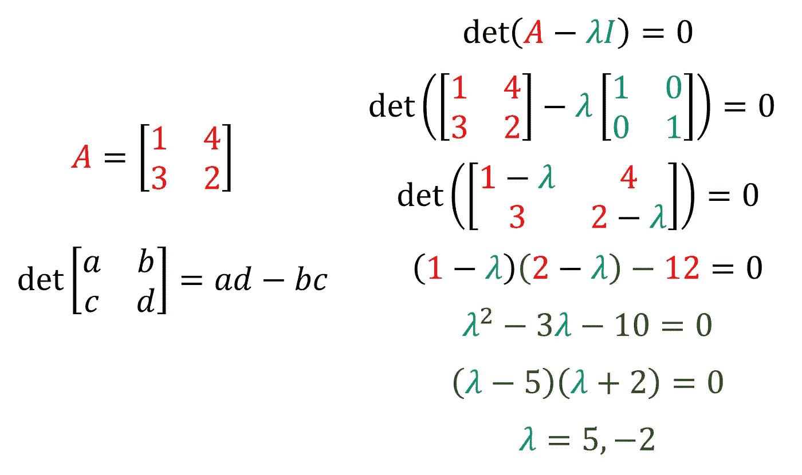

在这种情况下，矩阵`[[1, 4], [3, 2]]`的特征值是 5 和-2。这意味着当矩阵的特征向量乘以矩阵时，它们的向量长度将被拉伸 5 倍和-2 倍，分别对应于每个特征向量。通过将发现的特征值代入我们最初导出的方程，我们可以找到特征向量。

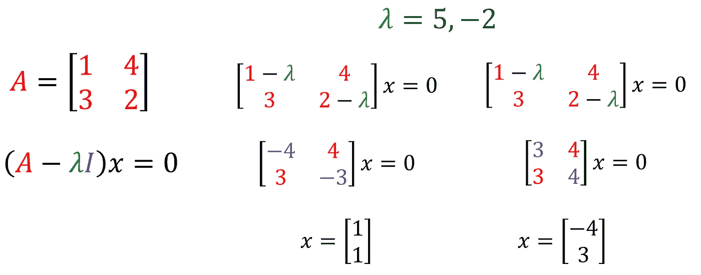

特征向量和特征值确实是矩阵的*瑰宝* *。*它体现了母体的精神和本质——*eigen*是德语中“先天”的意思。只要给定任何矩阵的特征向量和特征值，就可以很容易地完全重构原始矩阵。有了这个特殊的性质，特征向量几乎完全可以保证出现在任何有矩阵运算的地方。

例如，考虑主成分分析(PCA)，这是一种常见的无监督机器学习技术，旨在减少数据的维度，同时保留方差和均值等关键统计指标。例如，考虑一个 100 维的数据集，PCA 将尝试将其缩减为两维。首先，该算法构造一个协方差矩阵，该矩阵评估(在某种意义上)两个变量的相关程度。矩阵作为一个整体定义了数据的形状。

协方差矩阵的特征向量用于沿着最大方差线在 *x* 和 *y* 轴之间重新定向数据。本质上，特征向量被用作矩阵的快照，它告诉算法哪些区域要放大，哪些区域要去噪。特征向量和特征值的无数其他应用，从机器学习到拓扑学，都利用了特征向量提供了如此多关于矩阵的有用信息的关键特征——应用于从寻找四维立方体中的旋转线到压缩高维图像到谷歌的搜索排名算法的任何地方。

也许特征向量和特征值如此特殊的原因是因为它的定义——向量的方向保持不变，而它们周围的空间是扭曲的，永远指向矩阵的真正美丽。

如果您喜欢，您可能还会喜欢微积分入门，这是一个与线性代数一样重要和迷人的数学领域:

[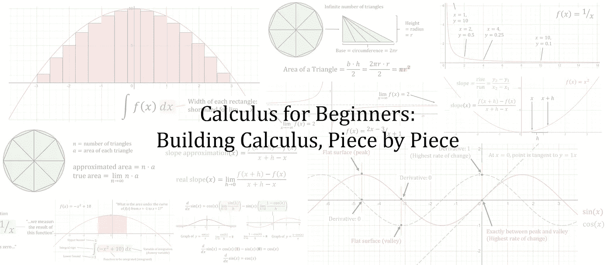](https://medium.com/@andre_ye/calculus-for-the-beginner-building-calculus-piece-by-piece-9370f158ee89)

点击上方！^