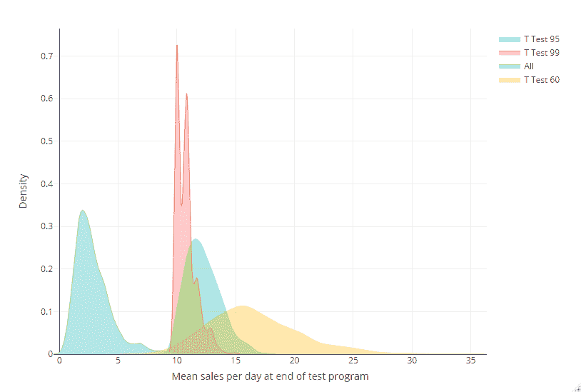
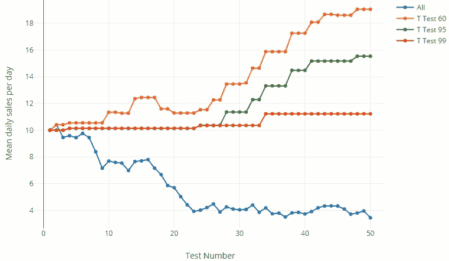

# 模拟的乐趣

> 原文：<https://towardsdatascience.com/the-joy-of-simulation-9906f1d5c604?source=collection_archive---------54----------------------->

## 使用蒙特卡罗模拟来设置测试参数和选择算法

统计学家的天堂(照片由约翰·施诺布里奇在 T2 的 Unsplash 上拍摄)

在拥挤的领域中，数据科学中最棘手的问题之一是为一项任务选择正确的方法和工具，这项任务没有“基础事实”来比较不同的选项。我说的“基本事实”是指你试图预测或评估的真实结果的例子。

例如，如果你想知道 ARIMA 和预言家谁更擅长预测冰淇淋销量，你可以选择过去的某个日期，比如说，你卖了 10 个冰淇淋，如果 ARIMA 预测了 4 个，预言家预测了 11 个，你就知道预言家更好，因为它最接近现实，即“基本事实”。简单！好的，通常情况下*没有*那么容易，但是原理很简单…

但是，如果你想弄清楚是温度还是一周中的哪一天对冰淇淋的销售影响最大呢？或者你卖了多少多冰冰淇淋，因为所有的“天气热，也许买些冰淇淋？”你上周在镇上张贴的海报(看，广告不是我的强项…)？这里你没有“地面真相”,因为你不知道温度和星期*到底有什么影响，也不知道你的海报*到底有多有效。你所知道的是，不同的方法和软件包会产生对这些值的不同估计，但是要说出这些估计中哪些是好的，哪些是不太可靠的是很棘手的，因为你没有东西可以对它们进行比较(除了彼此之外)。**

那怎么办呢？在这些情况下，一个很好的工具是简单的蒙特卡罗模拟。这些模拟以 20 世纪 40 年代摩纳哥的蒙特卡洛赌场命名，本质上包括构建您感兴趣的任何系统的虚拟版本，然后大量运行各种场景以生成问题的“暴力”解决方案。

因为建立这些模拟通常很简单，通常只需要几行代码就可以实现，一旦概率数学变得困难，通常更容易依靠蒙特卡罗模拟。对于任何经常处理复杂概率问题的人(即任何数据科学家/分析师)，这使他们成为一个无价的工具。

它们对“没有事实根据”的问题有什么用？使用蒙特卡洛模拟，你可以创建一个你正在处理的情况的粗略副本，然后*创建你自己的基本事实*来比较不同的方法。

# 总是关闭

这一点很重要(Gif 来自 GIPHY)

让我们用一个例子来说明:假设你是一个统计员，任务是为销售代理销售房地产时使用的销售脚本开发一个测试策略。你掌握的信息是:

*   销售代理平均每天销售 10 件商品，正态分布，标准差为 4
*   你的老板今年想要测试大约 50 个想法。考虑到测试的限制，每个测试将按 50:50 的比例进行，每个桶中有 50 个代理
*   相对于之前的脚本，任何新脚本的提升平均分布在+10%和-15%之间(即任何给定的新脚本都有 40%的机会产生积极影响)

您有四个测试选项:

1.  置信水平为 95%的单尾 T 检验
2.  置信水平为 99%的单尾 T 检验
3.  置信水平为 60%的单尾 T 检验
4.  推出每一个新剧本！

现在，解决这个问题的一个方法是拿出笔和纸，做一大堆代数运算，算出哪种策略是最优的，如果这能让你高兴的话:请便！但是如果你和我一样，你可能会发现建立一个蒙特卡洛模拟更容易，然后让它为你做所有困难的工作。

让我们这样做，运行上面的场景，比方说，500 次，看看我们用每种测试策略得到什么结果。

这可能不是人们所期望的结果。这是怎么回事？要回答这个问题，让我们看一下模拟的单次运行，看看测试的累积影响如何随着时间的推移而演变。如您所见，最宽松的测试标准(置信度为 60%)胜出，因为尽管它做出了相当多的错误判断，但它选择了如此多的获胜者，以至于最终的净效果总体上比其他更严格的测试设置更积极。

关键的一点是，在这个场景中，我们并不试图优化单个测试的结果，而是希望在一个*大型测试组合*中，最大化正确识别的赢家数量减去错误识别的输家数量。更一般地说，如果一个人正在做大量的测试，他通常可以对任何一个给定测试的结果不太有信心。这也有一个令人高兴的结果，通常意味着一个人可以在每次测试中得到更少的数据，从而可以在可用的时间内进行更少的测试或更多的测试，但是我离题了。

现在，你可能会反对创建广告脚本的人(或在通常的数据科学设置中:产品经理/领导层)很少坦率或能够说出类似“有趣的是，我们实际上 60%的时间都是错误的”这样的话，所以事情可能不像我的例子中那样明确？

然而，蒙特卡洛模拟的美妙之处在于，人们可以非常灵活地看到不同的场景是如何发生的。也许销售线索[很弱](https://www.youtube.com/watch?v=mikCQoDG2Ls)，你想知道这会如何影响你的测试？也许[三等奖是你被解雇了](https://www.youtube.com/watch?v=Lbp3ozjl-qM)所以你想采取更安全的策略，最大化获得高于某个阈值的结果的概率，而不考虑期望值？或者如上所述，你暗自怀疑新销售脚本的成功率不会那么高？所有这些场景都可以插入到模拟中，以查看它们可能如何实现，通常只需对代码进行小的更改。

# 建造你的赌场

在构建这些模拟时，您可以自己生成数据，就像我上面所做的那样，创建与您感兴趣的数据分布相匹配的随机数集*。您通常可以用不到 100 行代码构建一个半体面的模拟，当然，您可以根据自己的喜好将这些代码变得复杂。但是，要小心高度复杂的模拟，因为它们会失去一些简单的解释能力，而这种能力使它成为一种有吸引力的工具。

另一种方法是从您感兴趣的系统中获取实际数据，并根据您感兴趣的内容对其进行修改。因此，在上面的示例中，我们将采用实际的销售历史，并根据模拟的测试影响向上或向下调整销售额。这样做的好处是，你可以更加确信模拟与现实相符，坏处是，如果你想了解数据分布的变化如何影响结果，你的控制力会小得多。

*另一个快速题外话:不要假设你所有的数据都是正态分布的，因为当它不是真的时，它会狠狠地咬你一口！例如，大多数销售分布是不正常的，少数销售人员/产品/广告推动了大部分销售。

# 数据科学家最好的朋友

如果你还没有被说服，喜欢这种方法的另一个原因是，当与利益相关者交谈时，模拟通常更直观。人们可以更容易地谈论所做的假设，为什么某些结果/运行会以这样的方式结束，以及输入假设的变化如何影响结果。我倾向于发现利益相关者比“我做了一船复杂的概率数学，你最好希望我没有搞砸”更容易接受这一点。

我保证我做对了(照片由[罗马法师](https://unsplash.com/@roman_lazygeek?utm_source=medium&utm_medium=referral)在 [Unsplash](https://unsplash.com?utm_source=medium&utm_medium=referral) 上拍摄)

因此，如果您不确定哪个因果影响/提升产品包适合您的特定问题和数据分布，该怎么办？需要检查您的多元回归是否正确地调整了系数？不确定您的算法对不断变化的环境的响应速度有多快？无法确定统计测试是否适用于您的数据分布？给你的老朋友蒙特打个电话。