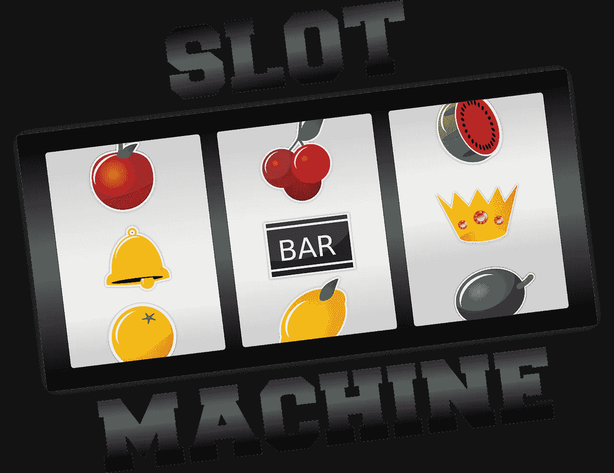
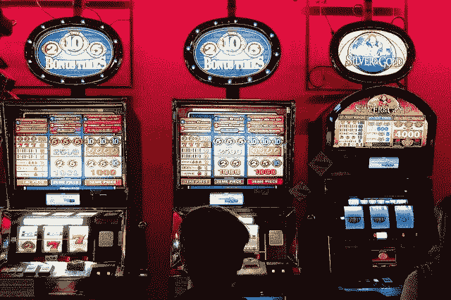
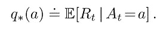
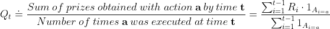
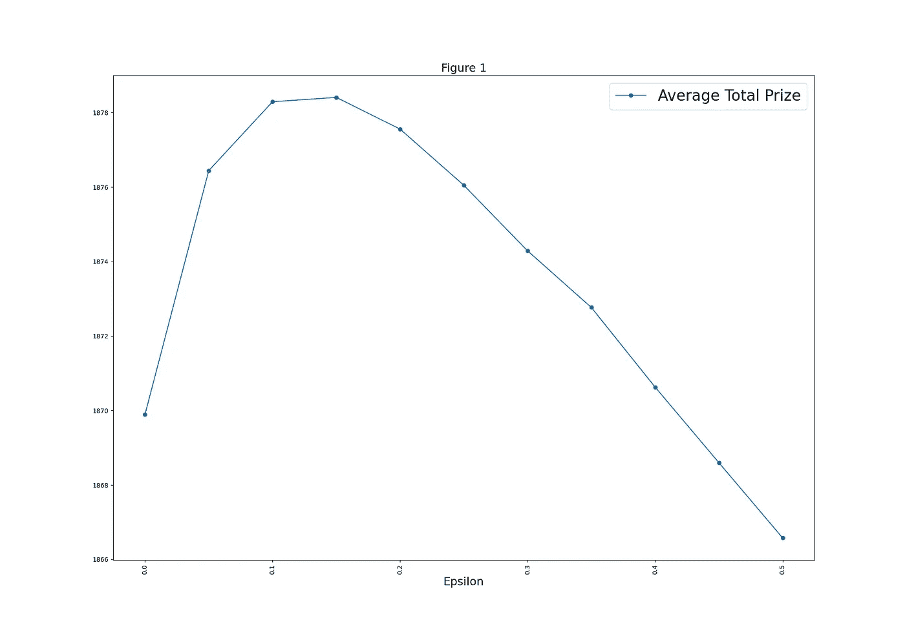
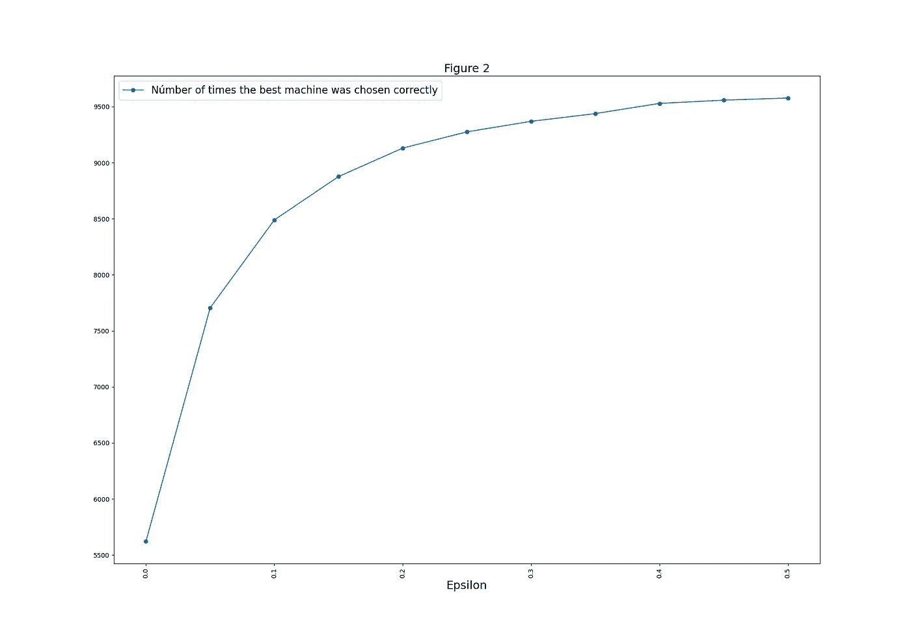

# 强化学习中的 K-bandit 问题

> 原文：<https://towardsdatascience.com/the-k-bandit-problem-with-reinforcement-learning-440b2f3ddee0?source=collection_archive---------30----------------------->

## 强化学习的基本概念



图片来自 [Pixabay](https://pixabay.com/es/vectors/m%C3%A1quina-tragaperras-casino-frutas-159972/)

# 强化学习中的基本问题

强化学习中一个非常重要的部分是如何评估代理执行的动作。在本帖中，我们将使用 K-bandit 问题来展示评估这些行为的不同方法。重要的是要记住，K-bandit 问题只是许多强化学习情况的一个简单版本。这很简单，因为代理执行的操作是单独评估的，不像其他技术那样，评估是在一系列操作上完成的。

# K-bandit 问题

想象一下，你在一个被 4 台不同的老虎机包围的赌场里。每台机器根据不同的概率法则给你不同的奖励。你的工作将是最大化这些机器给你的奖励，并发现哪一台机器有更好的奖励。你将通过在机器上试验和玩一千次来做到这一点！奖品和获得这些奖品的概率不会随着时间而改变。

你会使用什么策略来最大化奖励和发现最好的机器？也许第一种方法是在机器上玩相同的次数(每台 250 次)。然而，在给我们更好奖品的机器上玩得更多不是更好吗？如果我们选错了机器怎么办？

正是因为这些问题，我们需要协调我们的行动。有时探索会更好(尝试在不同的机器上玩)，有时利用我们的知识会更好(在我们认为最好的机器上玩)。



图片来自 [Pixabay](https://pixabay.com/es/photos/casino-juego-de-azar-3260387/)

在我们继续解决这个问题之前，我将介绍一些贯穿整个问题的符号:

*   在时间 t 执行的 Aₜ=The 动作。(在示例中，这将是机器
*   在第 t 步获得 Rₜ=The 奖
*   q∫(a)=执行行动 a 时的预期奖励，数学上是:



期望奖金 q∑(a)是这个问题中最重要的值，因为如果我们发现它的真实值，我们就知道应该一直在哪个机器上玩。通常这个值是未知的，这就是为什么我们需要在不同的机器上探索(玩)来估计期望值。随着时间的推移，我们将得到期望值的更好的近似值(如果我们可以无限地玩下去，我们将得到精确的值)。近似值使用的符号是 Qₜ(a).这是对时间 t 时 a 的期望值的估计。

# 估计代理行动的期望值

有许多方法可以估计行动的期望值(Qₜ(a)).这里我们将使用对我来说最自然的方法。该方法将执行某个动作获得的所有奖励相加，这将出现在分子中，并将除以该动作执行的次数:



借助于这个方程，随着时间的推移，Qₜ(a 的值将更接近于 q∑(a ),但探索和利用不同的可能行动将是很重要的。在本文中，ε-贪婪方法将被用来探索。这是一个非常简单的方法，因为我们唯一要做的事情就是选择一个被计算为更好的选项，但是有一定的概率(ε)随机尝试不同的动作。所以我们假设ε=.1 成立，那就意味着时间上一千步，会选择 900 次最佳选项(exploit)，做 100 次探索。

# 使用 Python

既然已经定义了问题并描述了解决问题的方法，我们将使用 python 来解决它。所以是时候打开你最喜欢的 IDE 开始编码了！我将一段一段地描述和解释代码，并将它完整地放在最后。你可以完全复制它，如果有疑问，检查具体的作品。对于这个程序，我们将只使用两个库，因此我们将继续导入它们:

```
###Import necessary libraries
import random as rd
import numpy as np
```

第二步是创建两个辅助函数。第一个辅助函数将帮助我们模拟概率结果。这个函数将抛出一个介于 0 和 1 之间的随机数。如果随机数的结果低于我们定义的数，函数将返回 true，否则将返回 false。

```
###Define a random number in the interval [0,1] to simulate results of
###probabilistic experiments.
def decision(probability):
return rd.random() < probability
```

第二个函数是ε-贪婪算法，它将决定在哪个机器上玩。它可以是期望值最高的机器，也可以是随机的机器。

```
### Choose which machine to play following the E-greedy method.
def greedy(no_machines,probability):
aux=decision(probability)
if(aux==True):
index=rd.randint(0,len(no_machines)-1)

else:
index=np.argmax(no_machines)
return index
```

为了测试不同的想法，我们将多次执行该算法。在这种情况下，我们将为每个循环播放 1000 次，重复循环 10000 次，并尝试ε=[0，. 05，. 1，. 15，. 2，. 25，. 3，. 35，. 4，.. 45，.. 5]。这样我们就会知道我们应该对我们的知识有多贪婪。让我们首先定义有助于实验的变量。

```
### This variable holds the real probability of winning that each machine has.
### This variable is unknown to the player and it is what we'll try to estimate. 
prob_win=[.8,.85,.9,.7]
### We will try different epsilons to see which one is better. 
epsilon=[0,.05,.1,.15,.2,.25,.3,.35,.4,.45,.5] ###Variables that hold the total for each different simulation(E=(0,.1,.2,...).
p_total_reward=[]
p_chosen_machine=[]
```

鉴于问题 3 的结构，循环是必要的:

*   第一个循环将用于遍历所有ε=[0，. 05，. 1，. 15，. 2，. 25，. 3，. 35，. 4，. 45，.. 5]。
*   第二个循环在每个游戏中都有 10，000 个循环。
*   第三个循环进行了 1000 次。

代码:

```
for j in range(len(epsilon)):
    ### Here the evolution of the algorithm can be seen. This variable shows
    ### the evolution of the average prize. With the average prize the performance
    ### of the algorithm is shown.
    average_prize=[]
    ###Variable that holds the total prize for each iteration.
    total_reward_acum_g=[]
    ###At the end of each cycle we will choose the machine that has the highest
    ###expected prize and save it in this variable.
    chosen_machine_g=[]
    for x in range(10000):
        ###The algorithm will be tested many times to see it's performance
        ### variable that indicates the prize by playing 1000 times.
        total_reward=0
        ### Number of times played
        i=0
        ### Númber of times played over each machine.
        iteraciones_por_accion=[0,0,0,0]
        ### The expected prize over each machine. The value is started at 10
        ### so that initially all machines are tested.
        expected_prize_action=[10,10,10,10]
        for x in range(100):
          ###Index is the machine that was chosen to play with
          index=greedy(expected_prize_action,epsilon[j])
          ###Esta parte emula si ganaste o perdiste   
          res=decision(prob_win[index])
          if (res==True):
              g=2
          else:
              g=1
          ###Total reward   
          total_reward=total_reward+g
          i=i+1 
          #Total average prize
          average_prize.append(total_reward/i)
          ###Number of times played per machine.
          iteraciones_por_accion[index]=iteraciones_por_accion[index]+1
          ###Update the value of the expected prize
          expected_prize_action[index]=(expected_prize_action[index])+(1/iteraciones_por_accion[index])*(g-expected_prize_action[index])
        ###results after playing 1000 times
        total_reward_acum_g.append(total_reward)
        chosen_machine_g.append(np.argmax(expected_prize_action))
    print(epsilon[j])
    print("On average "+str(sum(total_reward_acum_g)/len(total_reward_acum_g))+" points were obtained.")
    print("The machine was chosen correctly " +str(chosen_machine_g.count(np.argmax(prob_win)))+" times.")
    p_total_reward.append(sum(total_reward_acum_g)/len(total_reward_acum_g))
    p_chosen_machine.append(chosen_machine_g.count(np.argmax(prob_win)))
```

最后，我们将使用 matplot 库在绘图中可视化结果。

```
import matplotlib.pyplot as plt
values=p_total_reward
values2=p_chosen_machine
eje_x=epsilon
eje_x[-1]
fig, ax = plt.subplots(figsize=(20, 14)) 
plt.xticks(rotation=90)
plt.plot(eje_x,values , marker ="o",label = "Average Total Prize");

ylabels = ['{:,}'.format(int(x)) + "K" for x in ax.get_yticks()*(1/1000)]
plt.legend(prop={'size': 24})
plt.title("Figure 1", fontdict=None, loc='center', pad=None,fontsize=18)
plt.xlabel("Epsilon", fontdict=None, labelpad=None,fontsize=18)
```



观察“图 1 ”,我们认识到当我们设置ε=0.15 时，达到最大奖励

这意味着 15%的时间用来探索是方便的，其余 85%的时间是贪婪的。现在，对于问题的第二部分，我们要求算法告诉我们它认为哪台机器最好。让我们也用图表来看看这个:

```
import matplotlib.pyplot as plt
valores2=p_chosen_machine
eje_x=epsilon
eje_x[-1]
fig, ax = plt.subplots(figsize=(20, 14)) 
plt.xticks(rotation=90)
plt.plot(eje_x,values2 , marker ="o",label = "Númber of times the best machine was chosen correctly");
#plt.plot(x, y, marker ="o", label = "Modelo Atribución");
ylabels = ['{:,}'.format(int(x)) + "K" for x in ax.get_yticks()*(1/1000)]
plt.legend(prop={'size': 16})
plt.title("Figure 2", fontdict=None, loc='center', pad=None,fontsize=18)
plt.xlabel("Epsilon", fontdict=None, labelpad=None,fontsize=18)
```



图 2 向我们展示了，随着探索的深入，算法倾向于更准确地选择最好的机器。这是一个显而易见的结果，因为有了更多关于不同机器的信息，我们就能更好地选择。然而，这伴随着一个奖励，因为做更多的探索伴随着降低奖励的成本。

# 更进一步

本文只是对 k-bandit 问题的初步探讨，所以对于感兴趣的读者，我想留下一些问题供您思考:

1.  如果我们玩 100 次而不是 1000 次，ε的结果会不同吗？
2.  如果这些机器给出的奖品大相径庭，ε会有什么变化？
3.  随着时间的推移，改变ε是否方便？
4.  这三个问题有什么联系？

非常感谢您的关注，希望能再次见到您。您可以提前找到并运行代码。

*原载于 2020 年 9 月 22 日*[*【https://datasciencestreet.com】*](https://datasciencestreet.com/the-k-bandit-problem-with-reinforcement-learning/)*。*