# 创建协同过滤音乐推荐系统的关键

> 原文：<https://towardsdatascience.com/the-keys-building-collaborative-filtering-music-recommender-65ec3900d19f?source=collection_archive---------9----------------------->

西蒙·诺在 [Unsplash](https://unsplash.com/s/photos/music?utm_source=unsplash&utm_medium=referral&utm_content=creditCopyText) 上的照片

## 接下来该放哪首歌？

“ …

*哦，我是个幸运的人，*

*用双手去数我爱的人*

*[…。】*

*跟我在一起，*

*我们深呼吸*

…”—我开始喃喃自语我最喜欢的一首歌

我仍然记得在音乐会上唱过这首歌。

尽管这不是我的第一场演唱会，但这是我用第一份工资全额支付的第一场演唱会。

大概是我在写关于基于内容的推荐系统的时候想到了这个问题。

从广义上来说，**推荐器**(或推荐)**系统**(或引擎)是一个过滤系统，其目的是预测用户对一个项目的*评级*或*偏好*:在我们的例子中是一首歌。

在推荐系统中，最常用的是*基于内容的过滤器*和*协同过滤器。*

> 基于内容的方法基于两首歌曲内容或属性的相似性给出推荐，而协作方法使用不同歌曲的评级矩阵来预测可能的偏好。

我们有兴趣了解 ***协同过滤器*** 是如何工作的。该算法的目的是学习一个可以预测用户是否会从某个项目中受益的函数——这意味着用户可能会听一首歌。

为此，这种类型的过滤仅依赖于用户对一组歌曲的历史偏好。

1 答案是我们在日常生活中使用的东西:**评级**。

收集用户评分有两种方式。

第一种是通过使用**明确评级**，这意味着我们明确要求用户给出一个评级。这代表了来自用户的最直接的反馈，以显示他们有多喜欢一首歌。

第二种采用**隐性评级；**例如，我们检查用户是否听了一首歌，听了多长时间或多少次，这可能表明他/她喜欢那首特定的歌。

这些评级可以转化为二进制(用户听或不听一首歌)，离散(1 到 5 颗星)，或某人听一首歌的次数，或连续数字(用户听一位艺术家的总时间)。

收集评级后，我们可以生成互动矩阵。

**交互矩阵**基于许多条目，包括用户-歌曲对以及代表用户对该歌曲的评级的值。

用户给特定的歌曲评级

一般来说，这些相互作用矩阵是巨大的(百万行百万列)，非常稀疏并且充满了缺失值。*为什么？*因为大多数项目没有被特定用户看过或评价过。

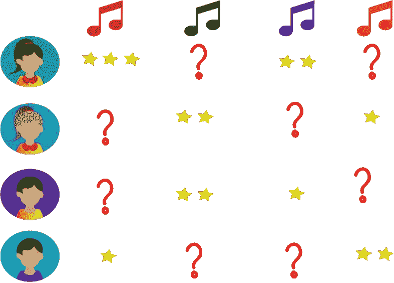

显示每个用户对特定歌曲的评价的矩阵。

在我们的例子中，我们将使用 [**百万首歌曲数据集**](http://millionsongdataset.com/) ，这是一百万首当代流行音乐曲目的音频特征和元数据的免费集合。

有两个文件会让我们感兴趣。

第一个文件给出了关于用户 ID、歌曲 ID 和收听次数的信息。我们可以从`static.turi.com/datasets/millionsong/10000.txt`开始读。

第二个文件将包含歌曲 ID、歌曲标题和艺术家姓名。我们可以从`static.turi.com/datasets/millionsong/song_data.csv`开始读

合并这两个文件后，我们最终得到一个数据集，其中包含 200 万个观察值，9567 首不同的歌曲和 76353 个不同的用户。

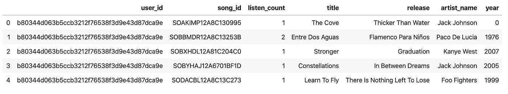

我们将使用`listen_count`，用户听一首歌的次数作为一个隐含的评级。

做一些探索性分析，我们可以发现用户平均听 26 首歌曲，平均听 16 首歌曲。

我们可以很快看到，并不是所有的用户都听所有的歌。所以`song x users`矩阵中的很多值都将为零。因此，我们将处理极其稀疏的数据。

处理这样一个稀疏矩阵，我们会占用大量的内存和资源。为了让我们的生活更容易，让我们只选择那些已经听了至少 16 首歌曲的用户。

我们现在需要使用`scipy-[sparse matrix](https://en.wikipedia.org/wiki/Sparse_matrix)`来避免溢出和内存浪费。为此，我们将使用`scipy.sparse`中的`[csr_matrix](https://docs.scipy.org/doc/scipy/reference/generated/scipy.sparse.csr_matrix.html)`函数。

首先，我们将根据来自作为索引的`song_id`和作为列的`user_id`的唯一值来重塑数据，以形成作为结果的`DataFrame` *的轴。*

然后，我们将使用函数 [pivot](https://pandas.pydata.org/pandas-docs/stable/reference/api/pandas.DataFrame.pivot.html) 生成一个[透视表](https://en.wikipedia.org/wiki/Pivot_table)。然后，我们将把这个表转换成一个稀疏矩阵。

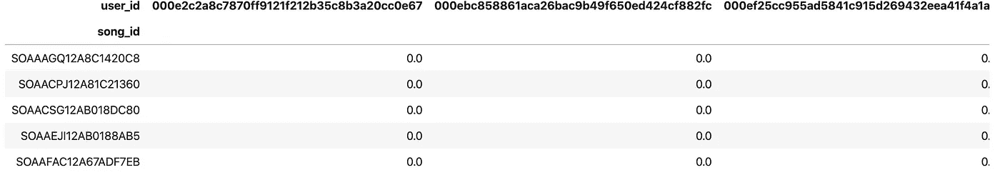

正如我们可以观察到的，许多值等于零。这表明用户没有听过该歌曲。

2那么，协同过滤器是如何向特定用户推荐歌曲的呢？有两种主要方法可以做到这一点。

它找到具有相似兴趣和行为的用户，并考虑这些相似用户所听的内容，然后做出推荐。这种技术被称为 ***基于用户的方法*** (或用户项目)。

或者它可以考虑用户过去考虑过什么歌曲，并推荐用户可以欣赏的新的类似歌曲；一种技术叫做 ***基于项目的方法*** (或项目-项目)。

3协同过滤器用什么算法推荐新歌？有几种机器学习算法可以用于协同过滤的情况。其中，我们可以提到最近邻、聚类和矩阵分解。

让我们来看看它们。

K**-最近邻(kNN)** 被认为是基于用户和基于项目的协同过滤方法的标准方法。

在我们研究这个算法在推荐系统中的具体应用之前，我们将解释 kNN 是什么。

kNN 算法是一种监督的非参数[惰性学习](https://en.wikipedia.org/wiki/Instance-based_learning)方法，用于分类和回归。

*监督*因为它需要标记的数据点才能工作。

*非参数*因为它不对数据分布做任何假设。

*懒是因为没有使用训练数据点做泛化；它被延迟到测试阶段。*

*这种算法是基于特征相似性的——我们可以开始看看它可以用于推荐系统的什么东西。*

*它基本上假设相似的东西彼此靠近。在这里[距离](/how-to-measure-distances-in-machine-learning-13a396aa34ce?source=friends_link&sk=adb1f38fb6c7cb31b6f2f992ad7bddbf)再次测量两点有多相似或“接近”。*

*想象一下，我们必须将一个数据点分为两类。*

*我们有两个属性来描述不同的点。如果我们在 x-y 图中表示点及其属性，它看起来会像这样:*

*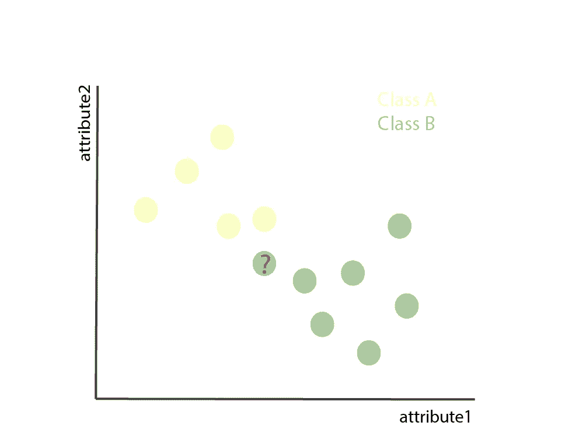*

*现在，kNN 算法如何知道这个新点属于黄色还是绿色类别？*

*首先，它会查看它的 ***k*** 最近邻居。然后，它将通过在这些 k 点中投票选出最受欢迎的类来确定该点应该具有哪个类。*

*让我们来看看实际情况。如果在我们的例子中 k = 5，我们需要取 5 个最近的邻居如下:*

*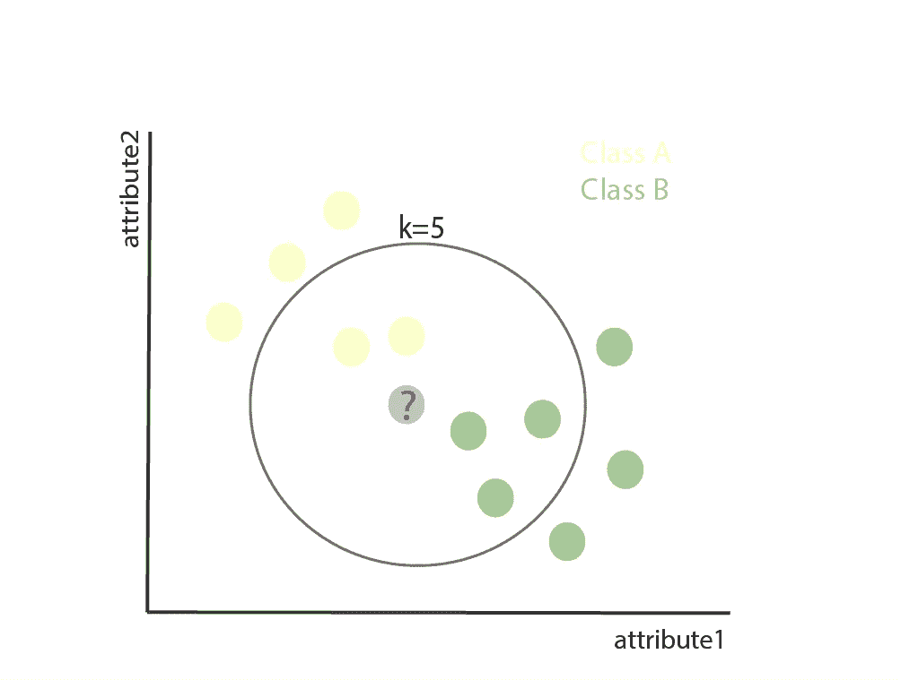*

*因此，我们有 3 个点属于绿色类，2 个点属于黄色类。所以我们的新数据点被归类为绿色。*

*注意这里。k 的选择非常重要，因为在我们的情况下，如果我们设置 k=3，新的数据点将被分类为黄色。*

*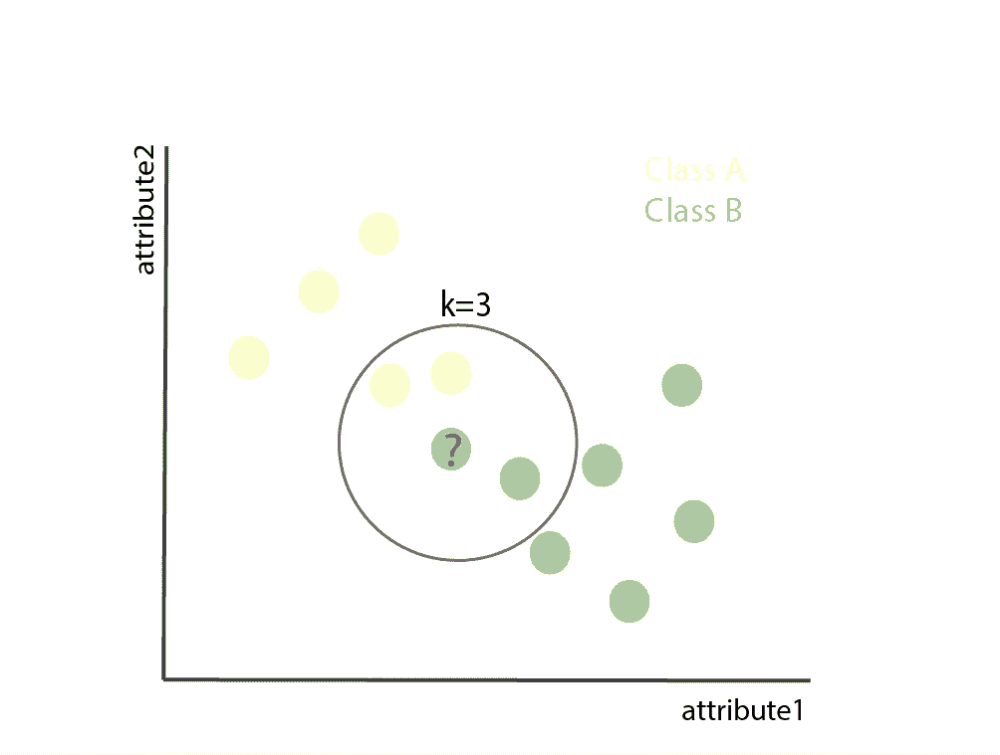*

*当我们使用 kNN 对一首歌曲进行预测时，该算法将计算目标歌曲与数据集中每首其他歌曲之间的距离。*

*然后，它会根据它们的距离进行排序。最后，它将返回前 k 首最近邻歌曲作为歌曲推荐。*

*让我们使用`Python 3.7`建立一个推荐系统，它依赖于 k 个最近邻居来推荐歌曲。*

*为此，我们将创建一个名为`Recommender`的类。我们不会在这里描述整个类，相反，我们将关注它内部的主要函数。*

*我们将使用`scikit-learn`中的`NearestNeighbors`方法。这种方法需要几个我们应该仔细选择的参数。*

1.  ***度量**:要使用的距离度量。我们将使用`cosine`*
2.  ***算法**:用于计算最近邻的算法。我们将使用一个`brute`强制算法。*
3.  ***n_neighbors:** 用于查询的邻居数量。我们要用`20`。记得我们之前提到过，这个参数非常重要。*

*我们还需要使模型符合数据。为此，我们将使用之前获得的稀疏矩阵。*

*现在，我们可以使用这个拟合的模型来推荐新歌。*

*我们如何做到这一点？我们只需要输入歌曲并从歌曲中获取`kneighbors`。该模型的这个属性还告诉我们，我们的歌曲与推荐的歌曲有多接近，从而允许我们对它们进行排序。*

*因为系统将输出歌曲的 id，而不是标题，所以我们将创建一个函数，将这些索引与歌曲标题进行映射。*

*如果我要做推荐，我们就不会有`id`。我们只知道标题。而且有时候这个名字的写法不一样。*

*我们如何解决这个问题？克服这一点的方法是将新歌曲的字符串与数据集中所有歌曲的字符串进行近似匹配，并确定它们的相似程度。*

*如果我们找到一首相似的，我们就选这首歌。*

*我们将使用一种叫做[模糊匹配](https://www.datacamp.com/community/tutorials/fuzzy-string-python)的普通技术来完成这项工作。我们将使用库`[fuzzywuzzy](https://pypi.org/project/fuzzywuzzy/)`。*

*这个方法使用 [Levenshtein Distance](https://en.wikipedia.org/wiki/Levenshtein_distance) ，它测量将一个单词序列更改为另一个单词序列所需的最少编辑次数。这些编辑可以是插入、删除或替换。*

*我们现在已经有了我们的推荐系统。所以是时候用了。*

*我们首先需要创建一个字典，根据歌曲的 id 对歌曲标题进行解码。这将被传递给推荐者。*

*然后，我们将推荐歌曲`I believe in miracles`。让我们看看我们有什么！*

*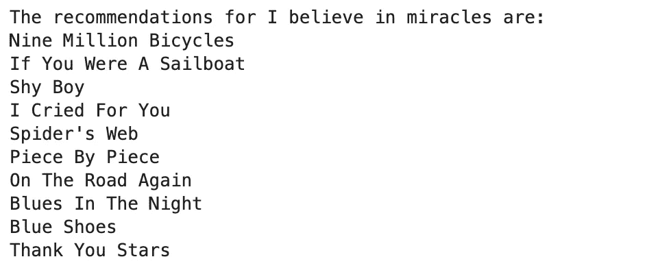*

*这种方法有一些限制。它没有很好地处理稀疏性，并且当我们有更多的用户或歌曲时，它的计算效率不高。*

*为了克服这些限制，我们可以使用其他方法，如矩阵分解。*

*矩阵分解是一种实现推荐系统的强大方法。其背后的思想是在一个低维的潜在空间中表现用户和物品。*

*因此，换句话说，矩阵分解方法将原始的稀疏用户项矩阵分解成具有潜在特征的较低维度的稀疏矩形矩阵。*

*这不仅解决了稀疏性问题，而且使该方法可扩展。不管矩阵有多大，你总能找到更低维度的矩阵，它们是原始矩阵的真实代表。*

*但是什么是潜在特征呢？为什么它对推荐系统有意义？*

*想象一下，一个用户给了下面几首歌很好的评价:*通往地狱的公路(AC DC)* ，*野兽的数量*，*，【铁娘子】，*水上烟(深紫色)。*

*我们可以把它们看作三个独立的等级。然而，如果我们的目的是找到一种更简单的方式来表达他们的偏好，我们可以说他们喜欢硬摇滚 T2。*

*`Hard Rock`是一个**的潜在特征**。它们是通过更高层次的属性来表达的，而不是具体的歌曲。*

*矩阵分解将告诉我们一个用户与一组特征有多少关联，以及一首歌有多少属于这组潜在特征。*

*这提供了一个优于其他协作过滤的优势:尽管两个用户没有评价过任何相同的歌曲，但如果他们共享相同的潜在特征，我们仍然可以找到他们之间的相似性。*

*在不同的矩阵分解技术中，我们发现了流行的*奇异值分解(SVD)* 。*

*当我们深入研究数学基础时，这可能是一个抽象的概念。但是我们会尽量保持简单。*

*假设我们有一个矩阵 A，包含 n 个用户 x m 首歌曲的数据。这个矩阵可以唯一地分解成 3 个矩阵；姑且称之为 **U** 、 **S** 和 **V** 。*

*就我们的歌曲推荐者而言:*

*- **U** 是一个 *n* 用户 x *r* 用户潜在特征矩阵*

***- V** 是一个 *m* 歌曲 x *r* 歌曲-潜在特征矩阵*

***-** **S** 是一个包含原矩阵奇异值的 *r x r* *非负*对角矩阵。*

*奇异值表示特定特征在预测用户偏好中的重要性。*

**对角矩阵*是主对角线外的元素全为零的矩阵。*

*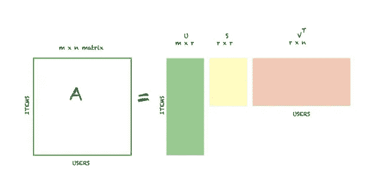*

*单值分解:任何 n×m 维的矩阵 A 都可以分解成三个矩阵 U，S，v。*

*这三个矩阵非常容易处理。此外，将它们相乘会给我们返回原始矩阵 **A** 。*

*我们以前研究过这些数据。我们知道一个用户平均听 26 首歌。经过进一步的探索，我们发现一首歌平均有 200 个用户在听，最少 48 个，最多 8277 个。*

*所以我们已经知道它是一个非常稀疏的矩阵。为了让我们的生活更轻松，让我们进一步过滤数据。我们将只选择那些至少被 200 个用户听过的歌曲。*

*我们将应用[宁滨](https://en.wikipedia.org/wiki/Data_binning)技术，而不是像现在这样使用隐式评级。*

*我们将定义 10 个类别。落在从 0 到 1 的区间内的原始数据值将被代表等级 1 所取代；如果它们落入 1 到 2 的区间，它们将被 2 所取代；诸如此类。最后一个类别将被赋予范围从 9 到 2213 的原始值。*

*现在让我们尝试采用矩阵分解的方法，使用 Python 3.7 和一个名为`surprise`的有趣库来推荐歌曲。*

****惊喜*** 是一个简单易用的 Python 库，专门为推荐系统设计。要安装惊喜，我们只需运行:`pip install surprise`。*

*运行推荐系统所需的软件包。*

*为了从我们的`DataFrame`加载数据集，我们将使用`load_from_df()`方法。*

*我们需要传递以下参数:*

*   ***df** —包含歌曲评级的数据帧。它必须有三列，分别对应于用户 id、歌曲 id 和收视率。*
*   ***阅读器**(`[**Reader**](https://surprise.readthedocs.io/en/stable/reader.html#surprise.reader.Reader)`)——一个阅读文件的阅读器。只需要指定`**rating_scale**`字段。*

*我们将为 [SVD](https://surprise.readthedocs.io/en/stable/matrix_factorization.html#surprise.prediction_algorithms.matrix_factorization.SVD) 使用内置函数。值得注意的是，这种实现(*由西蒙·芬克在网飞奖期间推广*)将一个矩阵分解为另外两个矩阵，然后使用梯度下降来寻找特征和权重的最佳值。*

*严格来说，这不是上面解释的数学 SVD。*

*相反，该算法将原始矩阵分解为两个低维矩阵的乘积。*

*第一矩阵具有包含与每个用户相关联的潜在特征的行。第二个具有包含与歌曲相关联的潜在特征的列。*

*首先，我们需要为我们的模型找到最适合我们现有数据的参数。*

*在交叉验证过程中，`[GridSearchCV](https://surprise.readthedocs.io/en/stable/model_selection.html#surprise.model_selection.search.GridSearchCV)`类将根据所选的参数组合为`SVD`算法计算准确性指标。这对于找到预测算法的最佳参数集非常有用。*

*`cross_validate`将为我们在网格搜索中找到的最佳估计值运行交叉验证程序，并报告准确性测量和计算时间。*

*这种方法使用`KFold`作为交叉验证技术。*

*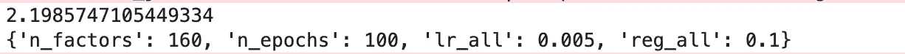**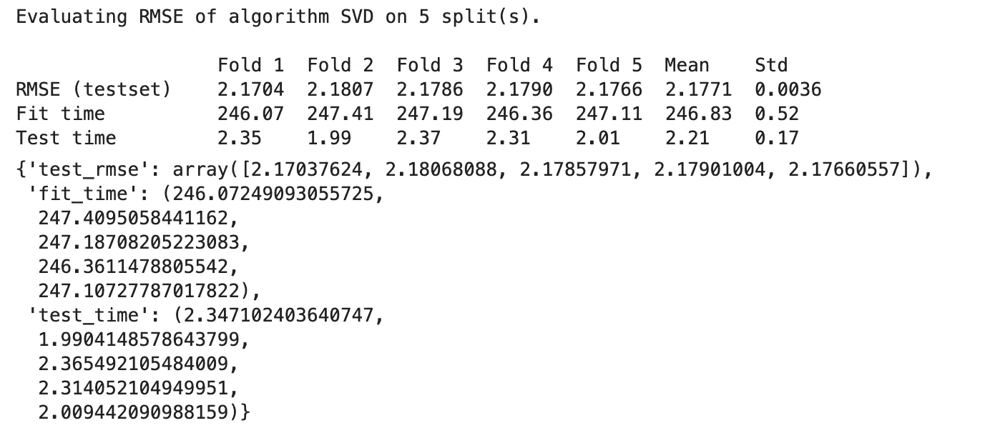*

*找到模型的最佳参数后，我们可以创建我们的最终模型。*

*我们可以使用方法`fit()`在训练集中训练算法，然后使用方法`test()`返回从测试集中获得的预测。*

**

*现在，我们可以得到用户对特定歌曲的评价:*

*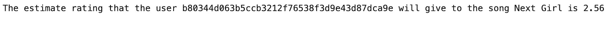*

*这个模型现在可以使用了！*

*如果您想了解代码的更多细节，可以看看我在 GitHub 中的 repo:*

* [## UGIS 22/音乐 _ 推荐者

### 一个推荐系统(或引擎)是一个过滤系统，其目的是预测一个评级或…

github.com](https://github.com/ugis22/music_recommender) 

如果您好奇并渴望阅读更多内容，请阅读以下资源:

Thierry Bertin-Mahieux、Daniel P.W. Ellis、Brian Whitman 和 Paul Lamere。
百万首歌曲集。《第 12 届国际音乐信息检索会议论文集
》(ISMIR 2011)，2011 年。

[k 近邻算法](/k-nearest-neighbors-knn-algorithm-bd375d14eec7)。

[基于 Python 的推荐系统——第二部分:协同过滤(K 近邻算法)](https://heartbeat.fritz.ai/recommender-systems-with-python-part-ii-collaborative-filtering-k-nearest-neighbors-algorithm-c8dcd5fd89b2)

[尺度模糊匹配](/fuzzy-matching-at-scale-84f2bfd0c536)

[在 PyTorch 中构建概率矩阵分解的音乐推荐引擎](/building-a-music-recommendation-engine-with-probabilistic-matrix-factorization-in-pytorch-7d2934067d4a)。

[基于 Python 的推荐系统——第三部分:协同过滤(奇异值分解)](https://heartbeat.fritz.ai/recommender-systems-with-python-part-iii-collaborative-filtering-singular-value-decomposition-5b5dcb3f242b)

人工智能-全合一。[第 16.3 讲](https://www.youtube.com/watch?v=9AP-DgFBNP4)和[第 16.4 讲](https://www.youtube.com/watch?v=YW2b8La2ICo)。*