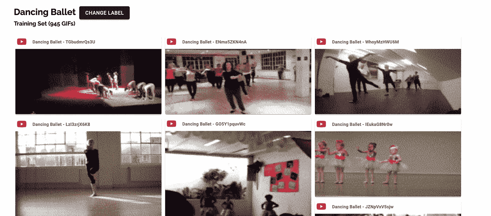

# 使用 gif 的动力学数据集浏览器

> 原文：<https://towardsdatascience.com/the-kinetics-dataset-explorer-using-gifs-8ceeebcbdaba?source=collection_archive---------33----------------------->

## 使人类更容易筛选动力学数据集



动力学数据集浏览器是一个网站，包含转换为 GIF 格式的动力学视频。使人们更容易快速筛选大量时态数据。生成的 gif 来自以比原始视频更低的频率采样的帧，即 4 fps 对 25 fps，并且得到的帧速率被调整为 16 fps。这意味着一个 10 秒的视频可以在大约 2.5 秒内被观看。宽度和高度也按比例缩小，以减小文件大小并加快加载速度。

点击下面的[链接](http://kinetics-explorer.com/)(或者去 http://kinetics-explorer.com/)可以找到探险家。博客文章的其余部分讨论了为什么(动机)和如何创建探索者以及所做的假设。

# 问题是

动力学数据集是用于人体动作识别的最重要的数据集之一。然而，该数据集非常大，包含大约 650，000 个视频，其中每个视频的持续时间为 10 秒。这意味着快速筛选数据集以理解类别背景可能具有挑战性。

这是因为通常视频倾向于顺序观看(而不是并行观看，例如 [YouTube](https://www.youtube.com/) vs [Giphy](https://giphy.com/) )。因此，为了获得视频中动作类别的整体时间结构，人们必须观看整个视频。因此，如果一个视频以 25 fps 的标准帧速率为 10 秒长，人眼需要扫描总共 250 帧才能掌握视频内的时间结构。

# 解决方案

视频只是一段时间内的图像序列，其中图像序列的顺序能够编码某种形式的时间信息，例如一个人跳舞、一个人走路或任何形式的位移，我们的大脑将其解释为运动。在一秒钟内压缩的图像序列越多，视频看起来越无缝，越接近真实世界的解释，例如，60 fps 的视频看起来比 25 fps 的视频更无缝。这意味着，如果帧速率足够高，视频是一种高密度的时间编码介质。

为了找到解决这个问题的好办法，我们需要考虑动作类别的时间同一性。这里，我指的是以高精度确保特定类别的动作已经发生所需的最小时间和帧速率。因此，可以认为视频在编码时间信息时包含大量冗余。这样，只有少量均匀采样的帧可以编码必要的时间标识。

为了找出正确的帧速率，我们需要考虑在什么时间分辨率下信息变得不连贯，并且不能以有意义的方式捕捉视频中动作的时间结构。

这个问题在图像中的相似之处是像素化，如下所示。


[https://miscellaneousdetails.com/tag/mona-chalabi/](https://miscellaneousdetails.com/tag/mona-chalabi/)

从上面的图像中，我们可以看出拍摄对象可能是一只老虎，但是，它是像素化的，即使用少量像素来表示图像。这意味着图像的空间同一性很低，因为我们不能清楚地说出它是什么。

增加像素数(从而降低像素化)将增加所讨论对象的空间同一性，代价是图像可能需要更大的内存。可以说，空间分辨率越大，对象的空间身份的可信度越高。存在一个限制，即增加更多的像素不会增加空间同一性。

将上述逻辑应用于视频，我们从连续的真实世界场景出发，该场景具有最高可能的时间分辨率(由于连续的性质)。分辨率约为 60 fps 的高质量视频编码(在上下文中，人眼的上限约为 1000 fps)。对于高质量的视频，大量的存储器用于存储时间信息，但是具有大量冗余。随着视频中更多的帧被均匀地移除，一些时间信息会丢失，直到视频编码不连贯的程度。这意味着我们不能根据时间信息来判断动作类别，即时间身份不确定。(然而，视频也包含空间结构，因此很容易纯粹根据图像判断视频中发生了什么，例如去游泳还是踢足球。这个因素是相当多的基于视频的深度学习算法所利用的，并且没有真正考虑时域)。

GIF 编码格式是解决这一问题的理想选择，因为:

*   它们通常具有比视频更低的帧速率，这意味着更低的时间分辨率/密度。
*   有默认的自动循环功能，允许多个 gif 连续播放。
*   在网络浏览器中被广泛采用。

因此，将动力学视频转换为 gif 可以为筛选大型视频数据集提供更有效的方法。

# 实施细节

实现 GIF 到视频的转换非常简单，如下所示。

```
subprocess.call([
'ffmpeg',
'-i', str(video_file),
'-filter_complex',
"[0:v] fps=4,scale={scale}:-1".format(scale='180'),
'-f', 'image2',
'-loglevel', 'warning',
'-y',
png_file
])subprocess.call([
'ffmpeg',
'-i', png_file,
'-f', 'gif',
'-framerate', '16',
'-loglevel', 'warning',
'-y',
str(gif_file)
])
```

[ffmpeg](https://www.ffmpeg.org/) 库用于进行转换，其中第一个`subprocess`调用用于以 4 fps 对原始视频进行统一采样，并将数据存储为图像。(从技术上讲，在此过程中直接创建 GIF 表示是可能的，但它将以 4 fps 播放，但仍需要 10 秒才能播放完视频)。`filter_complex`参数将视频重新缩放到 180 像素的宽度，同时保持宽高比

第二个`subprocess`调用用于以 16 fps 的帧速率从生成的 png 文件创建 GIF，这使得 GIF 的总长度为 2.5s，长度减少了 75 %。

## gif 的缺点

然而，gif 有一些缺点，其中之一是有时它们比视频需要更高的内存(cpu 和存储)。并且已经[建议](https://developers.google.com/web/fundamentals/performance/optimizing-content-efficiency/replace-animated-gifs-with-video)因为这个问题最好把 gif 转换成视频。还有其他文件编码，比如比这两种都更有效的 [webp](https://developers.google.com/speed/webp) ，但是，它没有像 GIF 格式那样被广泛采用。

然而，主要概念保持不变，即通过从源视频中统一提取帧来降低时间分辨率。将提取的帧与新的帧速率组合，以减少相对于源视频的持续时间。

# 对深度学习的启示

一些深度学习论文提到了子采样帧的想法，例如[让我们跳舞:从在线舞蹈视频中学习](https://arxiv.org/pdf/1801.07388.pdf)论文。然而，据我所知，还没有关于视频数据中最佳子采样频率的研究。由于标准视频数据(例如 YouTube 中的)包含大量时间冗余，一个有趣的研究领域可以是在什么时间分辨率下时间身份丢失以及影响它的因素是什么。

与此同时，GIF 方法可以作为一个权宜之计，以防您有大量的视频训练数据需要进行二次采样，因为使用视频的每一帧进行训练在计算上非常昂贵。只需以统一的间隔提取帧，转换成 gif 并浏览您的数据。如果人类能够以降低的时间分辨率说出正在发生的事情，那么理论上，深度学习算法应该能够识别动作序列。增加提取间隔，直到你一个人分不清帧中发生了什么动作。此时，视频序列的时间同一性变得不一致。

# 结论

希望 Kinetics explorer 工具对希望使用 Kinetics 数据集执行深度学习的个人有用。

我们还研究了将视频转换为 gif 并降低时间分辨率背后的原因。如果我的推理有任何逻辑上的不一致，请在下面的评论区添加。我也一直在寻求学习和完善我的知识。

如果您有任何问题或需要澄清的事情，您可以在[https://mbele.io/mark](https://mbele.io/mark)和我预约时间

# 参考

*   [https://developers . Google . com/web/fundamentals/performance/optimizing-content-efficiency/replace-animated-gifs-with-video](https://developers.google.com/web/fundamentals/performance/optimizing-content-efficiency/replace-animated-gifs-with-video)
*   [https://medium . com/Pinterest-engineering/improving-gif-performance-on Pinterest-8d ad 74 BF 92 f 1](https://medium.com/pinterest-engineering/improving-gif-performance-on-pinterest-8dad74bf92f1)
*   [https://arxiv.org/pdf/1801.07388.pdf](https://arxiv.org/pdf/1801.07388.pdf)
*   [https://stackoverflow.com/a/37563785](https://stackoverflow.com/a/37563785)