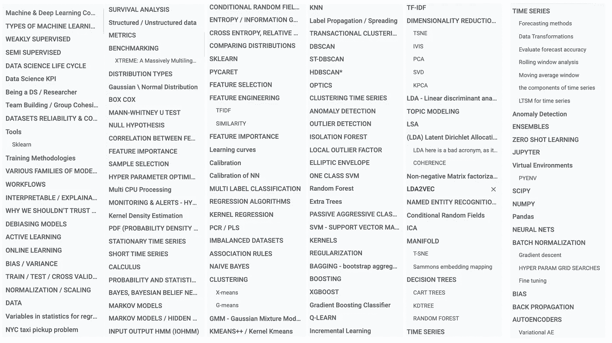
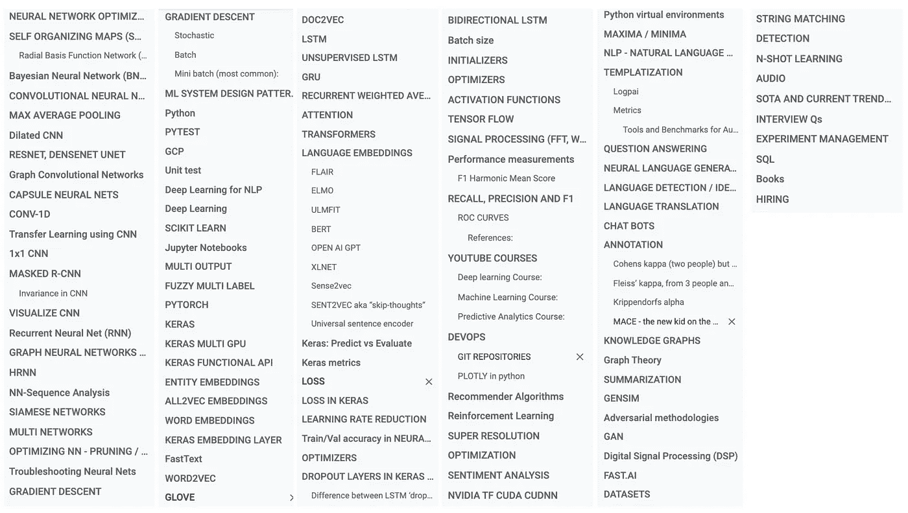

# 您需要的最后一个机器和深度学习概要

> 原文：<https://towardsdatascience.com/the-last-machine-deep-learning-compendium-youll-ever-need-dc973643c4e1?source=collection_archive---------15----------------------->

简编，Blende12，**。**

## 针对数据科学研究人员的几乎每个主题的综合资源

**编辑** : **简编有自己的网站@**[**mlcompendium.com**](https://www.mlcompendium.com/)**谷歌文档现在已经完全退役，取而代之的是网站。我没有从纲要中获利，我总是试图确保它是最新的，用新的知识更新工作的主体，用作者信用更新参考文献。**

自 2017 年以来，我一直在策展与机器学习(ML)、深度学习(DL)、统计学、概率、NLP、NLU、深度视觉等直接或间接相关的一切。我开始整理一份私人参考书目，因为我想扩大我的知识范围。这份名单后来被命名为 ML 纲要。我认为，每个研究人员和数据科学家(DS)都应该努力在日常基础上学习更多知识，不是通过撞上与任务相关的墙并解决它们，而是作为一种终身学习实践。就我个人而言，我在开始新的一天之前会阅读一些文章，偶尔会写下并分享我在[媒体](https://medium.com/@cohenori)上获得的知识。

部分目录，第一部分，ML 汇编。

我把《纲要》当成了我个人的谷歌，上面有我读过的关于我感兴趣的或我需要了解的每个主题的各种摘要、链接和文章。主题可能包括大多数现代机器学习算法、特征选择和工程技术、深度学习、NLP、音频、视觉、时间序列、异常检测；诸如雇佣、管理和实验管理等主题。这将节省你无数的时间去搜索和筛选那些可能不会给你任何价值的文章。

部分目录，第二部分，ML 汇编。

请记住，这是一个进行中的永久工作，我不断更新它与新的主题，所以请随时访问。最后，请随时使用评论选项给我反馈。

*我为初创企业和扩大规模的企业提供无偿建议。你可以在这里* *了解更多关于我的信息并联系我* [*。*](https://medium.com/@cohenori)

Ori Cohen 博士拥有计算机科学博士学位，主要研究机器学习和脑机接口(BCI)。他在一家智能城市初创公司领导了一个数据科学团队，主要利用机器和深度学习进行自然语言处理(NLP)和理解(NLU)研究。目前，他是 TLV 新遗迹公司在 AIOps 领域的首席数据科学家。他定期在 Medium.com 撰写关于管理、流程和所有数据科学的文章。