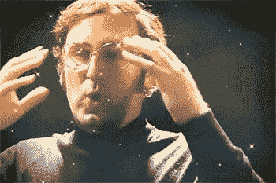

# 2019 年最后一次发人深省的采访

> 原文：<https://towardsdatascience.com/the-last-thought-provoking-interview-of-2019-e082ad1c475f?source=collection_archive---------22----------------------->

## 探索两个聪明人之间的对话，包括对猫、鬼和显然是埃隆·马斯克的讨论。

前十年的最后一个十二月发生了一件事，这件事是一次谈话。

两个伟大的头脑之间的对话，讨论有趣和刺激的话题。这篇文章探索了这段对话中有趣的片段，希望你，读者，能继续听下去*(对话链接在本文末尾)。*

我从没想过我会在一篇媒体文章中提到猫，但是我们在这里。

为什么我们在这篇文章中提到猫？埃隆·马斯克和一个鬼魂的对话是什么？

好吧，继续读下去找出答案。

但我可以向你保证，读完这篇文章后，你很可能会比开始时更加困惑——*提前道歉。*

# 个人资料和对话

让我们先来理解我在本文中提到的对话是关于什么的。首先，介绍一下参与我们对话的两位有趣的头脑。

对话发生在两个人之间，你们可能在网上见过面，如果你们没有见过面，让我给你们介绍一下莱克斯·弗里德曼和迈克尔·史蒂文斯。

莱克斯和迈克尔是非常聪明和有声望的人。两人都在 YouTube、Instagram 和 Twitter 上拥有大量粉丝。

这是他们的简介。

[Lex Fridman 的](https://lexfridman.com/)研究工作在于人工智能、深度学习和自动驾驶汽车。

我是通过他在 Spotify 上的播客“Lex Fridman 的人工智能”认识 Lex Fridman 的。

他 33 岁(*在写作的时候* g)，受过博士教育。

哦，他也在谷歌工作，研究机器学习。

去迈克尔·史蒂文斯。

> 在我谈到迈克尔之前，让我补充一下，这篇文章中提到的对话是由莱克斯·弗里德曼的 YouTube 频道主持的(*观看他的视频和讨论*，你会获得脑细胞)。我会在下面放一个链接。

迈克尔·史蒂文斯也是 33 岁(*写作时* g)，身兼数职；他是演说家、演员、编辑等等。

迈克尔因在他的[频道 Vsauce](https://www.youtube.com/user/Vsauce) 上提供娱乐内容而成为最著名的 YouTubers 用户之一。他提出了最令人兴奋和发人深省的问题，同时提供了一种科学的方法来回答奇怪和有趣的问题，如:“什么是最可怕的东西”或“镜子是什么颜色的。”

对话开始时，Lex 问了 Michael 以下关于心理学的问题:

> *“你认为我们怎样才能把心理学从 20 世纪的水平提升到更像理论物理学家所做的，更精确和严谨的水平？”*

莱克斯以一个探索思维的问题开始，这很公平，因为迈克尔在 YouTube 上有一个名为“思维场”的系列

迈克尔很好地回答了这个问题，尽管没有衡量答案正确性的标准，但他回答的自信方式和逻辑推理实际上可能有一定的根据——*当然是假设性的*。

迈克尔对第一个问题的回答是，我们需要结合心理学的物理基础。

心理学的物理基础是一个模糊的短语，可以有主观的解释。尽管如此，迈克尔解释说，如果我们能够在我们的情绪、感觉和心情中获得一些可测量和可量化的成分，心理学也许能够与理论物理学相媲美。

通过发现我们的情绪和这个可量化的成分之间的相互关系，我们可以走上一条**意识可以以物理和数学形式存在的道路**。

我跟随迈克尔的推理和思考过程，直到当他提到“量子态”时我迷失了方向。但在莱克斯提出第二个问题后我发现自己。

# 意识和猫

> *“你对意识有什么看法，你认为它是现实的一部分，还是深入人心，由人类构建？”*

在迈克尔回答第二个问题之前，他谦虚地声明“*我不是上帝，”*他的答案是基于猜测。

在继续解释我们的整个存在和宇宙之前，这些都是合理的免责声明。

再一次，迈克尔的回答让我不禁想到，我本以为最后会问我是谁？。但是，恰恰相反，我在问，*我是什么时候？(曼哈顿博士在此共鸣)*

*提示推测假说……*

意识是一种可以在物理定律中得到充分解释的东西

暂停，你是在告诉我理论上意识可以用支配我们宇宙的公式来描述。

如*‘F = ma’之类的。*

*脑子=炸了。*

来自 https://giphy.com 的 Gif 图片

对他的答案的进一步解释引导迈克尔探索宇宙，以及它如何与我们的记忆和意识的联系相吻合。他推测，在我们宇宙的口袋里，有嵌入的记忆。

这是我从这一段对话中所理解的:如果我们以某种方式抓住宇宙的一部分，那么我就可以探索人们在被抓住的那部分时间内存在的记忆。

迈克尔用一只猫来解释记忆和宇宙之间的联系。我会尽力把他的口头解释写下来。

假设你被你的猫*(我是爱狗人士)*抓伤了，事实上有两种说法或者说是证据证明你确实被抓伤了。

第一个是你手臂上的物理爪痕，第二个是宇宙内部有一种状态，包含了你被你的猫抓伤的记忆。因此，意识出现在宇宙中包含这些存储记忆状态的空间，并且时间的存在是普遍的。

时间和回忆过去的事件可以被看作是我们以某种方式或形式进入记忆状态。

*沉重的东西。*

不会破坏剩下的对话，但对话发生了有趣的转变，涉及到了诸如自由意志、模拟、科学挑战、地球是平的等话题。

但我们谈谈吧，鬼魂。

# 鬼

来自 pinterest.com 的幽灵形象

提到鬼魂是因为 Lex 之前的一个声明，他说 Michael 的思维方法是"*像"*一样的科学，并且被封装在科学过程中。

> *“提出问题，勇于提出问题，保持好奇心，不被自己的想法所束缚，这就是作为一名科学家对我的意义”——莱克斯·弗里德曼*

我欢迎读者反驳我将要陈述的理论。这个理论是迈克尔为了传达一个观点而提出的。

理论是这样的，当我们用手、脚或头移动物理物体时，实际发生的是一个鬼魂( *Casper 就是你*)离开我们的身体，占有了我们想要移动的物体，突然物体移动了。

*你问的重物呢？迈克尔的理论是分两部分的。*

第二部分通过陈述鬼魂只是变得懒惰来适应不能移动重物的情况。

> *“鬼的懒惰与物体的质量成正比，这就是 F=ma 的原因”。*

我们可能无法证明鬼魂的存在，因为我们缺乏对鬼魂的视觉感知，但一旦我们开始询问关于鬼魂的问题，或进行测试，并表达对鬼魂的各种好奇，以及提出的理论，我们就开始了科学进程。

迈克尔用鬼魂做类比的重点是，能够提出问题和基于观察表达好奇心的能力不仅仅归因于拥有科学思维，而是人类的产物。

# 人工智能和埃隆·马斯克

图片来自[gettyimages.co.uk](https://www.gettyimages.co.uk/)

很高兴你能走到这一步。所以我不会在这里浪费时间，陈述 Lex 向 Michael 提出的问题。

> *“你认为构建超人或人类级别的人工智能需要什么？”*

我不得不称赞迈克尔回答上述问题的方法。他没有直接跳到一个可以炫耀他的智慧、观点或经历的答案，而是选择进一步剖析这个问题。

*   “我们讨论的基础是什么？”
*   “聪明是什么意思？”
*   "我们如何衡量人工机器或程序的智能？"

不幸的是，这些问题在对话中没有得到直接回答，但关于人工智能程序的输出与人类结果如何区分的讨论引出了一条道路，人们可以亲自探索这条道路，以找到涵盖上述问题的研究领域或解决这些问题的讨论。只需在谷歌上输入“图灵测试”。

现在，埃隆·马斯克的名字出现在人工智能和自动驾驶汽车的话题中。

提到人工智能，你就不能不提到埃隆马斯克(Elon Musk)或他的一家公司。

你和我可能都是技术专家，我们非常清楚埃隆·马斯克和其他知名人士对人工智能进步的立场，以及如果发展得不到适当的治理和监控，它对人类生活的影响。

莱克斯·弗里德曼问迈克尔·史蒂文斯这个问题:

> *“在当前的时间里，人们担心人工智能的一个好的门槛是什么？”*

> 在我看来，我不认为我们可以量化对影响人类生活的紧迫问题的关注程度，对任何主题采取预防措施成功的真正指标是最糟糕的情况不会发生。

迈克尔对这些问题的回答与我对此事的看法一致。他指出，关于技术进步的警告性声明和行动并不新鲜。然后，他进一步将人工智能的创造与夫妇接生婴儿进行了比较。

我们怎么知道现在出生的婴儿不是精神病患者。如果婴儿表现出高比例的邪恶或精神变态，我们应该阻止他们出生吗？

> *“也许我们不应该生孩子，也许我们不应该创造人工智能”——迈克尔·史蒂文斯*

重申一下，这些问题没有直接的答案。Lex Fridman 与这些有创造力和智慧的人交谈的目的是通过提出特定领域和发人深省的问题来揭示和民主化他们的思维方法。

Lex 对 Elon Musk 的努力非常了解，因为他已经与 Elon Musk 进行了几次对话(*链接在本文末尾*)。

埃隆与人工智能、太空以及几乎所有与技术相关的时髦词汇的讨论都有关联。埃隆也积累了大量忠实粉丝。

# 在我看来，随着[网络卡车](https://www.tesla.com/en_gb/cybertruck)的成功发布，埃隆·马斯克笑到了最后。

当谈到埃隆·马斯克时，迈克尔并不关注汽车、人工智能、宇宙飞船等华而不实的东西。相反，他表达了自己对埃隆如何处理这么多追随者和责任的好奇。

我会列出迈克尔问的问题，但我有一个想法。

**在这里迁就我，中等；我将代表迈克尔·史蒂文斯向埃隆·马斯克提出一些问题。**

# 我相信埃隆·马斯克阅读这篇文章的概率只有 0.00001%(或者小得可笑的概率)。

如果你正在阅读这篇埃隆·马斯克的文章，迈克尔·史蒂文斯(顺便提一下，还有 Medium)想问你一些下面列出的问题，请在这篇文章的评论部分或你选择的任何回复形式中随意回答。

*但这引发了一个问题，如果他真的回应了，我们怎么知道他是真的埃隆·马斯克……好吧，我会让埃隆·马斯克来证明他回应的真实性。但是问题来了。*

*   分享你的想法、愿景和梦想的人的数量让你担心吗？
*   当很多人分享你的想法和梦想时，你对自己所承担的责任有什么感觉？
*   做埃隆·马斯克是什么感觉？

不幸的是，没有办法在一篇单一的媒体文章中充分呈现迈克尔·史蒂文斯和莱克斯·弗里德曼之间的对话的价值，所以我鼓励你观看对话的 YouTube 视频或收听 Spotify 播客版本，也包括在下面。

如果你喜欢这篇文章，并且想阅读我的更多文章，请关注我。感谢阅读。

 [## 迈克尔·史蒂文斯:Vsauce-Lex frid man 的人工智能(AI 播客)

### 迈克尔·史蒂文斯是世界上最受欢迎的 YouTube 教育频道之一 Vsauce 的创始人，拥有超过…

open.spotify.com](https://open.spotify.com/episode/5UmcM9Glgni4CVi4ruZ8Kr)