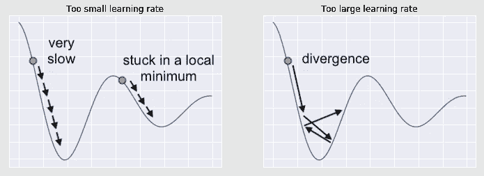
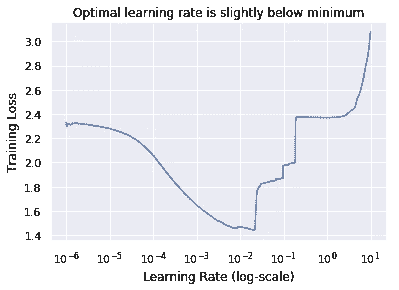
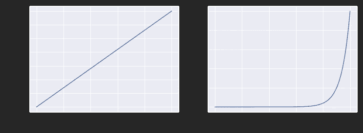

# 学习率查找器

> 原文：<https://towardsdatascience.com/the-learning-rate-finder-6618dfcb2025?source=collection_archive---------23----------------------->

## [实践教程](https://towardsdatascience.com/tagged/hands-on-tutorials)

## 无需昂贵的搜索即可快速到达最佳值的邻域。

图片由 [Wokandapix](https://pixabay.com/users/wokandapix-614097/?utm_source=link-attribution&amp;utm_medium=referral&amp;utm_campaign=image&amp;utm_content=1820039) 来自 [Pixabay](https://pixabay.com/?utm_source=link-attribution&amp;utm_medium=referral&amp;utm_campaign=image&amp;utm_content=1820039)

学习率可以说是神经网络中最重要的超参数。不幸的是，这也是最难调准的。但是不要绝望，因为学习率搜索器会让你很快得到相当不错的值！我们来看看它是如何工作的，如何在 TensorFlow 中实现。

## 为什么重要？

要回答这个问题，让我们从定义学习率开始。当你训练一个神经网络时，一个优化算法(通常是某种梯度下降)遍历损失函数的表面，寻求沿着损失正在减少的斜坡向下走。学习率基本上就是它所走的一步的大小。这个步长不能太小也不能太大，这非常重要。

如果学习率太小，该算法将需要很长时间才能达到最小值，如上图左侧面板所示。更糟糕的是，如果损失曲面中存在局部极小值，优化器可能会陷入其中，无法仅通过小的步骤摆脱出来。

另一方面，如果学习率太大，优化算法可能会超过最小值，并在最小值附近反弹，永远不会收敛，在最糟糕的情况下，它甚至会完全发散，就像上图右侧的面板一样。因此，让你的学习速度恰到好处是非常重要的！

## 为什么很难？

学习率是一个很难调整的超参数，原因有很多:

*   在大多数情况下，领域知识或以前的研究帮助不大，因为对一个问题有效的学习率可能连另一个问题的一半都不到，即使是一个密切相关的问题。
*   通过网格搜索或随机搜索来调整学习率通常在时间和计算能力方面都很昂贵，尤其是对于大型网络。
*   最优学习率与其他超参数紧密耦合。因此，每次你改变正则化的数量或网络的结构，你应该重新调整学习率。

## 进入学习率查找器

寻找最佳收视率在某种程度上一直是一个随机射击的游戏，直到 [Smith (2017)](https://arxiv.org/abs/1506.01186) 提出了一个聪明而简单的方法。

他注意到，通过在训练早期监测损失，可以获得足够的信息来调整学习速度。其思想是仅针对一个时期训练网络，从非常低的学习速率开始，每次迭代都增加学习速率，直到非常大的值(使得每个新的小批量都使用比前一个小批量更高的学习速率来训练)。然后，我们可以为每次迭代绘制损失与学习率(对数标度)的关系图。通常情况下，我们会得到一个类似于下图的图:

为什么是这样的形状？在训练开始时，在网络的权重被随机初始化后，很容易取得进展(减少损失)。这种进步最初是缓慢的，因为我们是一小步一小步地前进，但是随着我们学习速度的提高，损失开始越来越快地减少。然而，在某一点上，学习率变得太大，损失发散。

基于这个情节，可以挑出一个好的学习率。然后，我们简单地用选择的值重新开始训练。你可能会问，这个最优值是多少？令人惊讶的是，这并不是损失最小的值！最佳学习率略小于或低于损失最小化值。为什么？这有两个原因。

*   首先，至少，学习率已经太大，因为损失处于爆炸的边缘。少一点不会有太大的区别，但多一点会把一切都炸飞，所以最好还是保险一点。
*   其次，如果您使用一个具有动量的优化器(比如流行的 Adam)，那么每次迭代的损失实际上是当前小批量损失和过去损失的移动平均值。因此，当学习率开始变得太大时，损失图不会立即爆炸，因为平均值会被过去的小损失拉低。当我们看到损失曲线飙升时，这意味着学习率已经过大一段时间了。

因此，对于上面的示例图，我们将选择 10^-3 的最优学习速率，它比最小值小大约一个数量级。

这种方法可能不会选择学习率的单一最优值，但它选择的值应该非常接近最优值。然而，它最大的吸引力在于它的速度。你只需要训练一个网络一次，只有一个纪元-没有昂贵的随机搜索！

## 在 TensorFlow 中实现学习率查找器

在 TensorFlow 中实现这种方法非常容易。我们只需要四个组件:

1.  在每次迭代中增加学习速度的东西。
2.  记录学习率和每次迭代损失的东西。
3.  在记录损失和学习率的同时训练一个时期的模型的代码。
4.  密谋策划人。

前两个可以组合在一起，作为自定义回调来实现。

在处理每个批处理的末尾，它会将当前的丢失率和学习率附加到为存储这些值而建立的两个相应的列表中，然后它会将学习率乘以一个因子，作为参数传递。

现在，我们应该传递什么因子？这取决于我们想要开始的学习率的初始小值、我们最终想要在时期结束时达到的大值以及每个时期的迭代次数。

如果我们想以 0.000001 的学习率开始，并在 1000 次迭代中指数增加，最终达到 10，那么适当的乘法因子由`np.exp(np.log(10 / 10**-6) / 1000)`给出。我们可以很容易地验证这一点:

除了左边的图以对数刻度显示垂直轴(学习率)之外，这两个图是相同的。如你所见，我们确实在 1000 步中从 0.000001 到 10。对数学习率线性增加，因此学习率呈指数增加。这样，我们可以比大值更详细地研究小值。

最后要避免的是我们在一个历元训练中的迭代次数——它不会总是 1000。它只是训练数据中的示例数除以我们想要使用的批量大小。

让我们用一个简洁的函数把它们打包在一起。

我们的函数将编译的 TensorFlow 模型作为输入，同时输入训练数据和批量大小。它首先计算我们刚刚讨论过的学习率乘法因子。为了得到一个整数，我们在计算迭代次数时使用了除法运算符(`//`)。然后，它将模型的学习速率设置为我们开始时的最小值，并使用我们之前定义的自定义回调对其进行一个时期的训练。最后，它从回调中提取损失和学习率，并绘制它们，产生我们已经看到的图。

让我们在臭名昭著的时尚 MNIST 数据集上尝试一下。

正如所讨论的，根据情节判断，我们宣布 10^-3 为最佳学习率，重新编译模型，并准备好以调整后的学习率进行训练！

## 结论

在神经网络中，学习速率是一个很难调整的超参数。但是，有一个简单的解决方案:

*   仅在一个时期内训练网络，提高每次迭代的学习率(从非常小的值开始，到非常大的值结束)。
*   每次迭代后，绘制损失与对数学习率的关系图。随着学习率的增加，损失曲线可能开始以增加的速度向下倾斜，然后它将达到最小值，然后向上爆发。
*   最佳学习率比使图中损失最小的学习率小一个数量级。
*   这种调整学习率的方法可以使用自定义回调在 TensorFlow 中轻松实现。

## 来源

*   Smith (2017)，训练神经网络的循环学习率。在计算机视觉应用(WACV)，2017 年 IEEE 冬季会议。IEEE，第 464–472 页。
*   [https://github . com/ageron/hands on-ml2/blob/master/11 _ training _ deep _ neural _ networks . ipynb](https://github.com/ageron/handson-ml2/blob/master/11_training_deep_neural_networks.ipynb)

感谢阅读！

如果你喜欢这篇文章，为什么不在我的新文章上 [**订阅电子邮件更新**](https://michaloleszak.medium.com/subscribe) ？而通过 [**成为媒介会员**](https://michaloleszak.medium.com/membership) ，就可以支持我的写作，获得其他作者和我自己的所有故事的无限访问权。

需要咨询？你可以问我任何事情，也可以在这里 为我预约 1:1 [**。**](http://hiretheauthor.com/michal)

也可以试试 [**我的其他文章**](https://michaloleszak.github.io/blog/) 中的一篇。不能选择？从这些中选择一个:

 [## 蒙特卡洛辍学

### 用一个小技巧免费改善你的神经网络，获得模型不确定性估计作为奖励。

towardsdatascience.com](/monte-carlo-dropout-7fd52f8b6571)  [## SVM 内核:他们实际上做什么？

### 直观的视觉解释

towardsdatascience.com](/svm-kernels-what-do-they-actually-do-56ce36f4f7b8)  [## 校准分类器

### 你确定你的模型返回概率吗？🎲

towardsdatascience.com](/calibrating-classifiers-559abc30711a)