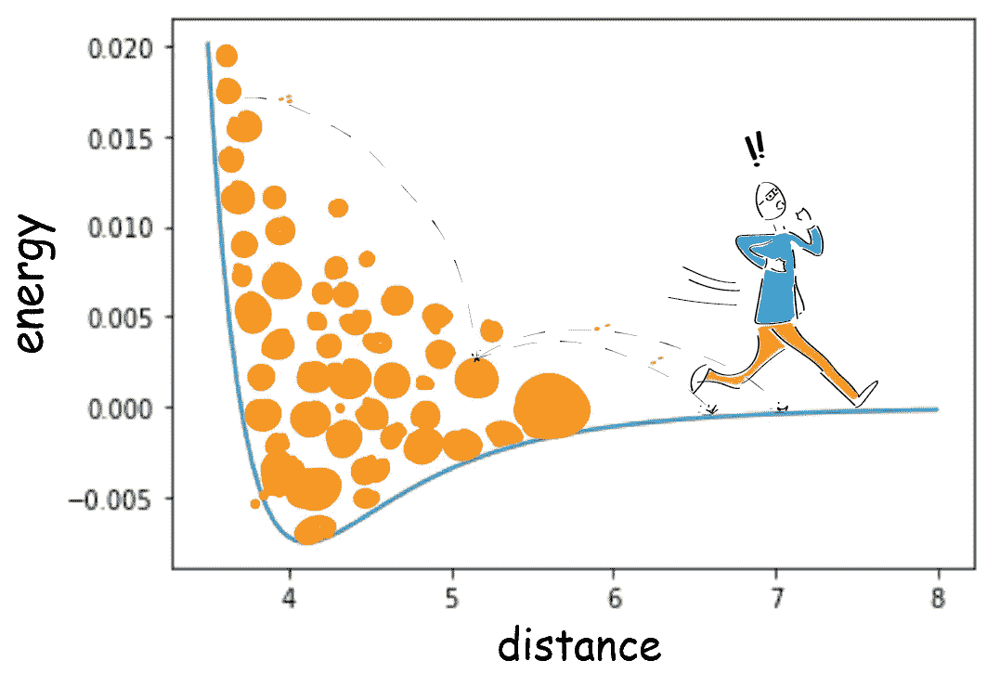
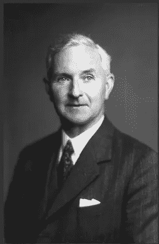
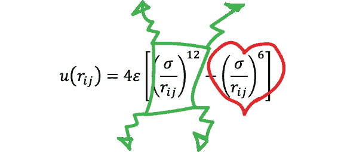
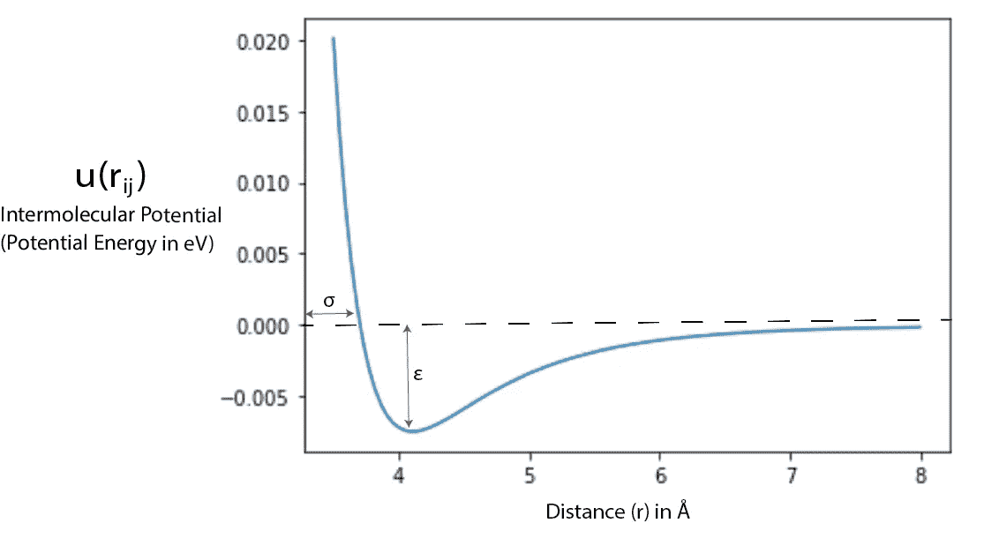
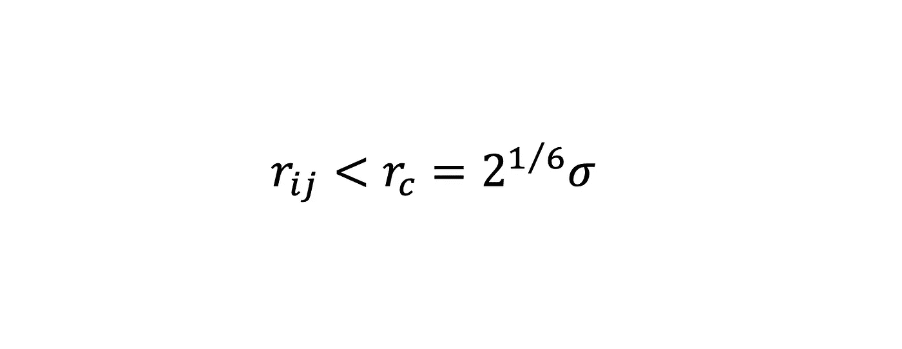
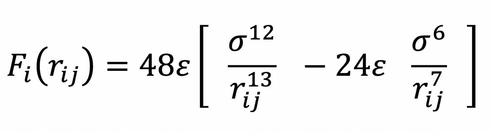
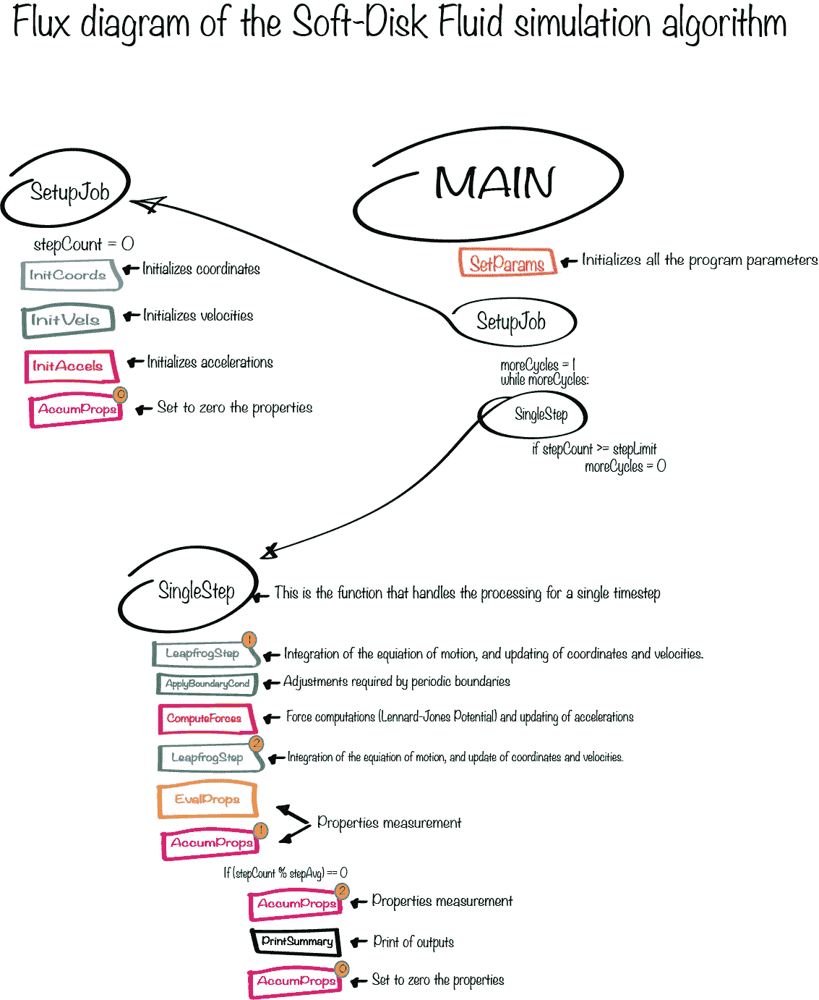
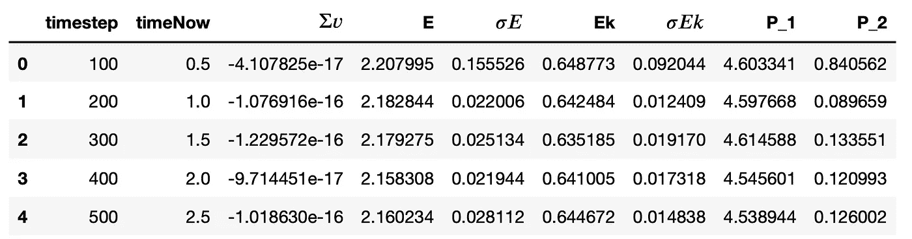

# 伦纳德-琼斯势

> 原文：<https://towardsdatascience.com/the-lennard-jones-potential-35b2bae9446c?source=collection_archive---------6----------------------->

卢卡·扎马塔罗的《逃离伦纳德·琼斯》，版权 2020

## [分子动力学](https://towardsdatascience.com/tagged/molecular-dynamics)

## 为什么分子动力学的艺术如此迷人，为什么我在情感上如此不知所措

那是2004 年，德国海德堡市正在举办*第五届国际系统生物学大会(ICSB 2004)* ，一个摆在大会内的书摊吸引了我的注意。被曝光的书籍之一是由丹尼斯·c·拉帕波特(Dennis C. Rapaport)撰写的第二版 [*分子动力学模拟艺术*，由剑桥大学出版社出版。](https://www.cambridge.org/core/books/art-of-molecular-dynamics-simulation/57D40C5ECE9B7EA17C0E77E7754F5874)

给我印象最深的是分子动力学基本概念的清晰展示。这本 549 页的书代表了计算化学的经典课程。尽管如此，一个完整的 C 代码的出现使这本书具有了创新性，这些代码被分成几个部分，像学生练习一样在每一章中传播。

在与冠状病毒隔离 16 年后，我从书架上掸掉了它的精装书，重新发现了这部不可思议的杰作。现在，我想用 Python 提出一些它的美丽概念。

## 模型流体

第二章使用软磁盘流体模拟解决了非键合相互作用的基本分子动力学主题，这是一个球形粒子(原子)相互作用的*运动方程*的实现。计算成对原子之间的相互作用是为了提供原子间作用力的两个主要特征:

1.  *斥力:对压缩的阻力。*
2.  *吸引力:在一定分离范围内粒子对的相互吸引(偶极-偶极，偶极-诱导偶极，范德华力，包括伦敦分散力)。*

计算这些特征的温和方程式是*伦纳德-琼斯势(LJP)。*

图 1:约翰·爱德华·伦纳德·琼斯爵士。剑桥大学计算机实验室/CC BY([https://creativecommons.org/licenses/by/2.0](https://creativecommons.org/licenses/by/2.0))

LJP 最初是由约翰·爱德华·伦纳德·琼斯爵士于 1924 年提出的，用于液态氩。这个电势决定了位于 *ri* 和 *rj* 位置的一对原子 *i* 和 *j* 的相互作用和排斥的强度。它根据它们的分离距离 ***r*** 计算它们的加速度和力。你还想要什么？！

等式 1:伦纳德-琼斯势

LJP 模型由两部分组成:排斥项***(σ/r)****和吸引项 ***(σ/r)⁶*** ，分别表示排斥力和吸引力。参数 ***r*** 是两个原子之间的距离(单位为ω)；*

****σ*** 是代表两个原子间分子间势= 0 时的距离的长度标度(单位为ω)，而 ***ε*** 支配着相互作用的强度(单位为 eV)。本质上，它是两个原子相互吸引程度的量度。*

*最后， ***u*** 是两个粒子之间的分子间势。相互作用在近距离排斥，然后吸引，在某个极限分离 ***rc:*** 随着参数 *r* 向 *rc* 增加，力下降到 0。*

**

*图 2:Lennard-Jones 电势曲线，计算为 *ε* = 0.0103 和 *σ* = 3.3*

*生成图 2 的 LJP 曲线的代码如下:*

*代码 1:计算伦纳德-琼斯势*

*为了简化计算，Rapaport 修改了第二章报告的例子中的 LJP，通过忽略由*范德华力代表的吸引尾来简化相互作用。*而且，ε和σ都设为 1。*极限间距 rc* 如公式 2 所示:*

**

*等式 2:极限分离*

*如果我们用这种势来构造模型流体，模拟看起来就像“一堆相互碰撞的软球”，正如 Rapaport 所报道的那样。像这样的模型仅限于一些低密度气体。*

*正如我们将很快看到的，我将在这里提出一个 Python 代码，它将恢复原来的 LJ 势。如果与我的 Python 代码相比，Rapaport C 代码是很快的，但是如果我们想使用像 Python 这样健壮的、得到很好支持的编程语言，这是我们必须付出的代价！*

## *牛顿…在工作！*

*我们正在谈论相互作用的原子。所以，我们应该考虑牛顿第二运动定律，其中 ***F*** 是每对粒子在位置 *r* 的力。等式 3 显示了从 LJ 电势得到的力。*

**

*等式 3:来自 LJP 的力*

*牛顿第三定律意味着 Fji 等于-Fij，因此来自成对相互作用 u(rij)的作用在粒子 *i* 上的力与作用在粒子*j*上的力方向相反。力的计算将需要进行数值积分，这将允许我们推导出模拟中每个原子的坐标、速度和加速度。有多棒？*

## *2D 软盘流体算法*

*现在我们已经了解了 LJP 是如何工作的，让我们开始创建一个二维软盘流体模拟的算法！该程序将是第二章的简单分子动力学练习( *pr_02_1* )的 Python 实现。在开始详细讨论代码之前，让我们简单介绍一下模拟将如何工作。看一下图 3 中的程序流程图:*

**

*图 3:程序的流程图*

*该计划由三部分组成:*

1.  *主循环*
2.  *设置作业功能*
3.  *单步函数*

*这些部分中的每一个都代表了另外十个子功能(彩色方块)的一个包装。*主*协调流量，首先调用 *SetParams* 和 *SetupJob* 这两个函数进行程序初始化。 *SetParams* 用于设置多个全局参数，而 *SetupJob* 包含 *InitCoords* 、 *InitVels* 和 *InitAccels、*分别是所有原子的坐标、速度和加速度的初始化函数。*

*主程序要做的每件事都是调用*单步执行*，它代表处理整个过程的函数。*单步*将调用*跳步，*使用简单的数值技术执行运动方程的积分:*跳步*方法。这种方法具有很好的能量守恒特性，综合了粒子的坐标和速度。您会注意到*跳过步骤*在*单步*的列表中出现了两次，参数 1 或 2 决定了两步跳过过程的哪一部分将被执行。最后，*单步*包含*计算力，*实现 LJP 和力并更新原子加速度，以及两个用于属性测量的函数: *EvalProps* 和 *AccumProps。**

*既然我们已经阐明了算法将如何工作，让我们准备一个参数文件作为输入，如下所示:*

*代码 2:输入文件*

*代码 2 中显示的参数输入文件将引导基本参数的设置。 *initUcell* 将指一个 20×20 正方形晶格的初始构型(共 400 个原子)。 *deltaT* 是一个时间步长参数，将由蛙跳方法使用，并涉及能量守恒。*温度*设置为 1，而流体密度设置为 0.8。最后， *stepLimit* 设置模拟的循环数。*

*通过上传输入文件设置好所有全局参数，并运行所有初始化后，*主*将进入 while 循环运行*单步*，直到*步数*变量超过*步数限制*。*

## *代码*

*第一步包括安装和导入 Python 所需的所有包，如代码 3 所示:*

*代码 3:导入所有需要的包*

*在最初的 Rapaport 版本中，我引入了一个用于分子定义的 Python 类(Mol 类)和一个用于属性的 Python 类(Prop 类)，它们由两个 C 语言结构表示:*

*代码 4:类定义*

*我已经用来自 [NumPy](https://numpy.org/) 的线性代数函数替换了所有用于向量运算的函数。此外，我重新编写了随机性和更新周期边界坐标的所有必要函数。*

*代码 5:基本功能*

*坐标、速度和加速度的初始化函数包含在以下代码中:*

*代码 6:初始化函数*

*代码 7 中有两个功能*设置参数*和*设置作业**

*代码 7: SetParams 和 SetupJob*

*如前所述，一个重要的修改涉及到 *ComputeForces* 函数，它实现了 LJP:在这里，我引入了由*范德华力代表的吸引尾，*在 *pr_02_1 中被移除。*(代码 8)*

*代码 ComputeForces 函数*

*代码 9 包括*蛙跳*方法，用于整合运动方程。*

*代码 LeapfrogStep 函数*

*代码 10 提供了属性测量的所有功能(温度、能量和压力)。*

*代码 10:属性测量功能*

*在向您展示*单步*函数的代码之前，让我为程序输出介绍一些有用的额外函数。在代码 11 中，我提出了第一个用于绘制原子轨迹的函数(*【plotMolCoo】)*，它一步一步地绘制所有的图形，第二个函数从所有的坐标图形块中创建一个 mp4 视频。这两种功能必须协同工作。此外，代码 11 包括 *GraphOutput* ，这是一个打印熊猫数据帧形状属性的函数。*

*代码 11:输出函数*

*这里的*单步*功能:整个算法的真实档位。*

*代码 12:单步函数*

*最后，在代码 13 中，主循环。*

*代码 13:主循环。*

*将所有代码可视化后，将所有部分装入 Jupyter 笔记本并运行它:你应该能够制作一个这样的视频…*

*视频 1:2D 软盘模拟*

## *对我最喜欢的谜题的思考。*

*基于 Lennard-Jones 势的软盘流体模拟表示流体或气体的微观模型。它是基于模拟原子相互作用的球形粒子。相互作用发生在利用排斥力和吸引力的粒子对之间。正如视频中所见，在 500 个时间步长后，最初靠近的两个彩色原子(红色和青色)倾向于向不同的方向移动。*

**

*表 1:分子动力学特性(前 500 个时间步)*

*表 1 提供了速度分量的总和、每个原子的平均能量和动能、标准偏差以及前 500 个时间步长的平均压力。对于守恒定律，系统的能量是守恒的。*

*密度为 0.8 时，轨迹显示稠密的流体相。我邀请读者改变密度和温度的参数，看看轨道如何修改它们的模式。*

*我提供了 Rapaport 一书第二章练习 *pr_02_01* 中描述的函数的 python 实现。在这样做的时候，我保留了与这本书相关的物理和化学概念的原创性，同时，用 Python 代替 C 代码帮助我更深入地理解了所有模拟过程背后的数学。毕竟，Rapaport 的书的整体紧凑性已经被我的直接方法粉碎了，这种方法包括用另一种更现代的代码替换旧的 C 代码。*

*我喜欢称这种方法为“我最喜欢的难题”！*

## *参考资料:*

*[*分子动力学模拟的艺术*，丹尼斯·c·拉帕波特著，剑桥大学出版社出版。](https://www.cambridge.org/core/books/art-of-molecular-dynamics-simulation/57D40C5ECE9B7EA17C0E77E7754F5874)*

*[拉比亚·纳伊姆(加州大学戴维斯分校)——libre texts，伦纳德·琼斯潜力](https://chem.libretexts.org/Bookshelves/Physical_and_Theoretical_Chemistry_Textbook_Maps/Supplemental_Modules_(Physical_and_Theoretical_Chemistry)/Physical_Properties_of_Matter/Atomic_and_Molecular_Properties/Intermolecular_Forces/Specific_Interactions/Lennard-Jones_Potential)*

*[https://python inchemistry . org/sim _ and _ scat/molecular _ dynamics/intro . html](https://pythoninchemistry.org/sim_and_scat/molecular_dynamics/intro.html)*