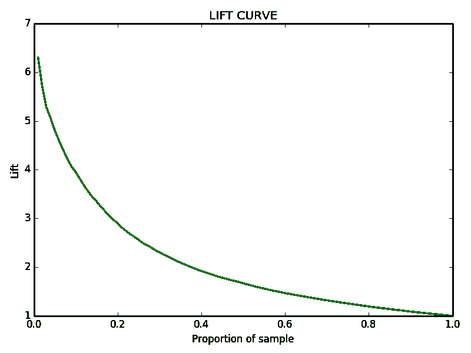
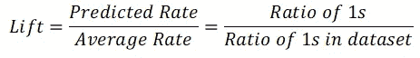
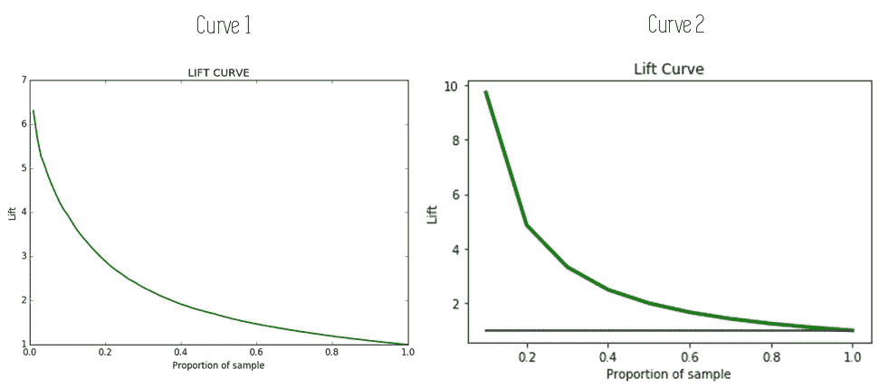
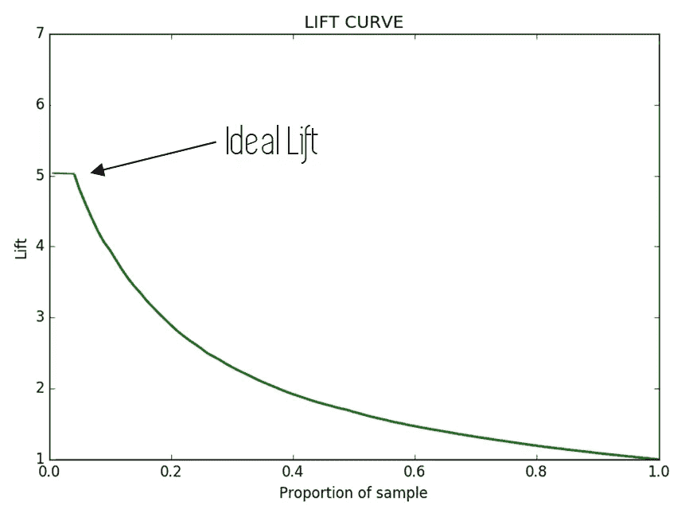

# 升力曲线:揭开面纱

> 原文：<https://towardsdatascience.com/the-lift-curve-unveiled-998851147871?source=collection_archive---------5----------------------->

## 评估分类算法的另一种[棒极了]方式


这篇文章的目的是解释什么是提升曲线，它如何补充 ROC 曲线等其他分类评估技术，以及它如何用于比较不同的模型。

*如果你不知道什么是 ROC 曲线，你可以在这里* *找到一个解释这一切的好帖子* [***。没有必要了解它来理解升力曲线(它们是独立的工具)，但看到它们如何一起使用总是很好的。***](/the-roc-curve-unveiled-81296e1577b)

*最后，在我们开始之前，这里有一些额外的资源可以让你的机器学习事业突飞猛进:*

```
*Awesome Machine Learning Resources:**- For* ***learning resources*** *go to* [***How to Learn Machine Learning***](https://howtolearnmachinelearning.com/books/machine-learning-books/)*! 
- For* ***professional******resources*** *(jobs, events, skill tests) go to* [***AIgents.co — A career community for Data Scientists & Machine Learning Engineers***](https://aigents.co/)***.***
```

[](https://z-ai.medium.com/subscribe) [## 订阅我的专属列表！

### 订阅我的专属列表！并获取所有你喜爱的新鲜文章<3! By signing up, you will create a Medium…

z-ai.medium.com](https://z-ai.medium.com/subscribe) 

*说了这么多，我们开始吧。*

# 分类算法的概率输出

当面临二元分类问题时(*例如使用某个患者的健康记录*来识别他是否患有某种疾病)，我们使用的机器学习算法通常会返回一个概率(*在这种情况下是患者患有疾病*的概率)，然后将其转换为预测(*患者是否患有这种疾病*)。


之前解释的场景的管道

提升曲线使用这个返回的概率来评估我们的模型的表现，以及它在识别数据集的阳性(*1 或患病患者)*或阴性(*0 或健康患者*)实例方面的表现。

# 数据

本例中使用的数据集是 ***UCI 心电图数据集*** ，您可以在此处 ***找到[**。**](http://archive.ics.uci.edu/ml/datasets/Cardiotocography)*** 理解这篇文章并不需要下载数据，但是如果你想研究一下**，在这篇文章的末尾有一个 Jupyter 笔记本的链接，上面有我用来解释的代码。**

我们模型的目标是对患有某种心脏疾病的患者进行分类。让我们看看升力曲线如何帮助我们评估模型。

# 升力曲线

下图显示了正常升力曲线的示例:



升力曲线图形

如我们所见，在 X 轴上，我们有对应于某一升力的样品比例，绘制在 Y 轴上。提升很容易计算为某个样本点上 1 的比率除以整个数据集上 1 的比率，这也可以视为随机算法做出的预测。



举升公式

## 如何构建升力曲线:

建立升力曲线非常容易。首先，我们必须从最高(最接近 1)到最低(最接近 0)对模型的预测进行排序。通过这种方式，我们可以根据患病的可能性对人口进行排序。


首先，我们根据患者患病的可能性对他们进行分类

之后，我们使用真实的已知标签计算数据集上 1 的比例，对于样本的每个比例(X 轴),我们使用上述公式计算提升，这是我们最终绘制的。因此，每个点上的升力是使用到该点为止的数据样本的比例的正实标签和我们的数据的正实标签的总数来计算的。

## 如何阅读升力曲线

让我们看看提升曲线如何帮助我们评估我们的模型:在我们的例子中，我们想估计一个病人患病的可能性有多大。通过我们对数据的排序，患病概率最高的患者将出现在我们图表的左侧，通常伴随着最高的 Lift 得分。


这些患者将对应于上图的**点 A** ，有时也称为 ***最大升力点*** 。一般规则是，这个点越高，我们的模型表现得越好，因为在我们的人口比例中有许多真正的阳性标签，这些标签具有非常高的阳性概率(我们知道这一点，因为我们已经以这种方式对数据点进行了排序)。

最大升力是一个可以快速用于比较两个模型的指标:具有最高最大升力的模型通常更好。下图显示了这一点。曲线 2 具有更高的最大升力，因此与其对应的模型可能更好。



两条升力曲线的比较

对于**点 B** ，我们选择了一个包含 10%人口的样本，我们可以看到我们的阳性标记比平均值多 4 倍多。我们如何将这些转化为有用的信息？想象一下，我们的记录显示 10%的患者患有心脏病，而 90%的患者没有。B 点的信息告诉我们，最有可能患病的 10%人口的患病比例是平均值的 4 倍。

因此，在我们的例子中，我们的算法预测的概率最高的 10%的人群将有大约 40%(10%平均值的 4 倍)的患病患者。

最后，**点 C** 与点 B 非常相似，但样本中包含了患病几率最高的 50%人口。对于该样本，患病患者的比例是平均值的两倍，因此患病患者的比例为 20%。

最后一个要解释的有趣概念是理想升力。这种情况很少发生，当升力曲线的起点平坦时，如下图所示。



具有平坦理想升力区的曲线

这意味着，在升力曲线开始下降之前，随着样本比例的增加，升力保持不变，所以具有最大升力的群体越来越大，直到出现下降，这是一件好事。

在这里，您可以找到使用一组数据点的真实标签和相应的预测概率绘制升力曲线的代码:

# 结论和其他资源

提升曲线，就像所有其他评估指标一样，不是唯一或完美的解决方案，但是，像 ROC 曲线一样，它提供了一种快速评估我们的算法如何运行的方法，也是比较不同模型的好工具。

提升曲线在营销模型中非常有用，我们希望预测特定受众是否会对特定营销活动做出反应:使用提升曲线，我们可以在最有可能做出积极反应的特定人口规模中进行削减。此外，它们还可以用于类似的模型，这些模型试图预测一个人是否会拖欠贷款或付款，并只针对影响最大的样本。

[](https://z-ai.medium.com/subscribe) [## 订阅我的专属列表！

### 订阅我的专属列表！获取所有你喜欢的新鲜文章<3! By signing up, you will create a Medium…

z-ai.medium.com](https://z-ai.medium.com/subscribe) 

## Additional Resources:

[](https://www.kdnuggets.com/2016/03/lift-analysis-data-scientist-secret-weapon.html) [## Lift Analysis - A Data Scientist's Secret Weapon - KDnuggets

### By Andy Goldschmidt, Akanoo. Whenever I read articles about data science I feel like there is some important aspect…

www.kdnuggets.com](https://www.kdnuggets.com/2016/03/lift-analysis-data-scientist-secret-weapon.html) [](https://select-statistics.co.uk/blog/cumulative-gains-and-lift-curves-measuring-the-performance-of-a-marketing-campaign/) [## Cumulative Gains and Lift Curves: Measuring the Performance of a Marketing Campaign - Select…

### Suppose that you are running a direct marketing campaign, where you are trying to target members of your customer base…

select-statistics.co.uk](https://select-statistics.co.uk/blog/cumulative-gains-and-lift-curves-measuring-the-performance-of-a-marketing-campaign/) 

That is all, I hope you liked the post. Feel Free to connect with me on [LinkedIn](https://www.linkedin.com/in/jaime-zornoza/) 或[在 Twitter](https://twitter.com/Jaimezorno) 上关注我 **@jaimezorno** 。还有，你可以看看我在数据科学和机器学习上的帖子[**这里**](https://medium.com/@jaimezornoza) 。好好读！

关于机器学习和数据科学的更多资源，请查看以下资源库: [**如何学习机器学习**](https://howtolearnmachinelearning.com/books/machine-learning-books/) ！有关职业资源(工作、事件、技能测试)，请访问 AIgents.co[**——一个面向数据科学家&机器学习工程师**](https://aigents.co/) 的职业社区。

此外，更多像这样的帖子[**请在 Medium**](https://medium.com/@jaimezornoza) 上关注我，敬请关注！

您可以在我的 Github 上找到用于绘制升力曲线的代码以及一个带有快速示例的 Jupyter 笔记本:

[](https://github.com/jaimezorno/Lift_curve) [## jaimezorno/升力曲线

### 此时您不能执行该操作。您已使用另一个标签页或窗口登录。您已在另一个选项卡中注销，或者…

github.com](https://github.com/jaimezorno/Lift_curve) 

非常感谢您的阅读，祝您有美好的一天！