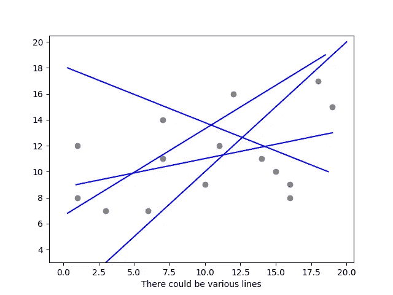
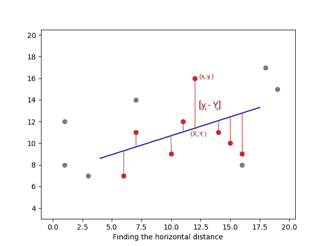
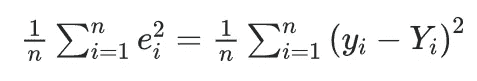
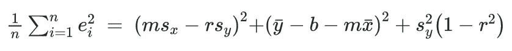
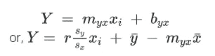
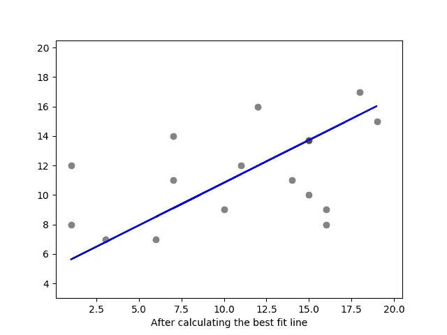
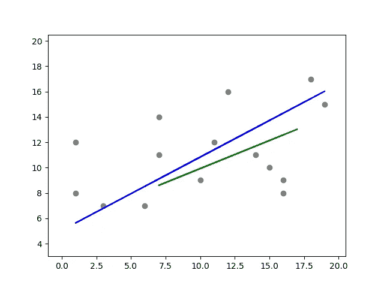

# 简单地说，线性回归方程

> 原文：<https://towardsdatascience.com/the-linear-regression-equation-in-a-nutshell-8df202501255?source=collection_archive---------15----------------------->

“回归图前的家伙”使用未画的剪贴画|作者图片

回归到底是什么？回归分析是根据其他一些变量来预测某个变量的值或属性。而线性回归是当只有一个变量，你想根据另一个单一的变量来预测。

# **定义**

实际上，我在学校学到的简单线性回归的正式定义是，*通过一个变量 y 对另一个变量 x 的回归，我们指的是 y 对 x 的依赖，平均而言。*这是你可以写在考卷上的更多答案。回归的概念实际上要简单得多。

回归实际上是寻找图表中数据集的趋势。如果画回归线(流行语预警！)通过[散点图](https://en.wikipedia.org/wiki/Scatter_plot)，只要看着这条线，你就能判断出某个事物的趋势是上升还是下降！！

作者的 matplotlib 散点图|图片

你应该知道回归分析是计算和制定直线方程的方法(不要担心我们会得到它)，而回归线就是直线本身。而简单回归的方程是一条线的[方程。](https://youtu.be/AqFwKecNaTk)

> *Y = mX + b*

# **直觉**

浏览互联网时，你会发现两种直观的线性回归方法。一个是人们会告诉你回归是一种方法，你可以预测一个变量的值，比如说，y，输入 x，你可能已经知道了，这没问题！(这是 ML 的最佳方法)

另一种方法是我在定义中定义的。想想看，你可以在散点图上画出成千上万条线，但是最符合并且不同于所有其他线的线就是回归线。讲出来在下一段！

matplotlib 散点图中的各种线条|图片由作者提供

预测的方法是正确的，但不是 100%有保证，这就是为什么在我的教科书中，在定义的末尾写着:“平均而言”。要知道为什么这是真的，你和我必须深入研究均方差。).现在，把它想象成一个函数，它告诉你这条线工作得有多好。均方差的值越低，线条应该越好。

**均方误差**

正如我前面说过的，平方误差是一个函数，可以知道相对于绘制的数据，线中存在多少误差，线越好，mse 的值越小。

现在让我们学习如何找到 mse，这样你就可以自己计算了。从下面的图中，让我们假设蓝线是回归线，然后我们将试图找到该线与图中(yᵢxᵢ)标为红色的点的垂直距离。

也就是说，我们从 Yᵢ点的实际高度中减去 xᵢ点，也就是 yᵢ点的线的高度，假设值是 eᵢ

> eᵢ = yᵢ - Yᵢ

matplotlib |图像中直线和点的距离(由作者提供)

现在以同样的方式，我们把 eᵢ的所有值加起来，

> ∑eᵢ = ∑(yᵢ — Yᵢ)

现在你自己想一想，有些点可能在直线上，直线下可能有更多的点，这可能使总和为负，但惯例决定让 mse 为正值，以便更好地理解。

现在，如果我们使用[模数](https://youtu.be/r6hS_8nm1jM)使数值为正，那么随着图中更多的数据点，数值将变得太大。所以伟大的头脑决定在相加之前先求平方值。然后在相加之后，他们建议将总和除以数据集的总计数。因此它被称为均方差。

MSE 方程|作者方程

**线性回归方程**

正如我在直觉部分所说的，均方差(mse)值越低，这条线就越好，被称为最佳拟合。由于 mse 本身不可能为 0(实际上在大多数情况下不可能，但并非所有情况下都是如此)，我们必须通过简化 mse 方程来找到 mse 的最小值。

简化 mse 的方程式后，会是这样的，

作者对均方误差方程的扩展

其中 n 是存在的数据点总数，r 是数据集的[相关性](https://www.investopedia.com/terms/c/correlation.asp)值，sₓ和 sᵧ分别是所有 y 值和 x 值的标准偏差，x̅ **̄** & y̅分别是 x 和 y 值的平均值。

现在，由于 r 总是位于-1 到 1 之间，r 可以导致**sᵧ(1-r)**为 0，而 sᵧ本身不能为 0，这一项的帮助并不能真正方便地制定线性回归方程。

现在，如果 **(msₓ-rsᵧ) = 0，**那么 **m = r(sᵧ/sₓ)** ，其中 m 也可以写成 **mᵧₓ** (听起来像 m 在 x 上的 y)。
现在，如果 **(y̅ — b — mx̅̄) = 0** ，那么， **y̅ = b + mx̅** ，或者 **b = y̅ — mᵧₓx̅̄** ，其中 b 也可以写成 bᵧₓ(听起来像 b 在 x 上的 y)。

现在，如果你把 bᵧₓ和 mᵧₓ的值放入我们在定义中讨论过的主要线性方程中，它看起来会像这样，

作者推导回归方程|方程

是的，我知道这对于一个方程来说看起来很难看，但是你不需要每次都记住它。请记住，斜率只是相关乘以标准差的比率，截距看起来像旧的线性方程，其中 x 和 Y 分别是平均值，x 被视为 xi，因为 Y 将是 x 输入线的未知数。

matplotlib |作者图片中的最佳拟合线

这是回归线最终外观的可视化表示。如果你输入一个在计算中没有用到的值，你会得到 y 的预测值，它会像红点一样出现在这条线上。

# **重要提示**

这是大多数回归新手会犯的错误，仔细看我用了 **mᵧₓ** 和 **bᵧₓ** 这是 y 在 x 上而不是 x 在 y 上，因为这意味着我们将用 x 的值作为函数输入来预测 y 的值。

只有在这种情况下，我才把 mse 的等式表述为 **yᵢ — Yᵢ** 。但是，如果你想在某一天根据输入的 y 来预测 x 的值，你必须用**xᵢ——xᵢ**来计算 mse，因为如果你仔细想想，某个数据点的水平距离与它到直线的垂直距离有很大的不同。

那么斜率就会变成 **mₓᵧ = r(sᵧ/sₓ)** (仔细看标准差的比值是 mᵧₓ值的倒数，现在听起来是 x 对 y)。截距将变成**b =x̅̄——mₓᵧy̅**,最终等式将是这样的， **X = mₓᵧyᵢ + bₓᵧ**

matplotlib | Image 中 y 对 x 和 x 对 y 的回归方程

这条蓝线是您想要基于 x 预测 y 值的函数的方程，绿线是您想要基于 y 预测 x 的函数。这证明没有一条回归线是另一条回归线的反函数[。](https://youtu.be/W84lObmOp8M)

# 结论

线性回归通常用于数据科学家领域，作为一种机器学习模型，主要作为一些分析领域的统计工具。如果你已经仔细阅读，尽管这篇文章有多长，线性回归背后的数学太简单了。在那件事上你必须支持我！