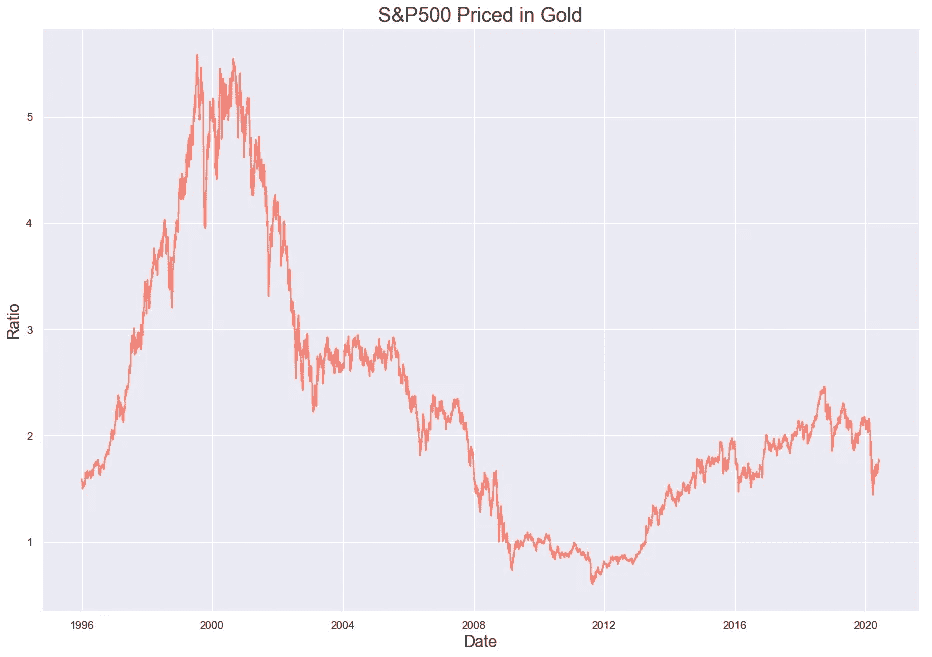

# 流动性效应:对美国股票和黄金的分析

> 原文：<https://towardsdatascience.com/the-liquidity-effect-an-analysis-of-us-equities-gold-eb12e6d92caf?source=collection_archive---------65----------------------->

## 货币扩张如何影响黄金和美国股市不同板块的表现？在货币制度相对稳定的时期，趋势是否有所不同？

照片由来自 [Pexels](https://www.pexels.com/photo/bitcoins-and-u-s-dollar-bills-730547/?utm_content=attributionCopyText&utm_medium=referral&utm_source=pexels) 的[大卫·麦克比](https://www.pexels.com/@davidmcbee?utm_content=attributionCopyText&utm_medium=referral&utm_source=pexels)拍摄

**注:**这不是投资建议。

我以谈论 2020 年上半年发生的历史性事件结束了我的上一篇帖子——多次触发断路开关、美联储宣布“无限量化宽松”以及随后购买美国公司债务。作为一个将沃伦·巴菲特的价值投资原则与宏观经济趋势相结合的人，美联储最近注入的流动性让我质疑我的核心投资理念。我决定使用历史数据来观察不同资产类别在[量化宽松(QE)](https://www.fxcm.com/markets/insights/what-is-quantitative-easing/) 和[量化紧缩(QT)](https://www.fxcm.com/markets/insights/what-is-quantitative-tightening/) 期间的相对表现，以了解潜在趋势的迹象。

我意识到这个主题包含了很多内容，所以我将这篇文章集中在以下几个要点上:

1.  市场情绪从价值股转向成长股
2.  黄金作为一种天然的市场对冲
3.  美国股票市场的估值

## 数据准备

我所有的数据都是从雅虎财经获得的，在那里你可以下载几乎所有在主要指数上交易的股票或 ETF/ETN/ETP 的历史价格。唯一的警告是——在分析之前需要考虑股息和股票分割(如果每只股票都像伯克希尔·哈撒韦公司的 A 类股一样运作，对吗？).我下载股息历史、历史股价和股票分割(如果适用)并计算相关股票/ETF 的实际价格:

结果输出如下所示:

衡量任何资产表现的最常见方法是计算从开始日期开始的回报率，并与时间复合。python 中的 Performance Analytics 包不符合我的要求，所以我创建了一个自定义方法来计算给定资产的回报:

因为我想分析 QE 期和 QT 期之间的表现，所以我从他们的[网站](https://www.federalreserve.gov/monetarypolicy/bst_recenttrends.htm)下载了美联储总资产的历史，以估计 QE 和 QT 的日期范围，供以后分析。美联储的资产负债表(以百万美元计)如下:

用红色突出显示的区域表示美国经济衰退的时期(是的，我们目前正处于衰退中)。人们可以看到在经济衰退期间货币刺激的使用，美联储将其资产负债表从大约。2008 年至 2015 年间的 1 万亿至 4.5 万亿美元。仅在 2020 年 2 月至 2020 年 6 月期间，美联储就实施了 3 万亿美元的资产购买，相比之下，上一轮刺激措施相形见绌。我将把这两个时期用于 QE，2004 年至 2020 年的剩余时间将被视为稳健货币政策的时期。

## 人气从价值转向增长

优秀的基本面、稳定的自由现金流和强劲的资产负债表是沃伦·巴菲特投资哲学的特质。他发现了被低估的公司，并进行长期投资，在此过程中获得了股息和投资组合的增长。然而，成长型公司并不吹嘘有很大(或任何)的利润，而是实现销售的指数增长，牺牲短期利润。这些公司最终可能发展成为高价值公司，或者破产。

在我的分析中，我使用了$SPYG 和$SPYV 指数，分别跟踪 S&P500 的成长型和价值型公司。我首先绘制了这两个指数从 2001 年到 2020 年的累积回报，以及 SPYV 和 SPYG 价格随时间的比率，以获得两者之间的趋同感。

价值与增长的权衡:价值(蓝色)胜过增长(绿色)，直到 2008 年衰退

从上面的图片中可以看出一些有趣的地方:

1.  在 2008 年大衰退之前，价值跑赢了增长，此后一直呈下降趋势
2.  从 2002 年到 2008 年，增长几乎停滞不前，但经历了衰退后的天文数字般的增长
3.  2020 年标志着成长型股票的复合回报率在过去 20 年中首次超过价值

2000 年的网络泡沫主要集中在 90 年代牛市期间私人投资推动的严重高估的科技股上。美联储没有干预直接向市场注入任何流动性，这可能是 2008 年经济增长如此艰难的原因。在大衰退之后，经济经历了快速的货币扩张，导致利率处于历史低位。私营企业以接近零的利率获得了急需的资本，这为这些股票的上涨再次推波助澜。

为了通过 QE 和 QT 直观显示相对表现，我将这两个指数的复合回报分成不同的时间段

以上图表有助于讲述一个详细的故事:

1.  价值明显优于 2008 年，增长将持续到 2016 年，这可能是由于廉价资本的可用性
2.  2016 年至 2017 年年中似乎是两者之间的一场掷地有声的比赛，但似乎有另一个刺激因素再次推动估值上升——总统可能会胜过 TCJA 比尔？
3.  美联储在 2018 年 12 月抛售后的温和行动解释了随后的反弹

Soo……价值投资死了吗？

也许吧。或者，一段时间的 QT 将迎来经典投资原则的新时代。似乎价值投资在资金充裕的环境下非常有效，但这在目前并不现实。

## 黄金作为市场避险工具

在市场动荡时期，黄金一直是避风港，在危机期间提供风险调整后的回报和急需的流动性。由于它不易受到货币操纵的影响，在疯狂印钞和通货膨胀期间，它充当了价值储存手段。我绘制了与上面相同的图表，比较黄金和 S&P500:

与 S&P500 相比，2001 年至 2012 年似乎是投资黄金的最佳时机，最近几个月又出现了上涨。我对黄金和 S&P500 的比率进行移动平均交叉分析，以了解长期投资趋势。我选择 200 天和 50 个月的简单移动平均线(SMA)进行分析，因为我在寻找一个大的日期范围，它平滑了短期波动，表明长期买入机会。

黄金 S&P500 比值的均值反演分析。短期和长期移动平均线的交叉可以表示看涨(黄金交叉)或看跌(死亡交叉)信号

短期移动平均线(在这种情况下，200 日移动平均线)高于长期移动平均线表明出现了“黄金交叉”，这通常是该资产的买入机会。相反，较高的长期均线交叉表示死亡交叉。与 S&P500 相比，2003 年至 2012 年是购买黄金的好机会，如果美联储继续印钞，似乎另一轮上涨可能会变成牛市，推动金价上涨。指数移动平均线(EMA)是另一个可以用来衡量趋势的工具。EMA 更重视当前数据。最新的价格数据对移动平均线的影响更大，旧的价格数据影响较小，使其对当前价格波动的反应更大。

基于均线的黄金 S&P500 比率均值反演分析。短期和长期移动平均线的交叉可以表示看涨(黄金交叉)或看跌(死亡交叉)信号

虽然总的趋势保持不变，但是均线和均线相比有更大的差距。这告诉我，黄金可能会出现长期突破，但它需要另一种催化剂才能继续上涨。

## 美国股票市场的估值

投资界使用多种指标来确定与历史数据相比，股票市场是过高还是过低。S&P500 可能接近历史高点，但这并不意味着它在这些水平上被高估了。我使用一段时间内标准普尔 500 与黄金的比率来获得市场的跨资产视图，并查看标准普尔 500 是否达到了历史最高水平。

尽管标准普尔 500/黄金比率处于 2007/08 年的水平，但远低于互联网泡沫破裂时的峰值。上图启发我观察 SPY 指数的不同板块(特别是科技股),寻找超买的迹象。我首先关注纳斯达克综合指数，它包含了更广泛市场中的所有科技股。技术在过去十年中经历了最大的增长，使其成为理想的首选。我比较了纳斯达克和 S&P 的比率，看前者指数的相对增长。

纳斯达克/S&P500 比率上次处于这些水平是在 2000 年网络泡沫时期，但这次的增长率似乎有所不同。私人投资涌入科技行业，在很短时间内将价值推至过高水平。纳斯达克指数可能与 2000 年代处于同一水平，但大部分上涨可归因于 5 只大型科技股。在过去几十年里，受指数增长和廉价资本的推动，技术作为一个整体一直跑赢大盘。我将科技股从更广泛的指数中分离出来，并与所有其他板块的综合表现进行比较。它有助于描绘出一幅科技行业全面占据绝对主导地位的画面，从而产生了历史上第一次万亿美元的估值。

自 2016 年以来，不包括技术在内的市场仅上涨了约 35%，而技术板块却出现了爆炸式增长，在同一时间段内实现了 170%的回报率！尽管市场尚未从 3 月份的恐慌性抛售中恢复过来，但科技股已经创下了今年的又一个新高。我们会重蹈 2001 年的覆辙吗？

## 离别的思绪

1.  十多年来，在资本投资和低利率的推动下，增长盖过了传统的价值投资。如果借贷成本再次上升，或者人为的流动性突然被吸出市场，市场就可能发生逆转。鉴于目前的市场状况，这两种可能性都不大。
2.  黄金/S&P500 比率是衡量相对于股票表现的良好指标，有助于衡量更广泛的市场情绪。黄金似乎预示着在合适的催化剂下开始另一轮上涨(也许是更多的货币刺激？).
3.  技术一直是历史上最长牛市的领跑者，只有时间才能证明这些估值是新常态，还是该行业将会突然觉醒。

在这种时期投资可能具有挑战性——申请破产的公司在消息传出后估值飙升，使得市场上的意外波动似乎很正常。有什么好的交易技巧来应对这种市场波动？我的答案是——动量投资(即将推出)。

感谢您的阅读！如果你认为我错过了一些可以帮助你了解这个话题的东西，请告诉我，你的反馈将会非常感谢。下面是 Github 的链接。

 [## 然后 namesvik/quantified easing effects _ Equities

### GitHub 是超过 5000 万开发人员的家园，他们一起工作来托管和审查代码、管理项目和构建…

github.com](https://github.com/thenamesvik/QuantitativeEasingEffects_Equities)