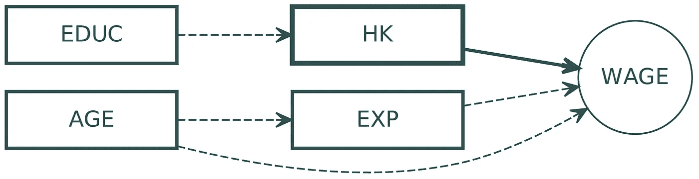
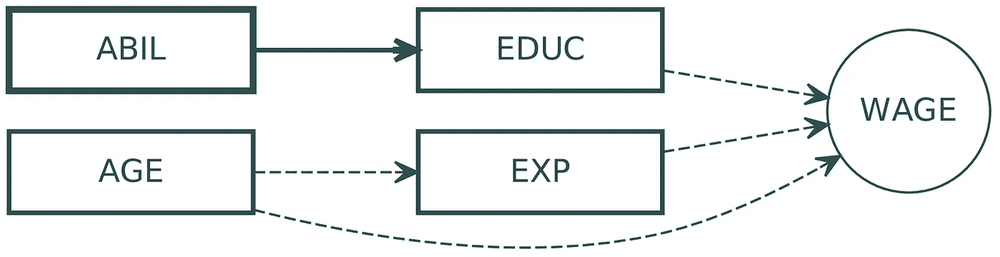

# 建模的逻辑:认识论笔记

> 原文：<https://towardsdatascience.com/the-logic-of-modeling-an-epistemological-note-88e524e14e62?source=collection_archive---------32----------------------->

**简介**

在[的上一篇文章](/causal-models-for-regression-96270bf464e0)中，我讨论了回归分析的因果建模。此外，我解释了机器学习的逻辑如何偏离定量社会科学的逻辑，因为它的主要目的不是揭示因果联系并生成关于人类行为的全面主张。
然而，这种情况比大多数在学术环境之外使用回归和机器学习的人所认为的要有限得多。顾问通常需要产生关于生产的投入和产出、管理实践和可交付成果之间的关系的知识。通常，他们会对员工表现不佳、员工流失和延误进行根本原因分析。无论是否理解了支配推理的规则，人们通常都会在考虑因果关系的情况下做出决定，并对真理做出一些承诺。因此，统计学习最终与因果推理融合在一起，尽管程度不同，取决于对发现的使用。

在那篇文章中，我解释了科学与非科学话语的区别，即程序合法性和可证伪性。尽管科学家很少逃脱被描绘成真理的吸盘，但他们的角色更容易被理解为陪审员，他们唯一且庄严地向科学进程宣誓。这是因为程序合法性的概念是科学的核心，而实质合法性是由宗教和大多数公共话语支撑的。程序合法性的核心是可证伪性，或认为科学是一个筛选过程，剔除与证据不一致或不连贯的观点。虽然那些在象牙塔外工作的人可能会把这些视为哲学上的诡辩，但研究和理论之间的墙，以及商业和生产之间的墙，是越来越薄的。如今，企业界带来的大部分附加值都来自于那些严重依赖与科研机构之间的桥梁的公司。正因为如此，引入科学精神可能有助于他们吸引和留住人才，否则这些人才将被学术界没收。此外，科学的精神通过奖励合理的逻辑和长期主义而不是成就和短期主义来培养开放、宽容和创造力。

***超越因果性:可证伪性***

在前面提到的文章中，我列出了在回归分析中证明因果关系的条件。因果关系的条件是: *i* 非虚假性； *ii* 协变；以及 *iii* 存在一个貌似随意的环节(或传动链)。对于非虚假性，必须在一个映射分析的自变量和因变量之间的关系的经验模型中指定所有的前因、所有的调节因素，而没有中介因素。当这种情况发生时，系数代表自变量对因变量的总体影响的估计。如果它们的相关性是显著的，并且某种生成过程似乎控制着这种联系，那么只有这样才能推断出这种影响是因果的。这里重要的是: *a* 生成过程或传递链是永远无法观测到的，必须来自理论模型；因果关系的主张从来都不是对真理的主张，而只是对经验模型与理论模型的一致性的主张。

暗示 *a* 对于定量社会科学来说是相当重要的。尽管方法论研究让研究人员拥有了更好的工具来打破变量之间的关系——准实验就是一个例子——但它没有赋予他们找到因果联系的定量方法，而且永远不会。因为只有协变的结构被揭示，而根本的过程从未被揭示，定量社会科学将总是依赖于理论模型，无论是人类行为的数学或定性理论。
暗示 *b* 对社会科学、自然科学和非学术实践有着广泛的影响。一次打开因果关系的大门，并不意味着此后这门就永远锁上了。与放弃质疑其宗教信条或某些定义其核心信条的权利的宗教信徒不同——如果他们不放弃这种权利，他们就不是*信徒*——那些参与科学讨论的人不能承诺他们任何主张的真理价值。他们同意用科学方法测试任何假设，同时放弃他们对所有假设真值的承诺。研究人员最终致力于科学的*过程*，这意味着任何发现，无论多么有力，都可能在一些无法预料的情况下被证伪。
尽管对上述三个领域(社会科学、自然科学和非学术实践)的大多数人来说，因果关系和相关性之间的区别有些容易，但对证伪的更深入理解通常并不容易。这对于公司环境来说尤其是个问题，在公司环境中，决策是基于被认证为*验证的*规则而定期做出的。或许更重要的是，这是公共话语和我们社会结构的问题。舆论制造者竞相争取大众的支持，政治家竞相争取最多的选票，名人寻求扩大自己的粉丝群。然而，他们大多信奉某种既定的观念或价值观，而不是最初引导他们接受这些观念或价值观的过程。直到公共话语在实质上(“什么”)而不是在程序上(“如何”)被合法化的那一刻，它将更多地由宗教构成，而不是由科学构成。

退一步讲，为什么造假这么重要？尽管科学哲学已经采取了超越它的措施，但它还没有真正摆脱它。这是因为证伪原则依赖于科学中的推理逻辑。要知道为什么，我们应该看看推理的两个基本规则，即推理模式和推理模式。
模因托伦斯规则指出，要证明任何给定的理论是错误的，有且只有一个反驳是必要的。一个一般的理论总是以这样的形式出现:如果 T，那么 p——你可以随意把 *T* 看作理论，把 *p* 看作命题——因此观察 *p* 就足以使 *T* 出错。该规则提供了一个清晰的决策规则，是科学的瑞士军刀。假言规则——p，然后 A——不具有相同的性质，可能不能作为科学与非科学的分界线。观察 *p* 并不排除以下观察( *q* ， *f* ，…， *n* )会使 *T* 为假，也不排除 *p* 可能在以后的任何时间被观察到。无论有多少证实性的观察，都不足以在以后的阶段排除负面的观察。相反，一个理论真的只需要一次证伪就可以被否定。卡尔·波普尔(Karl Popper)认为证伪和验证是不对称的，他认为大部分经验观察是科学的基石。然而， *p* 也可以是任何理论命题，它将证伪的范围延伸到了经验主义的边界之外。不仅仅是一个证伪就能击败一个概括的主张，事实上，它需要一个不一致才能被宣布无效。
基于这一点，斯坦利&坎贝尔注意到“理论测试数据收集的任务主要是拒绝不充分的假设”( [1963，第 35 页](https://psycnet.apa.org/record/2003-00022-000))。因此，*理论是一组经验和理论命题*——在蒯因的[和*两个经验主义的教条*](https://www.jstor.org/stable/2181906) 出版后，这两者之间的界限一直困扰着认识论者，并作为进一步反驳尝试的无效假设。科学家通过测试替代解释来挑战现有理论:他们淘汰的越多，理论要求的确定性水平就越高。然而，在这个过程的任意阶段，我们只能说一些理论更符合现有的证据，但绝不能说一些理论是正确的。这些理论被赋予这样的地位是因为经受住了更强有力的驳斥，剔除了更多可供选择的假设。因此，它们在某些点上提供了更大的确定性，*这并不是说它们是真的*。

***认识论在起作用:对技能溢价的另类解释***

人们经常讨论教育和收入之间的联系是什么，有多强，所以我最近在[写了一篇关于新冠肺炎大学学费的文章](https://medium.com/@matteozullo/why-harvard-did-not-cut-a-dime-off-its-2020-21-tuition-8dd26011614d)。经济学家经常使用工资公式来表示个人收入，作为他们的教育和其他控制因素的函数。计算教育的最天真的方法是用受教育年限来表示:在其他条件不变的情况下，相对于受教育年限较短的人，受教育年限较长的人预期会挣得更多。*其他条件不变*条件要求在工资模型中规定所有相关控制因素，包括年龄和工作经验年限等变量。因果模型在这里有点棘手，因为箭头指向彼此的方式往往因地点和职业类型而异。通常，年纪大的人更有可能有更多年的工作经验，因此赚更多的钱；此外，他们通常更擅长这项工作，因为他们经历了学习曲线。因此，多年的经验对收入既有间接影响，也有直接影响。对于学习曲线不陡峭的职业和技能要求周转快、贬值快的职业来说，情况就不那么真实了。

说到教育，受教育程度越高的工人通常工资越高。这被称为“技能溢价”,经济学家对其进行了左右南北的估算。技能溢价是对教育投资回报率的一种衡量，被经济合作与发展组织(OECD)等国际组织用来比较各经济体及其社会流动性程度。
技能溢价真正抓住了什么？为什么受教育程度更高的工人要求更高的工资，人类行为的什么基本理论提供了因果函数？几十年来，教育学者提出了两个假说，即人力资本理论和教育信号理论。在我引用的那篇文章中，我用这两者来洞察为什么大学在转向在线教学后保持其价格点。

对我们来说，重要的是这两个理论都与积极的技能溢价相一致，尽管链接功能非常不同。在人力资本框架中，教育提高了工人的生产力，使他们能够以更具成本效益的方式更有效地完成任务。值得注意的是，如果人力资本理论是我们的指导假设，我们应该考虑教育和多年工作经验的相互作用:更多的技术工人预计会以更快的速度学习曲线，并更多地利用他们在工作中获得的经验。
信号假说是*也是*与积极的技能溢价相一致。我不会在这里详细介绍这个理论，而将讨论限制在介绍它的核心假设。雇主对申请人是否适合职位空缺知之甚少，招聘只能占用他们这么多时间。此外，申请人有动机夸大自己的能力，申请他们并不真正胜任的工作。最重要的是，许多工作在本质上并不是真正的技术性工作，但需要高水平的能力才能有效地完成。人力资源和管理工作就是这样一个例子，还有很多；相比之下，工程和编程工作的准入门槛要高得多，会让那些知识领域不包含一些明确定义的技能的求职者望而却步。就业市场充斥着信息不对称和负面激励，有些工作比其他工作更容易受到这些因素的影响。
问题是，雇主能做些什么来把不合适的求职者挡在门外？信号给出的答案是凭证或学位。学位和证书(例如，分数)可能不会给我们的技能组合增加多少，但它们可以区分适合和不适合。能力水平高的人在课程中进步更快，成绩也更高。因此，他们发出信号表明自己是健康的。能力水平较低的人——我们这里说的是一般能力，并假设存在这样一种能力，这又是一个大问号——会表现得更差，甚至可能在比赛开始前被淘汰，无论是因为考试成绩差还是学业成绩不理想。

附带说明一下，人力资本阵营最近安抚了信号，承认它“开启了对教育市场的非常现实的理解，并与人力资本的观点很好地结合”。在实践中,,当还不清楚是否可以将对立的理论归纳为共同的子成分时，它们可能会在一个更大的范式中达成一致。我们将不讨论为什么人力资本和信号目前在理性选择的更广泛框架内共存，但重要的是要承认科学在实践中是如何工作的。要解释这一点，需要更深入地探究科学的认识论，尤其是伊姆雷·拉卡托斯的“研究计划”。仅出于演示的目的，我们将假设人力资本和信号是不可约的，并且一次只能有一个是真的。

下图显示了与人力资本和教育信号相对应的两个逻辑模型。值得注意的是，前者在从教育到工资的路径中引入了一个中介因素，即人力资本。为了简单起见，我没有考虑人力资本和工作经验的相互作用，尽管一个成熟的逻辑模型可能应该考虑。教育对人力资本有积极的影响，通过提高工人的生产力来提高他们的工资。如果信号不存在，并且我们可以获得一个完美的人力资本衡量标准，并在模型中加以说明，那么教育年限对收入的剩余或部分影响在统计上不会与零不同。如果人力资本理论正确地描述了教育和工资之间的联系，那么这个*一定是这样的*。
相比之下，信号框架引入能力作为教育的前提。能力水平较高的人获得更多的教育，而教育表明他们有能力找到收入更高的工作。因为能力和教育是协变量，教育和人力资本也是协变量，所以两个模型都认为教育对工资的独立影响为零。这一观察结果相当重要，并质疑标准工资模型作为人力资本与信号假说的合法测试。

因果模型:人力资本

因果模型:信号

那么合法的测试会是什么样的呢？先说一个这样的测试来之不易。一个人一定很挑剔。更重要的是，无论什么样的测试都只能得出这样的结论:其中一个理论与人类行为一致，而另一个则不一致。它永远不会为那个理论提供确凿的证据，也永远不会得出这个理论是正确的结论。教育学者过去使用的少数测试之一是课程作业的变化。当相邻群体的课程要求发生变化时，一个人在获得相同学位的同时，结束了或多或少的受教育年数，那么接受更多教育年数的群体肯定有更高的工资，这样人力资本理论就不会验证错误。反过来说，这两个群体肯定有相同的工资，因为他们发出了不要测试错误的信号。值得注意的是，这两个陈述不能被重新表述为“*……为了让理论[X]检验真实的*”。
所有这些都可以而且必须形式化:

*HK w*T6*w HK*

其中, *HK* 是教育的人力资本理论, *w* 是“在其他条件相同的情况下，接受更多年教育的个人挣得更多”的命题。如果 *w* 不成立，则*的规则会使理论无效。另一方面，*假言规则*假定:*

*S w*
w S∩*T1*∩*…∩*Tn**

*从 *w* 可能无法推断出 *S* 为真，只能推断出 *w* 与 *S* 为真一致。然而，任何现阶段尚未考虑的理论( *T1* ，…， *Tn* )都可能是真的。“验证”在这里意味着*的*迄今为止与人类行为一致，而不是理论是真的。路德维希·维特斯坦根的哲学家们从未完全接受验证的消亡，并得出结论说，一个人必须从科学之外的地方寻找真理和价值。从纯逻辑的角度来看，他们实际上是非常正确的，尽管我们不一定会被他们的反科学观点所迷惑。然而，它们让我们明白，进入科学话语是关于拥抱科学的过程，而不是拥抱世界的任何特定描述。这可能与科学家是热情的真理追求者的观点相冲突；作为个人，他们可能是，然而，科学的精神本质上是程序性的，而不是实质性的。*

***结论***

*这篇文章旨在成为研究和商业环境中统计推断和机器学习用户的认识论入门。从我自己的经验来看，我看到太多的人称赞科学是寻求真理的，而很少有人理解作为科学方法特征的程序合法性的形式。这并不意味着是理论哲学的练习。比起“可交付成果”,那些更关心发现过程——或者用波普尔的话说，发现逻辑——的经理们会支持企业文化向长期主义和开放的转变。尽管科学看起来是无情的，但从本质上来说，它并不是性能驱动的。草根文化的改变如果想要持久，就需要有强大的哲学基础。可证伪性和推理的逻辑是这些基础，所以让我们传播这个词，使它们成为公共领域。*