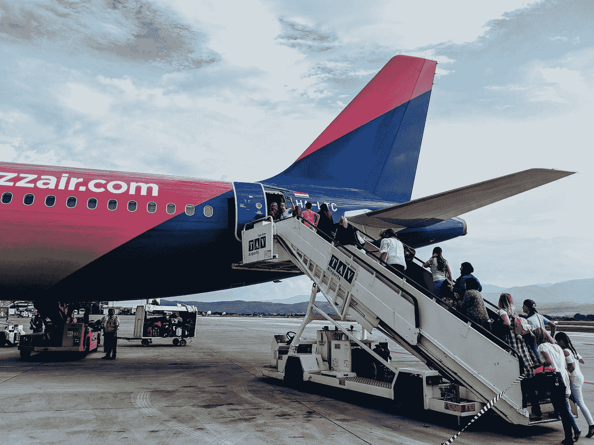

# 遗失登机牌的问题

> 原文：<https://towardsdatascience.com/the-lost-boarding-pass-problem-2a17313b2d8a?source=collection_archive---------22----------------------->

## 使用蒙特卡罗和一个惊人简单的解析解解决概率难题



马库斯·温克勒在 [Unsplash](https://unsplash.com?utm_source=medium&utm_medium=referral) 上的照片

> 在一个售罄的航班上，100 人排队登机。队伍中的第一位乘客丢失了登机牌，但还是被允许进去。他随便找了个座位坐下。每个随后的乘客坐在他们指定的座位上(如果有的话),否则坐在随机的空座位上。
> 最后一个登机的乘客发现他们的座位没人坐的概率有多大？

如果你的第一反应是描绘出登机人数较少的可能性，我邀请你花点时间自己尝试一下这个难题。这种方法给我带来了巨大的痛苦，我不想剥夺你的这种体验。

或者，继续阅读蒙特卡罗模拟和解析解的解释。

## 蒙特 卡罗模拟

由于对自己未能手动解决问题感到恼火，我很快用 Python 打出了一个杂乱的蒙特卡洛模拟:

```
import random
import numpy as npairplane = []#positive indicates that the criteria (last passenger reaches their seat) is fulfilled & vice versapositive = 0
negative = 0#constructing airplane
for i in range (1,101):
    airplane.append(i)def simulate():

    global airplane
    global positive
    global negative#first passenger
    airplane.remove(np.random.choice(airplane))#subsequent passengers
for i in range (2,100):
        if i in airplane:
            airplane.remove(i)
        else:
            airplane.remove(np.random.choice(airplane))if 100 in airplane:
        positive += 1
    else:
        negative += 1airplane = []
    for i in range (1,101):
        airplane.append(i)#running 100k trials
for i in range (0,100000):
    simulate()print(positive/(positive+negative)*100)Output: 50.076
```

通过蒙特卡洛计算，最后一名乘客找到座位的概率约为 50%。考虑到它代表了一架 100 人飞机中坐在特定座位上的最后一名乘客，我发现概率如此之高令人惊讶。

这是另一个概率难题，我们的直觉让我们失望了。这让我特别想起了[生日悖论](https://en.wikipedia.org/wiki/Birthday_problem)，在这个悖论中，由于存在严重缺陷的心理计算，大多数人也倾向于大大低估某种结果的概率。

## 分析解

真正的概率是**正好 1/2** 。原因如下:


乔纳森·法伯在 [Unsplash](https://unsplash.com?utm_source=medium&utm_medium=referral) 上拍摄的照片

从这一点开始，我按照进入的顺序引用乘客和分配给他们的座位，例如第一个登机的乘客是乘客 1，最后一个登机的乘客是乘客 100。类似地，座位 1 是乘客 1 的指定座位，依此类推。

**事实:乘客 100 将坐在座位 100(他被分配的座位)或座位 1。**

从第一个和最后一个乘客登机的角度来看，我最能理解这种观察。乘客 2–99 有两种可能。

1.  乘客的指定座位是空的。他们坐在那个座位上。
2.  乘客的指定座位被占用了。他们随意坐在其他座位上。

在这些乘客中的每一个在飞机上就座之后，他们被分配的座位被占用是必然真实的。要么是先前未被占用(上面的选项 1)并且他们坐在里面，要么是已经被占用(选项 2)。

在最后一名乘客登机前，2-99 号乘客的指定座位已被占用。此时，99 个人(包括乘客 1)已经就座，这意味着只有一个座位仍然空着。

由于还剩一个座位，且 2-99 号座位肯定有人，因此空座位必须是 1 号座位或 100 号座位。在最后一批乘客登机之前，座位 1 和座位 100 都不可能被占满，因为这意味着飞机上的所有 100 个座位都只有 99 名乘客。

事实:最后一名乘客坐在座位 1 和座位 100 的概率相等。

当最后一名乘客登机时，丢失登机牌问题的结果已经确定，因为只有一个座位可供他们选择。因此，我们必须看看乘客 1-99 所面临的决定。

对于乘客 1，选择 100 个座位中任何一个的概率是相等的。推而广之，他选择自己指定座位的概率和他选择最后一个乘客指定座位的概率是相等的。

乘客 2-99 坐在座位 1 或座位 100 的唯一方式是他们被分配的座位被占用。在这种情况下，坐在任何一个空座位上的概率也是相等的。

虽然座位 1 和座位 100 都是空的，但是同样有可能选择其中一个座位。在这两个座位中的一个被占用后，另一个座位保证保持空闲，直到最后一名乘客登机。座位 100 被先前的乘客占据的概率是 1/2。

**因此，最后一名乘客发现自己座位没人坐的概率也是 1/2。**

虽然我是一个非常没有经验的程序员，但通过 Python 使用蒙特卡罗解决丢失登机牌问题仍然比用解析方法解决要快得多。我可以在这里说一些关于模拟在解决问题中的力量，但是你可能已经听过了。

相反，我将公开感谢那些提出让航空公司在登机口打印登机牌的人。

## 来源

遗失登机牌的问题并没有在网上大量出现，尽管我能够找到略有不同的措辞版本:这里的、这里的和这里的。

[](https://medium.com/@raotanae) [## Tanae Rao -中等

### 阅读 Tanae Rao 在媒体上的文章。牛津大学哲学、政治和经济学(即将出版)。每天，塔娜·饶…

medium.com](https://medium.com/@raotanae)