# 彩票假说:一个综述

> 原文：<https://towardsdatascience.com/the-lottery-ticket-hypothesis-a-survey-d1f0f62f8884?source=collection_archive---------11----------------------->

隐喻是将思想从一个头脑传递到另一个头脑的强大工具。1970 年，艾伦·凯在 PARC 施乐公司介绍了术语“桌面”的另一种含义。如今，每个人——只需一瞬间——都想知道当提到桌面时，它到底是什么意思。最近，深度学习有幸迎来了一个新的强大隐喻:彩票假说(LTH)。但是这个假设试图传递什么思想呢？在今天的帖子中，我们深入研究了这一假设，并回顾了最初由 [Frankle & Carbin (2019)](https://openreview.net/forum?id=rJl-b3RcF7) 获得 ICLR 最佳论文奖后的文献。

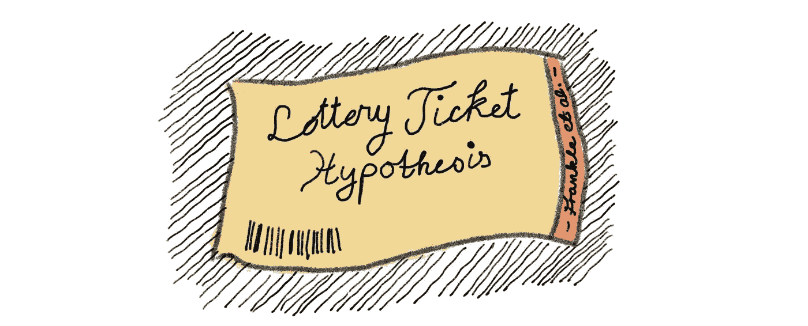

# 深度学习✂️中的剪枝

修剪过度参数化的神经网络在深度学习中有着悠久的传统。最常见的是将特定的重量设置为 0，并在随后的训练过程中保持不变。这可以通过将权重 **W** 与二进制修剪掩码 **m** 逐元素相乘来容易地完成。进行这种外科手术有几个**激励因素**:

*   它通过正则化过度参数化的函数来支持泛化。
*   它通过识别能够适合内存的性能良好的较小网络来减少推理时间期间的内存约束。
*   它降低了能源成本、计算、存储和延迟，这些都可以支持在移动设备上的部署。

随着最近越来越深的网络的出现，所有这三个因素都重新受到关注。概括地说，任何竞争剪枝算法都必须解决 4 个基本问题:

1.  **要修剪哪些连接结构？** : *非结构化修剪*不考虑修剪后的权重之间的任何关系。*另一方面，结构化修剪*按组修剪权重，例如通过移除整个神经元(权重列)、过滤器或 CNN 的通道。虽然非结构化修剪通常允许更大幅度地减少权重的数量(同时保持高性能)，但这并不一定要在标准硬件上加速计算。这里的关键是密集计算可以很容易地并行化，而“分散”计算则不能。另一个区别是全局修剪和局部修剪。*局部修剪*强制修剪每层的 **s** 百分比的权重。*另一方面，全局修剪*是不受限制的，并且简单地要求整个网络上的权重总数被修剪了 **s** 百分比。

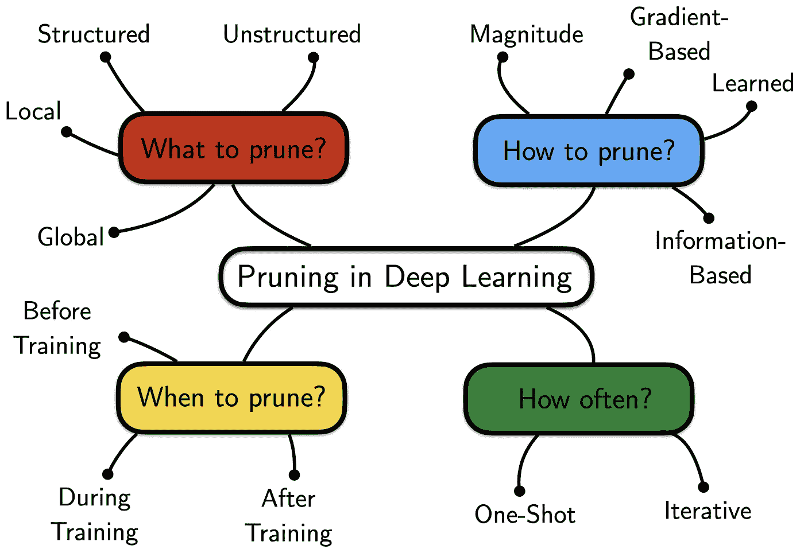

修剪什么、如何修剪、何时修剪以及多久修剪一次？

1.  **如何对权重进行排序修剪？**:有许多或多或少的启发式方法来对网络中特定权重的重要性进行评分。一个常见的经验法则是，较大幅度的权重对函数拟合有更大的影响，应该减少修剪。虽然在实践中效果很好，但直觉上这似乎与诸如 L2 权重正则化的想法相矛盾，后者实际上惩罚了大量的权重。这激发了使用基于梯度的方法或者甚至更高阶曲率信息来学习修剪掩模的更复杂的技术。
2.  **多久修剪一次？**:体重量通常只是体重重要性的一个嘈杂的代理。在训练结束时只修剪一次(*一次性*)就会成为这种噪音的牺牲品。另一方面，迭代程序在一次训练运行后仅修剪少量权重，但重复*训练-得分-修剪-回卷*循环。这通常有助于消除整个修剪过程中的噪声。通常，每次迭代的修剪率大约为 20%，总共使用 20 到 30 次修剪迭代(这使得我们只有 1%的未修剪权重)。一个人可以更保守——以更长时间的训练为代价！
3.  **何时执行修剪步骤？**:可以在网络训练的 3 个不同阶段进行修剪——训练后、训练中和训练前。当训练收敛后进行修剪时，性能通常会下降，这使得有必要重新训练/微调并给网络一个重新调整的机会。另一方面，训练期间的修剪通常与正则化和丢弃/加强分布式表示的想法相关联。直到最近，从头开始训练稀疏网络还是不可能的。

# 彩票假说&如何衡量它🃏

## 弗兰克尔和卡宾(2019)——彩票假说:寻找稀疏、可训练的神经网络

[**论文**](https://openreview.net/forum?id=rJl-b3RcF7) **|** [**代码**](https://github.com/facebookresearch/open_lth)

虽然传统文献已经能够表明，完全训练的密集网络可以被修剪到很小的参数，而不会使性能降级太多，但是很长时间以来，从零开始成功训练稀疏子网络是不可能的。那么为什么会出现这种情况呢？较小的子网**可以**近似表现良好的功能。但是与密集的网络相比，学习动力显得非常不同。

最初的彩票假设论文 [(Frankle & Carbin，2019)](https://openreview.net/forum?id=rJl-b3RcF7) 首先提供了为什么会出现这种情况的见解:在修剪之后，产生的子网络被**随机初始化**。相反，如果将权重重新初始化回其原始(但现在被屏蔽)权重，则有可能恢复同等(甚至更好)的性能！)在潜在更少的训练迭代中。这些高性能的子网可以被认为是权重初始化彩票的赢家。假设如下:

> ***彩票假设*** *:一个随机初始化的、密集的神经网络包含一个子网，该子网被初始化为使得——当被隔离训练时——它可以在最多相同次数的迭代训练后匹配原始网络的测试精度。—* [*弗兰克尔&卡宾(2019，第 2 页)*](https://openreview.net/forum?id=rJl-b3RcF7)

那么，我们怎样才能找到这样一张中奖的彩票呢？[Frankle&Carbin(2019)](https://openreview.net/forum?id=rJl-b3RcF7)提出**迭代幅度修剪** (IMP):从密集初始化开始我们训练我们的网络，直到收敛。然后，我们确定最小幅度权重的百分比，并创建一个二进制掩码来删除这些权重。然后，我们用它的**先前的初始权重**重新训练稀疏化的网络。收敛后，我们重复修剪过程(掩蔽额外的 **s** 权重),并用新发现的掩码重置为初始权重。我们重复这个过程，直到我们达到期望的稀疏水平，或者测试精度显著下降。

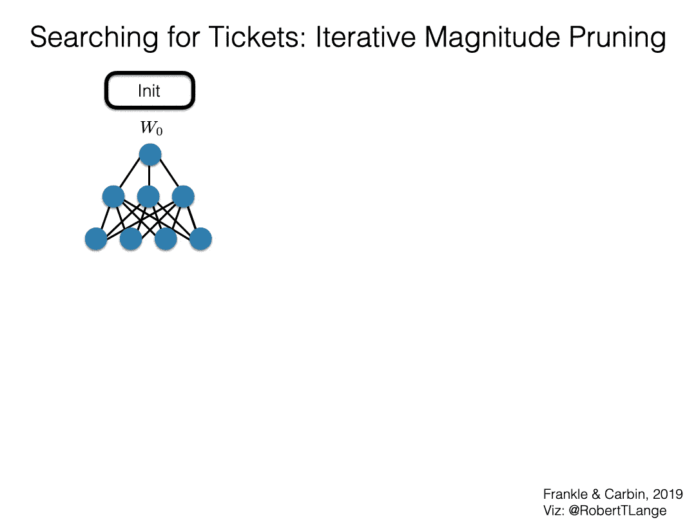

如果 IMP 成功，它会找到初始化彩票的*赢家。这只是在这个迭代修剪过程之后剩下的子网。请注意，也可以简单地以一次性方式进行修剪——但当花费额外的计算时，会获得更好的结果(参见[Frankle&Carbin(2019)](https://openreview.net/forum?id=rJl-b3RcF7)的图 4)。如果我们回想一下修剪文献中的广泛问题，我们会发现:*

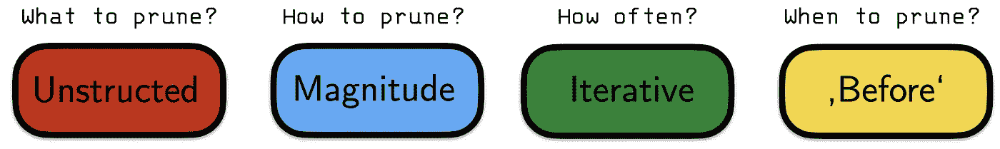

*小鬼和修剪的柱子*

下图总结了第一篇 LTH 论文的一些关键经验观点:

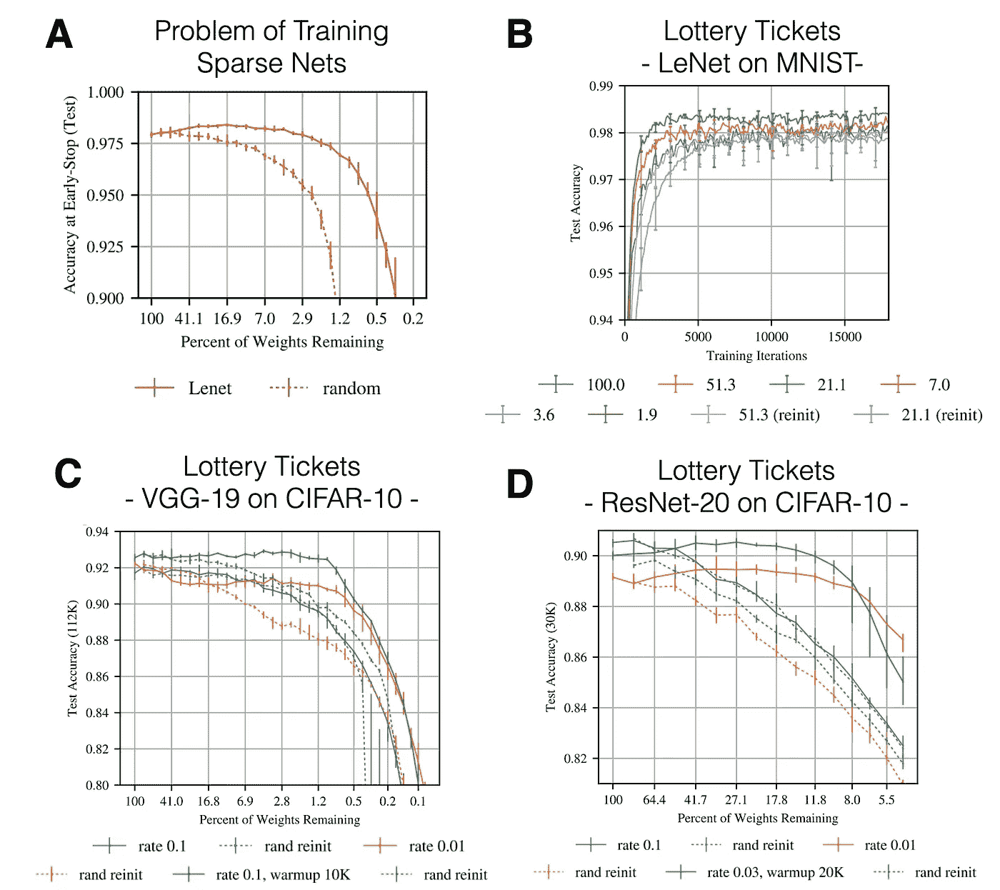

*LTH 关键结果。来源:改编自*[*Frankle&Carbin(2019)*](https://openreview.net/forum?id=rJl-b3RcF7)

*   **面板 B** :在没有任何超参数调整的情况下，IMP 能够找到稀疏子网络，其能够在更少的训练迭代中胜过未修剪的密集网络(图例指的是修剪权重的百分比)。彩票中奖初始化和随机重新初始化之间的最终表现差距被称为*彩票效应*。
*   **面板 C** & **面板 D** :为了将原始结果扩展到更复杂的任务/架构，如 CIFAR-10、VGG-19 和 Resnet-20， [Frankle & Carbin (2019)](https://openreview.net/forum?id=rJl-b3RcF7) 必须调整学习速率，并包括预热(在预定义的一组迭代内从 0 退火到最终速率)时间表。注意，要求的 Resnet 学习率比 VGG-19 学习率小得多。

那么这能告诉我们什么呢？首先，IMP 可以找到一个有利于手头任务的子结构，并且该子网络的权重初始化在学习动态方面是特殊的。此外，过度参数化对于成功的训练来说不是必需的，它可能只通过提供可用子网的组合爆炸来有所帮助。许多有趣的后续工作描述了中奖彩票质量差异背后的潜在机制。

## Frankle 等人(2019)——稳定彩票假说

[**论文**](https://arxiv.org/abs/1903.01611) **|** [**代码**](https://github.com/facebookresearch/open_lth)

原始彩票纸的一个限制是它局限于小规模的任务，如 MNIST 和 CIFAR-10。为了将 LTH 扩展到具有竞争力的 CIFAR-10 架构，[Frankle&Carbin(2019)](https://openreview.net/forum?id=rJl-b3RcF7)必须调整学习率计划。没有这种调整，不可能获得与原始密集网络相当的修剪网络([刘等人，2018](https://arxiv.org/pdf/1810.05270.pdf)；[盖尔等人，2019](https://arxiv.org/pdf/1902.09574.pdf)) 。但是如果我们放松一些门票限制呢？

在后续工作[中，Frankle 等人(2019)](https://arxiv.org/abs/1903.01611) 询问是否有可能通过不将权重重置为初始值，而是重置为少量 **k** 次训练迭代后找到的权重，来稳健地获得修剪后的子网络。换句话说，**不是在修剪后倒回迭代 0，而是倒回迭代 k** 。以下是正式定义和图解:

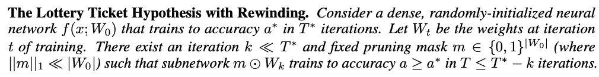

来源:[弗兰克尔等人(2019)](https://arxiv.org/abs/1903.01611)

因为我们执行了一点点训练，所以产生的票不再被称为彩票，而是匹配票。

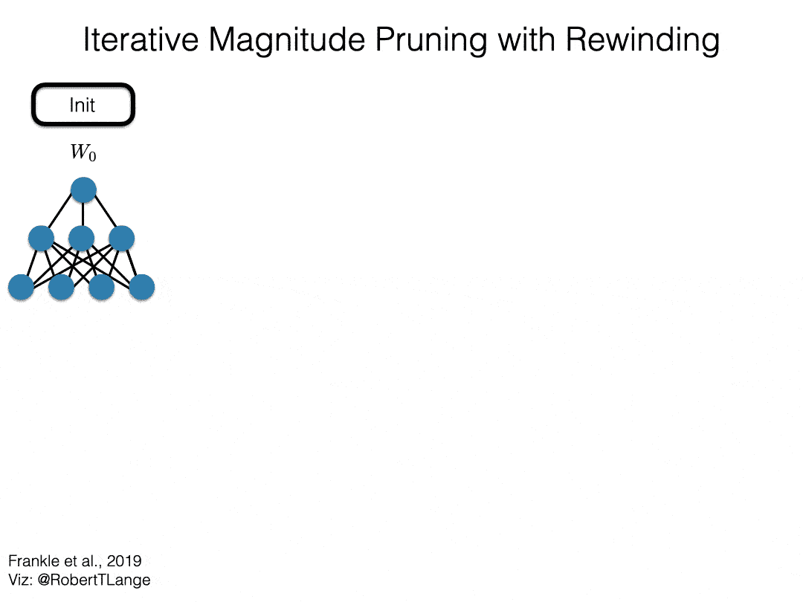

下图总结了关键的见解:在执行 IMP 时，回退到迭代 **k** > 0 非常有效。最多可以修剪大约。85%的重量，同时仍然获得匹配的测试性能。这适用于 CIFAR-10 和 Resnet-20(回退到迭代 500；画面 A)以及 ImageNet 和 Resnet-50(倒带至时期 6；图片 B)。不再需要学习率热身。

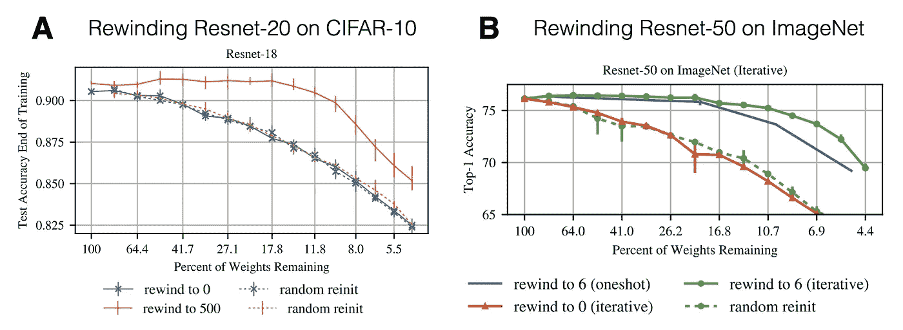

*缩放 LTH 关键结果。来源:改编自* [*Frankle 等人(2019)*](https://arxiv.org/abs/1903.01611)

## Renda 等人(2020 年)——比较神经网络修剪中的倒回和微调

[**论文**](https://arxiv.org/abs/2003.0238) **|** [**代码**](https://github.com/lottery-ticket/rewinding-iclr20-public)

到目前为止，我们已经讨论了 IMP 是否能够识别匹配的网络初始化。但是抽签程序与其他修剪方法相比如何呢？在他们的论文中， [Renda 等人(2020)](https://arxiv.org/abs/2003.02389) 比较了三种不同的程序:

1.  **微调**:修剪后，使用小学习率从最终训练值训练剩余权重。通常这只是原始训练程序的最终学习率。
2.  **重绕**:对应于 [Frankle et al. (2019)](https://arxiv.org/abs/1903.01611) 之前介绍的方法。修剪之后，剩余的权重被重置为先前 SGD 迭代 **k** 的值。从那一点开始，使用从迭代 **k** 开始的学习率时间表重新训练权重。重量和学习率计划都被重置。
3.  **学习速率倒回**:学习速率倒回使用最终未倒回的重量，而不是倒回重量值*和*设置学习速率时间表，只有将学习速率时间表重置为迭代 **k** 。

[Renda et al. (2020)](https://arxiv.org/abs/2003.02389) 对比三种方法在精度、搜索成本和参数效率方面的得失。他们回答了以下问题:

*   假设在搜索成本上的预算是无限的，那么这三种方法的最终精度和参数效率(剪枝前/剪枝后的压缩比)如何？
*   给定搜索成本的固定预算，这三种方法在准确性和参数效率方面如何比较？

在 Resnet-34/50/56 和自然语言基准 GNMT 上的实验揭示了以下见解:

1.  在无限制和固定预算实验中，重量倒带和再训练都优于简单的微调和再训练。在比较结构化和非结构化修剪时也是如此。
2.  学习率倒带优于重量倒带。此外，虽然重量倒带可能会因 **k** =0 而失败，但将学习速率倒带至训练程序的开始几乎总是有益的。
3.  权重重绕 LTH 网络是在精确度、压缩和搜索成本效率方面用于初始化修剪的 SOTA 方法。

正如许多由大规模实验产生的对深度学习的经验主义见解一样，仍然存在一个令人生畏的问题:*对于我们试图理解的这些高度非线性的系统，这实际上告诉了我们什么？*

# 剖析彩票:鲁棒性和学习动力学🔎

## 周等(2019)——解构彩票:零、符号和超级面具

[**论文**](https://papers.nips.cc/paper/8618-deconstructing-lottery-tickets-zeros-signs-and-the-supermask.pdf) **|** [**代码**](https://github.com/lottery-ticket/rewinding-iclr20-public)

决定初始化是否成功的主要因素是什么？这似乎是掩蔽标准(权重的大小)、非掩蔽权重的倒带以及将权重设置为零并冻结它们的掩蔽的组合。但是如果我们改变这三种成分中的任何一种呢？大重量有什么特别之处？其他替代倒带策略保留中奖票吗？为什么要将权重设置为零？[周等(2019)](https://papers.nips.cc/paper/8618-deconstructing-lottery-tickets-zeros-signs-and-the-supermask.pdf) 从三个方面研究这些问题:

*   **通过比较不同的评分标准来选择要屏蔽的权重。**保持最小的训练重量，在初始化时保持最大/最小重量，或者重量空间中的幅度变化/移动。
*   **通过分析当重绕重量不回到其初始状态时是否仍然获得中奖票。**他们比较了随机重新初始化、保持权重的重新洗牌和常数初始化。
*   **将屏蔽重量冻结至初始值，而非 0 值。**

大量实验的结论如下:

1.  保持重量与其离原点的距离成比例地“活动”的其他评分标准与“最大量”标准表现得一样好。
2.  只要在执行重绕时保持与初始化时权重的原始符号相同的符号，就可以获得与经典 IMP 公式表现相当的彩票(*注*:该发现后来不能被 [Frankle 等人(2020b)](https://openreview.net/forum?id=Hkl1iRNFwS) )复制)。
3.  将权重值屏蔽为 0 至关重要。

基于这些发现，他们假设**“知情”屏蔽可以被视为一种训练形式**:它只是加速权重的轨迹，这些权重在其优化轨迹期间已经“朝向”零。有趣的是，从 IMP 获得的掩码已经应用于随机初始化的网络(并且没有任何额外的训练),其产生的性能大大优于随机掩码和/或随机初始化的网络。因此，**对强感应偏置**进行编码是*超屏蔽*的一种形式。这开辟了一个令人兴奋的前景，即根本不训练网络权重，而是简单地找到正确的掩码。[周等(2019)](https://papers.nips.cc/paper/8618-deconstructing-lottery-tickets-zeros-signs-and-the-supermask.pdf) 表明，甚至可以通过使其可微分并以强化式损失训练来学习掩模。这个想法非常让我想起[Gaier&Ha(2019)](https://arxiv.org/abs/1906.04358)权重不可知的神经网络。学习到的掩码可以被认为是编码解决方案规则性的连接模式。通过多次采样权重来评估掩模，我们本质上使其对采样的权重是鲁棒的(或不可知的)。

## Frankle 等人(2020 a)——线性模式连接&彩票假说

[**论文**](https://arxiv.org/abs/1912.05671) **|** [**代码**](https://github.com/facebookresearch/open_lth)

当我们训练神经网络时，我们通常对数据批次进行随机排序。每一批用于评估相对于网络参数的损耗梯度。在数据集上的一个完整循环(也称为一个时期)之后，批次通常被混洗，并且我们继续下一个时期。批次的顺序可以被视为我们注入到训练过程中的噪声源。根据它，我们可能获得非常不同的最终权重，但是理想情况下，我们的网络训练过程对于这样的噪声是有些健壮的。更正式地说，我们可以考虑单个砝码初始化，我们对两个不同的批次订单进行训练，以获得两组不同的训练砝码。线性模式连接性分析 [(Frankle 等人，2020a)](https://arxiv.org/abs/1912.05671) 提出了以下问题:**如果我们在这两个由不同数据顺序产生的最终权重配置之间进行平滑插值(凸组合)，验证/测试精度会如何表现？**

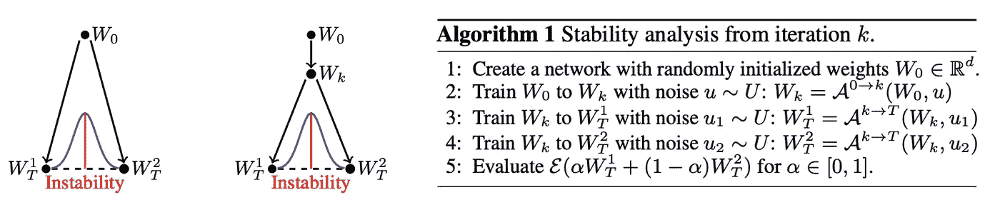

*线性模式连接。来源:* [*弗兰克尔等人(2020a)*](https://arxiv.org/abs/1912.05671)

如果当我们在两个最终权重之间进行插值时误差没有显著增加，则网络被认为是稳定的。此外，我们可以在单个共享数据排序上训练用于 **k** 迭代的初始权重，并且仅在稍后将训练分成两个单独的数据排序。对于哪一个 k，网络会变得稳定？很简单， **k=T** 就是这种情况，但是更早的呢？事实证明，这与我们为了获得匹配的票证初始化而必须倒带的迭代有关。


*线性模式连接关键结果。来源:改编自* [*弗兰克尔等人(2020a)*](https://arxiv.org/abs/1912.05671)

*   **面板 A** :暂时没有票，看看网络什么时候对不同的数据排序变得插值稳定。对于 LeNet，在初始化时就已经是这种情况了。对于 Resnet-20 来说，这种稳定性只是在以后的训练中才会出现。这不是让人想起倒带迭代吗？
*   面板 B :迭代幅度修剪可以诱导稳定性。但这仅在倒回至 **k** =0 时与学习率计划技巧结合使用。
*   **面板 C** :通过修剪越来越多的权重，我们似乎进入了 3 种参数化模式(聚焦于蓝线):
    - *模式 I* :网络被过度参数化，因此即使是随机修剪也能产生良好的性能。
    - *制度 II* :随着我们增加删减权重的百分比，仅影响与*和*稳定票/网络匹配的产量。
    - *状态 III* :虽然 IMP 仍然能够在严重稀疏的情况下产生稳定的网络，但是得到的网络不再匹配。

这是彩票如何被用来揭示学习动力特征的一个例子。下一篇文章给出了对不同学习阶段的另一种更精细的分析:

## Frankle 等人(2020 b)——神经网络训练的早期阶段

[**论文**](https://openreview.net/forum?id=Hkl1iRNFwS) **|** [**代码**](https://github.com/facebookresearch/open_lth)

到目前为止，我们已经看到，只有少量的训练迭代(或 Resnet 上的历元)会产生数据顺序健壮性以及倒带时获得匹配票的能力。一个更普遍的后续问题是:这些匹配票证初始化有多健壮？在我们失去魔力之前，我们能在多大程度上扭动和扰乱初始化？而这个随着 **k** 如何变化？

为了研究鲁棒性的出现 [Frankle 等人(2020b)](https://openreview.net/forum?id=Hkl1iRNFwS) 在 CIFAR-10 上使用 Resnet-20 进行了置换实验。协议如下:使用带有倒带的 IMP 导出匹配票据。然后，对匹配的车票和列车进行扰动，直到收敛。排列包括:

*   *将权重设置为迭代 0 或* ***k*** 的符号和/或幅度(见**画面 A** )。任何排列(符号或大小—‘init’)都会损害高稀疏级别的性能。另一方面，在低水平上，IMP 衍生的网络似乎对符号翻转具有鲁棒性。同样的定性结果适用于倒回至 **k** =2000(参见 [Frankle 等人(2020b)](https://openreview.net/forum?id=Hkl1iRNFwS) 的图 4)。
*   *在迭代* ***k*** *时，用网的结构子组件*置换权重(见**画面 B** )。这包括全局(跨层)、局部(层内)和给定过滤器内交换网络的权重。匹配标签对任何扰动都不鲁棒，并且性能降低到倒回迭代 **k** =0 的水平。**另一方面，画面 C** 通过仅交换具有相同符号的权重来限制排列的效果。在这种情况下，网络对于在所有稀疏水平上的滤波器内洗牌是鲁棒的。
*   *将高斯噪声添加到匹配的票证权重*(见**面板 D** ):为了确保添加的噪声的正确比例， [Frankle 等人(2020b)](https://openreview.net/forum?id=Hkl1iRNFwS) 计算由特定层的初始化分布产生的逐层标准化标准偏差。有效标准差的大小非常影响扰动彩票的最终表现。扰动越大=性能越差。
*   *具有不同自监督损耗* ( **面板 E** )的密集/稀疏网络的预训练:当从 **k** =500 到 **k** =2000 时，先前的结果被很大程度地保留。这表明除了简单的重量分布特性和符号之外，还有其他的力。相反，魔术似乎在于实际的训练。因此， [Frankle 等人(2020b)](https://openreview.net/forum?id=Hkl1iRNFwS) 询问早期阶段适应是否取决于条件标签分布中的信息，或者无监督表示学习是否足够。与回退到迭代 0 相比，在随机标签上训练少量的历元确实缩小了差距。但是较长的预训练最终会损害网络的性能。最后，预训练(非票证)稀疏网络不足以克服“错误的”/有害的修剪掩模(**面板 F** )。

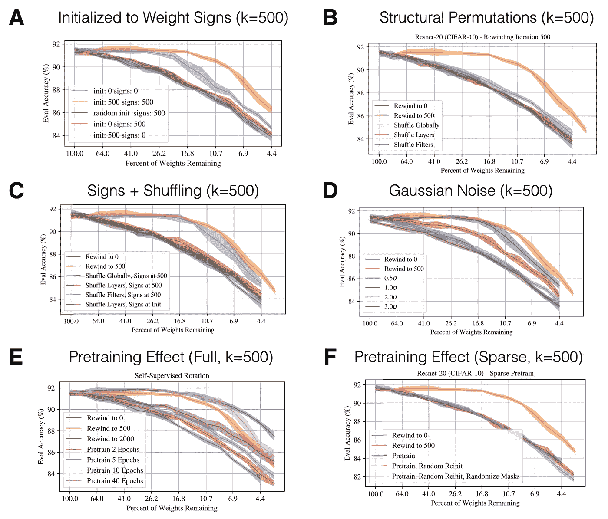

*前期关键成果。来源:改编自* [*弗兰克尔等人(2020b)*](https://arxiv.org/pdf/2002.10365.pdf)

总而言之，这提供了一个证据，即很难克服使用倒带的必要性，因为匹配初始化的出现显得非常重要。自我监督的预培训似乎提供了一种避免倒带的潜在方法。在 CIFAR-10 上培训 Resnet-20 的早期学习动态的进一步见解总结在下面由 [Frankle 等人(2020b)](https://openreview.net/forum?id=Hkl1iRNFwS) 制作的 awesome 可视化中:

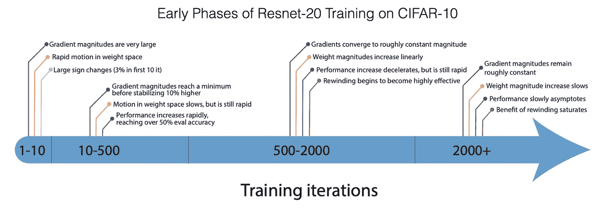

*NN 训练的早期阶段。来源:* [*弗兰克尔等人(2020 年 b)*](https://arxiv.org/pdf/2002.10365.pdf)

# 几乎不需要培训就能发现中奖彩票！

虽然乔纳森·弗兰克尔的原始工作提供了一个实证存在的证明，但寻找门票是棘手和昂贵的。IMP 需要反复训练越来越稀疏的网络，这不是每个博士研究员都能做到的(不会被他们的实验室成员讨厌)🤗).下一个自然的问题是如何用更少的计算来识别这样的网络。这里有两种尝试这样做的最新方法:

## you et al .(2020)——获取早期入场券:更有效地训练深度网络

[**论文**](https://arxiv.org/abs/1909.11957) **|** [**代码**](https://github.com/RICE-EIC/Early-Bird-Tickets)

[You et al. (2020)](https://arxiv.org/abs/1909.11957) 使用结合了早期停止、低精度和大学习率的低成本训练方案，在训练早期识别获胜门票(因此是“早期鸟”门票)。他们认为这是由于神经网络优化轨迹的两阶段性质:

1.  学习低频/大奇异值分量的稳健的第一阶段。
2.  学习较高频率/低奇异值分量的吸收阶段。

通过仅关注于识别连通性模式，有可能在阶段 1 中识别出早鸟票。与标准 LTH 工作的一个主要区别是，[尤等人(2020)](https://arxiv.org/abs/1909.11957) 基于它们的批量归一化比例因子修剪整个卷积通道。此外，修剪是在单次训练运行中迭代执行的。

作者根据经验观察到，在训练的第一个时期，修剪掩码发生了显著变化，但似乎很快就收敛了(见下图的左部)。

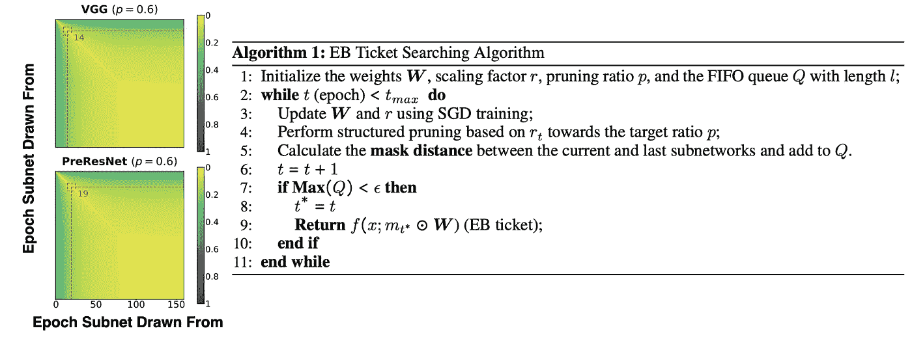

*掩码收敛&早鸟算法。来源:改编自* [*尤等(2020)*](https://arxiv.org/abs/1909.11957)

因此，他们推断早期出现的假设是正确的，并制定了合适的检测算法:为了检测早期出现，他们提出了一种掩码距离度量，该度量在两次连续的修剪迭代中计算两个修剪掩码之间的汉明距离。如果距离小于阈值，它们会停止修剪。然后，可以简单地重新训练所产生的早期票证，以恢复性能。

## Tanaka 等人(2020)——通过迭代保存突触流，在没有任何数据的情况下修剪神经网络

[**论文**](https://arxiv.org/abs/2006.05467) **|** [**代码**](https://github.com/ganguli-lab/Synaptic-Flow)

虽然 [You et al. (2020)](https://arxiv.org/abs/1909.11957) 询问是否有可能减少所需的计算量，但他们仍然需要根据数据训练模型。 [Tanaka et al. (2020)](https://arxiv.org/abs/2006.05467) 另一方面，回答了一个更宏大的问题:我们能在没有任何训练和任何数据的情况下获得中奖的门票吗？他们认为，初始化时修剪的最大挑战是**层崩溃**的问题——过度急切地修剪整个层，导致架构无法实现(因为梯度流被切断)。

想象一个堆叠了一组完全连接的层的 MLP。可以通过保持每层的单一重量来避免层塌陷，该重量对应于理论上可实现的最大压缩量。在不崩溃的情况下，修剪算法可以实现的压缩级别称为**临界压缩**。理想情况下，我们希望这两者相等。受流网络的启发， [Tanaka 等人(2020)](https://arxiv.org/abs/2006.05467) 定义了一种基于梯度的分数，称为**突触显著性。**该指标与分层相关性传播有些关系，并测量一种形式的贡献。然后，本文在“微观”神经元和“宏观”网络层次上证明了两个显著性守恒定律。这使得作者能够证明——为了充分压缩——基于梯度的方法将完全修剪大的层(如果评估一次的话)。那么我们为什么不在训练的小鬼设定中遇到层塌陷呢？ [Tanaka 等人(2020)](https://arxiv.org/abs/2006.05467) 表明这是由于梯度下降鼓励逐层保护以及小速率迭代修剪。因此，任何想要最大临界压缩的全局剪枝算法都必须考虑两件事:积极地对逐层保守性评分，并在剪枝后迭代地重新评估评分。

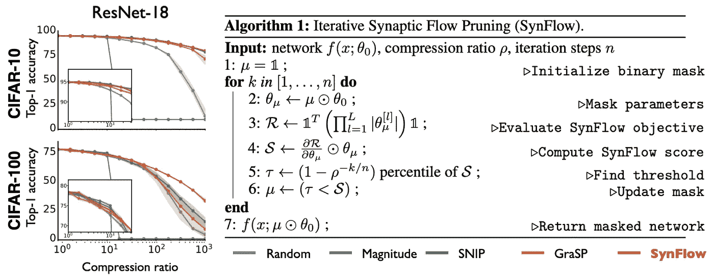

*性能&突触流算法。来源:改编自* [*田中等人(2020)*](https://arxiv.org/abs/2006.05467)

基于这些观察，作者定义了一个迭代过程，该过程产生一个屏蔽，该屏蔽通过初始化的网络保持突触强度的流动(见上文)。最重要的是，这个过程完全是数据不可知的，只需要随机初始化。在 CIFAR-10/100 和 Tiny ImageNet 上，它们能够超越其他“初始化时修剪”基准。我真的很喜欢阅读这篇论文，因为它通过将理论结果转化为可操作的算法来利用它。

# 票在数据集、优化器和域之间通用吗？🃏 👉 🃏

## morcos et al .(2019)-一张票赢所有人:跨数据集和优化器推广彩票初始化

[**论文**](https://arxiv.org/abs/1906.02773) **|** [**代码**](https://github.com/varungohil/Generalizing-Lottery-Tickets)

一个关键问题是匹配票是否过多。在子网初始化的上下文中，过度拟合是什么意思？票证是在特定数据集(如 MNIST、CIFAR-10/0、ImageNet)上生成的，具有特定的优化器(SGD、Adam、RMSprop)，用于特定的域(视觉)和特定的任务(对象分类)。如果我们改变这些成分中的任何一个，一张票是否仍然是赢家还不明显。但是我们真正感兴趣的是在一般意义上找到学习的正确归纳偏差。

因此， [Morcos et al. (2019)](https://arxiv.org/abs/1906.02773) 询问是否可以在一个视觉数据集(如 ImageNet)上识别匹配的票证，并将其转移到另一个数据集(如 CIFAR-100)。关键问题是，在新数据集上训练匹配的彩票后，彩票效应是否会持续。过程如下:

1.  使用 IMP 在*源*数据集上查找彩票。
2.  在新的*目标*数据集上评估源彩票，对其进行训练直至收敛。

因此，此时你可能会问自己，在这种情况下，输入/输出形状是如何工作的？至少我做到了😄。由于我们对图像进行操作，并且所考虑的网络情况中的第一层是卷积，所以我们不必对第一隐藏层变换进行任何改变。呸。在我们从卷积过渡到全连接(FC)层的网络处理阶段， [Morcos 等人(2019)](https://arxiv.org/abs/1906.02773) 使用[全局平均池](https://www.quora.com/What-is-global-average-pooling)，以确保不管通道大小(数据集之间会有所不同)如何，FC 层的尺寸都能计算出来。最后但并非最不重要的是，最后一层必须从彩票传输中排除，而是随机初始化。这是因为不同的数据集有不同数量的目标类。这个过程*不同于传统的转移学习，因为我们不转移表示(以训练权重的形式)，而是在单独的数据集*上找到的初始化和屏蔽。那么 [Morcos et al. (2019)](https://arxiv.org/abs/1906.02773) 发现了什么？

*   **面板 A** 和**面板 B** :将 VGG-19 票证从小型源数据集传输到 ImageNet 的性能很好，但不如在目标数据集上直接推断的票证。另一方面，从比目标数据集更大的数据集推断的票据比从目标数据集推断的票据性能更好。
*   **面板 C** 和**面板 D**:Resnet-50 的情况大致相同。但是也可以观察到，对于比 Resnet-50 更小的修剪部分，性能已经下降(Resnet-50 的“修剪”悬崖比 VGG-19 更尖锐)。

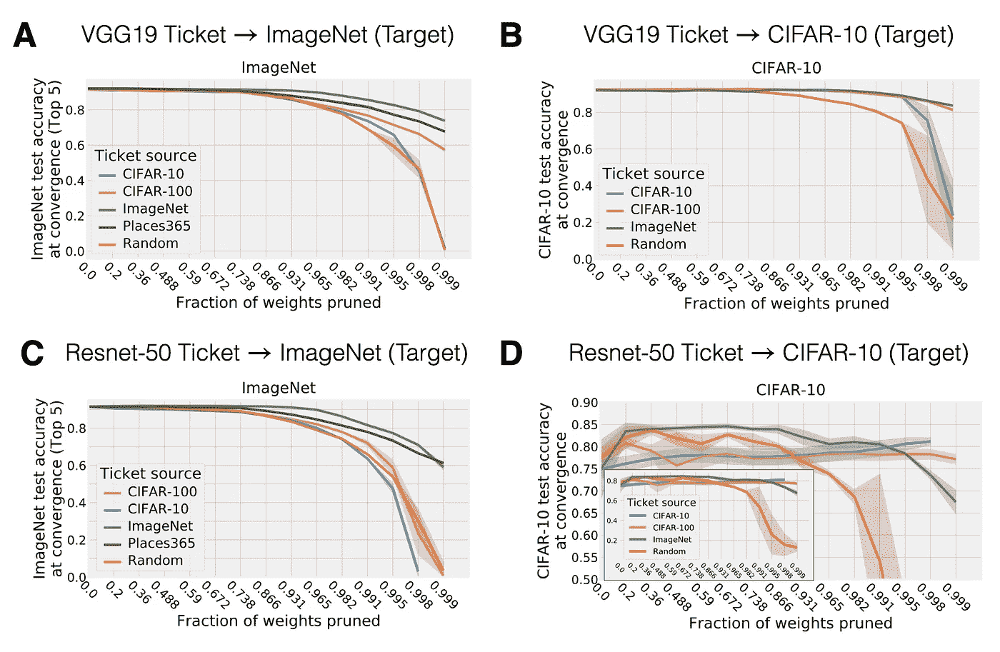

*跨数据集传输票据。来源:改编自*[*Morcos et al .(2019)*](https://arxiv.org/abs/1906.02773)

最后， [Morcos et al. (2019)](https://arxiv.org/abs/1906.02773) 还调查了用一个优化器推断的票据是否转移到另一个优化器。是的，这对于 19 岁的 VGG 来说是可能的，如果你仔细调整学习速度的话。这再次表明彩票编码的归纳偏差在数据和优化过程中是不变的。

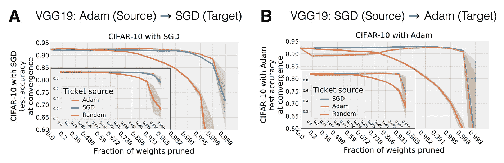

*票跨优化器转移。来源:改编自* [*Morcos 等人(2019)*](https://arxiv.org/abs/1906.02773)

那又怎样？这凸显了门票作为一般归纳偏差的巨大潜力。人们可以想象在一个非常大的数据集上找到一个健壮的匹配标签(使用大量计算)。这个*通用票*可以灵活地充当(可能是所有/大部分)松散域相关任务的初始化器。因此，票证可以——类似于元学习权重初始化的概念——*在权重初始化空间*中执行某种形式的分摊搜索。

## 余等(2019)——用奖励和多种语言玩彩票:RL 和 NLP 中的彩票

[**纸**](https://openreview.net/forum?id=S1xnXRVFwH)

到目前为止，我们已经在计算机视觉任务的上下文中看到了子网初始化。非交叉熵损失函数的不同域怎么样？[于等(2019)](https://openreview.net/forum?id=S1xnXRVFwH) 调查对语言模型的扩展(基于和 Transformer 模型)以及强化学习(演员-评论家方法)的设置。在 vision 中与之前的工作有几个不同之处:首先，除了卷积滤波器和 FC 层(循环&嵌入层和注意模块)，我们还修剪了其他类型的层。第二，我们在非常不同的损失面上训练(例如，非平稳的演员-评论家损失)。最后，RL 网络通常比大型视觉网络具有少得多的参数(特别是对于连续控制)，这可能使其在高稀疏水平下更难修剪。

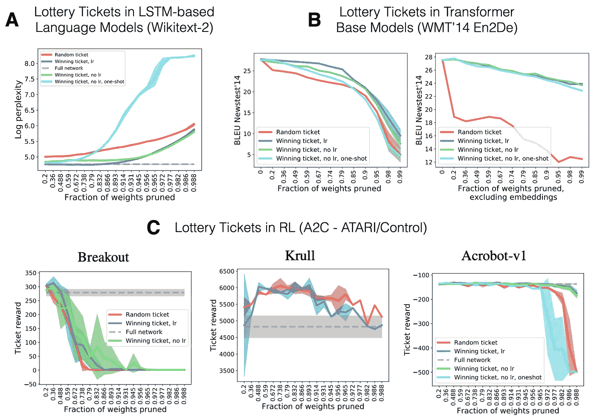

*语言模型中的票& RL。来源:改编自* [*于等(2019)*](https://arxiv.org/pdf/1906.02768.pdf)

简而言之，是的，对于语言和 RL 任务，存在明显优于随机子网的稀疏初始化。最有趣的是，作者发现人们可以减少所有变压器重量的 2/3，同时仍然获得强大的性能。后期倒带和迭代修剪也是关键，嵌入层似乎被过度参数化了。所以主要是 IMP 针对他们。另一方面，对于 RL，在所有考虑的游戏中，表现良好的修剪水平变化很大。这表明对于一些任务，标准的基于 CNN 的演员-评论家网络有太多的参数。这很可能是由许多游戏组成的 RL 基准的功能，这些游戏都是由相同的架构设置学习的。

# 开放研究问题？

彩票假说开辟了许多不同的观点，如优化、初始化、表达性与可训练性以及稀疏性/过参数化的作用。目前，未回答的问题比回答的问题要多得多——这让我兴奋不已！以下是我的一些想法:

*   引发彩票的有效初始化方案是什么？元学习能产生这样的中奖票初始化方案吗？有可能将利用彩票的优化算法形式化吗？连通性和权重初始化的影响能够被解开吗？中奖票能算归纳偏差吗？
*   一个已经用只在一半训练数据上预训练的权重初始化的网络，最终网络(在完整数据集上训练)**总是**产生泛化差距 [(Ash & Adams，2019)](https://arxiv.org/abs/1910.08475) 。换句话说，对数据子集进行预训练比从随机初始化中进行训练更糟糕。彩票能克服这个暖启动问题吗？根据 [Morcos 等人(2019)](https://arxiv.org/abs/1906.02773) 的研究，这应该是一个很容易的扩展。
*   彩票在领域(视觉、语言、RL)和任务(分类、回归等)之间有哪些不同？)?差异是损失面的函数吗？我们能简单地从掩模中提取规律吗？

总的来说，仍有许多东西有待发现，许多彩票有待赢取。

## 一些最后的提示和致谢

> *感谢*[*Jonathan Frankle*](https://twitter.com/jefrankle)*的宝贵反馈，指点&整个 LTH 代码库的开源(参见*[*open _ lth repository*](https://github.com/facebookresearch/open_lth)*)。此外，我要大声疾呼，是谁让这篇博文变得可读🤗*

如果你仍然看不够 LTH，这些建议值得一试:

*   Jonathan Frankle 的 [ICLR 最佳论文奖演讲](https://www.youtube.com/watch?v=s7DqRZVvRiQ) —精彩的 10 分钟关键观点和结果介绍，非常容易理解的幻灯片！
*   Ari Morcos 的[关于跨数据集归纳票据的再工作演讲](https://www.youtube.com/watch?v=oOgbHpjTwwA)。
*   乔纳森·弗兰克尔[对 2019 年 ML 研讨会回顾的贡献](https://ml-retrospectives.github.io/neurips2019/accepted_retrospectives/2019/lottery-ticket/)&[伴随个人故事](https://slideslive.com/38923503/retrospective-lightning-talks)(从 12:30 分钟开始)
*   推荐大家看一下原始论文的演变和 [ArXiv 预印本](https://arxiv.org/abs/1803.03635)的不同版本。特别是对于一个刚刚起步的研究人员来说，看到基于越来越强大的假设检验的轨迹和规模，真的很有启发。
*   如果你对一些数学感兴趣，并且对浓度不平等有亲近感，请查看[malachi 等人(2020)](https://arxiv.org/abs/2002.00585) 。他们正式证明了 LTH，并提出了一个更强的猜想:给定一个足够大的密集网络，不需要任何额外的训练就可以获得匹配性能的子网*。*
*   检查这个 [GitHub 库](https://github.com/he-y/Awesome-Pruning)中的大量最近的(和不太最近的)修剪文件。

你可以在这里找到这篇博文的 pdf 版本。如果您在科学工作中使用本博客，请注明:

```
@article{lange2020_lottery_ticket_hypothesis,
  title   = "The Lottery Ticket Hypothesis: A Survey",
  author  = "Lange, Robert Tjarko",
  journal = "https://roberttlange.github.io/year-archive/posts/2020/06/lottery-ticket-hypothesis/",
  year    = "2020",
  url     = "https://roberttlange.github.io/posts/2020/06/lottery-ticket-hypothesis/"
}
```

*原载于 2020 年 6 月 27 日*[*https://roberttlange . github . io*](https://roberttlange.github.io/posts/2020/06/lottery-ticket-hypothesis/)*。*