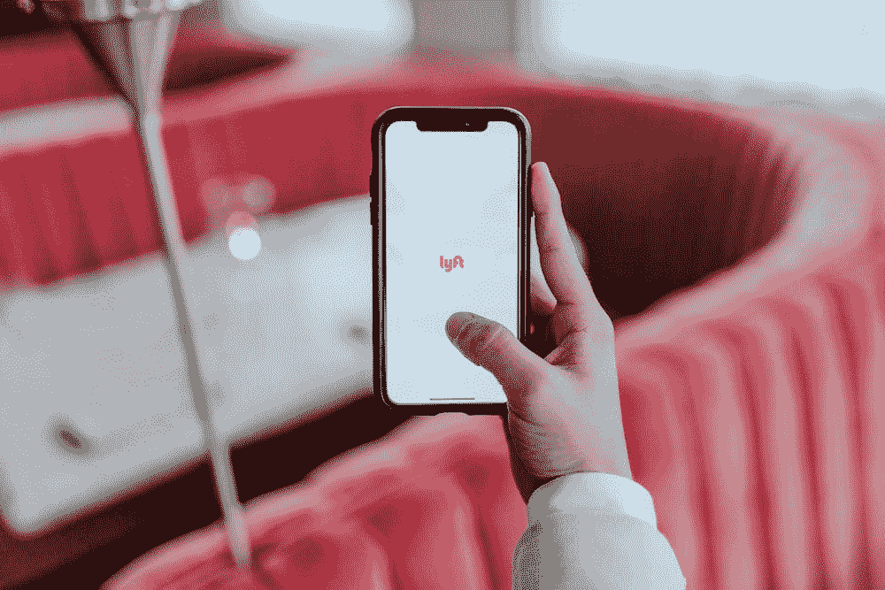
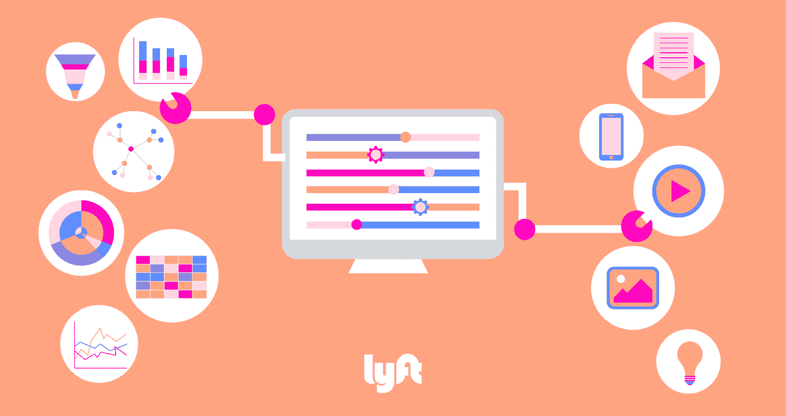
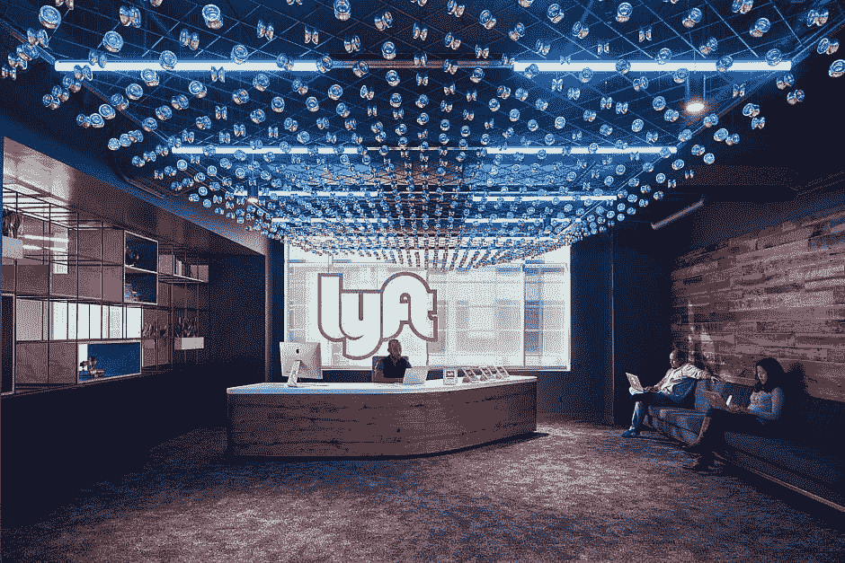

# Lyft 数据科学家访谈

> 原文：<https://towardsdatascience.com/the-lyft-data-scientist-interview-a935700c3f8e?source=collection_archive---------25----------------------->

## Lyft 数据科学面试问题

图片来自 [Unsplash](https://unsplash.com/photos/WO23uj_8EUU)

## 介绍

Lyft，Inc .是一家快速扩张的拼车公司，总部位于旧金山，在美国 644 个城市和加拿大 12 个城市开展业务。Lyft 成立于 2012 年，是长途拼车业务的一部分，最初名为 *Zimride* ，于 2013 年在硅谷推出。

该公司迅速扩张，从 2014 年 4 月的 60 个美国城市扩张到 2017 年 1 月的 300 多个城市。现在，Lyft 的用户已经超过 2300 万，截至 2020 年，记录的乘车次数达到 10 亿次。

Lyft 每天生成数百万个数据点，需要扩展其数据科学和研究科学能力。因此，一个专门的数据科学和商业智能部门的任务是利用最先进的**分析、机器学习和大数据**(使用 AWS S3/AWS EC2)工具来提供**商业模式和见解**。

# Lyft 的数据科学角色

来自 [Lyft 工程](https://eng.lyft.com/lyft-marketing-automation-b43b7b7537cc)的数据科学职责

Lyft 的数据科学能力分为三个特定的团队:**数据科学家、研究科学家和机器学习工程师。**

**数据科学家负责构建分析基础架构**，创建模型，并为自助分析设置仪表盘。Lyft 的数据科学家角色最初被称为数据分析师，现在更专注于分析，并与产品经理一起推动产品决策。

**Lyft 的研究科学家更像传统的数据科学家**并运送生产代码来从事核心的机器学习项目，例如估计的乘坐时间和每次乘坐的定价。Lyft 研究科学家在运行 Lyft 应用和产品的自动化引擎上做了大量工作。

**最后，Lyft 的机器学习工程师专注于构建基础设施**，这是托管研究科学家构建的复杂模型所需要的。

Lyft 的数据科学角色是为不同产品和功能的团队量身定制的**。**因此，确切的角色和职责将取决于您被分配到的团队和产品/功能。

无论您正在与哪个团队合作，或者您的团队被分配到哪个产品/功能，Lyft 的数据科学家角色都将跨越业务分析、建模、机器学习和深度学习实施。

## 所需技能

Lyft 的文化是创造一个“开放、包容和多元化的环境，在这个环境中，成员的贡献得到认可”。Lyft 更倾向于聘用在**数据分析和可视化**方面拥有 3 年以上经验的高素质申请人。

Lyft 招聘的其他基本要求包括:

*   统计学，经济学，应用数学，运筹学或工程学学士学位。有高等学位者优先。
*   3 年以上数据科学或分析行业经验。
*   优秀的数据分析、建模、Python 和 SQL 语言(MySQL、PostgreSQL、SqlServer、Oracle)技能——能够编写大型数据集的结构化高效查询。
*   精通 Tableau、Power BI 或类似的数据可视化软件。
*   使用 ETL 逻辑构建新的数据表非常容易:构建、管理和修复整个企业数据模型。
*   熟练使用气流等工作流程管理工具。
*   出色的沟通技巧，能够向相关受众展示调查结果和建议。

## 什么样的数据科学角色？

来自 [Lyft 工程](https://eng.lyft.com/experimentation-in-a-ridesharing-marketplace-b39db027a66e)的车辆数据映射

Lyft 有一个专门的数据分析和商业智能部门，但根据您被分配到的团队和产品，工作角色和职能可能会略有不同。根据团队的不同，这些职能可能包括:

*   利用机器学习自动化工具来管理增长杠杆。
*   通过每周、每月和每季度的业务回顾，跟踪并报告与中心工作流相关的 KPI。
*   分析价格变化对整个市场的影响。
*   与产品领导紧密合作，构建最有效的工具、系统和流程来管理大规模定价

Lyft 的数据科学团队包括:

*   绘图
*   自主车辆
*   市场
*   动态定价
*   成长团队
*   骑手体验
*   驾驶员体验
*   欺诈团队
*   机场体验

# Lyft 面试流程

Lyft 总部来自[影城建筑](https://studios.com/projects/lyft_hq/)

Lyft 的招聘流程与其他大型科技公司类似。面试过程从招聘经理或人力资源的初步电话筛选开始，然后是带回家的挑战(通常有 24 小时的交付时间)或技术筛选。在成功通过带回家的挑战和 45 分钟长的技术面试(在某些情况下是两次技术面试)后，接下来是五六次现场一对一面试，现在几乎是因为新冠肺炎。

## 初始屏幕

最初的筛选是通过人力资源或招聘经理的电话来完成的。这次面试主要是**试探性的，以简历为主**。这里的主要重点是评估你的背景，特别是**过去的经验、角色、团队动态**，以确定你是否是一个潜在的合适人选。

## 技术屏幕

面试流程的下一步是与数据科学家进行技术面试电话筛选。这次面试持续 30 到 45 分钟，面试问题涵盖概率基础、统计学、机器学习、业务案例研究、一些运营 KPI 的定义、假设测试的数学演示以及您的技术/过去的项目经验。

## 带回家的挑战

完成初步筛选后，您将收到 Lyft 带回家的挑战，您将有 24 小时的时间完成。带回家挑战中的问题是基于**案例研究的问题**(拼车数据集)，它们包括**技术和商业**方面的问题。在这项挑战中，问题通常跨越不同的主题，例如流失率测量、优化(使用机器学习)、建议的设计/实验，以及创建关于您的假设、限制和结论的综合报告。

[*面试查询*](https://www.interviewquery.com) *查看 Lyft 带回家挑战。*

> 注意:带回家的挑战演示将在现场进行。

## 现场面试

通过技术筛选后，流程中的下一个预定面试是现场面试。该流程包括**五或六轮与数据科学家或团队经理的一对一**面试，每轮持续约 45 分钟。这是一个为期半天的面试过程，包括**白板编码、与团队经理和数据科学家的项目讨论**、**业务案例研究和统计概念**。

一般来说，累积面试过程看起来会像这样:

*   带回家的数据挑战演示–在这次面试中，候选人需要对在面试过程的早期提交的带回家的挑战进行演示。

> 注意:在这个阶段，你需要围绕你的分析建立一个连贯的故事，同时回答关于你使用了什么指标以及为什么选择它们的问题。

*   商业案例研究面试:这个面试中的问题主要是开放式的，围绕一个真实的商业案例研究。建议在 Lyft 温习一些与拼车相关的单位经济学指标。
*   数据科学家的统计和概率:这里的问题围绕假设检验，比如经典的“硬币在 y 次翻转中有 x 个正面”。熟悉关键概念的业务应用程序、它们的变体以及使用 SQL 的数据操作是有好处的。
*   SQL/Python 访谈:这是一次 45 分钟的数据科学家访谈，涉及 SQL 或 R/Python 和算法的白板编码。
*   核心价值观/文化契合度与产品经理的面谈。

面试流程的目的是评估您在提供业务影响洞察方面的**分析概念和设计技能的经验**。记得复习你的统计和概率(A/B 测试)、实验设计和关键统计概念的商业应用的知识。

此外，阅读关键经济指标和 KPI、算法和模型也会有所帮助。 [*在面试查询*](https://www.interviewquery.com)*上练习大量的 SQL 和优化问题，因为这些可以更好地为面试过程的技术方面做好准备*。**

# *Lyft 数据科学面试问题*

*   *描述如何设计热图，告诉司机去哪里。你如何定义接下来哪些领域会有高需求，你希望谁去那里？*
*   *你如何模拟激增对需求和供给的影响？*
*   *解释相关性和方差。*
*   *解释实现池匹配的最佳方法。*
*   *你如何减少供应方的流失？*
*   *一个司机的终身价值是多少？*
*   *有哪些不同的因素会影响司机平均等待时间的增长？*
*   *你熟悉哪些优化技术，它们是如何在基础层面上工作的？给定一个线性需求函数，你如何找到最优价格？对二次函数求导。*
*   *如何在极坐标下从圆中画出均匀的随机样本？*
*   *求基本分布的随机变量的期望值。你如何构建一个置信区间？*
*   *你如何估计用户订购顺风车的概率？为了估计这个概率，你需要什么样的假设？*

# *感谢阅读*

*   *如果你想了解更多独家面试解释，请查看 [**面试查询**](https://www.interviewquery.com/) **！***
*   *查看我的 [**Youtube 频道**](https://www.youtube.com/channel/UCcQx1UnmorvmSEZef4X7-6g) 获取更多面试指南，以及解决问题的技巧&。*
*   *在面试查询博客上找到更多数据科学面试指南，如 Pinterest 数据科学家面试 和 [**IBM 数据科学家面试**](https://www.interviewquery.com/blog-ibm-data-scientist-interview/) 。*

**原载于 2020 年 7 月 28 日 https://www.interviewquery.com***。***