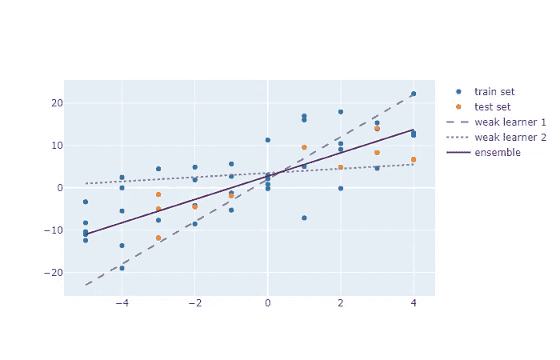

# 集成学习背后的魔力

> 原文：<https://towardsdatascience.com/the-magic-behind-ensemble-learning-569be80fbab4?source=collection_archive---------30----------------------->

## 如何使用许多 Kaggle 竞赛获胜者使用的简单技术来提高模型的性能

机器学习中最有用和最简单的技术之一是所谓的集成学习。集成学习(EL)是 XGBoost、Bagging Trees、Random Forest 和其他方法背后的方法，但还不止这些。

这里有很多关于数据科学的非常好的文章(这里的和这里的是我最欣赏的两个故事)。*那么，为什么又是一篇关于埃尔的文章呢？*因为我想用一个非常简单的例子向你展示**它是如何工作的，这个例子让我确信它不是魔术！**

嗯，我第一次看到 EL 运行时(只有几个非常简单的回归模型)，我简直不敢相信自己的眼睛，我仍然感谢教授我这项技术的教授。

我有两个不同的模型(“弱学习者”)，样本外 R 分别为 0.90 和 0.93。在查看结果之前，我会想到在两个原始 R 之间的某处获得一个 R。换句话说，我认为 EL 可以用于避免一个模型的性能与最差的模型一样差，但不是一个可以*胜过最佳模型*的模型。

令我非常惊讶的是，预测的简单平均值的 R 为 0.95。

> 起初，我寻找一个错误，然后我想这背后可能有什么神奇的东西！

## 什么是集成学习

使用 EL，您可以组合两个或更多模型的预测，以获得一个更健壮和性能更好的模型。集合模型有很多方法，但这里我只讨论两个最有用的，只是给出一个想法。

在**回归**中，您可以对可用模型的预测进行平均。

在**分类**中，你可以让任何一个模特投票给一个标签。票数多的标签就是新机型选择的标签。

## 为什么效果更好

EL 工作得更好的基本原因是每个预测都有误差(至少在概率意义上)，组合两个预测可以帮助减少误差，从而提高性能指标(RMSE，R .等)。).

在下面的图表中，你可以看到两个弱学习者如何处理一个样本数据集。第一个学习者具有比它应该具有的高得多的角度系数，而第二个学习者具有几乎为零的角度系数(可能是过度正则化的结果)。整体看起来好多了。

查看样本外 R，我们得到-0.01，两个弱学习者的 R 为 0.22，整体的 R 为 0.73。

作者图片

即使在像这样的基本例子中，学习者也可能不是一个好模型的原因有很多:也许你选择使用正则化来避免过度拟合，或者你选择不排除一些异常值，或者你使用了错误次数的多项式回归(当你使用二次多项式，但你的测试数据显示明显的不对称更适合三次)。

## 当它工作得更好的时候

让我们看看另外两个有相同数据的学习者。

作者图片

在这个例子中，我们可以说组合这两个模型并没有提高多少性能，但是 R 对于学习者分别是-0.37，0.22，对于组合是-0.04。因此，EL 模型的得分介于两个原始模型之间。

这两个例子之间有一个很大的区别:在前一个例子中，模型的误差是负相关的，而在后一个例子中，它们是正相关的(三个模型的系数不是估计的，而是作者为了举例而选择的)。

因此，集成学习可以用于在任何情况下改善偏差/方差平衡，但是当*模型的误差不是正相关时，EL 模式可以导致性能的提升*。

## 异构与同构模型

EL 通常用于同质模型(如本例或随机森林),但您可以将非常不同的模型(线性回归+神经网络+ XGBoost)与不同的解释变量集相结合。这可能会导致不相关的错误和性能的提高。

## 与投资组合多样化的比较

*EL 的工作原理类似于投资组合理论中的多样化，但它甚至更好*。

在分散投资中，你试图减少投资于不相关股票的业绩差异。一篮子多元化的股票比最差的单只股票表现好，但永远不会比最好的单只股票好。

引用沃伦·巴菲特的话:

> **“多元化**是对无知的一种保护，对于那些知道自己在做什么的人来说，这没有什么意义。”

在机器学习中，EL 有助于减少模型的方差，但它可能会导致一个整体性能优于最佳单一模型的模型。

## **总结**

将更多模型组合在一个模型中是一种相对简单的技术，可以解决偏差-方差权衡问题并提高性能。

如果你有两个或两个以上看起来不错的型号，不要选择:全部使用(小心)！

**关于我**

我是一名前数学家，对许多不同的事情都有热情:数据科学、数据可视化、金融、资产/负债管理，以及(但不要告诉任何人)会计！

如果您想知道，如果根据样本外数据计算，或者如果您的估计量不是 OLS，R 可能是负的